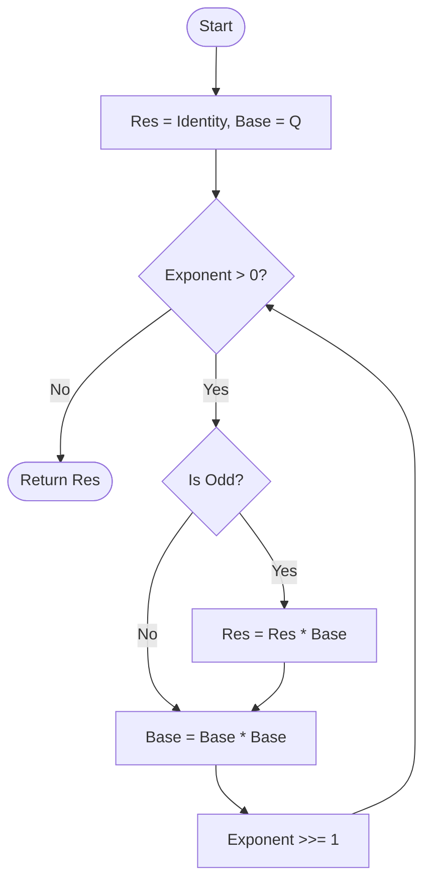
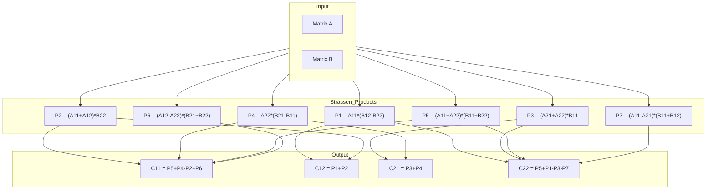

# Matrix Exponentiation

> **Complexity**: O(log n) matrix operations  
> **Actual Complexity**: O(log n × M(n)) where M(n) is the multiplication cost

## Introduction

**Matrix exponentiation** is an elegant method for calculating Fibonacci numbers based on the matrix representation of the sequence. This approach exploits fast exponentiation (squaring) to reduce the number of operations to O(log n).

## Mathematical Foundation

### Fibonacci Q Matrix

The Fibonacci sequence satisfies the matrix relation:

```
[ F(n+1) ]   [ 1  1 ]   [ F(n)   ]
[        ] = [      ] × [        ]
[ F(n)   ]   [ 1  0 ]   [ F(n-1) ]
```

Applying this relation n times from initial conditions F(1) = 1, F(0) = 0:

```
[ F(n+1)  F(n)   ]   [ 1  1 ]^n
[                ] = [      ]
[ F(n)    F(n-1) ]   [ 1  0 ]
```

The matrix `Q = [[1,1], [1,0]]` is called the **Fibonacci Q matrix**.

### Formal Proof of Q-matrix Power Property

We prove by induction that $Q^n = \begin{pmatrix} F_{n+1} & F_n \\ F_n & F_{n-1} \end{pmatrix}$.

**Base Case (n=1)**:
$$ Q^1 = \begin{pmatrix} 1 & 1 \\ 1 & 0 \end{pmatrix} = \begin{pmatrix} F_2 & F_1 \\ F_1 & F_0 \end{pmatrix} $$
Since $F_2=1, F_1=1, F_0=0$, the base case holds.

**Inductive Step**:
Assume the property holds for $k$: $Q^k = \begin{pmatrix} F_{k+1} & F_k \\ F_k & F_{k-1} \end{pmatrix}$.
We want to show it holds for $k+1$.

$$ Q^{k+1} = Q^k \times Q = \begin{pmatrix} F_{k+1} & F_k \\ F_k & F_{k-1} \end{pmatrix} \times \begin{pmatrix} 1 & 1 \\ 1 & 0 \end{pmatrix} $$

Performing the multiplication:
$$ Q^{k+1} = \begin{pmatrix} F_{k+1}\cdot 1 + F_k\cdot 1 & F_{k+1}\cdot 1 + F_k\cdot 0 \\ F_k\cdot 1 + F_{k-1}\cdot 1 & F_k\cdot 1 + F_{k-1}\cdot 0 \end{pmatrix} $$

Using Fibonacci recurrence $F_{m} = F_{m-1} + F_{m-2}$:
- Top-left: $F_{k+1} + F_k = F_{k+2}$
- Top-right: $F_{k+1}$
- Bottom-left: $F_k + F_{k-1} = F_{k+1}$
- Bottom-right: $F_k$

$$ Q^{k+1} = \begin{pmatrix} F_{k+2} & F_{k+1} \\ F_{k+1} & F_k \end{pmatrix} $$

This matches the formula for $n=k+1$. Thus, the property holds for all $n \ge 1$.

### Properties of Q

1. **Determinant**: det(Q^n) = (-1)^n
2. **Symmetry**: Q^n is always a symmetric matrix (Q^n[0][1] = Q^n[1][0])
3. **Cassini's Identity**: F(n+1)×F(n-1) - F(n)² = (-1)^n

## Algorithm

### Fast Exponentiation (Binary Exponentiation)

The key idea is to use binary decomposition of the exponent:

```
n = Σ bᵢ × 2^i  (where bᵢ ∈ {0, 1})
```

Then:
```
Q^n = Q^(Σ bᵢ × 2^i) = Π Q^(bᵢ × 2^i)
```

### Visualization



### Pseudocode

```
MatrixFibonacci(n):
    if n == 0:
        return 0
    
    result = identity matrix I
    base = Q = [[1,1], [1,0]]
    
    exponent = n - 1
    
    while exponent > 0:
        if exponent is odd:
            result = result × base
        base = base × base  // Squaring
        exponent = exponent / 2
    
    return result[0][0]  // This is F(n)
```

### Go Implementation

```go
func (c *MatrixExponentiation) CalculateCore(ctx context.Context, reporter ProgressReporter, 
    n uint64, opts Options) (*big.Int, error) {
    
    if n == 0 {
        return big.NewInt(0), nil
    }
    
    state := acquireMatrixState()
    defer releaseMatrixState(state)
    
    exponent := n - 1
    numBits := bits.Len64(exponent)
    
    // state.res = identity matrix
    // state.p = Q matrix = [[1,1],[1,0]]
    
    for i := 0; i < numBits; i++ {
        if (exponent >> i) & 1 == 1 {
            multiplyMatrices(state.tempMatrix, state.res, state.p, state, ...)
            state.res, state.tempMatrix = state.tempMatrix, state.res
        }
        
        if i < numBits - 1 {
            squareSymmetricMatrix(state.tempMatrix, state.p, state, ...)
            state.p, state.tempMatrix = state.tempMatrix, state.p
        }
    }
    
    return new(big.Int).Set(state.res.a), nil
}
```

## Implemented Optimizations

### 1. Strassen Algorithm

For 2×2 matrices with large elements, the Strassen algorithm reduces the number of multiplications from 8 to 7:

```
Classic 2×2 multiplication:
  C[0][0] = A[0][0]×B[0][0] + A[0][1]×B[1][0]  (2 mult)
  C[0][1] = A[0][0]×B[0][1] + A[0][1]×B[1][1]  (2 mult)
  C[1][0] = A[1][0]×B[0][0] + A[1][1]×B[1][0]  (2 mult)
  C[1][1] = A[1][0]×B[0][1] + A[1][1]×B[1][1]  (2 mult)
  Total: 8 multiplications

Strassen 2×2:
  P1 = A[0][0] × (B[0][1] - B[1][1])
  P2 = (A[0][0] + A[0][1]) × B[1][1]
  P3 = (A[1][0] + A[1][1]) × B[0][0]
  P4 = A[1][1] × (B[1][0] - B[0][0])
  P5 = (A[0][0] + A[1][1]) × (B[0][0] + B[1][1])
  P6 = (A[0][1] - A[1][1]) × (B[1][0] + B[1][1])
  P7 = (A[0][0] - A[1][0]) × (B[0][0] + B[0][1])
  
  C[0][0] = P5 + P4 - P2 + P6
  C[0][1] = P1 + P2
  C[1][0] = P3 + P4
  C[1][1] = P5 + P1 - P3 - P7
  Total: 7 multiplications + 18 additions
```

**Strassen Decomposition Diagram**:



The implementation switches to Strassen when elements exceed `--strassen-threshold` (default: 3072 bits).

### 2. Symmetric Matrix Squaring

For a symmetric matrix (b = c), the square can be calculated with only 4 multiplications:

```
[ a  b ]²   [ a²+b²    b(a+d) ]
[      ] = [                  ]
[ b  d ]    [ b(a+d)   b²+d²  ]
```

```go
func squareSymmetricMatrix(dest, mat *matrix, state *matrixState, 
    inParallel bool, fftThreshold int) {
    
    ad := new(big.Int).Add(mat.a, mat.d)  // a + d
    
    a2 = smartMultiply(a2, mat.a, mat.a)  // a²
    b2 = smartMultiply(b2, mat.b, mat.b)  // b²
    d2 = smartMultiply(d2, mat.d, mat.d)  // d²
    b_ad = smartMultiply(b_ad, mat.b, ad) // b(a+d)
    
    dest.a.Add(a2, b2)    // a² + b²
    dest.b.Set(b_ad)      // b(a+d)
    dest.c.Set(b_ad)      // symmetric
    dest.d.Add(b2, d2)    // b² + d²
}
```

### 3. Zero-Allocation with sync.Pool

```go
type matrixState struct {
    res, p, tempMatrix *matrix
    // Temporaries for Strassen
    p1, p2, p3, p4, p5, p6, p7 *big.Int
    s1, s2, s3, s4, s5, s6, s7, s8, s9, s10 *big.Int
    // Temporaries for symmetric square
    t1, t2, t3, t4, t5 *big.Int
}

var matrixStatePool = sync.Pool{
    New: func() interface{} {
        return &matrixState{
            res: newMatrix(),
            p: newMatrix(),
            // ...
        }
    },
}
```

### 4. Parallelism

Independent multiplications are parallelized:

```go
if inParallel {
    var wg sync.WaitGroup
    wg.Add(7)  // Strassen: 7 parallel multiplications
    go func() { p1 = smartMultiply(p1, m1.a, s1); wg.Done() }()
    go func() { p2 = smartMultiply(p2, s2, m2.d); wg.Done() }()
    // ...
    wg.Wait()
}
```

## Complexity Analysis

### Operations per Iteration

| Operation | Classic | Strassen | Symmetric Square |
|-----------|---------|----------|------------------|
| Multiplications | 8 | 7 | 4 |
| Additions | 4 | 18 | 4 |

### Number of Iterations

- log₂(n) iterations
- At each iteration: 1 squaring + potentially 1 multiplication

### Total Complexity

- **With Karatsuba**: O(log n × n^1.585)
- **With FFT**: O(log n × n log n)

## Comparison with Fast Doubling

| Criterion | Matrix Exp. | Fast Doubling |
|-----------|-------------|---------------|
| Multiplications/iter (base) | 8 | 3 |
| Multiplications/iter (optimized) | 4-7 | 3 |
| Mathematical complexity | More intuitive | More compact |
| Practical performance | Slower | Faster |

## Usage

```bash
# Calculation with Matrix Exponentiation
./fibcalc -n 1000000 -algo matrix -d

# Adjust Strassen threshold
./fibcalc -n 10000000 -algo matrix --strassen-threshold 2048

# Disable Strassen (classic multiplication only)
./fibcalc -n 1000000 -algo matrix --strassen-threshold 999999999
```

## References

1. Erickson, J. (2019). *Algorithms*. Chapter on Recursion and Backtracking.
2. Cormen, T. H. et al. (2009). *Introduction to Algorithms*. Section 31.2: Matrix Exponentiation.
3. Strassen, V. (1969). "Gaussian Elimination is not Optimal". *Numerische Mathematik*.
