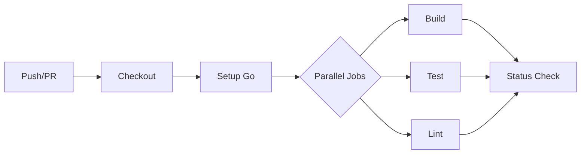

# CI/CD Pipeline Documentation

> **Version**: 1.0.0  
> **Last Updated**: December 2025

This document describes the Continuous Integration and Continuous Deployment pipeline for the Fibonacci Calculator.

---

## Overview

The project uses **GitHub Actions** for CI/CD with the following workflows:

| Workflow         | Trigger         | Purpose               |
| ---------------- | --------------- | --------------------- |
| `ci.yml`         | Push/PR to main | Build, test, and lint |
| `dependabot.yml` | Weekly          | Dependency updates    |

---

## CI Workflow (`ci.yml`)

### Pipeline Stages



### Jobs

#### Test Job

Runs the full test suite:

```yaml
test:
  name: Test
  runs-on: ubuntu-latest
  steps:
    - uses: actions/checkout@v4

    - name: Set up Go
      uses: actions/setup-go@v5
      with:
        go-version: "1.24"
        check-latest: true

    - name: Build
      run: make build

    - name: Test
      run: make test
```

#### Lint Job

Runs static analysis with golangci-lint:

```yaml
lint:
  name: Lint
  runs-on: ubuntu-latest
  steps:
    - uses: actions/checkout@v4

    - name: Set up Go
      uses: actions/setup-go@v5
      with:
        go-version: "1.24"
        check-latest: true

    - name: golangci-lint
      uses: golangci/golangci-lint-action@v6
      with:
        version: latest
        args: --timeout=5m
```

### Trigger Events

The CI runs on:

- **Push** to `main` or `master` branches
- **Pull requests** targeting `main` or `master`

---

## Dependabot Configuration

Automated dependency updates are configured in `.github/dependabot.yml`:

```yaml
version: 2
updates:
  - package-ecosystem: "gomod"
    directory: "/"
    schedule:
      interval: "weekly"
    open-pull-requests-limit: 5
    labels:
      - "dependencies"
    commit-message:
      prefix: "chore(deps):"
```

### Update Schedule

| Ecosystem  | Frequency | Max PRs |
| ---------- | --------- | ------- |
| Go modules | Weekly    | 5       |

---

## Local CI Simulation

Run the same checks locally before pushing:

```bash
# Full CI check
make check

# Individual steps
make build
make test
make lint
```

---

## Adding Coverage Reporting

Extend the workflow with coverage:

```yaml
- name: Test with Coverage
  run: |
    go test -coverprofile=coverage.out ./...
    go tool cover -html=coverage.out -o coverage.html

- name: Upload Coverage
  uses: codecov/codecov-action@v3
  with:
    files: coverage.out
    fail_ci_if_error: true
```

---

## Adding Docker Build

Extend for container builds:

```yaml
docker:
  name: Docker Build
  runs-on: ubuntu-latest
  needs: [test, lint]
  steps:
    - uses: actions/checkout@v4

    - name: Set up Docker Buildx
      uses: docker/setup-buildx-action@v3

    - name: Build and push
      uses: docker/build-push-action@v5
      with:
        context: .
        push: false
        tags: fibcalc:${{ github.sha }}
        cache-from: type=gha
        cache-to: type=gha,mode=max
```

---

## Release Workflow (Optional)

For automated releases on tags:

```yaml
name: Release

on:
  push:
    tags:
      - "v*"

jobs:
  release:
    runs-on: ubuntu-latest
    steps:
      - uses: actions/checkout@v4

      - name: Set up Go
        uses: actions/setup-go@v5
        with:
          go-version: "1.24"

      - name: Build binaries
        run: |
          GOOS=linux GOARCH=amd64 make build
          mv build/fibcalc fibcalc-linux-amd64

          GOOS=darwin GOARCH=amd64 make build
          mv build/fibcalc fibcalc-darwin-amd64

          GOOS=windows GOARCH=amd64 make build
          mv build/fibcalc.exe fibcalc-windows-amd64.exe

      - name: Create Release
        uses: softprops/action-gh-release@v1
        with:
          files: |
            fibcalc-linux-amd64
            fibcalc-darwin-amd64
            fibcalc-windows-amd64.exe
          generate_release_notes: true
```

---

## Branch Protection

Recommended settings for `main`:

| Setting                     | Value                 |
| --------------------------- | --------------------- |
| Require status checks       | ✅                    |
| Required checks             | `test`, `lint`        |
| Require branches up-to-date | ✅                    |
| Require review approval     | ✅ (1 reviewer)       |
| Dismiss stale reviews       | ✅                    |
| Restrict pushes             | ✅ (maintainers only) |

---

## Secrets Management

Required secrets for extended workflows:

| Secret            | Purpose         | Required For |
| ----------------- | --------------- | ------------ |
| `DOCKER_USERNAME` | Docker Hub auth | Docker push  |
| `DOCKER_PASSWORD` | Docker Hub auth | Docker push  |
| `CODECOV_TOKEN`   | Coverage upload | Codecov      |
| `GITHUB_TOKEN`    | Auto-provided   | Releases     |

---

## Troubleshooting CI

### Build Fails

```bash
# Check Go version matches CI
go version

# Verify dependencies
go mod tidy
go mod verify
```

### Test Timeout

Increase timeout in workflow:

```yaml
- name: Test
  run: make test
  timeout-minutes: 30
```

### Lint Errors

Run locally to see full output:

```bash
golangci-lint run --timeout=5m
```

---

## See Also

- [CONTRIBUTING.md](../../CONTRIBUTING.md) - Development guidelines
- [Makefile](../../Makefile) - Build commands
- [Docs/TROUBLESHOOTING.md](../TROUBLESHOOTING.md) - Troubleshooting guide
