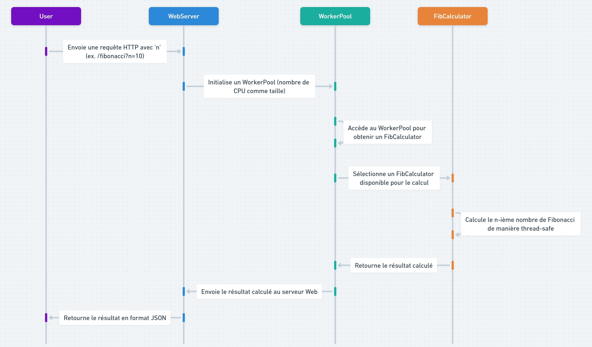

# DoublingParallelWeb



## Description

Ce projet implémente un service web de calcul des nombres de Fibonacci, utilisant des goroutines pour exécuter des calculs en parallèle. Le programme est écrit en Go et vise à optimiser l'utilisation des ressources CPU disponibles en exploitant le parallélisme. Ce service est particulièrement efficace pour le calcul de grands nombres de Fibonacci, où la performance et l'efficacité sont cruciales.

Le calcul est réparti entre plusieurs *workers*, chaque *worker* étant responsable du calcul d'une portion de la série de Fibonacci. Cela permet de maximiser l'utilisation des processeurs disponibles et de réduire le temps de calcul global. Pour garantir la sécurité des threads lors des opérations parallèles, des verrous sont utilisés dans les structures de données.

Le résultat du calcul est renvoyé au client au format JSON, avec le nombre de Fibonacci formaté en notation scientifique pour garantir la lisibilité des très grandes valeurs.

## Fonctionnalités

- **Calcul parallèle des nombres de Fibonacci** : Utilisation de goroutines pour paralléliser les calculs et optimiser l'utilisation du CPU.
- **API Web** : Fournit une API RESTful pour calculer le n-ième nombre de Fibonacci.
- **Sécurité des threads** : Garantit la sécurité des threads grâce à l'utilisation de *mutex* lors des calculs.
- **Optimisation par décomposition binaire** : Le calcul des nombres de Fibonacci est optimisé à l'aide de la décomposition binaire pour améliorer la performance.

## Composants Principaux

1. **FibCalculator** : Structure qui encapsule les variables nécessaires au calcul des nombres de Fibonacci de manière sécurisée. Les grandes valeurs sont manipulées grâce au package `math/big`.
2. **WorkerPool** : Structure qui gère un pool de calculateurs de Fibonacci, permettant une allocation efficace des ressources de calcul entre les tâches parallèles.
3. **handleFibonacci** : Fonction qui gère les requêtes HTTP entrantes, extrait le paramètre `n`, calcule le n-ième nombre de Fibonacci, puis retourne le résultat au format JSON.
4. **formatBigIntSci** : Fonction qui formate les grands nombres de Fibonacci en notation scientifique, en ne conservant que les cinq premiers chiffres significatifs.

## Prérequis

Pour exécuter ce projet, vous devez avoir les éléments suivants installés :

- [Go](https://golang.org/dl/) (version 1.16 ou supérieure)

## Installation

1. Clonez le dépôt :

   ```sh
   git clone https://github.com/votre-utilisateur/fibonacci-service.git
   cd fibonacci-service
   ```

2. Compilez le projet :

   ```sh
   go build
   ```

3. Exécutez le service :

   ```sh
   ./fibonacci-service
   ```

Le serveur démarrera sur le port `8080` par défaut.

## Utilisation

Le service est accessible via une requête HTTP sur le port `8080`. Par exemple, pour obtenir le 10e nombre de Fibonacci, vous pouvez exécuter la commande suivante :

```sh
curl "http://localhost:8080/fibonacci?n=10"
```

La réponse sera au format JSON, avec le résultat en notation scientifique si nécessaire :

```json
{
  "fibonacci": "5.500e6"
}
```

## Exemple de Code

Le fichier `main.go` contient l'implémentation complète du service. Voici un extrait de la fonction principale qui démarre le serveur :

```go
func main() {
    http.HandleFunc("/fibonacci", handleFibonacci)
    fmt.Println("Serveur démarré sur le port 8080...")
    http.ListenAndServe(":8080", nil)
}
```

Cette fonction initialise le serveur HTTP et associe la route `/fibonacci` à la fonction `handleFibonacci`, qui gère les calculs demandés par les utilisateurs.

## Limitations

- Le service limite les calculs de Fibonacci à des valeurs de `n` inférieures ou égales à 1 000 000, pour éviter des temps de calcul excessifs et des problèmes de mémoire.
- Les très grands nombres peuvent nécessiter des ressources significatives et le temps de calcul peut croître rapidement avec `n`.

## Contribuer

Les contributions sont les bienvenues. Pour proposer des améliorations ou des corrections, vous pouvez ouvrir une *pull request* ou créer une *issue* sur le dépôt GitHub.

## Licence

Ce projet est sous licence MIT. Voir le fichier `LICENSE` pour plus de détails.

## Auteurs

- **Nom de l'Auteur** - Développeur principal - [Votre Profil GitHub](https://github.com/votre-utilisateur)

## Remerciements

Un grand merci à tous ceux qui contribuent à la communauté Go et à ceux qui aident à l'amélioration des algorithmes de calcul parallèle.

