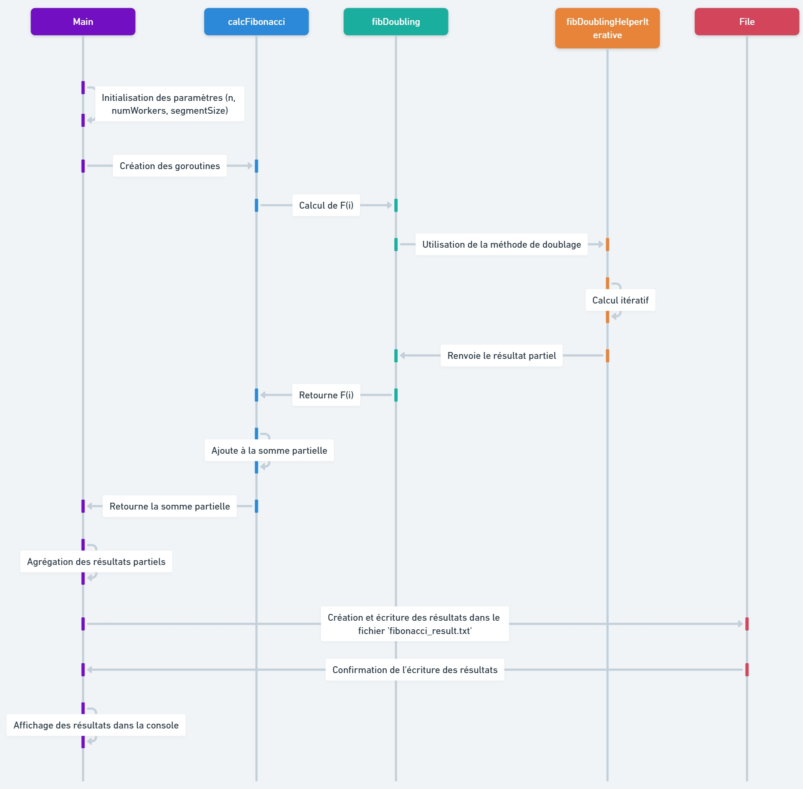

# Calcul Parallèle de la Somme des Nombres de Fibonacci



Ce projet est une implémentation en Go (Golang) qui calcule la somme des nombres de Fibonacci jusqu'à un terme spécifique (« n ») en utilisant une méthode optimisée, dite du « doublage ». L'objectif de ce projet est de démontrer l'efficacité des techniques parallèles pour des calculs de grande envergure, notamment en exploitant les ressources matérielles d'une machine multi-cœurs.

Le programme écrit le résultat final dans un fichier texte nommé `fibonacci_result.txt`. Ce fichier contient la somme des termes de Fibonacci, le nombre total de calculs effectués, le temps moyen par calcul et le temps d'exécution global. L'approche adoptée est spécifiquement conçue pour exploiter le parallélisme offert par les cœurs de processeur, offrant ainsi une solution optimale pour le calcul de séries importantes.

## Description du Programme

### Structure

Le programme est composé de plusieurs fonctions clés qui assurent le calcul de la somme des nombres de Fibonacci de manière efficace :

- **`fibDoubling(n int) (*big.Int, error)`** : Cette fonction calcule le nième terme de la suite de Fibonacci en utilisant la méthode du doublage, garantissant une complexité optimisée.

- **`fibDoublingHelperIterative(n int) *big.Int`** : Fonction auxiliaire chargée de l'implémentation itérative de la méthode du doublage. Elle utilise des opérations sur des grands entiers, grâce au package `math/big`.

- **`calcFibonacci(start, end int, partialResult chan<- *big.Int, wg *sync.WaitGroup)`** : Cette fonction permet de diviser la liste de Fibonacci en segments calculés parallèlement par différents travailleurs (ou goroutines), ce qui optimise la vitesse de calcul.

- **`main()`** : Fonction principale qui orchestre la répartition des tâches entre les goroutines, effectue les mesures du temps d'exécution, et écrit les résultats dans le fichier de sortie.

### Fonctionnement

1. **Calcul des Terme de Fibonacci** : La méthode du doublage est utilisée pour déterminer rapidement le nième terme de la suite de Fibonacci. Cette approche consiste à exploiter la représentation binaire de l'entier `n` et à calculer les termes de manière itérative en utilisant des opérations bit à bit.

2. **Parallélisme et Répartition des Tâches** : Le programme exploite les cœurs disponibles sur la machine hôte, en divisant le calcul en segments à traiter par différents travailleurs. Chaque travailleur effectue des calculs sur une portion des termes de la suite, en utilisant des goroutines pour paralléliser les opérations.

3. **Agrégation des Résultats** : Les résultats partiels sont ensuite agrégés pour obtenir la somme totale des termes de Fibonacci jusqu'à \( n \). Le fichier `fibonacci_result.txt` est créé pour contenir ces résultats, y compris des informations relatives aux performances (temps d'exécution global, temps moyen par calcul).

## Usage

### Prérequis

Pour exécuter ce programme, vous devez disposer de Go (Golang) installé sur votre système. Assurez-vous de disposer d'une version récente de Go ainsi que de suffisamment de mémoire et de puissance CPU pour traiter de grands nombres de Fibonacci.

### Compilation et Exécution

1. **Compilation** : Pour compiler le programme, vous pouvez utiliser la commande suivante :

   ```bash
   go build -o fibonacci_sum
   ```

2. **Exécution** : Une fois compilé, le programme peut être exécuté comme suit :

   ```bash
   ./fibonacci_sum
   ```

   Notez que le paramètre \( n \) est fixé à 100 millions dans le code, mais vous pouvez le modifier en éditant directement la valeur de la variable `n` dans la fonction `main()`.

### Résultats

Le fichier `fibonacci_result.txt` contiendra :
- La somme totale des termes de Fibonacci jusqu'à \( n \).
- Le nombre de calculs effectués.
- Le temps moyen par calcul.
- Le temps d'exécution total.

Ces informations permettent de mesurer la performance du calcul, à la fois en termes de précision (grâce à l'utilisation des grands entiers) et en termes d'efficacité (grâce au parallélisme).

## Avertissements

- **Consommation de Ressources** : Le programme est gourmand en mémoire et en puissance CPU, en particulier pour des valeurs élevées de \( n \). Assurez-vous de disposer d'une machine avec suffisamment de ressources, de préférence multi-cœurs, pour éviter des plantages.

- **Limite de Calcul** : Le paramètre \( n \) est limité à 100 millions pour éviter des calculs excessivement coûteux. Cette limite est placée pour prévenir la surcharge de la mémoire et le temps de calcul trop important.

## Conclusion

Ce projet illustre l'efficacité des algorithmes parallèles pour le calcul des nombres de Fibonacci. En utilisant la méthode du doublage et en exploitant les ressources disponibles de manière optimale, ce programme est capable de calculer des termes très élevés de la suite de Fibonacci, tout en fournissant des informations précieuses sur la performance.

Il s'agit d'une excellente démonstration des capacités de Go en termes de gestion des grands entiers et de parallélisme, ce qui le rend idéal pour des projets de calcul numérique et de haute performance.

Pour toute question ou amélioration, n'hésitez pas à proposer des modifications ou à émettre des suggestions sur la page du projet.

