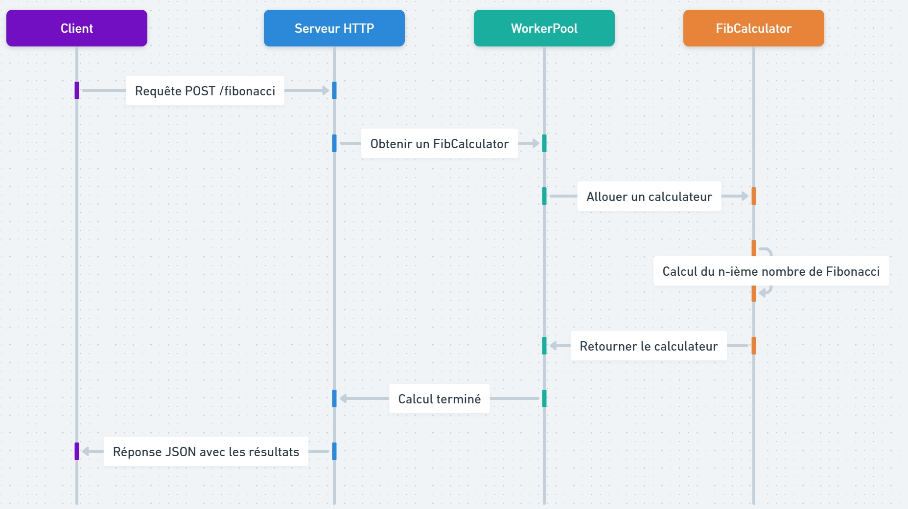

# Calcul du Nombre de Fibonacci avec Go - Implémentation Parallèle et Thread-Safe



Ce projet est une implémentation en Go (Golang) permettant de calculer la somme des nombres de Fibonacci jusqu'à un grand nombre `n`. Le code est conçu pour être exécuté de manière efficace grâce à l'utilisation du parallélisme et de la concurrence, exploitant tous les cœurs du processeur disponibles. Il permet ainsi de réduire le temps de calcul grâce à une division intelligente des tâches.

## Caractéristiques Principales

1. **Calcul Parallèle des Nombres de Fibonacci**  
   Le programme utilise des goroutines, un `WorkerPool` et des structures à mutex pour diviser les tâches en segments calculés en parallèle, améliorant ainsi l'efficacité.

2. **Approche Optimisée**  
   Le calcul des nombres de Fibonacci se base sur un algorithme d'exponentiation rapide permettant de décomposer efficacement la série en fonction de la représentation binaire de `n`, réduisant ainsi la complexité temporelle.

3. **Gestion des Ressources CPU**  
   Le programme exploite toutes les unités centrales disponibles (à l'aide de `runtime.NumCPU()`) afin de maximiser l'utilisation des ressources matérielles.

4. **Thread-Safe avec `sync.Mutex` et `sync.WaitGroup`**  
   Le calcul sécurisé est assuré par des verrous (« mutex ») et un groupe d'attente (« wait group ») pour synchroniser les goroutines, garantissant une écriture sûre des données partagées.

## Fonctionnalités Détaillées

1. **Structures Utilisées**
   - **FibCalculator** :
     Gère les variables `big.Int` pour stocker les résultats de Fibonacci et permet de calculer le nombre de Fibonacci de façon thread-safe.
   - **WorkerPool** :
     Cette structure alloue des instances de `FibCalculator` entre les goroutines, évitant ainsi des coûts supplémentaires dus à la création d'instances multiples.

2. **Interface HTTP REST**
   Le calcul du nombre de Fibonacci est exposé via une API REST accessible par une requête `POST`. Un exemple de requête cURL est :

   ```sh
   curl -X POST -H "Content-Type: application/json" -d '{"n": 1000}' http://localhost:8080/fibonacci
   ```

3. **Gestion de la Notation Scientifique**
   Lorsque le résultat est très grand, il est automatiquement converti en notation scientifique pour être affiché de manière lisible.

4. **Sauvegarde des Résultats**
   Le programme écrit les résultats dans un fichier texte (`fibonacci_result.txt`), qui peut ensuite être lu et affiché. Cela permet une meilleure traçabilité des calculs et des performances.

## Dépendances et Installation

Pour exécuter ce programme, vous devez disposer de Golang installé sur votre machine. Pour télécharger et installer Golang, vous pouvez vous rendre sur le site officiel [golang.org](https://golang.org/).

### Installation

1. Clonez le répertoire du projet :
   ```sh
   git clone <URL_du_dépôt>
   ```

2. Naviguez vers le répertoire du projet :
   ```sh
   cd <nom_du_dépôt>
   ```

3. Installez les dépendances et construisez le programme :
   ```sh
   go mod tidy
   go build
   ```

4. Exécutez le programme :
   ```sh
   ./<nom_du_binaire>
   ```

Le serveur sera alors exécuté sur le port 8080 et pourra recevoir des requêtes HTTP.

## Exécution du Programme

Pour exécuter ce programme, il suffit de lancer le serveur Go, puis de faire une requête HTTP `POST` à l'adresse `http://localhost:8080/fibonacci`. Le serveur répondra avec un JSON contenant :
- La valeur calculée du `n`-ième nombre de Fibonacci,
- Le nombre total de calculs effectués,
- Le temps moyen par calcul,
- Le temps total d'exécution.

### Exemple de Réponse

```json
{
  "n": 1000,
  "nombre_de_calculs": 32,
  "temps_moyen_par_calcul": "50ms",
  "temps_execution_total": "1.6s",
  "somme_formatted_result": "4.346e209"
}
```

## Architecture et Conception

Le code est conçu de manière modulaire, facilitant la maintenance et l'évolution de l'application. Les calculs lourds sont confiés à des `FibCalculator` alloués par un pool de travailleurs (« Worker Pool »), assurant ainsi un partage optimal des ressources et une gestion efficace des threads.

L'implémentation des mécanismes de synchronisation tels que `sync.Mutex` (verrous) et `sync.WaitGroup` (groupes d'attente) assure une exécution fluide et sans conflits même lorsque plusieurs goroutines accèdent à des données partagées.

## Licence

Ce projet est sous licence MIT, ce qui permet une utilisation libre, sous réserve de la conservation de la licence originale et des droits d'auteur.

## Remerciements

Merci d'utiliser ce projet comme point de départ pour développer des applications parallèles et concurrentes. L'équipe de développement de ce projet espère que vous trouverez cette implémentation intéressante et utile dans vos études ou travaux professionnels.

