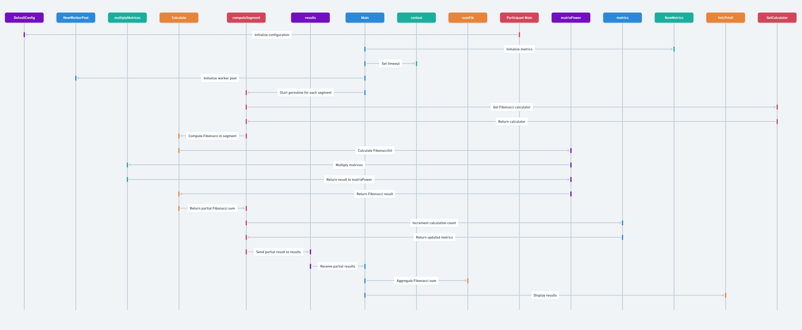
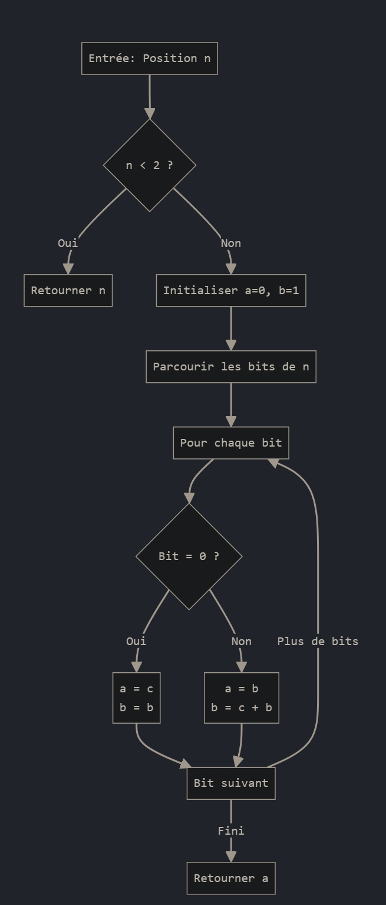

# Calcul de Fibonacci par la Méthode de Calcul Parallèle avec Mémoïsation et Benchmark



# README - Calcul Parallélisé des Nombres de Fibonacci

## Introduction

Ce projet implémente un calcul parallélisé des nombres de Fibonacci en utilisant le langage de programmation Go. Le code repose sur une approche optimisée appelée "doublage" pour le calcul des nombres de Fibonacci et utilise des travailleurs (« workers ») parallèles pour accélérer la somme des n premiers termes. Cette méthode exploite les ressources du processeur de façon optimale, ce qui est particulièrement adapté pour les calculs intensifs sur des grands ensembles de données.

## Structure du Code

Le code est divisé en plusieurs sections et utilise plusieurs paquets de la bibliothèque standard de Go, tels que `fmt`, `math/big`, `sync`, `runtime`, et `os`. Voici une analyse des principales parties du code :

### Fonctions de Calcul de Fibonacci

#### 1. `fibDoubling(n int) (*big.Int, error)`

Cette fonction calcule le `n`ème nombre de Fibonacci en utilisant la méthode de « doublage » (également connue sous le nom de "Fast Doubling"). Cette méthode est plus efficace que les approches itératives classiques, car elle permet de réduire la complexité à `O(log n)`.

- **Paramètre :** `n` est un entier positif, représentant l'indice du nombre de Fibonacci à calculer.
- **Retour :** Retourne un pointeur vers un objet `big.Int`, qui est utilisé pour gérer de très grands entiers.

#### 2. `fibDoublingHelperIterative(n int) *big.Int`

Il s'agit d'une fonction auxiliaire qui effectue le calcul itératif. Elle se sert des opérations bit-à-bit (à l'aide du paquet `bits`) pour itérer sur les bits de `n` et générer les termes de Fibonacci en doublant successivement.

- Les objets `a` et `b` sont utilisés respectivement pour stocker les termes précédents et courants de la séquence.
- La fonction utilise des opérations telles que `Lsh` (left shift) et `Mul` pour effectuer les calculs nécessaires.

### Calcul Parallélisé des Nombres de Fibonacci

#### 1. `calcFibonacci(start, end int, partialResult chan<- *big.Int, wg *sync.WaitGroup)`

Cette fonction calcule la somme des nombres de Fibonacci entre les indices `start` et `end`. Pour chaque indice dans cet intervalle, elle appelle `fibDoubling` afin de récupérer la valeur correspondante et l'ajoute à une somme partielle.

- Le résultat partiel est ensuite envoyé via un canal (`partialResult`) pour la fusion ultérieure.
- Un `WaitGroup` est utilisé pour synchroniser l'exécution des différentes goroutines.

### Fonction Principale (`main`)

La fonction `main` est le point d'entrée du programme. Voici les éléments clés qu'elle gère :

1. **Initialisation des Paramètres :**
   - `n` est fixé à `100000000`, ce qui signifie que le programme va calculer la somme des 100 millions premiers nombres de Fibonacci.
   - `numWorkers` est défini comme le nombre de cœurs disponibles (à l'aide de `runtime.NumCPU()`), permettant une parallélisation adaptée à l'architecture de la machine.

2. **Décomposition des Tâches :**
   - Le calcul est divisé en segments, chacun étant assigné à un « worker » distinct.
   - Chaque goroutine exécute `calcFibonacci` pour calculer sa portion des valeurs de Fibonacci.

3. **Fusion des Résultats :**
   - Une fois les calculs terminés, les résultats partiels sont fusionnés dans une variable `sumFib` pour obtenir la somme totale.

4. **Calcul des Temps :**
   - Le temps total d'exécution est calculé et affiché, ainsi que le temps moyen par calcul.

5. **Sauvegarde des Résultats :**
   - Les résultats, incluant la somme des nombres de Fibonacci, le nombre de calculs, le temps moyen par calcul, et le temps d'exécution, sont sauvegardés dans un fichier texte `fibonacci_result.txt`.

## Points Forts et Optimisations

1. **Approche de Doublage :**
   - L'utilisation de l'algorithme de doublage permet de calculer le `n`ème terme de la séquence de Fibonacci avec une complexité logarithmique, ce qui est beaucoup plus efficace que les méthodes classiques (itératives ou récursives avec mémorisation).

2. **Parallélisation :**
   - Le programme exploite la parallélisation en utilisant plusieurs goroutines qui calculent chacune une portion des valeurs de Fibonacci, en tirant parti des ressources multi-cœurs.

3. **Utilisation des `big.Int` :**
   - Les valeurs de Fibonacci deviennent rapidement très grandes. Le type `big.Int` de Go est essentiel pour éviter les débordements et gérer des entiers de taille arbitraire.

## Limitations et Améliorations Possibles

1. **Performance Mémoire :**
   - Le programme utilise `big.Int` qui peut consommer beaucoup de mémoire pour des valeurs très grandes de `n`. Une amélioration pourrait consister à utiliser des techniques de réduction de la mémoire.

2. **Gestion des Erreurs :**
   - Certaines parties du code, telles que les appels à `fibDoubling`, ignorent les erreurs retournées. Une meilleure gestion des erreurs permettrait de rendre le code plus robuste.

3. **Calcul Répétitif :**
   - Le calcul des termes de Fibonacci pourrait être optimisé davantage en utilisant une mémoisation partagée pour éviter de recalculer les mêmes termes plusieurs fois.

## Comment Exécuter le Programme

### Prérequis
- **Go** : Assurez-vous que le compilateur Go est installé sur votre système.
- **Fichier Source** : Le fichier source est intitulé `fibonacci_parallel.go`.

### Compilation et Exécution
Pour compiler et exécuter le programme, utilisez les commandes suivantes :

```sh
# Compiler le fichier source
$ go build -o fibonacci_parallel fibonacci_parallel.go

# Exécuter le programme
$ ./fibonacci_parallel
```

Les résultats seront affichés sur la console et également sauvegardés dans le fichier `fibonacci_result.txt`.

## Conclusion
Ce projet démontre comment tirer parti des caractéristiques avancées du langage Go, telles que la parallélisation avec des goroutines, l'utilisation des grands entiers avec `big.Int`, et des approches mathématiques efficaces comme le doublage pour calculer des séquences de Fibonacci de grande taille. Le code, bien que performant, offre plusieurs pistes pour d’éventuelles améliorations afin de le rendre encore plus optimisé et robuste.


