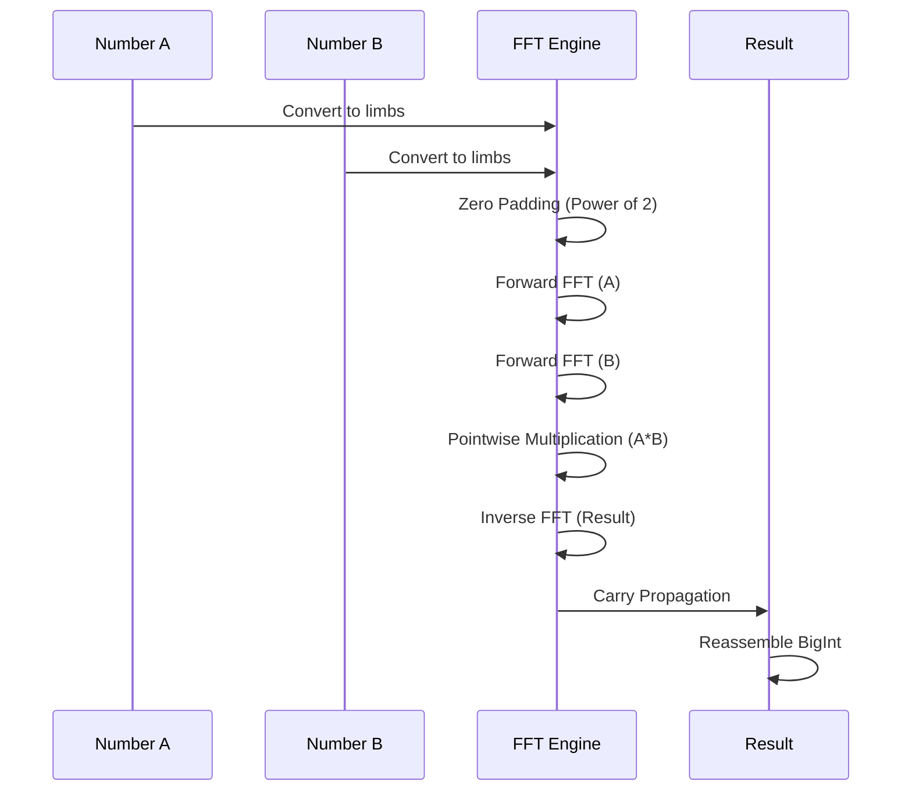

# FFT Multiplication for Large Integers

> **Complexity**: O(n log n) for multiplying two numbers of n bits  
> **Used by**: Fast Doubling and Matrix Exp. for very large numbers

## Introduction

The **Fast Fourier Transform (FFT)** allows multiplying two large integers in O(n log n) instead of O(n²) for naive multiplication or O(n^1.585) for Karatsuba. This optimization becomes crucial for numbers exceeding approximately 1 million bits.

## Mathematical Principle

### Convolution and Multiplication

Multiplication of two integers can be viewed as a **convolution** of their digits:

```
A = Σᵢ aᵢ × B^i
B = Σⱼ bⱼ × B^j

A × B = Σₖ cₖ × B^k  where  cₖ = Σᵢ aᵢ × b(k-i)
```

The term cₖ is the **discrete convolution** of sequences {aᵢ} and {bⱼ}.

### Convolution Theorem

The convolution theorem states that:

```
DFT(a * b) = DFT(a) × DFT(b)  (pointwise multiplication)
```

Where `*` is convolution and DFT is the Discrete Fourier Transform.

Therefore:
```
a * b = IDFT(DFT(a) × DFT(b))
```

### Visualization



### FFT Multiplication Algorithm

1. **Padding**: Extend numbers to a power of 2 length
2. **DFT**: Compute FFT of both digit sequences
3. **Multiplication**: Multiply pointwise in the frequency domain
4. **IDFT**: Compute inverse FFT
5. **Carry Propagation**: Handle carries

## Implementation in FibCalc

### `internal/bigfft` Module

The bigfft module implements specialized FFT multiplication for `big.Int`:

```go
// mulFFT performs x × y via FFT
func mulFFT(x, y *big.Int) *big.Int {
    return bigfft.Mul(x, y)
}

// smartMultiply chooses the optimal method
func smartMultiply(z, x, y *big.Int, threshold int) *big.Int {
    if threshold > 0 {
        bx := x.BitLen()
        by := y.BitLen()
        if bx > threshold && by > threshold {
            return bigfft.MulTo(z, x, y)  // FFT
        }
    }
    return z.Mul(x, y)  // Karatsuba (math/big)
}
```

### Code Structure

```
internal/bigfft/
├── fft.go      # Main FFT algorithm
├── fermat.go   # Modular arithmetic for FFT
├── scan.go     # Conversion between big.Int and FFT representation
├── pool.go     # Object pools for performance
└── arith_decl.go  # Low-level arithmetic declarations
```

### Fermat FFT

The implementation uses a **Fermat FFT** operating in the ring Z/(2^k + 1):

- Roots of unity are powers of 2
- Multiplications become bit shifts
- More efficient than complex number FFT for integers

## Activation Threshold

### Configuration

```bash
# Default threshold: 1,000,000 bits
./fibcalc -n 100000000 --fft-threshold 1000000

# Force earlier FFT (numbers > 500,000 bits)
./fibcalc -n 100000000 --fft-threshold 500000

# Disable FFT
./fibcalc -n 100000000 --fft-threshold 0
```

### Threshold Selection

The optimal threshold depends on several factors:

| Factor | Impact |
|--------|--------|
| L3 cache size | Larger cache → lower threshold |
| CPU frequency | Faster → slightly higher threshold |
| Number of cores | More cores → FFT less advantageous (saturating) |

To determine the optimal threshold:

```bash
./fibcalc --calibrate
```

## Interaction with Parallelism

### Contention Problem

The FFT algorithm tends to **saturate CPU resources** as it performs many parallel memory operations internally. Running multiple FFT multiplications in parallel causes contention.

### Implemented Solution

```go
// Disable external parallelism when FFT is used
// except for very very large numbers
if opts.FFTThreshold > 0 {
    minBitLen := s.f_k.BitLen()
    if minBitLen > opts.FFTThreshold {
        // FFT will be used - disable parallelism
        // except if numbers > ParallelFFTThreshold (10M bits)
        return minBitLen > ParallelFFTThreshold
    }
}
```

## FFT-Based Calculator

The `fft` calculator forces FFT use for all multiplications:

```go
type FFTBasedCalculator struct{}

func (c *FFTBasedCalculator) Name() string {
    return "FFT-Based Doubling (O(log n), FFT Mul)"
}

func (c *FFTBasedCalculator) CalculateCore(ctx context.Context, reporter ProgressReporter,
    n uint64, opts Options) (*big.Int, error) {
    
    // Force FFT by setting threshold very low
    opts.FFTThreshold = 1
    
    // Uses the same algorithm as Fast Doubling
    fd := &OptimizedFastDoubling{}
    return fd.CalculateCore(ctx, reporter, n, opts)
}
```

This calculator is primarily used for:
- FFT performance benchmarking
- Regression testing
- Multiplication algorithm comparison

## Complexity Analysis

### Multiplication of two numbers of n bits

| Algorithm | Complexity | Hidden constant |
|-----------|------------|-----------------|
| Naive | O(n²) | Low |
| Karatsuba | O(n^1.585) | Medium |
| Toom-Cook 3 | O(n^1.465) | High |
| FFT | O(n log n) | Very high |

### Crossover Point

```
                    │
    Calculation     │     /
     time           │    /  ← Karatsuba O(n^1.585)
                    │   /
                    │  /
                    │ /          ← FFT O(n log n)
                    │/     _______
                    └─────────────────────
                          ~1M bits      Size (bits)
```

### FFT Overhead

FFT overhead comes from:
1. Conversion big.Int → FFT representation
2. Padding to next power of 2
3. Forward and inverse FFT
4. Carry propagation

## Usage

```bash
# Force FFT use for all multiplications
./fibcalc -n 10000000 -algo fft -d

# Adjust FFT threshold for Fast Doubling
./fibcalc -n 100000000 -algo fast --fft-threshold 800000

# Comparative benchmark
./fibcalc -n 50000000 -algo all -d
```

## References

1. Cooley, J. W., & Tukey, J. W. (1965). "An algorithm for the machine calculation of complex Fourier series". *Mathematics of Computation*.
2. Schönhage, A., & Strassen, V. (1971). "Schnelle Multiplikation großer Zahlen". *Computing*.
3. [GMP Library - FFT Multiplication](https://gmplib.org/manual/FFT-Multiplication)
4. [Go bigfft package documentation](https://pkg.go.dev/github.com/ncw/gmp)
