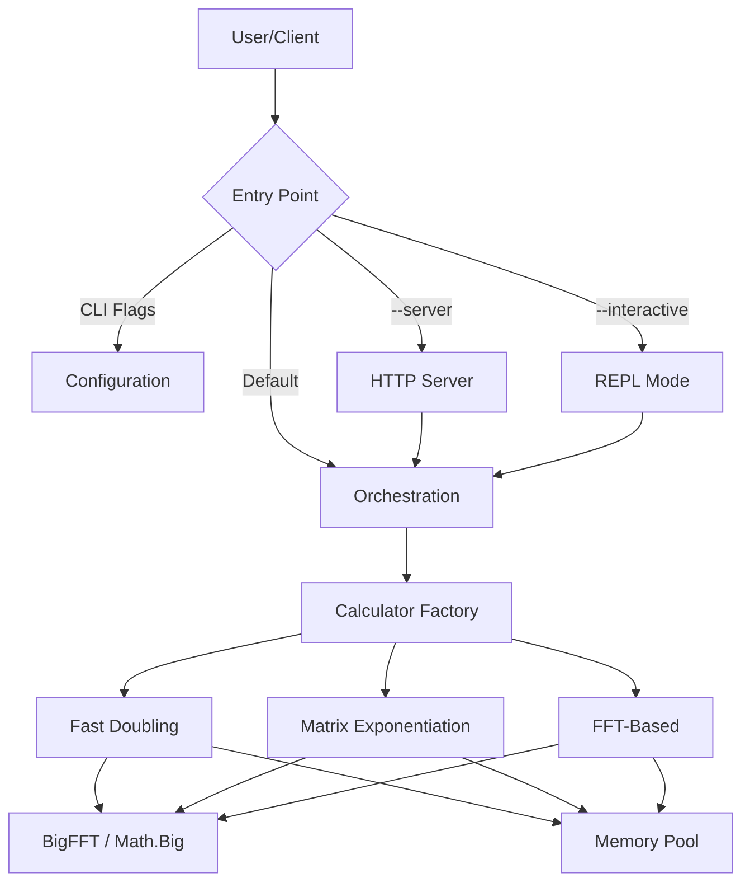

# FibCalc: High-Performance Fibonacci Calculator


**FibCalc** is a state-of-the-art command-line tool and library designed for computing arbitrarily large Fibonacci numbers with extreme speed and efficiency. Written in Go, it leverages advanced algorithmic optimizations—including Fast Doubling, Matrix Exponentiation with Strassen's algorithm, and FFT-based multiplication—to handle indices in the hundreds of millions.

---

## 📋 Table of Contents

- [Key Features](#-key-features)
- [Quick Start](#-quick-start)
- [Installation](#-installation)
- [Usage](#️-usage)
- [Server Mode (REST API)](#-server-mode-rest-api)
- [Docker Deployment](#-docker-deployment)
- [Kubernetes Deployment](#-kubernetes-deployment)
- [Architecture](#️-architecture)
- [Performance](#-performance)
- [Configuration](#️-configuration)
- [Security](#-security)
- [Development](#-development)
- [Documentation](#-documentation)
- [Contributing](#-contributing)
- [License](#-license)

---

## 🚀 Key Features

### Advanced Algorithms

- **Fast Doubling** (Default): The fastest known method ($O(\log n)$), optimized with parallel multiplication.
- **Matrix Exponentiation**: Classic approach ($O(\log n)$) enhanced with **Strassen's Algorithm** for large matrices and symmetric squaring optimizations.
- **FFT-Based**: For extreme numbers, switches to Fast Fourier Transform multiplication ($O(n \log n)$ complexity vs $O(n^{1.585})$ for Karatsuba).
- **GMP Support**: Optional build tag to use the GNU Multiple Precision Arithmetic Library for maximum raw performance.

### High-Performance Engineering

- **Zero-Allocation Strategy**: Extensive use of `sync.Pool` to recycle `big.Int` objects, reducing GC pressure by over 95%.
- **Adaptive Parallelism**: Automatically parallelizes operations across CPU cores based on input size and hardware capabilities.
- **Auto-Calibration**: Built-in benchmarking tool to determine optimal system-specific thresholds for parallelism and FFT switching.
- **One-Time Pre-Warming**: Optimized memory pool initialization (atomic pre-warming) to prevent redundant allocations during server uptime.

### Stability & Robustness

- **Production-Grade Logging**: Unified logging interface supporting structured logs via zerolog.
- **Concurrency Safety**: Rigorous data-race prevention in parallel FFT paths.
- **Graceful Error Handling**: Robust server startup and shutdown procedures.

### Rich User Experience

- **Interactive REPL**: A dedicated shell for performing multiple calculations, comparisons, and conversions.
- **Server Mode**: Production-ready HTTP API with metrics, rate limiting, and graceful shutdown.
- **Modern CLI**: Features progress spinners, ETA calculation, coloured output, and autocompletion generation.

---

## ⚡ Quick Start

### Using Go

```bash
# Calculate the 10-millionth Fibonacci number
go run ./cmd/fibcalc -n 10000000
```

### Using Docker

```bash
docker build -t fibcalc .
docker run --rm fibcalc -n 10000000
```

---

## 📦 Installation

### Option 1: Install from Source (Recommended)

Requires Go 1.25 or later.

```bash
go install ./cmd/fibcalc@latest
```

### Option 2: Build Manually

Clone the repository and build using the provided Makefile.

```bash
git clone https://github.com/agbru/fibcalc.git
cd fibcalc
make build
# Binary is located at ./build/fibcalc
```

### Option 3: Docker Image

Ideal for server deployments or isolated execution.

```bash
make docker-build
make docker-run
```

---

## 🛠️ Usage

### Command Synopsis

```text
fibcalc [flags]
```

### Common Flags

| Flag            | Short | Default       | Description                                                              |
| --------------- | ----- | ------------- | ------------------------------------------------------------------------ |
| `--n`           | `-n`  | `250,000,000` | The Fibonacci index to calculate.                                        |
| `--algo`        |       | `all`         | Algorithm to use: `fast`, `matrix`, `fft`, or `all` (for comparison).    |
| `--output`      | `-o`  |               | Write result to a specific file.                                         |
| `--json`        |       | `false`       | Output results in JSON format.                                           |
| `--hex`         |       | `false`       | Display result in hexadecimal format.                                    |
| `--calculate`   | `-c`  | `false`       | Display the full calculated value (suppressed by default for large $N$). |
| `--calibrate`   |       | `false`       | Run system benchmarks to find optimal thresholds.                        |
| `--interactive` |       | `false`       | Start the interactive REPL mode.                                         |
| `--server`      |       | `false`       | Start in HTTP server mode.                                               |
| `--timeout`     |       | `5m`          | Maximum time allowed for calculation.                                    |

### Usage Examples

**1. Basic Calculation**
Calculate F(1,000,000) using the default optimized algorithm.

```bash
fibcalc -n 1000000
```

**2. Compare Algorithms**
Run all algorithms and compare their performance for F(10,000,000).

```bash
fibcalc -n 10000000 --algo all --details
```

**3. Optimize for Your Machine**
Run calibration to find the best parallelism thresholds for your specific hardware.

```bash
fibcalc --calibrate
```

**4. Interactive Session**
Enter the REPL to experiment with different algorithms.

```bash
fibcalc --interactive
# fib> calc 100
# fib> algo matrix
# fib> calc 100
# fib> compare 10000
# fib> exit
```

---

## 🌐 Server Mode (REST API)

Launch the production-ready REST API server:

```bash
# Start server on port 8080
fibcalc --server --port 8080

# With auto-calibration at startup
fibcalc --server --port 8080 --auto-calibrate
```

### API Endpoints

| Endpoint                       | Method | Description                   |
| ------------------------------ | ------ | ----------------------------- |
| `/calculate?n=<N>&algo=<algo>` | GET    | Calculate Fibonacci number    |
| `/health`                      | GET    | Health check                  |
| `/algorithms`                  | GET    | List available algorithms     |
| `/metrics`                     | GET    | Server metrics for monitoring |

### Example API Calls

```bash
# Calculate F(100)
curl "http://localhost:8080/calculate?n=100&algo=fast"

# Health check
curl "http://localhost:8080/health"

# Get metrics
curl "http://localhost:8080/metrics"
```

### API Response Example

```json
{
  "n": 100,
  "result": 354224848179261915075,
  "duration": "125.5µs",
  "algorithm": "fast"
}
```

> **Full API documentation**: [Docs/api/API.md](Docs/api/API.md)  
> **OpenAPI specification**: [Docs/api/openapi.yaml](Docs/api/openapi.yaml)

---

## 🐳 Docker Deployment

### Quick Start with Docker

```bash
# Build the image
docker build -t fibcalc:latest .

# Run CLI calculation
docker run --rm fibcalc:latest -n 1000000

# Run server mode
docker run -d -p 8080:8080 --name fibcalc-server \
  fibcalc:latest --server --port 8080

# Verify server
curl http://localhost:8080/health
```

### Docker Compose

```yaml
version: "3.8"
services:
  fibcalc:
    image: fibcalc:latest
    ports:
      - "8080:8080"
    command: ["--server", "--port", "8080", "--auto-calibrate"]
    deploy:
      resources:
        limits:
          cpus: "4"
          memory: 2G
    healthcheck:
      test: ["CMD", "wget", "-q", "--spider", "http://localhost:8080/health"]
      interval: 30s
      timeout: 10s
      retries: 3
```

### Resource Recommendations

| Use Case           | CPU      | Memory |
| ------------------ | -------- | ------ |
| Small usage        | 1 core   | 512 MB |
| Medium usage       | 2 cores  | 1 GB   |
| Large calculations | 4+ cores | 2+ GB  |

> **Full Docker guide**: [Docs/deployment/DOCKER.md](Docs/deployment/DOCKER.md)

---

## ☸️ Kubernetes Deployment

Deploy FibCalc to Kubernetes with high availability:

```bash
# Apply manifests
kubectl apply -f k8s/namespace.yaml
kubectl apply -f k8s/deployment.yaml
kubectl apply -f k8s/service.yaml
kubectl apply -f k8s/hpa.yaml

# Verify deployment
kubectl get pods -n fibcalc
```

### Key Kubernetes Features

- **HorizontalPodAutoscaler**: Auto-scales from 2 to 10 replicas based on CPU/memory
- **PodDisruptionBudget**: Ensures minimum availability during updates
- **NetworkPolicy**: Restricts traffic to authorized sources only
- **SecurityContext**: Non-root execution with read-only filesystem
- **Prometheus Monitoring**: Built-in metrics endpoint

> **Full Kubernetes guide**: [Docs/deployment/KUBERNETES.md](Docs/deployment/KUBERNETES.md)

---

## 🏗️ Architecture

FibCalc follows **Clean Architecture** principles to ensure modularity and testability.



### Package Structure

| Package                  | Description                                |
| ------------------------ | ------------------------------------------ |
| `cmd/fibcalc`            | Main application entry point               |
| `internal/fibonacci`     | Core algorithms and logic                  |
| `internal/bigfft`        | FFT multiplication for large integers      |
| `internal/server`        | HTTP server implementation                 |
| `internal/logging`       | Unified logging interface (zerolog/stdlog) |
| `internal/cli`           | UI, REPL, and interaction logic            |
| `internal/orchestration` | Parallel algorithm execution               |
| `internal/calibration`   | Auto-calibration system                    |

> **Full architecture documentation**: [Docs/ARCHITECTURE.md](Docs/ARCHITECTURE.md)  
> **Internal API reference**: [Docs/INTERNAL_API.md](Docs/INTERNAL_API.md)

---

## 📊 Performance

FibCalc is optimized for speed. Below is a summary of performance characteristics on a standard workstation (AMD Ryzen 9 5900X).

| Index ($N$)     | Fast Doubling | Matrix Exp. | FFT-Based | Result (digits) |
| :-------------- | :------------ | :---------- | :-------- | :-------------- |
| **10,000**      | 180µs         | 220µs       | 350µs     | 2,090           |
| **1,000,000**   | 85ms          | 110ms       | 95ms      | 208,988         |
| **100,000,000** | 45s           | 62s         | 48s       | 20,898,764      |
| **250,000,000** | 3m 12s        | 4m 25s      | 3m 28s    | 52,246,909      |

### Algorithms at a Glance

- **Fast Doubling**: Best all-rounder. Uses $F(2k) = F(k)(2F(k+1) - F(k))$ identity.
- **Matrix Exponentiation**: Uses $\begin{pmatrix} 1 & 1 \\ 1 & 0 \end{pmatrix}^n$. Good for verification and theory.
- **FFT-Based**: Forces FFT multiplication for all operations. Best for extremely large $N$ where $O(n \log n)$ dominates.

### Performance Optimizations

1. **Zero-Allocation**: Object pools avoid allocations in critical loops
2. **Smart Parallelism**: Enabled only when beneficial
3. **Adaptive FFT**: Used for very large numbers only
4. **Strassen Algorithm**: Enabled for large matrix elements
5. **Symmetric Squaring**: Reduces multiplications by 50%
6. **Atomic Pre-Warming**: Ensures memory pools are initialized exactly once

> **Full performance guide**: [Docs/PERFORMANCE.md](Docs/PERFORMANCE.md)

---

## ⚙️ Configuration

### Environment Variables

| Variable                     | Description                                 | Default       |
| ---------------------------- | ------------------------------------------- | ------------- |
| `FIBCALC_PARALLEL_THRESHOLD` | Bit size to trigger parallel multiplication | 4096          |
| `FIBCALC_FFT_THRESHOLD`      | Bit size to switch to FFT multiplication    | 500,000       |
| `FIBCALC_STRASSEN_THRESHOLD` | Bit size for Strassen's algorithm           | 3072          |
| `FIBCALC_MAX_N`              | Maximum allowed N value (server)            | 1,000,000,000 |
| `FIBCALC_RATE_LIMIT`         | Requests per second (server)                | 10            |
| `FIBCALC_TIMEOUT`            | Calculation timeout                         | 5m            |

### CLI Configuration Flags

| Flag                   | Description                  | Default |
| ---------------------- | ---------------------------- | ------- |
| `--threshold`          | Parallelism threshold (bits) | 4096    |
| `--fft-threshold`      | FFT threshold (bits)         | 500,000 |
| `--strassen-threshold` | Strassen threshold (bits)    | 3072    |
| `--timeout`            | Maximum calculation time     | 5m      |
| `--port`               | Server port                  | 8080    |

---

## 🔒 Security

FibCalc implements comprehensive security measures for production deployment:

### Protection Mechanisms

| Feature              | Description                                        |
| -------------------- | -------------------------------------------------- |
| **Rate Limiting**    | 10 requests/second per IP with burst of 20         |
| **Input Validation** | Strict validation of all parameters                |
| **N Value Limit**    | Maximum 1 billion to prevent resource exhaustion   |
| **Timeouts**         | Configurable timeouts on all calculations          |
| **Security Headers** | X-Content-Type-Options, X-Frame-Options, CSP, etc. |
| **Non-root Docker**  | Container runs as unprivileged user                |

### Reporting Vulnerabilities

For security vulnerabilities, please follow the responsible disclosure process in [Docs/SECURITY.md](Docs/SECURITY.md).

> **Full security policy**: [Docs/SECURITY.md](Docs/SECURITY.md)

---

## 💻 Development

### Prerequisites

- Go 1.25+
- Make
- Docker (optional)

### Build & Test

```bash
make deps        # Install dependencies
make build       # Compile binary
make test        # Run unit tests
make lint        # Run linters
make coverage    # Generate coverage report
make benchmark   # Run performance benchmarks
make check       # Run all checks
```

### Mock Generation

```bash
# Regenerate mocks after interface changes
make generate-mocks

# Install mockgen
make install-mockgen
```

### Running Tests

```bash
# All tests
go test ./...

# With coverage
go test -cover ./...

# Benchmarks
go test -bench=. -benchmem ./internal/fibonacci/

# Fuzz testing
go test -fuzz=FuzzFastDoubling ./internal/fibonacci/
```

---

## 📚 Documentation

### Core Documentation

| Document                                           | Description                               |
| -------------------------------------------------- | ----------------------------------------- |
| [CHANGELOG.md](CHANGELOG.md)                       | Version history and release notes         |
| [Docs/ARCHITECTURE.md](Docs/ARCHITECTURE.md)       | System architecture and design decisions  |
| [Docs/PERFORMANCE.md](Docs/PERFORMANCE.md)         | Performance tuning and optimization guide |
| [Docs/SECURITY.md](Docs/SECURITY.md)               | Security policy and best practices        |
| [Docs/INTERNAL_API.md](Docs/INTERNAL_API.md)       | Internal API reference for developers     |
| [Docs/TROUBLESHOOTING.md](Docs/TROUBLESHOOTING.md) | Common issues and solutions               |
| [Docs/MONITORING.md](Docs/MONITORING.md)           | Prometheus, Grafana, and alerting setup   |

### API Documentation

| Document                                       | Description               |
| ---------------------------------------------- | ------------------------- |
| [Docs/api/API.md](Docs/api/API.md)             | REST API documentation    |
| [Docs/api/openapi.yaml](Docs/api/openapi.yaml) | OpenAPI 3.0 specification |

### Deployment Guides

| Document                                                       | Description                 |
| -------------------------------------------------------------- | --------------------------- |
| [Docs/deployment/DOCKER.md](Docs/deployment/DOCKER.md)         | Docker deployment guide     |
| [Docs/deployment/KUBERNETES.md](Docs/deployment/KUBERNETES.md) | Kubernetes deployment guide |

### Algorithm Documentation

| Document                                                             | Description                         |
| -------------------------------------------------------------------- | ----------------------------------- |
| [Docs/algorithms/FAST_DOUBLING.md](Docs/algorithms/FAST_DOUBLING.md) | Fast Doubling algorithm details     |
| [Docs/algorithms/MATRIX.md](Docs/algorithms/MATRIX.md)               | Matrix Exponentiation algorithm     |
| [Docs/algorithms/FFT.md](Docs/algorithms/FFT.md)                     | FFT multiplication details          |
| [Docs/algorithms/GMP.md](Docs/algorithms/GMP.md)                     | GMP integration guide               |
| [Docs/algorithms/COMPARISON.md](Docs/algorithms/COMPARISON.md)       | Algorithm comparison and benchmarks |

---

## 🤝 Contributing

Contributions are welcome! Please read [CONTRIBUTING.md](CONTRIBUTING.md) for details on:

- Code of conduct
- Development setup
- Commit message conventions
- Pull request process
- Testing guidelines
- Mock generation

---

## 📄 License

This project is licensed under the Apache License 2.0 - see the [LICENSE](LICENSE) file for details.

---

## 🙏 Acknowledgments

- The Go team for the excellent `math/big` package
- Contributors to the FFT multiplication algorithms
- The open-source community for inspiration and feedback
