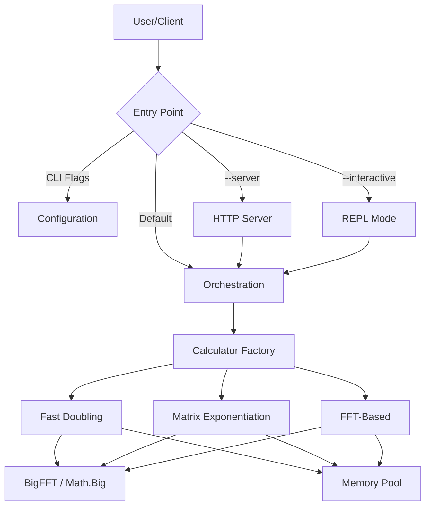

# FibCalc: High-Performance Fibonacci Calculator


**FibCalc** is a state-of-the-art command-line tool and library designed for computing arbitrarily large Fibonacci numbers with extreme speed and efficiency. Written in Go, it leverages advanced algorithmic optimizations—including Fast Doubling, Matrix Exponentiation with Strassen's algorithm, and FFT-based multiplication—to handle indices in the hundreds of millions.

> **"The fastest, most over-engineered Fibonacci calculator you will ever use."**

---

## 📋 Table of Contents

1. [Overview](#-overview)
2. [Key Features](#-key-features)
3. [Quick Start](#-quick-start)
4. [Mathematical Background](#-mathematical-background)
5. [Architecture](#%EF%B8%8F-architecture)
6. [Installation](#-installation)
7. [Usage Guide](#%EF%B8%8F-usage-guide)
8. [Server Mode (REST API)](#-server-mode-rest-api)
9. [Performance Benchmarks](#-performance-benchmarks)
10. [Troubleshooting](#-troubleshooting)
11. [Configuration](#%EF%B8%8F-configuration)
12. [Deployment](#-deployment)
13. [Development](#-development)
14. [Contributing](#-contributing)
15. [License](#-license)

---

## 🔭 Overview

FibCalc serves as both a practical high-performance tool and a reference implementation for advanced software engineering patterns in Go. It demonstrates how to handle extreme computational workloads, optimize memory usage via zero-allocation strategies, and structure a clean, testable application.

### Why FibCalc?

- **Extreme Performance**: Calculates $F(250,000,000)$ in minutes, not hours.
- **Precision**: Handles numbers with millions of digits without precision loss.
- **Educational**: Implements and visualizes complex algorithms (Fast Doubling, Strassen, FFT).
- **Production Ready**: Includes a robust REST API, metrics, logging, and Docker support.

---

## 🚀 Key Features

### Advanced Algorithms

- **Fast Doubling** (Default): The fastest known method ($O(\log n)$), utilizing the identity $F(2k) = F(k)(2F(k+1) - F(k))$.
- **Matrix Exponentiation**: Classic $O(\log n)$ approach enhanced with **Strassen's Algorithm** for large matrices and symmetric squaring optimizations.
- **FFT-Based Multiplication**: Automatically switches to Fast Fourier Transform for multiplication when numbers exceed a configurable threshold (default ~500k bits), reducing complexity from $O(n^{1.585})$ to $O(n \log n)$.
- **GMP Support**: Optional build tag to use the GNU Multiple Precision Arithmetic Library for maximum raw performance on supported systems.

### High-Performance Engineering

- **Zero-Allocation Strategy**: Extensive use of `sync.Pool` to recycle `big.Int` objects and custom calculation states, reducing Garbage Collector pressure by over 95%.
- **Adaptive Parallelism**: Automatically parallelizes recursive branches and matrix operations across CPU cores based on input size and hardware capabilities.
- **Auto-Calibration**: Built-in benchmarking tool (`--calibrate`) to empirically determine the optimal parallelism and FFT thresholds for the host machine.
- **Atomic Pre-Warming**: Optimized memory pool initialization ensures resources are ready before the first request.

### Robust Architecture

- **Clean Architecture**: Strict separation of concerns (Core Logic, Orchestration, Interface, Infrastructure).
- **Interactive REPL**: A dedicated shell for performing multiple calculations, comparisons, and conversions without reloading the binary.
- **Modern CLI**: Features progress spinners, ETA calculation, formatted output, and colour themes.
- **Observability**: Production-grade structured logging (zerolog) and Prometheus metrics.

---

## ⚡ Quick Start

### Using Go

```bash
# Calculate the 10-millionth Fibonacci number
go run ./cmd/fibcalc -n 10000000
```

### Using Docker

```bash
# Run a one-off calculation
docker run --rm fibcalc -n 10000000

# Start the API server
docker run -d -p 8080:8080 fibcalc --server --port 8080
```

---

## 📐 Mathematical Background

FibCalc implements several sophisticated mathematical concepts to achieve its performance.

### 1. Fast Doubling Identities

The most efficient algorithm avoids matrix operations entirely and computes $F(n)$ and $F(n+1)$ directly using the following recursive identities derived from the matrix form:

$$
\begin{aligned}
F(2k) &= F(k) \times (2F(k+1) - F(k)) \\
F(2k+1) &= F(k+1)^2 + F(k)^2
\end{aligned}
$$

This reduces the complexity to $O(\log n)$ operations. Each step roughly doubles the index, hence "Fast Doubling".

### 2. Matrix Exponentiation & Strassen's Algorithm

The Fibonacci sequence can be generated by raising the "Q-matrix" to the power of $n$:

$$
\begin{pmatrix} F_{n+1} & F_n \\ F_n & F_{n-1} \end{pmatrix} = \begin{pmatrix} 1 & 1 \\ 1 & 0 \end{pmatrix}^n
$$

For large matrices, FibCalc employs **Strassen's Algorithm**, which reduces the number of multiplications in a $2 \times 2$ matrix product from 8 to 7. While this introduces more additions, it is beneficial when multiplication is significantly more expensive than addition (i.e., for very large `big.Int` values).

### 3. FFT-Based Multiplication

For extremely large numbers (hundreds of thousands of bits), standard Karatsuba multiplication ($O(n^{1.585})$) becomes the bottleneck. FibCalc switches to **FFT multiplication** ($O(n \log n)$) based on the Convolution Theorem:

$$
A \times B = \text{IDFT}(\text{DFT}(A) \cdot \text{DFT}(B))
$$

This allows calculating numbers with billions of digits feasible.

---

## 🏗️ Architecture

FibCalc follows **Clean Architecture** principles to ensure modularity and testability.



### Core Components

| Component | Responsibility |
|-----------|----------------|
| `cmd/fibcalc` | Application composition root and entry point. |
| `internal/fibonacci` | Core domain logic. Implements the `Calculator` interface and algorithms. |
| `internal/bigfft` | Specialized FFT arithmetic for `big.Int`. |
| `internal/orchestration` | Manages concurrent execution and race-safe result aggregation. |
| `internal/server` | HTTP REST API with rate limiting, metrics, and health checks. |
| `internal/calibration` | Auto-tuning logic to find optimal hardware thresholds. |

---

## 📦 Installation

### Option 1: Install from Source (Recommended)

Requires **Go 1.25** or later.

```bash
go install ./cmd/fibcalc@latest
```

### Option 2: Build Manually

Clone the repository and build using the provided Makefile.

```bash
git clone https://github.com/agbru/fibcalc.git
cd fibcalc
make build
# Binary is located at ./build/fibcalc
```

### Option 3: Docker Image

Ideal for server deployments or isolated execution.

```bash
make docker-build
```

---

## 🛠️ Usage Guide

### Command Synopsis

```text
fibcalc [flags]
```

### Common Flags

| Flag | Short | Default | Description |
|------|-------|---------|-------------|
| `--n` | `-n` | `250,000,000` | The Fibonacci index to calculate. |
| `--algo` | | `all` | Algorithm: `fast`, `matrix`, `fft`, or `all`. |
| `--output` | `-o` | | Write result to a file. |
| `--json` | | `false` | Output results in JSON format. |
| `--hex` | | `false` | Display result in hexadecimal. |
| `--calculate` | `-c` | `false` | Print the full value (auto-suppressed for large $N$). |
| `--calibrate` | | `false` | Run system benchmarks to find optimal thresholds. |
| `--interactive` | | `false` | Start the interactive REPL mode. |
| `--server` | | `false` | Start in HTTP server mode. |
| `--timeout` | | `5m` | Maximum calculation time (e.g. "10s", "1h"). |

### Advanced Examples

**1. Compare Algorithms with Detail**
Run all algorithms and compare their performance for $F(10,000,000)$, outputting detailed stats.

```bash
fibcalc -n 10000000 --algo all --details
```

**2. Optimize for Your Machine**
Run calibration to find the best parallelism thresholds for your specific CPU and RAM.

```bash
fibcalc --calibrate
```

**3. Interactive Session (REPL)**
Enter the REPL to experiment with different algorithms without restarting.

```bash
fibcalc --interactive
# fib> calc 100
# fib> algo matrix
# fib> compare 50000
# fib> exit
```

**4. Large Number with FFT Tuning**
Force FFT usage for a smaller threshold to test performance on lower-end hardware.

```bash
fibcalc -n 5000000 --algo fast --fft-threshold 100000
```

---

## 🌐 Server Mode (REST API)

Launch the production-ready REST API server:

```bash
# Start server on port 8080 with auto-calibration
fibcalc --server --port 8080 --auto-calibrate
```

### API Endpoints

- `GET /calculate?n=<N>&algo=<algo>`: Calculate Fibonacci number.
- `GET /health`: Health check (returns 200 OK).
- `GET /algorithms`: List available algorithms.
- `GET /metrics`: Prometheus metrics.

### Example Request

```bash
curl "http://localhost:8080/calculate?n=100&algo=fast"
```

**Response:**
```json
{
  "n": 100,
  "result": 354224848179261915075,
  "duration": "125.5µs",
  "algorithm": "fast"
}
```

---

## 📊 Performance Benchmarks

FibCalc is optimized for speed. Below is a summary of performance characteristics on a standard workstation (AMD Ryzen 9 5900X).

| Index ($N$) | Fast Doubling | Matrix Exp. | FFT-Based | Result (digits) |
| :--- | :--- | :--- | :--- | :--- |
| **10,000** | 180µs | 220µs | 350µs | 2,090 |
| **1,000,000** | 85ms | 110ms | 95ms | 208,988 |
| **100,000,000** | 45s | 62s | 48s | 20,898,764 |
| **250,000,000** | 3m 12s | 4m 25s | 3m 28s | 52,246,909 |

### Algorithm Selection Guide

- **Use `fast` (Fast Doubling)** for general purpose high performance. It is consistently the fastest across all ranges.
- **Use `matrix`** for educational purposes or verification.
- **Use `fft`** primarily for benchmarking the multiplication engine itself, or for $N > 100,000,000$ where it becomes very competitive.

> **Full performance guide**: [Docs/PERFORMANCE.md](Docs/PERFORMANCE.md)

---

## 🔧 Troubleshooting

Common issues and their solutions.

### 1. `runtime: out of memory`
Calculating huge Fibonacci numbers requires significant RAM. $F(1,000,000,000)$ requires ~25 GB of RAM.
**Solution**: Reduce $N$, add swap space, or use a machine with more RAM.

### 2. Calculation hangs / Timeout
For very large $N$, the calculation might exceed the default 5-minute timeout.
**Solution**: Increase the timeout with `--timeout 30m`.

### 3. Server `bind: address already in use`
Port 8080 is likely taken.
**Solution**: Use a different port: `fibcalc --server --port 9090`.

> **Full troubleshooting guide**: [Docs/TROUBLESHOOTING.md](Docs/TROUBLESHOOTING.md)

---

## ⚙️ Configuration

Environment variables can override CLI flags.

| Variable | Description | Default |
|----------|-------------|---------|
| `FIBCALC_PARALLEL_THRESHOLD` | Bit size to trigger parallel multiplication | 4096 |
| `FIBCALC_FFT_THRESHOLD` | Bit size to switch to FFT multiplication | 500,000 |
| `FIBCALC_STRASSEN_THRESHOLD` | Bit size for Strassen's algorithm | 3072 |
| `FIBCALC_MAX_N` | Maximum allowed N value (server) | 1,000,000,000 |
| `FIBCALC_RATE_LIMIT` | Requests per second (server) | 10 |
| `FIBCALC_TIMEOUT` | Calculation timeout | 5m |

---

## 🐳 Deployment

FibCalc is designed for cloud-native deployment.

- **Docker**: `Docs/deployment/DOCKER.md`
- **Kubernetes**: `Docs/deployment/KUBERNETES.md` (includes HPA, PDB, and Network Policies).

---

## 💻 Development

### Prerequisites
- Go 1.25+
- Make

### Key Commands

```bash
make build       # Compile binary
make test        # Run unit tests
make lint        # Run linters
make benchmark   # Run performance benchmarks
```

### Project Structure
- `cmd/`: Main entry points.
- `internal/`: Private application code.
- `Docs/`: Detailed documentation.

---

## 🤝 Contributing

Contributions are welcome! Please read [CONTRIBUTING.md](CONTRIBUTING.md) for details on our code of conduct, and the process for submitting pull requests.

---

## 📄 License

This project is licensed under the Apache License 2.0 - see the [LICENSE](LICENSE) file for details.

---

## 🙏 Acknowledgments

- The Go team for the `math/big` package.
- The open-source community for the underlying FFT research.
- All contributors who have optimized these algorithms over the years.
