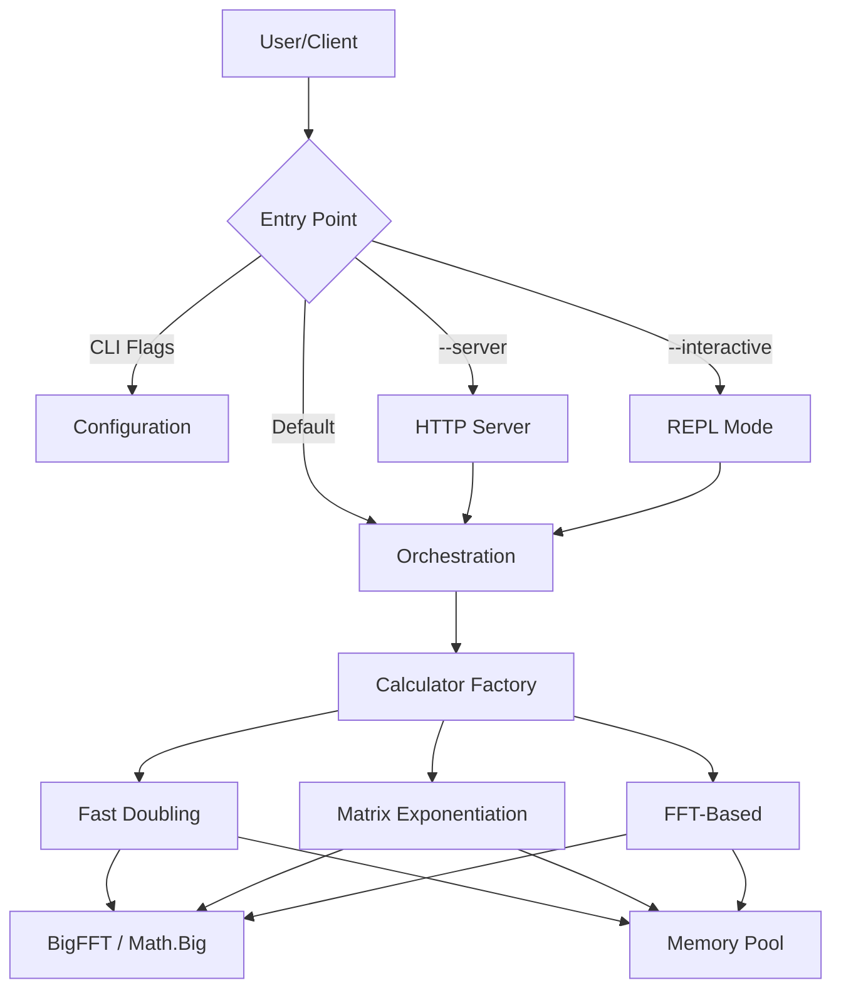

# FibCalc: High-Performance Fibonacci Calculator


**FibCalc** is a state-of-the-art command-line tool and library designed for computing arbitrarily large Fibonacci numbers with extreme speed and efficiency. Written in Go, it leverages advanced algorithmic optimizations—including Fast Doubling, Matrix Exponentiation with Strassen's algorithm, and FFT-based multiplication—to handle indices in the hundreds of millions.

## 🚀 Key Features

*   **Advanced Algorithms**:
    *   **Fast Doubling** (Default): The fastest known method ($O(\log n)$), optimized with parallel multiplication.
    *   **Matrix Exponentiation**: Classic approach ($O(\log n)$) enhanced with **Strassen's Algorithm** for large matrices and symmetric squaring optimizations.
    *   **FFT-Based**: For extreme numbers, switches to Fast Fourier Transform multiplication ($O(n \log n)$ complexity vs $O(n^{1.585})$ for Karatsuba).
    *   **GMP Support**: Optional build tag to use the GNU Multiple Precision Arithmetic Library for maximum raw performance.

*   **High-Performance Engineering**:
    *   **Zero-Allocation Strategy**: extensive use of `sync.Pool` to recycle `big.Int` objects, reducing GC pressure by over 95%.
    *   **Adaptive Parallelism**: Automatically parallelizes operations across CPU cores based on input size and hardware capabilities.
    *   **Auto-Calibration**: Built-in benchmarking tool to determine optimal system-specific thresholds for parallelism and FFT switching.

*   **Rich User Experience**:
    *   **Interactive REPL**: A dedicated shell for performing multiple calculations, comparisons, and conversions.
    *   **Server Mode**: production-ready HTTP API with metrics, rate limiting, and graceful shutdown.
    *   **Modern CLI**: Features progress spinners, ETA calculation, coloured output, and autocompletion generation.

## ⚡ Quick Start

### Using Go
```bash
# Calculate the 10-millionth Fibonacci number
go run ./cmd/fibcalc -n 10000000
```

### Using Docker
```bash
docker build -t fibcalc .
docker run --rm fibcalc -n 10000000
```

## 📦 Installation

### Option 1: Install from Source (Recommended)
Requires Go 1.25 or later.

```bash
go install ./cmd/fibcalc@latest
```

### Option 2: Build Manually
Clone the repository and build using the provided Makefile.

```bash
git clone https://github.com/agbru/fibcalc.git
cd fibcalc
make build
# Binary is located at ./build/fibcalc
```

### Option 3: Docker Image
Ideal for server deployments or isolated execution.

```bash
make docker-build
make docker-run
```

## 🛠️ Usage

### Command Synopsis

```text
fibcalc [flags]
```

### Common Flags

| Flag | Short | Default | Description |
|------|-------|---------|-------------|
| `--n` | `-n` | `250,000,000` | The Fibonacci index to calculate. |
| `--algo` | | `all` | Algorithm to use: `fast`, `matrix`, `fft`, or `all` (for comparison). |
| `--output` | `-o` | | Write result to a specific file. |
| `--json` | | `false` | Output results in JSON format. |
| `--hex` | | `false` | Display result in hexadecimal format. |
| `--calculate` | `-c` | `false` | Display the full calculated value (suppressed by default for large $N$). |
| `--calibrate` | | `false` | Run system benchmarks to find optimal thresholds. |
| `--interactive` | | `false` | Start the interactive REPL mode. |
| `--server` | | `false` | Start in HTTP server mode. |

### Usage Examples (Snippets)

**1. Basic Calculation**
Calculate F(1,000,000) using the default optimized algorithm.
```bash
fibcalc -n 1000000
```

**2. Compare Algorithms**
Run all algorithms and compare their performance for F(10,000,000).
```bash
fibcalc -n 10000000 --algo all --details
```

**3. Optimize for Your Machine**
Run calibration to find the best parallelism thresholds for your specific hardware.
```bash
fibcalc --calibrate
```

**4. Start API Server**
Launch the REST API server on port 8080.
```bash
fibcalc --server --port 8080
```

**5. Interactive Session**
Enter the REPL to experiment with different algorithms.
```bash
fibcalc --interactive
# fib> calc 100
# fib> algo matrix
# fib> calc 100
```

## 🏗️ Architecture

FibCalc follows **Clean Architecture** principles to ensure modularity and testability.



For a deep dive into the system design, see [Docs/ARCHITECTURE.md](Docs/ARCHITECTURE.md).

## 📊 Performance

FibCalc is optimized for speed. Below is a summary of performance characteristics on a standard workstation (AMD Ryzen 9 5900X).

| Index ($N$) | Fast Doubling | Matrix Exp. | FFT-Based |
| :--- | :--- | :--- | :--- |
| **10,000** | 180µs | 220µs | 350µs |
| **1,000,000** | 85ms | 110ms | 95ms |
| **100,000,000** | 45s | 62s | 48s |
| **250,000,000** | 3m 12s | 4m 25s | 3m 28s |

*Full benchmarks available in [Docs/PERFORMANCE.md](Docs/PERFORMANCE.md).*

### Algorithms at a Glance

*   **Fast Doubling**: Best all-rounder. Uses $F(2k) = F(k)(2F(k+1) - F(k))$ identity.
*   **Matrix Exponentiation**: Uses $\begin{pmatrix} 1 & 1 \\ 1 & 0 \end{pmatrix}^n$. Good for verification and theory.
*   **FFT-Based**: Forces FFT multiplication for all operations. Best for extremely large $N$ where $O(n \log n)$ dominates.

## ⚙️ Configuration

You can fine-tune performance via environment variables or CLI flags.

| Env Variable | Flag | Description |
|--------------|------|-------------|
| `FIBCALC_PARALLEL_THRESHOLD` | `--threshold` | Bit size to trigger parallel multiplication (Default: 4096). |
| `FIBCALC_FFT_THRESHOLD` | `--fft-threshold` | Bit size to switch from Karatsuba to FFT multiplication (Default: 500,000). |
| `FIBCALC_STRASSEN_THRESHOLD` | `--strassen-threshold` | Bit size to use Strassen's algorithm for matrices (Default: 3072). |

## 💻 Development

### Prerequisites
*   Go 1.25+
*   Make

### Build & Test
The project includes a comprehensive `Makefile` for common tasks.

```bash
make deps        # Install dependencies
make build       # Compile binary
make test        # Run unit tests
make lint        # Run linters
make coverage    # Generate coverage report
```

### Directory Structure
*   `cmd/fibcalc`: Main application entry point.
*   `internal/fibonacci`: Core algorithms and logic.
*   `internal/bigfft`: Optimized large-integer arithmetic.
*   `internal/server`: HTTP server implementation.
*   `internal/cli`: UI, REPL, and interaction logic.

## 🤝 Contributing

Contributions are welcome! Please read [CONTRIBUTING.md](CONTRIBUTING.md) for details on our code of conduct and the process for submitting pull requests.

## 📄 License

This project is licensed under the Apache License 2.0 - see the [LICENSE](LICENSE) file for details.
