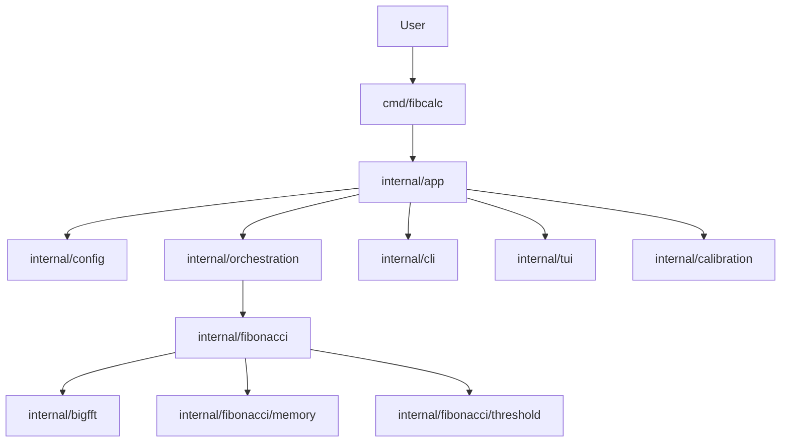

# FibCalc: High-Performance Fibonacci Calculator

[](https://go.dev/)
[](https://github.com/agbruneau/FibGo/actions/workflows/ci.yml)
[](https://github.com/agbruneau/FibGo/actions/workflows/coverage.yml)
[](LICENSE)

[](https://agbruneau.github.io/FibGo/dashboard/)

> **[Live Knowledge-Graph Dashboard →](https://agbruneau.github.io/FibGo/dashboard/)** — Explore the full architecture interactively (971 nodes, 3 781 edges, 8 layers, 13-step guided tour).

**FibCalc** is an academic prototype that computes arbitrarily large Fibonacci numbers at extreme speed. It demonstrates Clean Architecture, zero-allocation strategies, adaptive parallelism, and algorithmic optimization (Fast Doubling, Matrix Exponentiation with Strassen, FFT-based multiplication). Written in Go; handles indices in the hundreds of millions.

> "The fastest, most over-engineered Fibonacci calculator you will ever use."

---

## Table of Contents

1. [Quick Start](#quick-start)
2. [Key Features](#key-features)
3. [Architecture](#architecture)
4. [Performance Benchmarks](#performance-benchmarks)
5. [Usage Guide](#usage-guide)
6. [Configuration](#configuration)
7. [Development](#development)
8. [Testing](#testing)
9. [Troubleshooting](#troubleshooting)
10. [Changelog](#changelog)
11. [Contributing](#contributing)
12. [License](#license)

---

## Quick Start

Requires **Go 1.25** or later.

```bash
git clone https://github.com/agbruneau/FibGo.git
cd FibGo
go build -o fibcalc ./cmd/fibcalc
./fibcalc -n 1000000 -algo fast
```

Or with `make`:

```bash
make build    # ./build/fibcalc (uses PGO profile if present)
make all      # clean + build + test
```

---

## Key Features

### Algorithms

- **Fast Doubling** (default, $O(\log n)$): uses $F(2k) = F(k) \cdot (2F(k+1) - F(k))$.
- **Matrix Exponentiation**: $O(\log n)$ with Strassen (7 muls instead of 8) for large matrices; symmetric squaring optimization.
- **FFT-Based Multiplication**: auto-switches to Schonhage-Strassen over Fermat rings past ~500k bits, taking complexity from $O(n^{1.585})$ to $O(n \log n)$.
- **GMP backend** (optional build tag) for maximum raw throughput.

See [`docs/algorithms/`](docs/algorithms/) — [FAST_DOUBLING.md](docs/algorithms/FAST_DOUBLING.md), [MATRIX.md](docs/algorithms/MATRIX.md), [FFT.md](docs/algorithms/FFT.md), [GMP.md](docs/algorithms/GMP.md), [COMPARISON.md](docs/algorithms/COMPARISON.md).

### Performance engineering

- **Zero-allocation**: `sync.Pool` recycles `big.Int`, reducing GC pressure 95%+.
- **Bump allocator** (O(1), no fragmentation) for FFT temporaries.
- **State-bound calculation arena** (`internal/fibonacci/memory/`): pooled `CalculationState` owns its arena; same `[]big.Word` block is reused across calls when wide enough (`Reset()` only on the hot path). Aliases are severed before pool return.
- **GC controller** disables GC during large calculations (N ≥ 1M) with a soft memory-limit safety net.
- **Result detachment**: `ReleaseStateWithResult` deep-copies the result out of the arena (~850 KB memcpy for F(10M), <0.01 % of runtime) so the caller never aliases pooled memory.
- **FFT LRU cache** (thread-safe) for repeated forward transforms → 15-30% speedup. Eviction allocates fresh backing (no recycle) so concurrent `Get()` callers cannot observe a use-after-free.
- **Adaptive parallelism**: semaphore cap at `runtime.NumCPU()`.
- **Dynamic thresholds** with hysteresis (parallel, FFT, Strassen) adjusted from observed metrics. Atomic-backed (`sync/atomic.Int64`) — safe under concurrent reads (see [`docs/adr/0001-dtm-decision.md`](docs/adr/0001-dtm-decision.md)).
- **Auto-calibration** (`-calibrate`), versioned profile persistence, CPU-heuristic key to invalidate stale cache.
- **PGO** (Profile-Guided Optimization) supported via `make build-pgo`.
- **Modular Fast Doubling**: `--last-digits K` gives O(K) memory for arbitrarily large N.

Full guide: [`docs/PERFORMANCE.md`](docs/PERFORMANCE.md).

### Interfaces

- **Modern CLI**: spinners, ETA, color themes, `NO_COLOR` support.
- **Interactive TUI** (`--tui`): btop-style dashboard (Bubble Tea) — progress chart, sparklines, memory metrics, keyboard navigation. See [`docs/TUI_GUIDE.md`](docs/TUI_GUIDE.md).
- **Machine-readable output** (`--machine`) for scripting.
- **Shell completion**: bash, zsh, fish, PowerShell (`fibcalc -completion <shell>`).

---

## Architecture

Clean Architecture with four layers. Source of truth: [`docs/architecture/`](docs/architecture/).

> **Interactive view** — Browse the full knowledge graph (971 nodes, 3 781 edges, 8 architectural layers, 13-step guided tour) at **[agbruneau.github.io/FibGo/dashboard/](https://agbruneau.github.io/FibGo/dashboard/)**. The dashboard is generated from [`.understand-anything/knowledge-graph.json`](.understand-anything/knowledge-graph.json) and served statically by GitHub Pages from [`docs/dashboard/`](docs/dashboard/).


```mermaid
graph TD
    User --> Entry[cmd/fibcalc]
    Entry --> App[internal/app]
    App --> Config[internal/config]
    App --> Orch[internal/orchestration]
    Orch --> Fib[internal/fibonacci]
    Fib --> BigFFT[internal/bigfft]
    Fib --> FibMem[internal/fibonacci/memory]
    Fib --> FibThr[internal/fibonacci/threshold]
    App --> CLI[internal/cli]
    App --> TUI[internal/tui]
    App --> Calib[internal/calibration]
```

Key packages:

| Package | Responsibility |
|---|---|
| `cmd/fibcalc` | CLI entry point. |
| `internal/app` | Lifecycle, dispatch, version. |
| `internal/fibonacci` | Algorithms, frameworks, strategies. Sub-packages: `memory/` (arena, GC, budget), `threshold/` (dynamic manager). |
| `internal/bigfft` | Schonhage-Strassen over Fermat rings, bump allocator, LRU transform cache. |
| `internal/orchestration` | Concurrent execution (`errgroup`), result aggregation, calculator selection. |
| `internal/calibration` | Hardware-adaptive tuning, micro-benchmarks, profile persistence. |
| `internal/cli` / `internal/tui` | Presentation layers sharing `ProgressReporter` / `ResultPresenter`. |
| `internal/config` | Flag parsing, env vars, threshold estimation. |
| `internal/progress` | Observer pattern; production path is `Freeze` (snapshot + recover). |
| `internal/{errors,format,metrics,metrics/system,parallel,ui,testutil}` | Support packages (leaves). `parallel.ErrorCollector` is used by `fibonacci/common.go`. |

Full package list and dependency graph: [`docs/architecture/README.md`](docs/architecture/README.md), [`docs/architecture/dependency-graph.mermaid`](docs/architecture/dependency-graph.mermaid).

---

## Performance Benchmarks

Reference platform: **AMD Ryzen 9 5900X** (12 C / 24 T), 32 GB DDR4-3600, Linux 6.1, Go 1.25.0.

| N            | Fast Doubling | Matrix Exp. | FFT-Based | Result (digits) |
|--------------|---------------|-------------|-----------|-----------------|
| 10,000       | 180us         | 220us       | 350us     | 2,090           |
| 1,000,000    | 85ms          | 110ms       | 95ms      | 208,988         |
| 10,000,000   | 2.1s          | 2.8s        | 2.3s      | 2,089,877       |
| 100,000,000  | 45s           | 62s         | 48s       | 20,898,764      |
| 250,000,000  | 3m12s         | 4m25s       | 3m28s     | 52,246,909      |

**Algorithm selection guide**

- Use **`fast`** for general-purpose high performance (consistently fastest).
- Use **`matrix`** for educational purposes or cross-validation.
- Use **`fft`** for $N > 100{,}000{,}000$ where it becomes very competitive.

Full methodology, Intel comparison, regression tracking: [`docs/PERFORMANCE.md`](docs/PERFORMANCE.md).

---

## Usage Guide

### Synopsis

```text
fibcalc [flags]
```

### Common flags

| Flag | Short | Default | Description |
|---|---|---|---|
| `-n` | | 100,000,000 | Fibonacci index. |
| `-algo` | | `all` | `fast`, `matrix`, `fft`, or `all`. |
| `-calculate` | `-c` | `false` | Display the calculated value. |
| `-verbose` | `-v` | `false` | Display the full result. |
| `-details` | `-d` | `false` | Performance details and metadata. |
| `-output` | `-o` | | Write result to a file. |
| `-quiet` | `-q` | `false` | Minimal output (scripting). |
| `-machine` | | `false` | Machine-readable output (no ANSI). |
| `-calibrate` | | `false` | Benchmark to tune thresholds. |
| `-auto-calibrate` | | `false` | Quick startup calibration. |
| `-calibration-profile` | | | Path to calibration profile. |
| `-timeout` | | `5m` | Maximum calculation time. |
| `-threshold` | | `0` (auto) | Parallelism threshold (bits). |
| `-fft-threshold` | | `0` (auto) | FFT multiplication threshold (bits). |
| `-strassen-threshold` | | `0` (auto) | Strassen threshold (bits). |
| `-tui` | | `false` | Launch TUI dashboard. |
| `-completion` | | | Generate shell completion (bash/zsh/fish/powershell). |
| `--version` | `-V` | | Display version info. |
| `--last-digits` | | `0` | Compute only the last K decimal digits (O(K) memory). |
| `--memory-limit` | | | Memory budget (e.g. `8G`). Pre-flight estimator aborts if exceeded. |
| `--gc-control` | | `auto` | GC behaviour during calculation: `auto`, `aggressive`, or `disabled`. |

> Threshold `0` triggers hardware-adaptive estimation. Static fallbacks: parallel = 4,096 bits, FFT = 500,000 bits, Strassen = 3,072 bits (config) / 256 bits (internal).

### Examples

```bash
fibcalc -n 10000000 -algo all -details       # compare algorithms
fibcalc --tui -n 5000000 -algo all           # TUI dashboard
fibcalc -n 5000000 -algo fast -fft-threshold 100000   # FFT tuning
fibcalc -n 10000000000 --last-digits 100     # last K digits, O(K) memory
fibcalc -n 1000000000 --memory-limit 8G      # pre-flight memory validation
fibcalc -calibrate                           # tune for this host
fibcalc -completion bash > /etc/bash_completion.d/fibcalc
```

TUI walkthrough, keyboard shortcuts, screenshots: [`docs/TUI_GUIDE.md`](docs/TUI_GUIDE.md).

---

## Configuration

Environment variables override defaults (CLI flags still win). Priority: **CLI flags > Environment variables > Adaptive estimation > Static defaults**. Full list is also in [`.env.example`](.env.example).

| Variable | Description | Default |
|---|---|---|
| `FIBCALC_N` | Fibonacci index | 100,000,000 |
| `FIBCALC_ALGO` | `fast`, `matrix`, `fft`, `all` | `all` |
| `FIBCALC_TIMEOUT` | Calculation timeout | `5m` |
| `FIBCALC_THRESHOLD` | Parallelism threshold (bits) | 0 (auto) |
| `FIBCALC_FFT_THRESHOLD` | FFT threshold (bits) | 0 (auto) |
| `FIBCALC_STRASSEN_THRESHOLD` | Strassen threshold (bits) | 0 (auto) |
| `FIBCALC_VERBOSE` / `FIBCALC_DETAILS` / `FIBCALC_QUIET` | Output verbosity | `false` |
| `FIBCALC_MACHINE_OUTPUT` | Machine-readable output | `false` |
| `FIBCALC_CALCULATE` | Display computed value | `false` |
| `FIBCALC_OUTPUT` | Output file path | |
| `FIBCALC_TUI` | Launch TUI dashboard | `false` |
| `FIBCALC_TUI_THEME` | `high-contrast` or empty (dark) | |
| `FIBCALC_CALIBRATE` / `FIBCALC_AUTO_CALIBRATE` | Calibration mode | `false` |
| `FIBCALC_CALIBRATION_PROFILE` | Profile path | |
| `FIBCALC_PROFILE_MAX_AGE` | Calibration profile freshness window before re-calibration | `168h` (7 d) |
| `FIBCALC_MEMORY_LIMIT` | Memory budget ceiling | |
| `NO_COLOR` | Disable ANSI colors ([no-color.org](https://no-color.org/)) | |

Build and deployment details (cross-compilation, PGO, signing): [`docs/BUILD.md`](docs/BUILD.md).

---

## Development

- Go 1.25+, optional `golangci-lint` and `gosec`.
- **Reproducible environment** — open the repo in VS Code with the
  [`.devcontainer/`](.devcontainer/devcontainer.json) (Go + CGO +
  libgmp + benchstat pre-installed) or build the
  [multi-stage `Dockerfile`](Dockerfile) for a distroless runtime image.
- **Cross-compilation** — CI builds `linux/arm64`, `darwin/arm64`,
  `darwin/amd64` on every PR ; see [`docs/PORTABILITY.md`](docs/PORTABILITY.md)
  for the matrix and the assembler/generic fallback contract.
- Architectural decisions (concurrence, panic policy, globals, backlog):
  [`docs/adr/`](docs/adr/).
- Guidance for AI assistants: [`Claude.md`](Claude.md).
- Contribution workflow: [`CONTRIBUTING.md`](CONTRIBUTING.md).

Most common commands:

```bash
make all             # clean + build + test
make test            # go test -v -race -cover ./...
make test-short      # skip slow tests
make lint            # golangci-lint (24 linters, govet shadow enabled)
make coverage        # coverage.html report
make benchmark       # performance benchmarks
make bench-baseline  # refresh docs/audits/bench-baseline.txt for the CI gate
make build-pgo       # build with PGO
make build-all       # cross-compile linux/windows/darwin (amd64 + arm64)
make stats           # canonical package & LOC counts
make help            # list all targets
```

Project layout:

```
cmd/
  fibcalc/            # CLI entry point
  generate-golden/    # golden-data generator
internal/
  app/                # lifecycle, dispatch, version
  bigfft/             # FFT (Schonhage-Strassen), bump allocator
  calibration/        # hardware-adaptive tuning, profiles
  cli/                # CLI output, progress, completion
  config/             # flag + env parsing, threshold estimation
  errors/             # ConfigError, CalculationError, exit codes
  fibonacci/          # algorithms, frameworks, strategies
    fibonaccitest/    # test doubles for CoreCalculator
    memory/           # arena, GC controller, memory budget
    threshold/        # dynamic threshold manager
  format/             # duration/number formatting
  metrics/            # performance & memory indicators
    system/           # OS CPU/memory probes (formerly sysmon)
  orchestration/      # concurrent execution, aggregation
  parallel/           # ErrorCollector (used by fibonacci/common.go)
  progress/           # observer pattern (production path: Freeze)
  testutil/           # test-only helpers
  tui/                # Bubble Tea dashboard
    component/        # reusable TUI component
  ui/                 # color themes, NO_COLOR
docs/
  adr/                # Architectural Decision Records (0000-template, 0001..0004)
  architecture/       # C4 diagrams, dependency graph, patterns
  algorithms/         # math deep dives per algorithm
  audits/             # benchmark baseline + DTM on/off measurements
  dashboard/          # static GitHub Pages build of the interactive knowledge graph
  external-reviews/   # archived external reviews with transparency banners
  {BUILD,PERFORMANCE,TESTING,CALIBRATION,TUI_GUIDE,PORTABILITY}.md
.devcontainer/        # VS Code devcontainer (Go + CGO + libgmp)
.understand-anything/ # generated knowledge graph (source for docs/dashboard/)
Dockerfile            # multi-stage build (golang builder → distroless runtime)
test/
  e2e/                # end-to-end CLI integration tests
```

---

## Testing

Coverage gate at 80 % project-wide (`coverage.yml`). The hardening sprint
lifted `internal/cli/completion/` from 0 % to 95.7 %. Test layers:

- **Unit & integration** — every package under `internal/`.
- **Architecture gate** — `internal/arch_test.go` fails the build if a
  forbidden upward import is introduced (e.g. `tui → fibonacci`).
- **Golden** — `internal/fibonacci/testdata/fibonacci_golden.json`
  exercises every algorithm against an independent oracle (sizes
  through F(200 000), well into the FFT regime).
- **Property-based** — `gopter` identities (Cassini, recurrence,
  doubling, `GCD(F(m),F(n)) = F(GCD(m,n))`).
- **Fuzz** — 7 targets : `FuzzFastDoublingConsistency`,
  `FuzzFFTBasedConsistency`, `FuzzFibonacciIdentities`,
  `FuzzProgressMonotonicity`, `FuzzFastDoublingMod`,
  `bigfft.FuzzMul`, `bigfft.FuzzSqr`.
- **Panic-site contract** — `TestFermatPanicSites` documents and
  exercises each pre-condition panic in `internal/bigfft/fermat.go`;
  `TestFermatPostConditionPanicClassifier` guards the sentinel
  re-propagation (see [`docs/adr/0002-recover-strategy.md`](docs/adr/0002-recover-strategy.md)).
- **End-to-end** — `test/e2e/` exercises the CLI binary.
- **Performance gate** — `.github/workflows/ci.yml` runs `benchstat`
  against `docs/audits/bench-baseline.txt` and fails any PR introducing
  a regression > 5 % on the algorithmic hot paths.

```bash
go test -v -race -cover ./...                        # all tests
go test -v -short ./...                              # skip slow
go test -bench=. -benchmem ./internal/fibonacci/     # benchmarks
go test -fuzz=FuzzFastDoublingConsistency -fuzztime=30s ./internal/fibonacci/
go test -fuzz=FuzzMul -fuzztime=30s ./internal/bigfft/
make stats                                           # package / LOC counts
make bench-baseline                                  # refresh the CI baseline
```

Strategy, golden files, E2E, mocking policy: [`docs/TESTING.md`](docs/TESTING.md).

---

## Troubleshooting

- **`runtime: out of memory`** — $F(10^9)$ needs ~25 GB. Reduce N, add swap, or use `--last-digits K`.
- **Calculation hangs / times out** — raise `-timeout` (e.g. `-timeout 30m`).
- **Memory-limit exceeded** — pre-flight check with `--memory-limit 8G` or switch to `--last-digits`.

---

## Changelog

See [`CHANGELOG.md`](CHANGELOG.md) (Keep a Changelog format, SemVer).

---

## Contributing

Contributions welcome. Read [`CONTRIBUTING.md`](CONTRIBUTING.md) for the workflow, coding conventions, and test expectations.

---

## License

Apache License 2.0 — see [`LICENSE`](LICENSE).

### Acknowledgments

- The Go team for `math/big`.
- The open-source community for the underlying FFT research.
- The [Charm](https://charm.sh/) team for Bubble Tea, Lipgloss, Bubbles.
