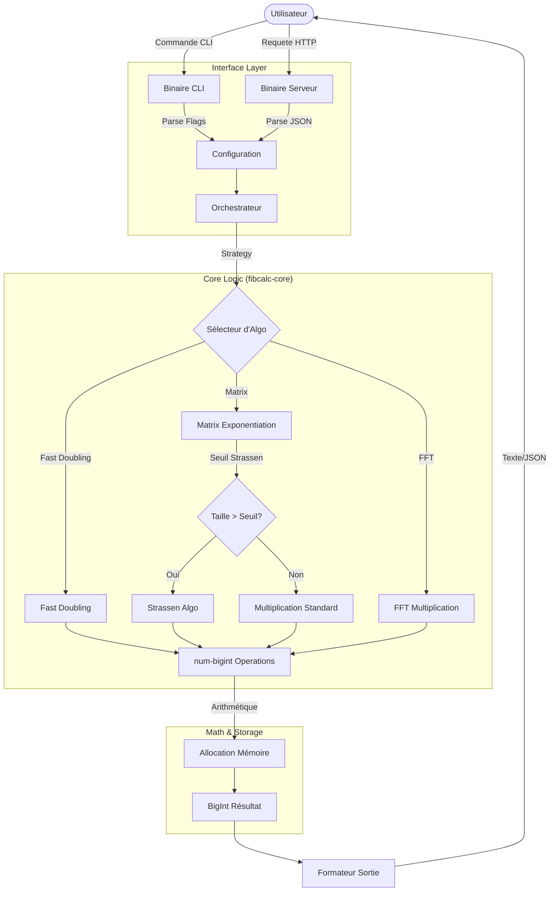

# Plan de Transmutation (Rust Port)

## 1. Stack Technique

*   **Langage**: Rust 2021 Edition
*   **Gestionnaire de Paquets**: Cargo (Workspaces)
*   **Noyau Mathématique**:
    *   `num-bigint`: Arithmétique arbitraire (Pure Rust).
    *   `num-traits` & `num-integer`: Traits génériques mathématiques.
*   **CLI (Command Line Interface)**:
    *   `clap` (derive): Parsing des arguments de ligne de commande.
    *   `indicatif`: Barres de progression et spinners.
    *   `colored` / `console`: Coloration du texte dans le terminal.
    *   `rustyline` ou `inquire`: Mode REPL interactif.
*   **Serveur API**:
    *   `axum`: Framework web haute performance, ergonomique et modulaire.
    *   `tokio`: Runtime asynchrone (standard de l'industrie).
    *   `tower`: Middleware (Rate limiting, timeouts).
    *   `serde` & `serde_json`: Sérialisation/Désérialisation JSON.
*   **Observabilité**:
    *   `tracing`: Logging structuré.
    *   `metrics`: Façade de métriques.
    *   `metrics-exporter-prometheus`: Exportateur compatible Prometheus.
*   **Tests & Benchmarks**:
    *   `proptest`: Property-based testing (équivalent `gopter`).
    *   `criterion`: Framework de micro-benchmarking statistique.

## 2. Architecture de Données

### Configuration (Shared)
La configuration doit refléter les options du Go pour garantir la parité.

```rust
// Dans fibcalc-core/src/config.rs
pub struct CalculationOptions {
    pub parallel_threshold_bits: usize,
    pub fft_threshold_bits: usize,
    pub strassen_threshold_bits: usize,
    pub fft_cache_enabled: bool,
    // ... autres options dynamiques
}
```

### API Response (JSON Contract)
La structure JSON doit être identique à celle du Go pour les clients API existants.

```rust
// Dans fibcalc-server/src/types.rs
use serde::Serialize;
use num_bigint::BigInt;

#[derive(Serialize)]
pub struct CalculationResponse {
    pub n: u64,

    // Le résultat est sérialisé en string ou number selon la taille/config,
    // mais ici on garde la compatibilité string pour les grands nombres.
    #[serde(skip_serializing_if = "Option::is_none")]
    pub result: Option<String>,

    pub duration: String,

    #[serde(skip_serializing_if = "Option::is_none")]
    pub error: Option<String>,

    pub algorithm: String,
}

#[derive(Serialize)]
pub struct ErrorResponse {
    pub error: String,
    #[serde(skip_serializing_if = "Option::is_none")]
    pub message: Option<String>,
}
```

## 3. Diagramme de Flux

Ce diagramme illustre le flux de contrôle depuis l'entrée utilisateur jusqu'au calcul mathématique.



## 4. Plan d'Implémentation

### Phase 1: Initialisation & Fondations
- [ ] Créer la structure du Workspace Cargo (`fibcalc-core`, `fibcalc-cli`, `fibcalc-server`).
- [ ] Définir les types partagés (`Options`, `Error`) et l'interface (Trait) `Calculator`.
- [ ] Mettre en place le CI/CD de base (fmt, clippy, test).

### Phase 2: Core Algorithmique (fibcalc-core)
- [ ] Implémenter le wrapper `num-bigint` et les utilitaires mathématiques de base.
- [ ] **Algo 1**: Implémenter `Fast Doubling` (portage direct logic).
- [ ] **Algo 2**: Implémenter `Matrix Exponentiation` avec optimisation des carrés symétriques.
- [ ] **Algo 3**: Implémenter `Strassen` pour la multiplication matricielle récursive.
- [ ] **Algo 4**: Implémenter la multiplication `FFT` (Schönhage-Strassen ou similaire si nécessaire, ou optimisation du `num-bigint`).
- [ ] Ajouter la logique de sélection dynamique des algorithmes basés sur les seuils (`DynamicThresholds`).

### Phase 3: CLI (fibcalc-cli)
- [ ] Configurer `clap` pour reproduire exactement les flags Go (`-n`, `-a`, etc.).
- [ ] Implémenter l'affichage avec `indicatif` (Spinner) et la gestion des couleurs.
- [ ] Implémenter le mode interactif (REPL).
- [ ] Ajouter la commande de calibration (`--calibrate`) et l'analyse des résultats.

### Phase 4: Serveur API (fibcalc-server)
- [ ] Mettre en place `axum` et le routeur HTTP.
- [ ] Implémenter les handlers (`calculate_handler`, `health_handler`).
- [ ] Intégrer les métriques Prometheus.
- [ ] Ajouter le middleware de Rate Limiting.

### Phase 5: Optimisation & Validation
- [ ] Écrire les tests de propriétés (`proptest`) pour vérifier l'identité de Cassini.
- [ ] Configurer `criterion` pour les benchmarks comparatifs (Rust vs Go).
- [ ] Profiling et optimisation mémoire (réduire les clones `BigInt`).
- [ ] Validation croisée sur Linux et Windows 11.
