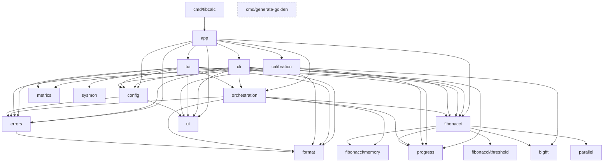

# TEAM B — Architecture & Refactorisation

> Rapport généré par l'agent `Plan` (mode read-only) puis matérialisé par le Coordinateur.

## Résumé exécutif

- Violations Clean Architecture strictes : **0** (couches respectées, `cmd → app → {cli, tui, calibration} → orchestration → fibonacci → bigfft/parallel/progress`).
- Smells de couplage P1 : **2** (cycle "souple" `cli ↔ orchestration` via `presenter.go`, package `app` à fan-out 9 internes — borderline).
- Refactos chirurgicales proposées : **9** (plafond ≤ 10 respecté).
- Code mort / signaux `unparam` à supprimer : **5 fonctions** (cf. F-B5).
- Erreur silencieusement ignorée : **1** critique (`g.Wait()` dans `orchestrator.go:67`, déjà flaggée par errcheck).
- Duplication majeure : `executeParallel3` (3×13 LoC quasi identiques) + arena/pre-size dans 2 calculators + `fibBig`/`calculateSmall`.
- Interfaces > 5 méthodes : **0** (toutes ISP-compliant). `CalculatorFactory` = 5 méthodes (limite).
- Sévérité globale du codebase : **mature, bien découpé**. Les findings sont du polish, pas de redesign.

## Schéma de dépendances internes



Couches respectées. Aucune flèche inversée détectée (`grep "internal/cli"` dans `internal/orchestration` = vide).

## Fan-in / fan-out

| Package | Fan-out interne | Fan-in interne | Verdict |
|---|---|---|---|
| `internal/parallel` | 0 | 1 (fibonacci) | Solitaire (OK) |
| `internal/format` | 0 | 11 | Hub utilitaire stable (OK) |
| `internal/errors` | 1 (format) | 16 | Hub stable, OK |
| `internal/progress` | 0 | 16 | Hub stable, OK |
| `internal/ui` | 0 | 14 | Hub stable, OK |
| `internal/config` | 2 (errors, ui) | 15 | OK |
| `internal/bigfft` | 0 | 9 | Spécialisé, OK |
| `internal/fibonacci` | 5 | 21 | Hub fonctionnel (cœur algorithmique) |
| `internal/orchestration` | 5 | 14 | OK |
| `internal/calibration` | 7 | 1 (app) | **Fan-out élevé**, voir F-B6 |
| `internal/cli` | 8 | 1 (app) | **Fan-out élevé**, voir F-B7 |
| `internal/tui` | 9 | 1 (app) | **Fan-out élevé**, voir F-B7 |
| `internal/app` | 9 | 1 (cmd/fibcalc) | Composition root, justifié |

Aucun package > 10 fan-out, aucun > 21 fan-in.

---

## Findings

### F-B1 — Erreur de `g.Wait()` ignorée dans l'orchestrateur (P0)

- **Fichier** : `internal/orchestration/orchestrator.go:67`
- **Diagnostic** : `g.Wait()` ne renvoie jamais d'erreur dans la boucle multi-calculator (les `g.Go` retournent toujours `nil`), donc la valeur de retour est techniquement vide. Mais le linter `errcheck` (baseline ligne 85-87) signale ce pattern. Plus grave : si quelqu'un un jour fait remonter une erreur depuis un `g.Go`, elle sera silencieusement perdue.
- **Patch proposé** :
```diff
-		g.Wait()
+		_ = g.Wait() // results aggregated per goroutine; errgroup currently never errors
```
- **Effort** : S | **Risque** : faible

### F-B2 — Triplication de code dans `executeParallel3` (P1)

- **Fichier** : `internal/fibonacci/common.go:97-144`
- **Diagnostic** : Trois goroutines `op1/op2/op3` répètent un bloc de 13 lignes (sem in, ctx check, set error, sem out, wg.Done). ~40 lignes dupliquées. Aussi appelée depuis `executeFFTTransformsParallel` (`fft.go:133`).
- **Patch proposé** :
```diff
+func runWithSem(ctx context.Context, sem chan struct{}, op func() error, ec *parallel.ErrorCollector, wg *sync.WaitGroup) {
+    defer wg.Done()
+    sem <- struct{}{}
+    defer func() { <-sem }()
+    if err := ctx.Err(); err != nil {
+        ec.SetError(fmt.Errorf("canceled before parallel operation: %w", err))
+        return
+    }
+    ec.SetError(op())
+}
```
- **Effort** : S | **Risque** : faible

### F-B3 — Duplication arena/pre-size dans Fast Doubling et FFT-Based (P1)

- **Fichiers** : `internal/fibonacci/fastdoubling.go:100-115` et `internal/fibonacci/fft_based.go:53-66`
- **Diagnostic** : Deux blocs de pré-allocation arena (12 lignes) identiques.
- **Patch proposé** : extraire `presizeStateFromArena(s *CalculationState, n uint64) *memory.CalculationArena`.
- **Effort** : S | **Risque** : faible

### F-B4 — `fibBig` (cmd/generate-golden) duplique `calculateSmall` (P2)

- **Fichiers** : `cmd/generate-golden/main.go:77-94` vs `internal/fibonacci/calculator.go:225-239`
- **Diagnostic** : Implémentations identiques. Ne pas unifier (le golden generator doit rester un oracle indépendant).
- **Patch proposé** : ajouter un commentaire `// intentional duplication: independent oracle for cross-validation`.
- **Effort** : S | **Risque** : nul

### F-B5 — Code mort / `unparam` détecté (P1)

- `internal/calibration/microbench.go:169` — `runSingleTest` : paramètre `parallel` jamais utilisé.
- `internal/calibration/microbench.go:208` — `multiplyTest` : retour `*big.Int` jamais consommé.
- `internal/cli/presenter.go:92` — `padRight` : `s` reçoit toujours `""`.
- `internal/config/env.go:19` — `getEnvString` : `defaultVal` toujours `"default"`.
- `internal/fibonacci/fft.go:86` — `executeDoublingStepFFT` : `opts` non utilisé.
- **Effort** : S (chaque) | **Risque** : faible

### F-B6 — Cohésion mixte de `internal/calibration` (P2)

- **Fichier** : `internal/calibration/calibration.go` (339 lignes, fan-out 7)
- **Diagnostic** : `RunCalibrationWithOptions` (61 statements, signalé `funlen` baseline ligne 602) mélange chargement, génération seuils, boucle, channel display, écriture profil, exit code.
- **Patch proposé** : extraire `runCalibrationLoop(ctx, calculator, thresholds, progressChan) ([]calibrationResult, int, time.Duration)`.
- **Effort** : M | **Risque** : moyen

### F-B7 — `cli.CLIProgressReporter` est un wrapper trivial (P2)

- **Fichier** : `internal/cli/presenter.go:19-27`
- **Diagnostic** : `CLIProgressReporter.DisplayProgress` ne fait que déléguer. `orchestration.ProgressReporterFunc(cli.DisplayProgress)` ferait pareil.
- **Patch proposé** : supprimer le type, utiliser `ProgressReporterFunc`.
- **Effort** : S | **Risque** : faible

### F-B8 — Cyclomatic complexity 24 dans `releaseMatrixState` (P1)

- **Fichier** : `internal/fibonacci/matrix_types.go:154-170`
- **Diagnostic** : Chaîne `checkLimit(s.p1) || checkLimit(s.p2) || ...` (20 termes) → cyclo 24.
- **Patch proposé** : helper `anyExceedsPoolLimit(items ...*big.Int) bool` → cyclo ~4.
- **Effort** : S | **Risque** : faible

### F-B9 — `gofmt` non passé sur ~80 fichiers (P1, hygiène)

- **Fichiers** : voir baseline `lint.txt` lignes 803-1099 (cmd/, internal/app/, bigfft/, calibration/, cli/, config/, errors/, fibonacci/).
- **Diagnostic** : probablement `\r\n` Windows ou `gofmt -s` jamais lancé.
- **Patch proposé** : `gofmt -w -s ./...` en commit isolé.
- **Effort** : S | **Risque** : nul

---

## Tableau récap (priorisé par ROI)

| # | Catégorie | Sévérité | Fichier(s) clé | Effort | Risque | ROI |
|---|---|---|---|---|---|---|
| F-B9 | Hygiène lint | P1 | ~80 fichiers | S | nul | ★★★★★ |
| F-B1 | Erreur ignorée | P0 | `orchestration/orchestrator.go:67` | S | faible | ★★★★★ |
| F-B2 | Duplication parallèle | P1 | `fibonacci/common.go:97` | S | faible | ★★★★ |
| F-B5 | Code mort/unparam | P1 | 5 fichiers | S×5 | faible | ★★★★ |
| F-B3 | Duplication arena | P1 | `fastdoubling.go`+`fft_based.go` | S | faible | ★★★★ |
| F-B8 | Cyclomatic 24 | P1 | `matrix_types.go:154` | S | faible | ★★★★ |
| F-B7 | Wrapper trivial | P2 | `cli/presenter.go:19` | S | faible | ★★★ |
| F-B4 | Doc duplication oracle | P2 | `cmd/generate-golden/main.go` | S | nul | ★★★ |
| F-B6 | Cohésion calibration | P2 | `calibration/calibration.go:65` | M | moyen | ★★ |
