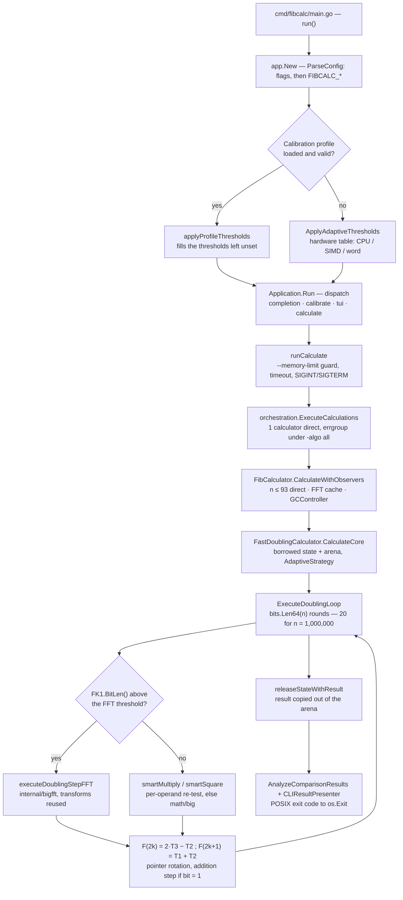

# FibGo / FibCalc Architecture

> **This document narrates; [`docs/architecture/`](architecture/README.md) draws** — except
> the CLI flow figure, which is drawn here, at the head of [§6](#6-data-flow-cli-input-to-final-result),
> above the legend that explains it.
> The eleven figures of the corpus (Mermaid blocks) are the **authoritative view of the
> system's shape** — import edges, subgraphs, branch order, loop returns.
> They are also the most verified pages of the repository: every import edge was
> checked against `go list` and every class arrow against the source, edge by edge, in
> the [validation report](architecture/validation/validation-report.md).
> The sections below are the **legend** of those figures: they give the why, the
> constants, the defaults and what is not guaranteed. Maintenance rule: **where a
> figure exists, ARCH.md cites it instead of drawing a second one.** There are not two
> competing views of the architecture, but one figure and its commentary.

## 0) Figure map

The corpus holds **eleven** Mermaid figures, plus two table documents without a figure:
ten live in [`docs/architecture/`](architecture/README.md), the eleventh — the CLI flow —
is inline in [§6](#6-data-flow-cli-input-to-final-result). Each row says which section of
this document comments which figure; follow the link from the section, or enter through
the [hub](architecture/README.md).

| Figure (Mermaid block) | What it draws | Explained in |
|---|---|---|
| [`system-context.md`](architecture/system-context.md) | C4-1: the user and the three external systems touched (OS, file system, optional GMP) | [§1](#1-project-overview) |
| [`container-diagram.md`](architecture/container-diagram.md) | C4-2: the logical containers; every `Rel` between two `Container`s is a real Go import | [§2](#2-high-level-architecture-clean-architecture) |
| [`dependency-graph.md`](architecture/dependency-graph.md) | the module's 45 direct internal imports, one per edge (neither superset nor subset) | [§2](#2-high-level-architecture-clean-architecture), [§3](#3-directory-structure) |
| [`component-diagram.md`](architecture/component-diagram.md) | `classDiagram`: interfaces, fields, class collaborations — **not** imports | [§4](#4-core-packages-responsibilities-key-types-interfaces) |
| [`patterns/interface-hierarchy.md`](architecture/patterns/interface-hierarchy.md) | the key interfaces and their implementations, grouped by domain | [§5](#5-design-patterns), [§8](#presentation-layer-integration) |
| **inline in [§6](#6-data-flow-cli-input-to-final-result)** (CLI flow) | `main.go` → exit code: configuration, dispatch, execution, presentation, errors | the section itself, ten numbered steps |
| [`flows/tui-flow.md`](architecture/flows/tui-flow.md) | the dashboard's Elm cycle: `programRef` bridge, messages, `Update`, `View`, key bindings | [§6](#tui-mode-figure) |
| [`flows/config-flow.md`](architecture/flows/config-flow.md) | the five configuration sources and their precedence, down to `fibonacci.Options` | [§8](#configuration-cascade), [§9](#9-configuration-and-environment) |
| [`flows/fastdoubling.md`](architecture/flows/fastdoubling.md) | decorator → `DoublingFramework` → multiplication decision → FFT step → result extraction | [§7A](#a-fast-doubling-fastdoublingcalculator) |
| [`flows/matrix.md`](architecture/flows/matrix.md) | binary exponentiation of the Q matrix, Strassen decision, return by pointer theft | [§7B](#b-matrix-exponentiation-matrixexponentiationcalculator) |
| [`flows/fft-pipeline.md`](architecture/flows/fft-pipeline.md) | `bigfft.Mul`/`Sqr`: threshold, allocation, polynomial conversion, transform, pointwise, inverse | [§7C](#c-fft-based-doubling-fftbasedcalculator) |

Without a figure, but part of the same corpus:

| Document | Role |
|---|---|
| [`patterns/design-patterns.md`](architecture/patterns/design-patterns.md) | **authoritative inventory** of the patterns and their implementation sites — [§5](#5-design-patterns) points to it instead of keeping a second list |
| [`validation/validation-report.md`](architecture/validation/validation-report.md) | record of the invariants checked against the source (commands, dates, corrections) — [§11](#11-testing-strategy) points to it |

## 1) Project Overview

**FibGo** (module/library name: **FibCalc**) is a high-performance Fibonacci computation system implemented in Go.

- **Go module path:** `github.com/agbruneau/FibGo`
- **Go version:** 1.26.1+ (`go.mod` declares `go 1.26.1`, no `toolchain` directive). Raised from 1.26.0 on 2026-09-07: govulncheck found GO-2026-4602 (`os`, FileInfo escaping a Root) reachable through `gopsutil`'s `cpu.init`, fixed in go1.26.1.
- **Primary binary:** `cmd/fibcalc`
- **Codebase stats:** run `make stats` for the canonical Go-package and LOC counts (the totals drift on every refactor; encoding them statically here has historically caused divergence between this document and reality).
- **Purpose:** compute very large Fibonacci values efficiently, compare multiple algorithms, and expose both CLI and TUI execution modes.
- **Core strengths:**
  - Multiple `O(log n)` Fibonacci algorithms (Fast Doubling, Matrix Exponentiation, FFT-Based Doubling)
  - Adaptive multiplication strategy (`math/big` Karatsuba vs FFT) with configurable thresholds
  - Optional GMP backend via build tag
  - Runtime calibration/adaptive thresholds with micro-benchmark support
  - Concurrency-aware orchestration with multi-level parallelism and progress reporting
  - Memory management via arena allocators, object pools, and GC control
  - Modular arithmetic mode (`--last-digits`) for O(K) memory computations

At runtime, FibCalc can execute one or many calculators in parallel, aggregate progress, validate result consistency across algorithms, and present results through CLI or TUI presentation layers.

> **Figure — [`architecture/system-context.md`](architecture/system-context.md).** The
> binary seen from outside: one actor (the user) and three external systems (the OS for
> signals and CPU/memory counters, the file system for the calibration profile, GMP
> under a build tag). Nothing else crosses the boundary — no network, no service, no
> database.

---

## 2) High-Level Architecture (Clean Architecture)

FibCalc follows **Clean Architecture** principles with strict unidirectional dependency flow: outer layers depend on inner layers, never the reverse. The orchestration layer defines interfaces (`ProgressReporter`, `ResultPresenter`) that presentation layers implement, ensuring the business logic never imports UI code.

> **Figures — [`architecture/dependency-graph.md`](architecture/dependency-graph.md) and
> [`architecture/container-diagram.md`](architecture/container-diagram.md).** The diagram
> below states the layering **rule** (which layer may import what); it draws no edge.
> The real edges are in the two figures: `dependency-graph.md` carries the **45 direct
> internal imports**, one per edge, checked equal to the `go list` output (reading of
> 2026-09-23, empty `diff`); `container-diagram.md` groups them into C4 containers, with
> the leaf packages gathered in one `support` block. That is where to read whether an
> edge exists — here, only whether it is allowed to.

```text
+-----------------------------------------------------------------------+
|                              Interfaces                               |
|                                                                       |
|  cmd/fibcalc  cmd/generate-golden  internal/cli  internal/tui  ui    |
+----------------------------------+------------------------------------+
                                   |
                                   v
+-----------------------------------------------------------------------+
|                           Application Layer                           |
|                                                                       |
|    internal/app          internal/config         internal/calibration |
|  (lifecycle/modes)       (flags/env/validation) (profile + tuning)   |
+----------------------------------+------------------------------------+
                                   |
                                   v
+-----------------------------------------------------------------------+
|                             Use-Case Layer                            |
|                                                                       |
|                   internal/orchestration                              |
|     (calculator selection, parallel execution, aggregation, compare)  |
+----------------------------------+------------------------------------+
                                   |
                                   v
+-----------------------------------------------------------------------+
|                             Domain Layer                              |
|                                                                       |
| internal/fibonacci  internal/progress  internal/bigfft                    |
| (algorithms)        (observer model)   (FFT arithmetic)                    |
|   fibonacci/memory   fibonacci/fibmath                                     |
|   (arena, GC ctrl)   (size of F(n))                                        |
+-----------------------------------------------------------------------+

Cross-cutting leaves — NOT a layer below the Domain. No Domain package
imports them; the arrows come sideways, from Interfaces and Application:

+-----------------------------------------------------------------------+
|                       Shared Utility Packages                         |
|                                                                       |
| internal/metrics ← internal/cli, internal/tui                         |
| internal/format  ← internal/cli, internal/tui                         |
+-----------------------------------------------------------------------+
```

Importers verified on HEAD with
`go list -f '{{join .Imports " "}}' ./internal/<pkg>` over every package of
the four layers: only `cli` and `tui` come back (`calibration` stopped
importing `format` on 2026-09-07, audit ARC-01). `test/e2e` and
`docs/` are consumers of the binary and prose about it — neither is an import
edge and neither belongs in this diagram.

### Dependency Rules

- **Interfaces layer** → imports Application, Use-Case *and* the shared Domain
  leaves. `internal/cli` and `internal/tui` both import `internal/progress`
  directly (they consume `progress.ProgressUpdate` off the channel), but
  neither imports `internal/fibonacci`: domain types reach them through the
  `orchestration.Calculator`/`Options` aliases — enforced by
  `internal/arch_test.go` for both.
- **Application layer** → imports Use-Case + Domain layers, **plus** the
  Interfaces layer. `internal/app` is the composition root: it imports
  `internal/cli`, `internal/tui` and `internal/ui` in order to wire them, and
  that downward-looking rule does not apply to it. No other package in this
  layer does (`internal/config` imports `ui` for colored usage output and
  nothing else from the Interfaces layer ; `internal/calibration` stopped
  importing it on 2026-09-07 — it reports through the `calibration.Reporter`
  port that `internal/cli` implements).
- **Use-Case layer** → `internal/orchestration` imports exactly
  `internal/apperrors`, `internal/fibonacci`, `internal/fibonacci/memory`
  and `internal/progress` — Domain plus the
  `apperrors` leaf, never a presentation package.
- **Domain layer** → no imports from outer layers (self-contained).
  `internal/bigfft` imports no internal package at all.
- **Infrastructure** → utility packages with no upward dependencies.
  `internal/apperrors` ships its own byte-formatter (`formatBytesLocal`) instead
  of depending on `internal/format`.

`internal/arch_test.go` fails `go test` if any of **eight** upward arrows is
reintroduced — a **test** gate, not a compile gate: the package
`github.com/agbruneau/FibGo/internal` has `GoFiles = []` and
`XTestGoFiles = [arch_test.go]`, so `go build ./...` compiles none of it and
passes regardless. They are grouped into **six** rules (`architectureRules`, one
subtest each): `errors → format` and `tui → fibonacci` (May-2026 hardening
sprint), `orchestration → format` (July-2026, APP-10), `cli → fibonacci`
(2026-09-07, STR-04), `calibration → ui` / `calibration → format` (2026-09-07,
ARC-01), and — as the two targets of the sixth and last rule —
`config → fibonacci` / `config → bigfft` (audit Fable5, ARCH-02 — the two
tolerated lateral imports `config → fibonacci/memory` and `config → ui` stay
allowed). Its package doc comment (the `internal_test` package comment in `internal/arch_test.go`) states the same
chain as this section: `cmd → app → orchestration → fibonacci → bigfft`, with
`config` a sibling of `orchestration` rather than a layer beneath `fibonacci`.

---

<!-- Moved here from README.md on 2026-09-07 (audit DOC-03): the README opened
with eight audit rows and a full request-flow diagram before "Démarrage
rapide". The diagram belongs with the architecture, not in front of the build
instructions. Nothing was cut. -->

## 2bis) The path of one calculation

What happens when you type `./fibcalc -n 1000000 -algo fast`, from `main` to the exit code. The paths
this walk leaves aside (TUI, calibration, `-last-digits`, matrix exponentiation) and the detail of each
layer are in the later sections of this document.



1. **`cmd/fibcalc/main.go` — `run`.** `-V` / `-version` short-circuits everything else
   (`app.HasVersionFlag`). Otherwise `app.New` builds the application; it only fails while parsing or
   validating the configuration, so its error maps to code 4 (`ExitErrorConfig`) — except `--help`, which is 0.
2. **`internal/app/app.go` — `New`.** `config.ParseConfig` reads the flags, then the `FIBCALC_*` variables
   for those absent from the command line. The three thresholds are resolved right after: a calibration
   profile that loads **and** validates fills the ones you did not set; failing that,
   `config.ApplyAdaptiveThresholds` reads them from the hardware table (FFT-threshold box above).
3. **`Run` — dispatch.** `-completion`, `-calibrate`, `-auto-calibrate` and `-tui` each go elsewhere;
   everything else falls into `runCalculate`.
4. **`internal/app/calculate.go` — `runCalculate`.** `-last-digits K` branches to
   `orchestration.ComputeLastDigits` (O(K) memory, no `big.Int` the size of F(n)). Otherwise: the
   `--memory-limit` budget check, then `context.WithTimeout(-timeout)` wrapped in
   `signal.NotifyContext(SIGINT, SIGTERM)` — that single context carries cancellation down to the core
   of the loop.
5. **`executeCalculations`.** `orchestration.GetCalculatorsToRun("fast", factory)` returns one calculator;
   `all` returns three (four under `-tags gmp`), sorted by name. The configuration's thresholds and GC mode
   become a `fibonacci.Options` here, the only vehicle of settings to the lower layers.
6. **`internal/orchestration/orchestrator.go` — `ExecuteCalculations`.** One goroutine drains the progress
   channel. A single calculator takes a direct path; several go through `errgroup`, where the failure of
   one cancels the others through the shared context.
7. **`internal/fibonacci/calculator.go` — `CalculateWithObservers`.** n ≤ 93: iterative addition and
   immediate return. Beyond that: defence-in-depth memory guard, FFT cache configured, `bigfft` pools
   pre-warmed, then execution under `GCController` — in `auto` mode, GC is switched off from
   n ≥ 1,000,000 and restored even on panic (`WithGC`).
8. **`fastdoubling.go` — `CalculateCore`.** Borrows a `CalculationState` and its arena (the calculator's
   GC-immune slot, else `sync.Pool`), picks `AdaptiveStrategy`, then starts the loop.
9. **`doubling_framework.go` — `ExecuteDoublingLoop`.** `bits.Len64(n)` rounds — **20** for
   n = 1,000,000 — from the most significant bit to the least. Per round: three products
   (T3 = FK·FK1, T1 = FK1², T2 = FK²), then F(2k) = 2·T3 − T2 and F(2k+1) = T1 + T2, pointer
   rotation, and an addition step when the current bit is 1.
10. **`strategy.go` — `AdaptiveStrategy.ExecuteStep`.** The only place the FFT is chosen:
    `FK1.BitLen() > FFTThreshold` sends the whole step to `executeDoublingStepFFT`, which transforms
    F(k) and F(k+1) once for the three products; otherwise `smartMultiply` / `smartSquare` re-test the
    threshold operand by operand and fall back to `math/big`. At `-n 1000000` on this host that branch is
    never taken.
11. **Return.** `releaseStateWithResult` copies the result out of the arena before handing the state back
    to the pool — otherwise the result would alias memory reused by the next call.
    `AnalyzeComparisonResults` sorts the results, checks that they agree (that is where `-algo all`
    detects a divergence, code 3) and renders them through `cli.CLIResultPresenter`; the POSIX code travels
    up to `os.Exit`.

---

## 3) Directory Structure

> **Figure — [`architecture/dependency-graph.md`](architecture/dependency-graph.md).**
> The tree below says *where the files are*; the figure says *who calls whom*.
> Read them together: every node of the figure is a directory of the `internal/` list
> below, and a package with no outgoing edge is a leaf there.

### Top-level tree (annotated)

```text
.
├── cmd/
│   ├── fibcalc/                 # Main application entrypoint
│   └── generate-golden/         # Golden-data generator for tests
├── internal/                    # top-level packages (run `make stats` for the authoritative count)
├── test/
│   └── e2e/                     # End-to-end CLI tests
├── docs/                        # Architecture, algorithm, build, test, perf docs
│   ├── architecture/            # C4 diagrams, flow diagrams, patterns, README
│   └── algorithms/              # Algorithm deep-dive documents
├── .env.example                 # Supported FIBCALC_* env variables
├── .golangci.yml                # Linter configuration
├── go.mod                       # Module + direct dependencies
├── Makefile                     # Build/test/lint/PGO/cross-compile workflows
├── README.md                    # Product and usage overview
├── CONTRIBUTING.md              # Development guidelines
└── CHANGELOG.md                 # Version history
```

### `internal/` package map

```text
internal/
├── app/                         # Lifecycle, mode dispatch, version, DI via WithFactory()
├── bigfft/                      # FFT multiplication engine for big.Int
│   ├── fft.go                   # Public API: Mul, MulTo, Sqr, SqrTo
│   ├── fft_core.go              # Core FFT algorithm
│   ├── fft_recursion.go         # Recursive FFT decomposition, parallelism config
│   ├── fft_poly.go              # Polynomial operations
│   ├── fft_cache.go             # FFT transform caching
│   ├── memory_est.go            # Memory estimates for transforms
│   ├── fermat.go                # Fermat ring arithmetic (Z/(2^k+1))
│   ├── pool.go, pool_warming.go # Size-class pools, adaptive pre-warming
│   ├── allocator.go, bump.go    # Memory allocators (bump allocator)
│   ├── arith_decl.go            # go:linkname declarations into math/big (!purego)
│   ├── arith_purego.go          # pure-Go replacements, -tags purego (EVAL-21)
│   └── arith.go                 # AddVV/SubVV/AddMulVVW wrappers (no build-tag split)
├── calibration/                 # Threshold benchmarking + profile persistence
├── cli/                         # CLI output/presenter/spinner
│   └── completion/              # Shell completion generators (bash/zsh/fish/powershell)
├── config/                      # Flag parsing, env override, adaptive thresholds
├── apperrors/                   # Typed app errors + exit code handling
├── fibonacci/                   # Core Fibonacci algorithms + framework/strategy/factory
│   ├── fibmath/                 # Size of F(n): GrowthFactor, BitsFor
│   └── memory/                  # Arena allocator, GC control, memory budget
├── format/                      # Duration/number/progress ETA formatting
├── metrics/                     # Runtime performance/memory indicators
├── orchestration/               # Concurrent execution and result analysis
├── progress/                    # Observer pattern (subject/observers/update model)
├── testutil/                    # Shared test helpers
├── tui/                         # Bubble Tea interactive dashboard
└── ui/                          # Themes/colors/NO_COLOR behavior
```

---

## 4) Core Packages (Responsibilities, Key Types, Interfaces)

> **Figure — [`architecture/component-diagram.md`](architecture/component-diagram.md).**
> The package cards below name the types; the figure shows their **signatures, fields
> and collaborations** — `FibCalculator` aggregates a `CoreCalculator` instead of
> implementing it, `DoublingFramework` receives a `ProgressCallback` and never a
> `*ProgressSubject`, the `TransformCache` is read only from `Mul`/`Sqr`. Mind the kind
> of arrow: it is a `classDiagram`, its edges are class relations, **not** package
> imports (those are in [§2](#2-high-level-architecture-clean-architecture)).

## `internal/app`
- **Responsibility:** startup + runtime mode orchestration (completion, calibration, TUI, normal calculation).
- **Key types/functions:** `Application`, `New`, `Run`, `runCalculate`, `runTUI`, `runCalibration`, `runLastDigits`, `runAutoCalibrationIfEnabled`.
- **DI support:** `AppOption` functional options, `WithFactory()` for injecting a custom `CalculatorRegistry` — consumer-defined (`orchestration.CalculatorSource` plus `GetAll`) ; `fibonacci.DefaultFactory` satisfies it.
- **Logging:** `--log-level` (or `FIBCALC_LOG_LEVEL`) builds one `*slog.Logger` on stderr (`internal/app/logging.go`, JSON without timestamps under `--machine`) and injects it through `fibonacci.Options.Logger` and `bigfft.SetTransformCacheLogger`. `off`, the default, injects nothing ; the domain falls back to `slog.DiscardHandler`.
- **Lifecycle flow:** `New()` → parse config → load calibration profile (or apply adaptive thresholds) → `Run()` → mode dispatch.

## `internal/config`
- **Responsibility:** parse CLI flags, validate configuration, apply `FIBCALC_` env overrides, apply adaptive thresholds.
- **Key types:** `AppConfig` (29 fields: 26 runtime parameters + the three `*Explicit` markers added by audit M-03 — `internal/config/config.go`, the `AppConfig` struct), `HardwareHeuristic` / `SIMDKind` (CPU class for default thresholds).
- **Key functions:** `ParseConfig`, `ApplyAdaptiveThresholds`, `DetectHardwareHeuristic`, `EstimateOptimalParallelThreshold`, `EstimateOptimalFFTThreshold`, `EstimateOptimalStrassenThreshold`. The per-heuristic variants `estimateParallelThresholdForHeuristic` / `estimateFFTThresholdForHeuristic` / `estimateStrassenThresholdForHeuristic` (`internal/config/thresholds.go`, the three `estimate*ThresholdForHeuristic` functions) are **unexported** — reachable only from in-package tests, not from diagnostics outside `internal/config`.
- **Precedence chain:** CLI flags > env vars (`applyEnvOverrides` skips any flag explicitly set on the command line, `internal/config/env.go:applyEnvOverrides`) > static defaults — **uniformly, including the three thresholds since audit M-03 (2026-09)**. `ParseConfig` records which of `--threshold`, `--fft-threshold`, `--strassen-threshold` arrived from the user (flag *or* `FIBCALC_*`) in `ThresholdExplicit`/`FFTThresholdExplicit`/`StrassenThresholdExplicit` (`internal/config/env.go:markExplicitThresholds`), and a cached calibration profile fills only the ones left to the tool; see [§9 Configuration and Environment](#9-configuration-and-environment).

## `internal/calibration`
- **Responsibility:** full/quick calibration, adaptive threshold candidate generation, micro-benchmarks, profile file persistence.
- **Key types:** `CalibrationProfile`, `CalibrationOptions`, `MicroBenchmark`, `ThresholdResults` (per-pass rows use the unexported `calibrationResult`), and the `Reporter` port (`Notice`, `Warning`, `Error`, `Summary` ; `NopReporter` by default) through which the package addresses the user without importing `ui` or `format` — `cli.CalibrationReporter` is the adapter.
- **Key functions:** `RunCalibration`, `AutoCalibrate`, `AutoCalibrateWithProfile`, `LoadCachedCalibration`, `LoadOrCreateProfile`, `SaveProfile`, `(*MicroBenchmark).RunQuick`, `GenerateParallelThresholds`. (The free function `QuickCalibrate` was removed by the 2026-09-03 over-engineering pass — [ADR-0011](adr/0011-audit-2026-09-ponytail.md); `RunQuick` is the entry point.)
- **Three-tier calibration:** (1) cached profile → (2) quick micro-benchmarks (`FastStrategy`; `internal/calibration/microbench.go`'s file comment states ~100 ms as the design target and `MicroBenchTimeout` caps a pass at 400 ms — no measurement artifact in the repo) → (3) full benchmark with adaptive threshold search (`CompleteStrategy`). Tier detail: [CALIBRATION.md](CALIBRATION.md#auto-calibration).

## `internal/orchestration`
- **Responsibility:** execute calculators concurrently, collect durations/errors/results, compare consistency, present summary.
- **Key types:** `CalculationResult`, `PresentationOptions`, `ProgressAggregator`.
- **Key interfaces:**
  - `CalculatorSource` — `List` / `Get`, the two lookups `--algo` resolution needs ; defined here, on the consumer side, so `fibonacci` exports no registry interface
  - `ProgressReporter` — displays progress (implemented by `TUIProgressReporter`, `NullProgressReporter`, and the `ProgressReporterFunc` adapter wrapping `cli.DisplayProgress` for the CLI)
  - `ResultPresenter` — formats results (implemented by `CLIResultPresenter`, `TUIResultPresenter`)
  - `ErrorHandler` — maps errors to exit codes
- **Concurrency model:** single-calculator fast path (no errgroup overhead) vs multi-calculator errgroup fan-out.

## `internal/fibonacci`
- **Responsibility:** domain algorithms, strategy selection, factory/registry, pooled state, framework loops, modular arithmetic.
- **Key interfaces (layered by scope):**
  - `Calculator` (public) — full calculation with context, progress channel, options
  - `CoreCalculator` (exported extension point) — pure algorithm computation with callback-based progress
  - no registry interface of its own : `DefaultFactory` is consumed through `orchestration.CalculatorSource` and `app.CalculatorRegistry`, both defined by their consumers
  - `Multiplier` (narrow ISP) — multiply/square only
  - `DoublingStepExecutor` (wide) — extends Multiplier with full doubling-step awareness
- **Key types:**
  - `FibCalculator` (decorator) — wraps CoreCalculator with GC control, FFT cache config, pool warming, small-N fast path, observer adaptation
  - `FastDoublingCalculator` — Fast Doubling O(log n) with parallel multiplication; holds a per-instance GC-immune `cachedState` slot (`atomic.Pointer`, arenas ≤ 4M words) consulted before the shared `sync.Pool`
  - `MatrixExponentiationCalculator` — Matrix exponentiation O(log n) with Strassen dispatch
  - `FFTBasedCalculator` — FFT-only multiplication for benchmark/large-N scenarios
  - `Options` — comprehensive configuration (thresholds, FFT cache, GC mode, memory limit, `Logger`)
  - `CalculationState` — pooled 5-variable state (FK, FK1, T1-T3) for doubling algorithms
  - `DefaultFactory` — thread-safe factory with lazy creation, double-check locking, caching

### `internal/fibonacci/memory`
- **Responsibility:** memory management during large computations.
- **Key types/functions:**
  - `CalculationArena` — contiguous bump-style arena with `PreSizeFromArena` for state big.Int
  - `GCController` (`auto`/`aggressive`/`disabled`) — disables GC for N ≥ 1M, uses `debug.SetMemoryLimit` as OOM safety net
  - `EstimateMemoryUsage`, `ParseMemoryLimit`, `FormatMemoryEstimate`

### `internal/fibonacci/fibmath`
- **Responsibility:** the three facts about the size of F(n) that used to be duplicated across `fibonacci`, `fibonacci/memory` and `config` : `GrowthFactor` (log₂ φ), `MaxUint64Index` (93) and `BitsFor(n)`.
- **Imports:** no internal package ; imported by `fibonacci` and `fibonacci/memory`. `bigfft` keeps its own literal on purpose — the kernel imports nothing internal.

## `internal/progress`
- **Responsibility:** Observer pattern for progress updates, decoupled from fibonacci package.
- **Key types/interfaces:** `ProgressObserver` (interface), `ProgressSubject` (observable with `Register`, `Freeze`, `ObserverCount`), `ProgressUpdate` (DTO), `ProgressCallback` (functional type).
- **Implementations:** `ChannelObserver`, `LoggingObserver`, `NoOpObserver`.
- **Optimization:** `Freeze()` creates a lock-free snapshot to avoid lock acquisition in hot computation loops.

## `internal/bigfft`
- **Responsibility:** high-performance FFT-based multiplication/squaring for `big.Int`.
- **Key APIs:** `Mul`, `MulTo`, `Sqr`, `SqrTo`.
- **Subsystems:**
  - FFT recursion with configurable parallelism (`FFTParallelismConfig`)
  - Transform cache for reuse across operations
  - Size-class object pools with adaptive pre-warming
  - Bump allocator for batch temporary allocations
  - Fermat ring arithmetic (`Z/(2^k+1)`) with `smallMulThreshold` cutover
  - Architecture-neutral arithmetic via `go:linkname` to `math/big` internals
    (declarations in `arith_decl.go`, replaced by `arith_purego.go` under
    `-tags purego`; this package performs **no**
    CPU-feature probing — `golang.org/x/sys/cpu` is read only by
    `internal/config/hardware.go`, for threshold heuristics)

## `internal/cli`
- **Responsibility:** terminal UX for non-TUI mode (progress, table/result output).
- **Key components:** `CLIResultPresenter` (also satisfies `orchestration.ErrorHandler`), `WriteCalculationStatus` (the presentation half of error handling, paired with `apperrors.ExitCodeFor`), `CalibrationReporter` (adapter for `calibration.Reporter`), `progressLine` (single-line progress redrawn on the existing ticker ; replaced `briandowns/spinner` on 2026-09-07), `DisplayProgress` (wrapped by `orchestration.ProgressReporterFunc`), `DisplayResult`, `DisplayQuietResult`, `WriteResultToFile`, `PrintExecutionConfig`, `PrintExecutionMode`.
- **Not here:** shell completion. It lives in the leaf subpackage `internal/cli/completion` (`Generate`), and `internal/cli` does **not** import it — `internal/app` does, from `runCompletion` (`internal/app/app.go`). The dependency graph draws that arrow from `app`, not from `cli`.

## `internal/tui`
- **Responsibility:** Bubble Tea Elm-style dashboard (`Model-Update-View`) for interactive execution.
- **Sub-models:** Header (title, version, elapsed), Chart (progress bar, ETA, sparklines), Metrics (memory, heap, GC, goroutines), Logs (scrollable viewport), Footer (keymap, status).
- **Integration:** `TUIProgressReporter` and `TUIResultPresenter` implement orchestration interfaces.
- **Theme:** Orange-dominant dark palette with lipgloss rounded borders.

## `internal/apperrors`
- **Responsibility:** typed errors, wrappers, exit code mapping — and nothing user-facing.
- **Key types:** `ConfigError`, `CalculationError`, `MemoryError` (timeout/cancellation are classified via `errors.Is` on context sentinels, not dedicated types — OVR-07).
- **Key helpers:** `NewConfigError`, `WrapCalculationError`, `ExitCodeFor` (pure `error → int` ; the message lives in `cli.WriteCalculationStatus`). The former `HandleCalculationError` / `ColorProvider` pair, which mixed both, was removed on 2026-09-07 (audit ARC-02).

## `internal/metrics`, `internal/format`, `internal/ui`, `internal/testutil`
- **Responsibility:** telemetry formatting, performance indicators (throughput, O(1) properties), theming/color controls (`NO_COLOR` support), test helpers. Host CPU/memory sampling is inlined in `internal/tui` (its only consumer — audit Fable5 DEAD-05).

---

## 5) Design Patterns

> **Authoritative inventory — [`architecture/patterns/design-patterns.md`](architecture/patterns/design-patterns.md).**
> One inventory is kept, and it is there: **16 patterns** and **5 engineering
> mechanisms**, one row each, with the reason and the implementation site.
> This document keeps no copy — that duplication is precisely what had made the two
> lists diverge (14 entries here, 11 there, different sets) before 2026-09-04.
>
> **Figure — [`architecture/patterns/interface-hierarchy.md`](architecture/patterns/interface-hierarchy.md):**
> the interfaces these patterns involve (`Calculator`, `CoreCalculator`,
> `Multiplier`/`DoublingStepExecutor`, `ProgressObserver`, `ProgressReporter`,
> `ResultPresenter`, `ErrorHandler`, `tempAllocator`) and their implementations.

Five of them carry the reading of the following sections; remembering them is enough to
follow §§6–8:

- **Decorator** — `FibCalculator` wraps a `CoreCalculator`. It holds the N ≤ 93 fast
  path, GC control, the FFT cache configuration and pool pre-warming; the algorithm cores
  know nothing of them ([§6 step 7](#6-data-flow-cli-input-to-final-result)).
- **Strategy** — `AdaptiveStrategy` (FFT threshold test) or `FFTOnlyStrategy` (no test)
  chooses the **multiplication engine**; the **parallelism** choice stays with the loop,
  which computes it before calling `ExecuteStep` and passes it as `inParallel`
  ([§7](#strategy-system), and step 8 of [§6](#6-data-flow-cli-input-to-final-result)).
- **Framework / Template Method** — `DoublingFramework` and `MatrixFramework` own the loop
  over the bits, progress reporting and context checks.
- **Observer** — `progress.ProgressSubject`, and its lock-free snapshot `Freeze()`, carry
  progress up to the CLI or the TUI ([§6](#progress-propagation-flow)).
- **Factory + Registry** — `DefaultFactory` builds and caches the calculators. It is the
  documented extension point: adding an algorithm means `Register` on a factory obtained
  from `NewDefaultFactory()`. A calculator that exists only under a build tag appends to
  `taggedRegistrations` from its `init()`: that is how `-algo gmp` works with `-tags gmp`
  ([§12](#gmp-build-tag)).

---

## 6) Data Flow (CLI input to final result)

The figure below is the authoritative drawing of the full path, from `main.go` to the exit
code: seven subgraphs, the branches and their priority order. **The ten steps that follow
are its legend** — each names the subgraph and boxes it comments, and adds what a
`flowchart` does not carry: signatures, values and reasons. A reader in a hurry who only
wants the trajectory in one sentence finds it in the [README](../README.md).


### Complete Execution Flow

**1. ENTRY POINT** — *figure: "Entry Point", `main.go → app.New`.*
`cmd/fibcalc/main.go` → `run(args, stdout, stderr)`. The version flag is handled before
anything else (`HasVersionFlag` → `PrintVersion` → exit), then `app.New(args, stderr)`
builds the `Application`.

**2. CONFIG RESOLUTION** — *figure: "Configuration Resolution", box `ParseConfig`.*
`config.ParseConfig(name, args, errWriter, availableAlgos)`: flag parsing
(`flag.NewFlagSet` with `ContinueOnError`), `applyEnvOverrides()` for the `FIBCALC_*`
variables, algorithm normalization (`strings.ToLower`), then
`config.Validate(availableAlgos)` for the semantic checks.

**3. THRESHOLD RESOLUTION** — *figure: "Configuration Resolution", from `LoadCachedCalibration`
to the `Profile loaded AND Validate ok?` diamond, then `applyProfileThresholds` (yes) or
`ApplyAdaptiveThresholds` (no).*
This step only fills what step 2 left to the tool.
`calibration.LoadCachedCalibration(cfg, profilePath)` runs **unconditionally**; if the
profile is valid and the configuration still passes `Validate`, it fills each of
`Threshold` / `FFTThreshold` / `StrassenThreshold` whose `*Explicit` marker is false — a
value that came from a flag or a `FIBCALC_*` variable is never overridden (audit M-03).
Otherwise `config.ApplyAdaptiveThresholds(cfg)` takes over with
`EstimateOptimalParallelThreshold()`, `EstimateOptimalFFTThreshold()` and
`EstimateOptimalStrassenThreshold()`, all three derived from the CPU. The full cascade is
in [§8](#configuration-cascade), its figure in
[`flows/config-flow.md`](architecture/flows/config-flow.md).

**4. MODE DISPATCH** — *figure: "Mode Dispatch", the column of diamonds `Completion?` →
`Calibrate?` → `Auto-calibrate?` → `TUI mode?`, and the default `CLI Mode: runCalculate`.*
`Application.Run` tests, in order: completion mode (`completion.Generate` → exit),
calibration mode (`calibration.RunCalibration` → exit), auto-calibration
(`calibration.AutoCalibrate` updates `cfg` **and the branch falls through** to what
follows), TUI mode (`tui.Run(ctx, calculators, cfg, version, errOut, logger)`), and by
default CLI mode (`runCalculate(ctx, out)`).

**5. LIFECYCLE SETUP** — *not in the figure; only the error exits it can produce are, in
the box `Exit 4 — config / memory budget`.* For CLI and TUI modes: branch to
`runLastDigits` under `--last-digits`; memory-budget validation when `--memory-limit` is
set; `context.WithTimeout(cfg.Timeout)` for the deadline;
`signal.NotifyContext(SIGINT, SIGTERM)` for cancellation.

**6. CALCULATOR SELECTION** — *figure: "Calculation Pipeline", box `GetCalculatorsToRun`.*
`orchestration.GetCalculatorsToRun(algo, factory)`: `algo="all"` goes through
`factory.List()` then one `factory.Get(k)` per key; a named algorithm makes a single
`factory.Get(algo)`.

**7. CONCURRENT EXECUTION** — *figure: "Calculation Pipeline", from `Build fibonacci.Options`
to the `Single calculator?` diamond and its two branches down to `Result`; "Progress
Reporting", `reporter goroutine started FIRST` and its `--quiet?` branch.*
`orchestration.ExecuteCalculations(ctx, ExecutionConfig{…})`:

- progress channel `make(chan, numCalcs * 5)`;
- **the progress goroutine starts before any `Calculate`** (the box
  `reporter goroutine started FIRST` in the figure):
  `reporter.DisplayProgress(wg, ch, …)`, or `NullProgressReporter` under `--quiet`;
- one calculator → direct call, without the cost of an `errgroup`; several → `errgroup`
  fan-out;
- per calculator: `Calculator.Calculate(ctx, progCh, idx, n, opts)` → creation of the
  `ProgressSubject` and registration of the `ChannelObserver` → `CalculateWithObservers`,
  which runs, in source order, `subject.Freeze(calcIndex)` (lock-free reporter), the
  N ≤ 93 fast path (iterative additions), `configureFFTCache(opts, n)`,
  `bigfft.EnsurePoolsWarmed(n)`, then `gcCtrl.WithGC(fn)` — panic-proof GC control, GC off
  for N ≥ 1M in `auto` mode and restored afterwards — wrapping
  `core.CalculateCore(ctx, …)`;
- return: `CalculationResult{Name, Result, Duration, Err}`.

**8. ALGORITHM CORE** — *not in this figure: the core is drawn by
[`flows/fastdoubling.md`](architecture/flows/fastdoubling.md), subgraphs
"DoublingFramework.ExecuteDoublingLoop", "Multiplication Decision", "FFT Doubling Step",
"Per-operation Execution" and "Result Extraction".* Inside `CalculateCore`, for Fast
Doubling:

```text
fd.acquireStateForN(n) → CalculationState
  └─ GC-immune cachedState slot first, sync.Pool as fallback;
     arena bound to the state, reused or grown, then PreSizeFromArena
DoublingFramework(AdaptiveStrategy)
ExecuteDoublingLoop(ctx, reporter, n, opts, state, parallel)
  ├─ bit iteration: MSB → LSB
  ├─ shouldParallelizeMultiplicationCached() decision
  │    computed HERE, in the loop, and passed to ExecuteStep as inParallel
  ├─ per bit: ExecuteStep (3 multiplications)
  │    ├─ parallel: executeParallel3 (3 goroutines)
  │    └─ sequential: ctx.Err() checked between operations
  ├─ recombination: F(2k) = 2·T3 − T2, F(2k+1) = T1 + T2
  ├─ pointer rotation (no copy)
  ├─ addition step, when the bit is 1: F(k) ← F(k+1), F(k+1) ← sum
  └─ ReportStepProgress (geometric work model)
```

See [§7A](#a-fast-doubling-fastdoublingcalculator).

**9. RESULT ANALYSIS** — *figure: "Result Presentation", from `AnalyzeComparisonResults`
to `PresentResult on fastest success`, through `PresentComparisonTable` and the two
diamonds `successCount == 0?` and `HasResultMismatch?`.*
`orchestration.AnalyzeComparisonResults(results, presOpts, …)` sorts (successes first,
then increasing duration), prints `PresentComparisonTable(results, out)`, compares every
value with every other (`big.Int.Cmp`) — a difference gives `ExitErrorMismatch` (code 3,
the box `Exit 3 — result mismatch`) — and on success calls
`PresentResult(best, n, verbose, details, …)`.

**10. OUTPUT & EXIT** — *figure: "Result Presentation", `Formatted Output to stdout` →
`-o set AND exit 0?` → `WriteResultToFile`; "Error Handling", the `ExitCodeFor` diamond
and the codes it produces.* Optional write to a file (`WriteResultToFile`, only if `-o` is
set **and** the exit code is 0); `DisplayQuietResult` in quiet mode; otherwise error →
exit-code mapping (0, 1, 2, 3, 4, 130), detailed in [§10](#exit-codes).

### TUI mode (figure)

> **Figure — [`architecture/flows/tui-flow.md`](architecture/flows/tui-flow.md).**
> When step 4 switches to `tui.Run`, steps 5 to 10 above are replaced by an Elm cycle:
> `NewModel` → `tea.NewProgram` → `ref.SetProgram(p)`, then the `programRef` bridge turns
> `ProgressReporter`/`ResultPresenter` calls into Bubble Tea messages. The figure carries
> the points one would not guess: the **generation guard** placed as the first
> statement of every labelled handler (a stale message is dropped, which makes `r` —
> restart — safe), the fact that `CalculationCompleteMsg` is returned by the `tea.Cmd`
> itself and does not go through the bridge, and the panel layout by terminal width. The
> sub-models' responsibilities are in [§4 `internal/tui`](#internaltui); usage is in
> [TUI_GUIDE.md](TUI_GUIDE.md).

### Concurrency Model (3 levels)

```text
Level 1: Algorithm-level parallelism
   └─ errgroup fan-out: each calculator runs in its own goroutine
      (single calculator: direct call, no errgroup overhead)

Level 2: Intra-algorithm operation parallelism
   └─ executeParallel3(): 3 goroutines for doubling step multiplications
      (the 3 goroutines are SPAWNED first; each acquires its token inside
       runParallel3Op, so the semaphore throttles work, not spawning)
      └─ Controlled by shouldParallelizeMultiplicationCached(), computed in
         ExecuteDoublingLoop BEFORE ExecuteStep and passed down as inParallel:
         ├─ Enabled when: operand > ParallelThreshold (default: 4096 bits)
         ├─ Suppressed when: FFT active (FFT saturates CPU cores)
         └─ Re-enabled when: operand > ParallelFFTThreshold (5M bits)
      └─ Semaphore: runtime.GOMAXPROCS(0) concurrent goroutines max
         (shared with executeTasks / executeMixedTasks on the matrix path)

Level 3: FFT internal parallelism
   └─ bigfft recursive decomposition + pointwise chunking: configurable limit
      └─ Semaphore: runtime.NumCPU() concurrent goroutines max, acquired
         NON-BLOCKING — a chunk with no free token runs on the caller
      └─ Total system: up to GOMAXPROCS(0) + NumCPU simultaneous goroutines
         (equal by default; mitigated by Level 2 suppression during FFT)
```

### Progress Propagation Flow

```text
FibCalculator.CalculateWithObservers
   └─ reporter := subject.Freeze(calcIndex)   [copies the observer slice once,
       │                                       returns a lock-free closure of
       │                                       type progress.ProgressCallback;
       │                                       there is no FrozenProgressSubject
       │                                       type — the closure IS the snapshot]
       └─ handed to CoreCalculator.CalculateCore as `reporter`
           └─ Core Algorithm calls reporter(float64)
               [per-iteration, throttled by ReportStepProgress to ≥1% change,
                with the first and last bit always reported]
               └─ ChannelObserver.Update → progressChan (buffered, numCalcs*5)
                   └─ ProgressReporter goroutine (started BEFORE the calculators)
                       ├─ CLI: spinner + ETA + progress percentage
                       └─ TUI: TUIProgressReporter → programRef.Send(ProgressMsg)
```

---

## 7) Algorithm Layer

> **Three figures, one per pipeline** — [`flows/fastdoubling.md`](architecture/flows/fastdoubling.md)
> (A), [`flows/matrix.md`](architecture/flows/matrix.md) (B),
> [`flows/fft-pipeline.md`](architecture/flows/fft-pipeline.md) (the `bigfft` engine under
> A and B). The subsections below give the mathematical identities, the costs and the
> invariants; the figures give the path — which branch is taken, in what order, and where
> the loop returns.
>
> **FFT routing** (from which operand size the switch happens, and on which path): the
> canonical description is in
> [`docs/algorithms/FFT.md` § FFT Routing](algorithms/FFT.md#fft-routing). What follows keeps
> only the structural implication — which object decides, and where.

### A. Fast Doubling (`FastDoublingCalculator`)

> **Figure — [`flows/fastdoubling.md`](architecture/flows/fastdoubling.md).** Subgraphs
> `Input` (decorator), `Strategy` (choice of the `CoreCalculator`), `Framework` (loop over
> the bits), `Multiply` (FFT decision and parallelism decision, taken in two different
> places), `FFTPipeline`, `Parallel`, `Result` (detachment from the arena).
- **Complexity:** O(log n) arithmetic operations; the operands double at every step, so the total is Θ(M(n)), not O(log n × M(n)) — M(n) being the cost of one n-bit multiplication ([FAST_DOUBLING.md § Complexity Analysis](algorithms/FAST_DOUBLING.md#complexity-analysis))
- Core identities (derived from Q-matrix squaring):
  - `F(2k)   = F(k) * (2F(k+1) - F(k))`
  - `F(2k+1) = F(k+1)² + F(k)²`
- Uses `DoublingFramework` + `AdaptiveStrategy`.
- Employs pooled `CalculationState` (5 big.Int + bound `CalculationArena`), and memory arena pre-sizing.
- **Result detachment:** `ReleaseStateWithResult` deep-copies the result out of the arena (~850 KB for F(10M): ⌈10e6 × 0.69424⌉ bits ÷ 8; the repo carries no measurement of that copy's share of runtime) so the arena can safely be reset and reused on the next acquisition. The previous "steal `s.FK`" zero-copy trick was dropped because it left the result aliasing pooled memory the next tenant would overwrite.

### B. Matrix Exponentiation (`MatrixExponentiationCalculator`)

> **Figure — [`flows/matrix.md`](architecture/flows/matrix.md).** Its `Multiply` subgraph
> carries the warning that matters: the Strassen decision is reached only from
> `multiplyMatrices` (`res × p`); the squaring path never consults `StrassenThreshold`.

- Uses binary exponentiation of Fibonacci Q-matrix: `[[1,1],[1,0]]^(n-1)`.
- `MatrixFramework` drives loop (LSB → MSB iteration over the bits of `n-1`).
- The `result × base` multiply switches between naive 2×2 multiply and Strassen
  based on `StrassenThreshold`. The **squaring** path does not: it goes straight
  from `squareSymmetricMatrix` to `smartSquare`/`smartMultiply` and never
  consults `StrassenThreshold`.
- Symmetric squaring is applied **unconditionally** — `MatrixFramework.SquareFunc`
  is wired to `squareSymmetricMatrix` at construction and called on every
  iteration but the last. There is no symmetry test and no "standard squaring"
  alternative in the code; `[a,b; b,d]` symmetry is an invariant of the Q-matrix
  powers, not a runtime condition. Cost: 3 squarings + 1 multiply instead of 4
  multiplies.
- The squaring is skipped on the final bit (`if i < numBits-1`).
- **Zero-copy result return:** steals `res.a` from matrix state. Matrix exponentiation does not use the state-bound arena, so the steal trick is still safe here.

### C. FFT-Based Doubling (`FFTBasedCalculator`)

> **Figure — [`flows/fft-pipeline.md`](architecture/flows/fft-pipeline.md)** for the `bigfft`
> engine itself (entry threshold, bump allocation, polynomial conversion, transform,
> pointwise product, inverse transform, reconstruction with carries); this calculator's
> place in the doubling loop is in
> [`flows/fastdoubling.md`](architecture/flows/fastdoubling.md), subgraph `Strategy`,
> node `B3`.

- Same doubling loop model (via `DoublingFramework`), but strategy is `FFTOnlyStrategy`.
- Every doubling step routes to `executeDoublingStepFFT` with no threshold test,
  regardless of operand size. It also passes `useParallel = false` to
  `ExecuteDoublingLoop`, so its three per-step operations always run sequentially.
- Useful for benchmarking FFT performance and extremely large-input scenarios.

### D. Modular Fast Doubling (`FastDoublingMod`)
- Dedicated `--last-digits` mode: computes F(N) mod 10^K.
- Uses O(K) memory regardless of N.
- Same fast doubling identities applied modularly.

### Strategy System

*The figure of these interfaces and their implementations is
[`patterns/interface-hierarchy.md`](architecture/patterns/interface-hierarchy.md); the
sketch below keeps only the signatures and the routing of `ExecuteStep`.*

```text
Multiplier (narrow interface)
   ├─ Multiply(z, x, y, opts) → (*big.Int, error)
   ├─ Square(z, x, opts) → (*big.Int, error)
   └─ Name() → string

DoublingStepExecutor (wide interface, extends Multiplier)
   └─ ExecuteStep(ctx, state, opts, inParallel) → error

Implementations:
   ├─ AdaptiveStrategy:  threshold-driven math/big vs FFT selection
   │     └─ ExecuteStep: if FFT-sized → executeDoublingStepFFT (transform reuse)
   │                     else → executeDoublingStepMultiplications (standard)
   └─ FFTOnlyStrategy:   ExecuteStep always routes to executeDoublingStepFFT,
                         with no threshold test at all. (Its Multiply/Square
                         call bigfft.MulTo/SqrTo — or mulFFT/sqrFFT when the
                         destination is nil — but ExecuteStep never invokes
                         them, so they are unreachable from the doubling loop.)
```

### `internal/bigfft` Role
- Provides efficient arithmetic primitives for huge operands (hundreds of millions of bits):
  - **Fermat ring arithmetic:** operations in Z/(2^k+1) for FFT kernel
  - **Recursive FFT decomposition** with configurable parallelism
  - **Transform caching:** consulted only by the `Mul`/`MulTo`/`Sqr`/`SqrTo`
    entry points (via `TransformCachedWithBump`), which the matrix path reaches
    through `smartMultiply`/`smartSquare`. No doubling loop touches it:
    `executeDoublingStepFFT` calls `TransformWithBump` directly.
  - **Size-class pools** with adaptive pre-warming based on estimated operand sizes
  - **Bump allocator** for batch temporary allocations with O(1) reset
  - **Architecture-neutral:** `go:linkname` to `math/big` internal word
    operations, declared in `arith_decl.go` — no per-architecture split and
    **no CPU-feature detection**. The SIMD assembly exploited is `math/big`'s
    own, on every architecture. The one build tag is `purego` (EVAL-21):
    `arith_purego.go` then replaces the linkname declarations with `math/bits`
    code ([PORTABILITY.md § 2.1](PORTABILITY.md#21-internalbigfftarithgo)).
- Public API used by Fibonacci layer via `Mul/MulTo/Sqr/SqrTo`.

---

## 8) Integration Patterns

### Factory and Registration Pattern

```text
NewDefaultFactory()
   ├─ Register("fast", → FastDoublingCalculator)
   ├─ Register("matrix", → MatrixExponentiationCalculator)
   ├─ Register("fft", → FFTBasedCalculator)
   └─ for each taggedRegistrations entry: register(f)

init() [in calculator_gmp.go, build tag: gmp]
   └─ taggedRegistrations += RegisterGMPCalculator → Register("gmp", → GMPCalculator)

Get(name) → lazy creation + double-check locking cache
GetAll() → lazily initializes all, returns copy
```

### Configuration Cascade

> **Figure — [`flows/config-flow.md`](architecture/flows/config-flow.md).** It draws the
> five sources (`Sources`), flag parsing and `*Explicit` marking (`Parse`), resolution by
> profile or by heuristic (`Calibration`, `Adaptive`) and the construction of
> `fibonacci.Options` (`Options`) — including the dotted loop showing that a profile
> written today is read back only on a **later run**. The two cascades below are its
> ordered reading.

Two different cascades, applied in this order.

**Everything except the three thresholds** — resolved entirely inside `ParseConfig`:

```text
CLI flags (highest priority)
   ↓ applyEnvOverrides(config, flagSet)  — skips any flag the user set explicitly
FIBCALC_* environment variables
   ↓
Static flag defaults (registerFlags)
```

**The three thresholds** (`Threshold`, `FFTThreshold`, `StrassenThreshold`) — `app.New`
runs a second stage *after* `ParseConfig`, but that stage no longer outranks the user
(audit M-03, 2026-09; before it the profile overwrote all three unconditionally, and a
silently discarded `--fft-threshold` was the observable symptom):

```text
CLI flag / FIBCALC_* value                               ← HIGHEST
   │  ParseConfig sets ThresholdExplicit / FFTThresholdExplicit /
   │  StrassenThresholdExplicit (markExplicitThresholds) when the value
   │  came from the user, by flag OR by environment variable.
   ↓ marker false
Valid cached calibration profile (~/.fibcalc_calibration.json, or
--calibration-profile / FIBCALC_CALIBRATION_PROFILE)
   │  applyProfileThresholds fills ONLY the non-explicit fields.
   │  Kept only if the resulting AppConfig still passes Validate().
   ↓ no valid profile → config.ApplyAdaptiveThresholds()
CPU-adaptive estimation (runtime.NumCPU, GOARCH, x86 SIMD tier), for the
fields still at 0
   ↓
Static defaults (in constants.go)
```

A fresh `--calibrate` / `--auto-calibrate` pass stays outside this rule: the user asked for a
measurement, so it is the measurement that is displayed, stored and applied.

Re-verified 2026-09-03 on the binary: with a profile carrying
`optimal_parallel_threshold: 777777` / `optimal_fft_threshold: 888888` and a matching
`cpu_heuristic_key`, `fibcalc -n 100 -algo fast -d --calibration-profile <p>` prints
`Parallelism=777777 bits, FFT=888888 bits`; adding `--threshold 4242 --fft-threshold 4243` to
the same command prints `Parallelism=4242 bits, FFT=4243 bits` — the reverse of what the
2026-08-07 run recorded here. Sources: `internal/calibration/calibration.go:LoadCachedCalibration`
and `applyProfileThresholds`, `internal/config/env.go:markExplicitThresholds`,
`internal/app/app.go:New`.

### Presentation Layer Integration

*Figure — [`patterns/interface-hierarchy.md`](architecture/patterns/interface-hierarchy.md),
group "Observation Interfaces": it adds `ErrorHandler`, the third collaboration interface
of `internal/orchestration`, which both presenters also satisfy.*

```text
internal/orchestration (defines interfaces)
   ├─ ProgressReporter interface
   │    ├─ internal/cli/display.go → ProgressReporterFunc(DisplayProgress)
   │    ├─ internal/tui/bridge.go → TUIProgressReporter
   │    └─ NullProgressReporter (quiet mode, testing)
   └─ ResultPresenter interface
        ├─ internal/cli/presenter.go → CLIResultPresenter
        └─ internal/tui/bridge.go → TUIResultPresenter
```

### Calibration System Integration

```text
Three-tier calibration approach:

1. CACHED PROFILE (one file read, no benchmark)
   LoadOrCreateProfile(path) → check IsValid() → apply thresholds

2. QUICK MICRO-BENCHMARKS (design target ~100 ms per microbench.go's file comment; the
   enforced cap is the MicroBenchTimeout constant, 400 ms, in microbench.go. The repo has
   no measurement of the actual wall time — CALIBRATION.md quotes ~125 ms from ADR-0010)
   NewMicroBenchmark().RunQuick(ctx) → parallel/FFT threshold tests
   → escalates to tier 3 when confidence < EscalationConfidenceThreshold
     (= 0.5, strategy.go:EscalationConfidenceThreshold; used in calibration.go:tryFastThenEscalate)

3. FULL CALIBRATION (seconds to minutes)
   RunCalibration(ctx, out, registry, profilePath, progressDisplay, colorProvider)
   ├─ registry["fast"] is the only calculator used  (calibration.go:configureHardwareDetection)
   ├─ GenerateParallelThresholds() → CPU-adaptive candidates  (idem)
   ├─ For each threshold: Calculate(ctx, progressChan, 0, CalibrationN, opts)
   ├─ Find best parallel threshold by duration — THE ONLY DIMENSION SWEPT
   ├─ FFT / Strassen come from the static heuristics, NOT from a sweep:
   │    config.EstimateOptimalFFTThreshold() / …StrassenThreshold()
   │    (calibration.go:persistCalibrationProfile)
   └─ SaveProfile(path) → persist for future runs
```

Only the `--auto-calibrate` escalation tier actually sweeps FFT and Strassen:
`CompleteStrategy.Calibrate` runs the shared `runner.go:findBest` sweep over
`GenerateFFTThresholds()` (`[-1]` — the sequential no-FFT baseline, prepended
before the loop — then 200K→1M bits, step 50K: 18 candidates) with the
`"fast"` calculator, and again over `GenerateQuickStrassenThresholds()` with
the `"matrix"` calculator when it is registered
(`internal/calibration/strategy_complete.go:CompleteStrategy.Calibrate`,
`adaptive.go:GenerateFFTThresholds`).

---

## 9) Configuration and Environment

> **Figure — [`flows/config-flow.md`](architecture/flows/config-flow.md).** The tables
> below list the flags, the variables and the constants; the figure says which wins over
> which. Read them together: a value from these tables applies only if the `Sources`
> subgraph leaves room for it.

### Core CLI flags (selected)

| Flag | Meaning |
|---|---|
| `-n` | Fibonacci index (default: 100,000,000) |
| `-algo` | `all`, `fast`, `matrix`, `fft`, and `gmp` in a `-tags gmp` build: `calculator_gmp.go`'s `init()` appends to `taggedRegistrations`, which every `NewDefaultFactory()` applies (`internal/fibonacci/registry.go`). Until 2026-09-23 that `init()` registered into a private factory nothing read, and `-algo gmp` was refused even with the tag (EVAL-23). |
| `-timeout` | Global execution timeout (default: 5m) |
| `-threshold` | Parallelism threshold (bits), `0` = auto, `-1` = disabled (audit H-02) |
| `-fft-threshold` | FFT threshold (bits), `0` = auto, `-1` = disabled (audit H-02) |
| `-strassen-threshold` | Strassen threshold (bits), `0` = auto. **No `-1`**: its consumer compares `size <= threshold`, so a negative value would force Strassen on permanently |
| `-calibrate` / `-auto-calibrate` | Full calibration / startup calibration |
| `-calibration-profile` | Profile path override |
| `-tui` | Launch TUI mode |
| `-calculate` (`-c`) | Print value |
| `-details` (`-d`) | Show metadata/perf details |
| `-verbose` (`-v`) | Full value output |
| `-quiet` (`-q`) | Minimal output |
| `-output` (`-o`) | Write result to file |
| `-completion` | Shell completion script (bash, zsh, fish, powershell) |
| `--last-digits` | Modular computation mode (O(K) memory) |
| `--memory-limit` | Memory budget guard (e.g., "8G", "512M") |
| `--gc-control` | `auto` / `aggressive` / `disabled` |

### Environment variable overrides (`FIBCALC_` prefix)

A `FIBCALC_*` variable is read only when the matching flag is absent from the command line, so the order is **CLI flags > env vars > static defaults** (`internal/config/env.go:applyEnvOverrides`). Since audit M-03 this holds for `FIBCALC_THRESHOLD` / `FIBCALC_FFT_THRESHOLD` / `FIBCALC_STRASSEN_THRESHOLD` too: a value supplied by either route marks the threshold explicit, and a cached calibration profile fills only what was left unset; see [Configuration Cascade](#configuration-cascade) above.

Supported keys include:

- `FIBCALC_N`, `FIBCALC_ALGO`, `FIBCALC_TIMEOUT`
- `FIBCALC_THRESHOLD`, `FIBCALC_FFT_THRESHOLD`, `FIBCALC_STRASSEN_THRESHOLD`
- `FIBCALC_VERBOSE`, `FIBCALC_DETAILS`, `FIBCALC_QUIET`, `FIBCALC_CALCULATE`
- `FIBCALC_CALIBRATE`, `FIBCALC_AUTO_CALIBRATE`, `FIBCALC_CALIBRATION_PROFILE`
- `FIBCALC_OUTPUT`, `FIBCALC_MEMORY_LIMIT`, `FIBCALC_GC_CONTROL`, `FIBCALC_LAST_DIGITS`
- `FIBCALC_MACHINE_OUTPUT`, `FIBCALC_TUI`, `FIBCALC_TUI_THEME`
- `FIBCALC_LOG_LEVEL`, `FIBCALC_PROFILE_MAX_AGE`

The list above is `envOverrides` (`internal/config/env.go`), the single reader
since 2026-09-07 (audit CFG-02) : `FIBCALC_TUI_THEME` and `FIBCALC_PROFILE_MAX_AGE`
used to be read by `internal/ui` and `internal/calibration` respectively, outside
the flag precedence chain. `--cpuprofile` and `--memprofile` have no environment
form.

Also honors standard `NO_COLOR` behavior.

### Calibration profiles
- File-backed JSON profile (`~/.fibcalc_calibration.json` by default).
- Stores hardware signature and tuned thresholds:
  - parallel
  - FFT
  - Strassen
- Validity checks include profile version, CPU count, arch, and word size.

### Performance-Tuning Constants

| Constant | Value | Purpose |
|---|---|---|
| `DefaultParallelThreshold` | 4,096 bits | Minimum operand size for parallel multiplication |
| `DefaultFFTThreshold` | 500,000 bits | Crossover point: math/big → FFT multiplication |
| `DefaultStrassenThreshold` | 3,072 bits | Crossover: naive matrix → Strassen multiplication |
| `ParallelFFTThreshold` | 5,000,000 bits | Re-enable parallelism when FFT is active |
| `CalibrationN` | 10,000,000 | Default N for calibration benchmarks |
| `MaxPooledBitLen` | 50,000,000 bits | Maximum big.Int size kept in pool (~6.25 MB) |
| `ProgressReportThreshold` | 0.01 (1%) | Minimum progress delta before UI update |
| `ProgressBufferMultiplier` | 5 | Progress channel buffer = numCalcs × 5 |
| `MaxFibUint64` | 93 | F(93) is the largest Fibonacci fitting in uint64 |

---

## 10) Error Handling

### Typed errors

| Type | Purpose |
|---|---|
| `ConfigError` | Invalid configuration/flags/parameters |
| `MemoryError` | Requested memory exceeds available/configured constraints |
| `CalculationError` | Wraps underlying computation failure cause (with `Unwrap()`) |

Timeouts and cancellations carry no dedicated type: they are classified with
`errors.Is` against `context.DeadlineExceeded`/`context.Canceled` (OVR-07
removed the former `TimeoutError`/`ValidationError`).

Additional helpers: `WrapCalculationError` (contextual wrapping with `%w` around a `CalculationContext`). Context classification is done inline in `ExitCodeFor` via `errors.Is` against `context.DeadlineExceeded`/`context.Canceled` — there is no `IsContextError` helper.

### Exit codes

| Code | Constant | Meaning |
|---:|---|---|
| `0` | `ExitSuccess` | Success |
| `1` | `ExitErrorGeneric` | Generic/unexpected error |
| `2` | `ExitErrorTimeout` | Timeout |
| `3` | `ExitErrorMismatch` | Cross-algorithm result mismatch |
| `4` | `ExitErrorConfig` | Configuration error |
| `130` | `ExitErrorCanceled` | Canceled (signal/context) |

`apperrors.ExitCodeFor` maps timeout/cancel/generic failures to an exit status and nothing else ; `cli.WriteCalculationStatus` writes the matching user-facing line. The split (audit ARC-02, 2026-09-07) is what lets `internal/apperrors` import no presentation package.

---

## 11) Testing Strategy

> **What the documentation itself guarantees —
> [`architecture/validation/validation-report.md`](architecture/validation/validation-report.md).**
> The figures are not covered by `go test`: they are `.md` files. What stands in for a test
> is the validation report, which gives the `go list` command that reproduces the import
> graph, the date it last ran, and the **dated** list of edges that turned out to be
> wrong. It also names what is not checked automatically: the class members of
> `component-diagram.md` drift independently of the edge check.

FibCalc uses a layered testing approach with 100+ `*_test.go` files:

- **Unit tests:** extensive table-driven tests across internal packages.
- **Golden file tests:** canonical expected Fibonacci outputs (`internal/fibonacci/testdata/fibonacci_golden.json`), plus CLI output goldens.
- **Fuzz testing:** Go fuzzing for cross-algorithm consistency, identities, monotonic progress, modular arithmetic.
- **Property-based tests:** `gopter` checks mathematical invariants (e.g., Cassini identity).
- **Benchmarks:** algorithm and subsystem benchmarks with alloc stats and profiling hooks.
- **Race detector:** standard test invocation includes `-race`.
- **E2E tests:** build and execute binary subprocesses in `test/e2e`.
- **Spy/mock patterns:** orchestration spy tests; for the algorithm core, implement [`fibonacci.CoreCalculator`](../internal/fibonacci/calculator.go) (exported interface) — a minimal stub fits in ~30 lines (see `coreStub` in `internal/orchestration/contract_test.go`).

Typical commands:

```bash
go test -v -race -cover ./...
go test -bench=. -benchmem ./internal/fibonacci/
go test -fuzz=FuzzFastDoublingConsistency ./internal/fibonacci/
```

---

## 12) Build System

The project uses standard Go tooling + Makefile workflows.

### Key Make targets

- **Build:** `build`, `build-all`, `build-linux`, `build-linux-arm64`, `build-windows`, `build-windows-arm64`, `build-darwin`
- **Test/quality:** `test`, `test-short`, `coverage`, `benchmark`, `lint`, `security`, `vulncheck`, `check`
- **Dev hygiene:** `format`, `tidy`, `deps`, `upgrade`
- **PGO:** `pgo-profile`, `pgo-check`, `build-pgo`, `build-pgo-all`, `pgo-rebuild`, `pgo-clean`
- **Tools:** none to install — versions are pinned in `scripts/tools.env` and run via `go run <pkg>@<version>`

### Version injection

Build-time version injection via linker flags:
```bash
-X github.com/agbruneau/FibGo/internal/app.Version=$(VERSION)
-X github.com/agbruneau/FibGo/internal/app.Commit=$(COMMIT)
-X github.com/agbruneau/FibGo/internal/app.BuildDate=$(BUILD_DATE)
```

### PGO support
- Profile path: `cmd/fibcalc/default.pgo`
- `make pgo-profile` generates profile from benchmark workload (`BenchmarkFibonacci/(FastDoubling|MatrixExp|FFTBased)` with `-benchtime=5s -count=3`).
- `make build-pgo` compiles with `-pgo=...`.
- Build target auto-detects PGO profile and uses it if present.

### Cross-compilation
- `make build-all` covers Linux, Windows and macOS in both `amd64` and `arm64`. The PGO variant (`build-pgo-all`) covers linux/amd64, windows/amd64 and macOS amd64+arm64 only.

### GMP build tag
- Optional calculator in `internal/fibonacci/calculator_gmp.go`.
- Build with:

```bash
go build -tags=gmp -o fibcalc ./cmd/fibcalc
```

- The `init()` in that file appends `RegisterGMPCalculator` to
  `taggedRegistrations`, so `-algo gmp` is available and `-algo all` compares
  four calculators; the CI `gmp` job checks both (EVAL-23).

### Linting and security
- `.golangci.yml` configures comprehensive linting rules — **schema v2** since audit GATE-01
  (2026-09-03): a binary from the pinned v1 line cannot analyze this module under a go1.27
  toolchain (`export data version 4`).
- `gosec` for security audits (enabled as a linter, plus the standalone `make security` target).
- Lint is a **hard** step of `scripts/check.sh` and `scripts/check.ps1`: a missing or failing
  `golangci-lint` fails the gate instead of being reported and passed over.

---

## 13) External Dependencies (direct)

From `go.mod`, direct dependencies are:

| Module | Purpose in FibCalc |
|---|---|
| `golang.org/x/sync` | `errgroup` for structured concurrent execution |
| `github.com/charmbracelet/bubbles` | Bubble Tea UI components (TUI) |
| `github.com/charmbracelet/bubbletea` | TUI framework (Elm architecture runtime) |
| `github.com/charmbracelet/lipgloss` | Terminal styling/theme for TUI |
| `github.com/leanovate/gopter` | Property-based testing |
| `github.com/ncw/gmp` | Optional GMP big integer backend (`gmp` build tag) |
| `github.com/shirou/gopsutil/v4` | Host CPU/memory sampling, called directly from `internal/tui` |
| `golang.org/x/sys` | Low-level OS/CPU support (including CPU feature usage) |

**Notable indirect dependencies:** Charmbracelet ecosystem (x/ansi, x/cellbuf, x/term, colorprofile), fatih/color, go-ole (Windows COM), ebitengine/purego, tklauser/numcpus.

---

## 14) Architectural Decision Records (ADR)

> The entries below (ADR-001..ADR-010) form a **narrative log internal to this document**, with its own three-digit numbering. They do not map one to one onto the files of [`docs/adr/`](adr/) (the formal register `0001`..`0013`, four-digit numbering and different subjects); read that directory for the canonical ADRs.

### ADR-001: Using `sync.Pool` for Calculation States
- **Context:** Fibonacci calculations for large N require numerous temporary `big.Int` objects.
- **Decision:** Use `sync.Pool` to recycle `CalculationState` and `matrixState` objects.
- **Guard:** Objects exceeding `MaxPooledBitLen` (50M bits / ~6.25 MB) are discarded to prevent memory bloat.
- **Results:** fewer allocations per calculation. No measurement of a speed-up from pooling alone exists in this repo; the throughput baseline `docs/audits/bench-baseline.txt` measures whole calculators, not this decision in isolation, and the five targeted A/B artifacts beside it under [`docs/audits/`](audits/) cover other decisions.

### ADR-002: Dynamic Multiplication Algorithm Selection
- **Context:** FFT multiplication beats Karatsuba by a constant factor at large sizes (one-level Schönhage-Strassen, [FFT.md § Complexity Analysis](algorithms/FFT.md#complexity-analysis)) but has significant overhead for small operands.
- **Decision:** 2-tier `smartMultiply` function: FFT (> FFTThreshold bits) or `math/big` Karatsuba (below).
- **Results:** Optimal performance across entire value range; configurable via threshold.
- **Scope, as the code stands today:** `smartMultiply` really is that 2-tier switch only on the
  `"matrix"` path. On the default `"fast"` calculator the threshold is read earlier — in
  `AdaptiveStrategy.ExecuteStep`, which selects a whole doubling-step implementation, leaving
  `smartMultiply`'s tier 1 unreachable — and on `"fft"` it is not read at all. Do not take this
  entry as the routing model: that is
  [`docs/algorithms/FFT.md` § FFT Routing](algorithms/FFT.md#fft-routing).

### ADR-003: Adaptive Parallelism
- **Context:** Parallelism has synchronization cost exceeding gains for small calculations.
- **Decision:** Enable parallelism only above `ParallelThreshold` (default: 4096 bits). Suppress during FFT (CPU saturation), re-enable above 5M bits.
- **Results:** Optimal performance by calculation size; avoids CPU over-subscription.

### ADR-004: Interface-Based Decoupling (Orchestration → Presentation)
- **Context:** Orchestration was importing CLI packages, violating Clean Architecture.
- **Decision:** Define `ProgressReporter` and `ResultPresenter` interfaces in orchestration; implement in CLI and TUI packages.
- **Results:** Clean dependency flow validated by TUI as second implementation; improved testability.

### ADR-005: Calculation Arena for Contiguous Allocation
- **Context:** Per-buffer GC tracking adds significant overhead for very large N.
- **Decision:** Pre-allocate contiguous block via `CalculationArena` for state big.Int backing arrays.
- **Results:** Reduced GC pressure, coexists with sync.Pool (pool recycles state objects, arena pre-sizes backing arrays).

### ADR-006: GC Control During Large Calculations
- **Context:** Go's default `GOGC=100` lets the live heap double before a cycle runs, so a large calculation carries roughly twice its working set.
- **Decision:** Disable GC during computation for N ≥ 1M (auto mode), with `debug.SetMemoryLimit` as OOM safety net.
- **Results:** No *GOGC-driven* cycle runs inside the guarded region; configurable via `--gc-control`. The region is not GC-free, though: the same `Begin()` installs `SetMemoryLimit(3 × Sys)`, which the runtime honours even with `GOGC=off` — by design, per the `DefaultMemoryLimitMultiplier` doc comment ("the Go runtime will trigger emergency GC"). See [PERFORMANCE.md](PERFORMANCE.md) §6. The repo carries no peak-RSS measurement for this decision — `memory.EstimateMemoryUsage` is a model, not an observation (see [PERFORMANCE.md](PERFORMANCE.md) §7).

### ADR-007: Observer Pattern for Progress Reporting
- **Context:** Progress reporting was tightly coupled to channel-based communication.
- **Decision:** Introduce `ProgressObserver` interface with `ProgressSubject` (observable). Use `Freeze()` for lock-free snapshot in hot loops.
- **Results:** Supports multiple concurrent observers; decouples progress from transport mechanism.

### ADR-008: Framework Pattern for Algorithm Loops
- **Context:** Fast Doubling and FFT-Based algorithms shared identical loop structures with different multiplication strategies.
- **Decision:** Extract `DoublingFramework` and `MatrixFramework` to own bit-iteration, progress reporting, and context checks, delegating operations to pluggable strategies.
- **Results:** Eliminated significant code duplication; new strategies can be added without modifying loop logic.

### ADR-009: Hardware heuristic for the default thresholds
- **Context:** Thresholds left at 0 (auto) should not depend on `runtime.NumCPU()` alone, while the FFT paths and wide multiplications benefit strongly from the x86 instruction sets (AVX2 / AVX-512).
- **Decision:** `internal/config/hardware.go` classifies the host (`DetectHardwareHeuristic`); `thresholds.go` adjusts the FFT / Strassen / parallelism estimates accordingly. The calibration profile carries `cpu_heuristic_key` to invalidate a cache when the SIMD class changes.
- **Results:** Documented and testable through the unexported variants `estimate*ThresholdForHeuristic` (`internal/config/thresholds.go`), exercised by the `config` package tests; earlier profiles obsolete (`CurrentProfileVersion = 4` since audit 2026-09 M-01, `internal/calibration/profile.go:CurrentProfileVersion`). A one-host measurement of 2026-09-23 found these estimates worse than the constants on that host ([CALIBRATION.md § Where the Defaults Come From](CALIBRATION.md#where-the-defaults-come-from)).

### ADR-010: Arithmetic backends other than GMP (research decision)
- **Context:** external libraries (FLINT and others) could be evaluated for research comparison; build load, licences and heterogeneous CI.
- **Decision:** No further C/C++ integration on `main` until a reproducible build matrix, a licence review and equivalence tests on a subset of `N` are in place. Supported extension point: `Register` on a factory built with `fibonacci.NewDefaultFactory()`, or, for a backend behind a build tag, an append to `taggedRegistrations` from `init()` (the `gmp` model).
- **Results:** **No-go** for a second mandatory backend; experiments possible on a dedicated branch or fork following [docs/algorithms/GMP.md](algorithms/GMP.md) (research section).

---

## Appendix: Architectural Notes for New Engineers

Suggested entry order, figure first and section as legend:
[§6](#6-data-flow-cli-input-to-final-result) — its figure is at its head —, then
[`dependency-graph.md`](architecture/dependency-graph.md) with
[§2](#2-high-level-architecture-clean-architecture), then the figure of the pipeline you
care about ([§7](#7-algorithm-layer)). The [figure map](#0-figure-map) gives the eleven
correspondences.

- Start from `cmd/fibcalc/main.go` and trace into `internal/app`.
- For execution semantics, read `internal/orchestration` first.
- For algorithm internals, focus on:
  1. `internal/fibonacci/fastdoubling.go` + `doubling_framework.go`
  2. `internal/fibonacci/matrix.go` + `matrix_framework.go` + `matrix_ops.go`
  3. `internal/fibonacci/strategy.go` (understand the 2 strategies)
  4. `internal/fibonacci/fft.go` + `internal/bigfft`
- For user interaction, study `internal/cli` and `internal/tui` presenters.
- For operational tuning, use `docs/CALIBRATION.md`, `docs/PERFORMANCE.md`, and Makefile PGO targets.
- Ten of the eleven figures and their validation report live in
  [`docs/architecture/`](architecture/README.md); the eleventh heads
  [§6](#6-data-flow-cli-input-to-final-result). Maintenance rule: **if a figure already
  covers the question, ARCH.md cites it; it does not draw a second one.** A change of
  shape is fixed in the figure, then in the legend that explains it.

This architecture intentionally emphasizes separation of concerns, algorithmic interchangeability, and performance-tuning hooks while keeping orchestration and presentation decoupled.