# FibGo / FibCalc Architecture

> **Ce document narre ; [`docs/architecture/`](architecture/README.md) dessine** — sauf la
> figure du flux CLI, qui est dessinée ici même, en tête de [§6](#6-data-flow-cli-input-to-final-result),
> au-dessus de la légende qui la commente.
> Les onze figures du corpus (blocs Mermaid) sont la **vue faisant foi sur la forme**
> du système — arêtes d'import, sous-graphes, ordre des branches, retours de boucle.
> Ce sont aussi les pages les plus vérifiées du dépôt : chaque arête d'import a été
> confrontée à `go list` et chaque flèche de classe à la source, arête par arête, dans
> le [relevé de validation](architecture/validation/validation-report.md).
> Les sections ci-dessous sont la **légende** de ces figures : elles donnent le
> pourquoi, les constantes, les défauts et ce qui n'est pas garanti. Règle de
> maintenance : **là où une figure existe, ARCH.md la cite au lieu d'en redessiner
> une seconde.** Il n'y a donc pas deux vues concurrentes de l'architecture, mais une
> figure et son commentaire.

## 0) Carte des figures

Le corpus compte **onze** figures Mermaid, plus deux documents-tables sans figure : dix
vivent dans [`docs/architecture/`](architecture/README.md), la onzième — le flux CLI — est
inline en [§6](#6-data-flow-cli-input-to-final-result). Chaque ligne dit quelle section de
ce document commente quelle figure ; suivre le lien depuis la section, ou entrer par le
[hub](architecture/README.md).

| Figure (bloc Mermaid) | Ce qu'elle dessine | Commentée en |
|---|---|---|
| [`system-context.md`](architecture/system-context.md) | C4-1 : l'utilisateur et les trois systèmes externes touchés (OS, système de fichiers, GMP optionnel) | [§1](#1-project-overview) |
| [`container-diagram.md`](architecture/container-diagram.md) | C4-2 : les conteneurs logiques ; chaque `Rel` entre deux `Container` est un import Go réel | [§2](#2-high-level-architecture-clean-architecture) |
| [`dependency-graph.md`](architecture/dependency-graph.md) | les 46 imports internes directs du module, un par arête (ni sur-ensemble ni sous-ensemble) | [§2](#2-high-level-architecture-clean-architecture), [§3](#3-directory-structure) |
| [`component-diagram.md`](architecture/component-diagram.md) | `classDiagram` : interfaces, champs, collaborations de classes — **pas** des imports | [§4](#4-core-packages-responsibilities-key-types-interfaces) |
| [`patterns/interface-hierarchy.md`](architecture/patterns/interface-hierarchy.md) | les interfaces clés et leurs implémentations, groupées par domaine | [§5](#5-design-patterns), [§8](#presentation-layer-integration) |
| **inline en [§6](#6-data-flow-cli-input-to-final-result)** (flux CLI) | `main.go` → code de sortie : configuration, dispatch, exécution, présentation, erreurs | la section elle-même, dix étapes numérotées |
| [`flows/tui-flow.md`](architecture/flows/tui-flow.md) | cycle Elm du tableau de bord : pont `programRef`, messages, `Update`, `View`, raccourcis | [§6](#tui-mode-figure) |
| [`flows/config-flow.md`](architecture/flows/config-flow.md) | les cinq sources de configuration et leur précédence, jusqu'à `fibonacci.Options` | [§8](#configuration-cascade), [§9](#9-configuration-and-environment) |
| [`flows/fastdoubling.md`](architecture/flows/fastdoubling.md) | décorateur → `DoublingFramework` → décision de multiplication → pas FFT → extraction du résultat | [§7A](#a-fast-doubling-fastdoublingcalculator) |
| [`flows/matrix.md`](architecture/flows/matrix.md) | exponentiation binaire de la matrice Q, décision Strassen, retour par vol de pointeur | [§7B](#b-matrix-exponentiation-matrixexponentiationcalculator) |
| [`flows/fft-pipeline.md`](architecture/flows/fft-pipeline.md) | `bigfft.Mul`/`Sqr` : seuil, allocation, conversion polynomiale, transformée, point à point, inverse | [§7C](#c-fft-based-doubling-fftbasedcalculator) |

Sans figure, mais partie du même corpus :

| Document | Rôle |
|---|---|
| [`patterns/design-patterns.md`](architecture/patterns/design-patterns.md) | **inventaire faisant foi** des patterns et de leurs sites d'implémentation — [§5](#5-design-patterns) y renvoie au lieu d'en tenir une seconde liste |
| [`validation/validation-report.md`](architecture/validation/validation-report.md) | relevé des invariants confrontés à la source (commandes, dates, corrections) — [§11](#11-testing-strategy) y renvoie |

## 1) Project Overview

**FibGo** (module/library name: **FibCalc**) is a high-performance Fibonacci computation system implemented in Go.

- **Go module path:** `github.com/agbruneau/FibGo`
- **Go version:** 1.26.0+ (`go.mod` declares `go 1.26.0`, no `toolchain` directive)
- **Primary binary:** `cmd/fibcalc`
- **Codebase stats:** run `make stats` for the canonical Go-package and LOC counts (the totals drift on every refactor; encoding them statically here has historically caused divergence between this document and reality).
- **Purpose:** compute very large Fibonacci values efficiently, compare multiple algorithms, and expose both CLI and TUI execution modes.
- **Core strengths:**
  - Multiple `O(log n)` Fibonacci algorithms (Fast Doubling, Matrix Exponentiation, FFT-Based Doubling)
  - Adaptive multiplication strategy (`math/big` Karatsuba vs FFT) with configurable thresholds
  - Optional GMP backend via build tag
  - Runtime calibration/adaptive thresholds with micro-benchmark support
  - Concurrency-aware orchestration with multi-level parallelism and progress reporting
  - Memory management via arena allocators, object pools, and GC control
  - Modular arithmetic mode (`--last-digits`) for O(K) memory computations

At runtime, FibCalc can execute one or many calculators in parallel, aggregate progress, validate result consistency across algorithms, and present results through CLI or TUI presentation layers.

> **Figure — [`architecture/system-context.md`](architecture/system-context.md).** Le
> binaire vu de l'extérieur : un acteur (l'utilisateur) et trois systèmes externes
> (OS pour les signaux et les compteurs CPU/mémoire, système de fichiers pour le profil
> de calibration, GMP sous tag de build). Rien d'autre ne franchit la frontière —
> pas de réseau, pas de service, pas de base.

---

## 2) High-Level Architecture (Clean Architecture)

FibCalc follows **Clean Architecture** principles with strict unidirectional dependency flow: outer layers depend on inner layers, never the reverse. The orchestration layer defines interfaces (`ProgressReporter`, `ResultPresenter`) that presentation layers implement, ensuring the business logic never imports UI code.

> **Figures — [`architecture/dependency-graph.md`](architecture/dependency-graph.md) et
> [`architecture/container-diagram.md`](architecture/container-diagram.md).** Le schéma
> ci-dessous énonce la **règle** de superposition (quelle couche a le droit d'importer
> quoi) ; il ne dessine aucune arête. Les arêtes réelles sont dans les deux figures :
> `dependency-graph.md` porte les **46 imports internes directs**, un par arête,
> vérifiés égaux à la sortie `go list` (relevé du 2026-09-04, `diff` vide) ;
> `container-diagram.md` les regroupe en conteneurs C4, avec les neuf paquets-feuilles
> réunis dans un seul bloc `support`. C'est là qu'on lit si une arête existe — ici, seulement
> si elle a le droit d'exister.

```text
+-----------------------------------------------------------------------+
|                              Interfaces                               |
|                                                                       |
|  cmd/fibcalc  cmd/generate-golden  internal/cli  internal/tui  ui    |
+----------------------------------+------------------------------------+
                                   |
                                   v
+-----------------------------------------------------------------------+
|                           Application Layer                           |
|                                                                       |
|    internal/app          internal/config         internal/calibration |
|  (lifecycle/modes)       (flags/env/validation) (profile + tuning)   |
+----------------------------------+------------------------------------+
                                   |
                                   v
+-----------------------------------------------------------------------+
|                             Use-Case Layer                            |
|                                                                       |
|                   internal/orchestration                              |
|     (calculator selection, parallel execution, aggregation, compare)  |
+----------------------------------+------------------------------------+
                                   |
                                   v
+-----------------------------------------------------------------------+
|                             Domain Layer                              |
|                                                                       |
| internal/fibonacci  internal/progress  internal/bigfft                    |
| (algorithms)        (observer model)   (FFT arithmetic)                    |
|   fibonacci/memory   fibonacci/threshold                                   |
|   (arena, GC ctrl)   (dynamic tuning)                                      |
+-----------------------------------------------------------------------+

Cross-cutting leaves — NOT a layer below the Domain. No Domain package
imports them; the arrows come sideways, from Interfaces and Application:

+-----------------------------------------------------------------------+
|                       Shared Utility Packages                         |
|                                                                       |
| internal/metrics ← internal/cli, internal/tui                         |
| internal/format  ← internal/cli, internal/tui, internal/calibration   |
+-----------------------------------------------------------------------+
```

Importers verified on HEAD with
`go list -f '{{join .Imports " "}}' ./internal/<pkg>` over every package of
the four layers: only `cli`, `tui` and `calibration` come back. `test/e2e` and
`docs/` are consumers of the binary and prose about it — neither is an import
edge and neither belongs in this diagram.

### Dependency Rules

- **Interfaces layer** → imports Application, Use-Case *and* the shared Domain
  leaves. `internal/cli` and `internal/tui` both import `internal/progress`
  directly (they consume `progress.ProgressUpdate` off the channel), but
  neither imports `internal/fibonacci`: domain types reach them through the
  `orchestration.Calculator`/`Options` aliases — enforced by
  `internal/arch_test.go` for `tui`.
- **Application layer** → imports Use-Case + Domain layers, **plus** the
  Interfaces layer. `internal/app` is the composition root: it imports
  `internal/cli`, `internal/tui` and `internal/ui` in order to wire them, and
  that downward-looking rule does not apply to it. No other package in this
  layer does (`internal/config` and `internal/calibration` import `ui` for
  colored output and nothing else from the Interfaces layer).
- **Use-Case layer** → `internal/orchestration` imports exactly
  `internal/errors`, `internal/fibonacci`, `internal/fibonacci/memory` and
  `internal/progress` — Domain plus the `errors` leaf, never a presentation
  package.
- **Domain layer** → no imports from outer layers (self-contained).
  `internal/fibonacci/threshold` does **not** import `internal/config` ; the
  application layer wires `threshold.Tuning` via `threshold.SetTuning`.
  `internal/bigfft` imports no internal package at all.
- **Infrastructure** → utility packages with no upward dependencies.
  `internal/errors` ships its own byte-formatter (`formatBytesLocal`) instead
  of depending on `internal/format`.

`internal/arch_test.go` fails `go test` if any of **six** upward arrows is
reintroduced — a **test** gate, not a compile gate: the package
`github.com/agbruneau/FibGo/internal` has `GoFiles = []` and
`XTestGoFiles = [arch_test.go]`, so `go build ./...` compiles none of it and
passes regardless. They are grouped into **five** rules (`architectureRules`, one
subtest each): `threshold → config`, `errors → format` and `tui → fibonacci`
(May-2026 hardening sprint), `orchestration → format` (July-2026, APP-10), and
— as the two targets of the fifth and last rule —
`config → fibonacci` / `config → bigfft` (audit Fable5, ARCH-02 — the two
tolerated lateral imports `config → fibonacci/memory` and `config → ui` stay
allowed). Its package doc comment (the `internal_test` package comment in `internal/arch_test.go`) states the same
chain as this section: `cmd → app → orchestration → fibonacci → bigfft`, with
`config` a sibling of `orchestration` rather than a layer beneath `fibonacci`.

---

## 3) Directory Structure

> **Figure — [`architecture/dependency-graph.md`](architecture/dependency-graph.md).**
> L'arborescence ci-dessous dit *où sont les fichiers* ; la figure dit *qui appelle qui*.
> Les deux se lisent ensemble : chaque nœud de la figure est un répertoire de la liste
> `internal/` ci-dessous, et un paquet sans arête sortante y est une feuille.

### Top-level tree (annotated)

```text
.
├── cmd/
│   ├── fibcalc/                 # Main application entrypoint
│   └── generate-golden/         # Golden-data generator for tests
├── internal/                    # top-level packages (run `make stats` for the authoritative count)
├── test/
│   └── e2e/                     # End-to-end CLI tests
├── docs/                        # Architecture, algorithm, build, test, perf docs
│   ├── architecture/            # C4 diagrams, flow diagrams, patterns, README
│   └── algorithms/              # Algorithm deep-dive documents
├── .env.example                 # Supported FIBCALC_* env variables
├── .golangci.yml                # Linter configuration
├── go.mod                       # Module + direct dependencies
├── Makefile                     # Build/test/lint/PGO/cross-compile workflows
├── README.md                    # Product and usage overview
├── CONTRIBUTING.md              # Development guidelines
└── CHANGELOG.md                 # Version history
```

### `internal/` package map

```text
internal/
├── app/                         # Lifecycle, mode dispatch, version, DI via WithFactory()
├── bigfft/                      # FFT multiplication engine for big.Int
│   ├── fft.go                   # Public API: Mul, MulTo, Sqr, SqrTo
│   ├── fft_core.go              # Core FFT algorithm
│   ├── fft_recursion.go         # Recursive FFT decomposition, parallelism config
│   ├── fft_poly.go              # Polynomial operations
│   ├── fft_cache.go             # FFT transform caching
│   ├── memory_est.go            # Memory estimates for transforms
│   ├── fermat.go                # Fermat ring arithmetic (Z/(2^k+1))
│   ├── pool.go, pool_warming.go # Size-class pools, adaptive pre-warming
│   ├── allocator.go, bump.go    # Memory allocators (bump allocator)
│   ├── arith_decl.go            # go:linkname declarations into math/big
│   └── arith.go                 # AddVV/SubVV/AddMulVVW wrappers (no build-tag split)
├── calibration/                 # Threshold benchmarking + profile persistence
├── cli/                         # CLI output/presenter/spinner
│   └── completion/              # Shell completion generators (bash/zsh/fish/powershell)
├── config/                      # Flag parsing, env override, adaptive thresholds
├── errors/                      # Typed app errors + exit code handling
├── fibonacci/                   # Core Fibonacci algorithms + framework/strategy/factory
│   ├── memory/                  # Arena allocator, GC control, memory budget
│   └── threshold/               # Dynamic threshold manager
├── format/                      # Duration/number/progress ETA formatting
├── metrics/                     # Runtime performance/memory indicators
├── orchestration/               # Concurrent execution and result analysis
├── progress/                    # Observer pattern (subject/observers/update model)
├── testutil/                    # Shared test helpers
├── tui/                         # Bubble Tea interactive dashboard
└── ui/                          # Themes/colors/NO_COLOR behavior
```

---

## 4) Core Packages (Responsibilities, Key Types, Interfaces)

> **Figure — [`architecture/component-diagram.md`](architecture/component-diagram.md).**
> Les fiches de paquet ci-dessous nomment les types ; la figure montre leurs **signatures,
> leurs champs et leurs collaborations** — `FibCalculator` agrège un `CoreCalculator` au
> lieu de l'implémenter, `DoublingFramework` reçoit une `ProgressCallback` et jamais un
> `*ProgressSubject`, la `TransformCache` n'est lue que depuis `Mul`/`Sqr`. Attention à
> la nature des flèches : c'est un `classDiagram`, ses arêtes sont des relations de
> classes, **pas** des imports de paquets (ceux-là sont en [§2](#2-high-level-architecture-clean-architecture)).

## `internal/app`
- **Responsibility:** startup + runtime mode orchestration (completion, calibration, TUI, normal calculation).
- **Key types/functions:** `Application`, `New`, `Run`, `runCalculate`, `runTUI`, `runCalibration`, `runLastDigits`, `runAutoCalibrationIfEnabled`.
- **DI support:** `AppOption` functional options, `WithFactory()` for injecting custom `CalculatorFactory`.
- **Lifecycle flow:** `New()` → parse config → load calibration profile (or apply adaptive thresholds) → `Run()` → mode dispatch.

## `internal/config`
- **Responsibility:** parse CLI flags, validate configuration, apply `FIBCALC_` env overrides, apply adaptive thresholds.
- **Key types:** `AppConfig` (24 fields: 21 runtime parameters + the three `*Explicit` markers added by audit M-03 — `internal/config/config.go`, the `AppConfig` struct), `HardwareHeuristic` / `SIMDKind` (CPU class for default thresholds).
- **Key functions:** `ParseConfig`, `ApplyAdaptiveThresholds`, `DetectHardwareHeuristic`, `EstimateOptimalParallelThreshold`, `EstimateOptimalFFTThreshold`, `EstimateOptimalStrassenThreshold`. The per-heuristic variants `estimateParallelThresholdForHeuristic` / `estimateFFTThresholdForHeuristic` / `estimateStrassenThresholdForHeuristic` (`internal/config/thresholds.go`, the three `estimate*ThresholdForHeuristic` functions) are **unexported** — reachable only from in-package tests, not from diagnostics outside `internal/config`.
- **Precedence chain:** CLI flags > env vars (`applyEnvOverrides` skips any flag explicitly set on the command line, `internal/config/env.go:applyEnvOverrides`) > static defaults — **uniformly, including the three thresholds since audit M-03 (2026-09)**. `ParseConfig` records which of `--threshold`, `--fft-threshold`, `--strassen-threshold` arrived from the user (flag *or* `FIBCALC_*`) in `ThresholdExplicit`/`FFTThresholdExplicit`/`StrassenThresholdExplicit` (`internal/config/env.go:markExplicitThresholds`), and a cached calibration profile fills only the ones left to the tool; see [§9 Configuration and Environment](#9-configuration-and-environment).

## `internal/calibration`
- **Responsibility:** full/quick calibration, adaptive threshold candidate generation, micro-benchmarks, profile file persistence.
- **Key types:** `CalibrationProfile`, `CalibrationOptions`, `MicroBenchmark`, `ThresholdResults` (per-pass rows use the unexported `calibrationResult`).
- **Key functions:** `RunCalibration`, `AutoCalibrate`, `AutoCalibrateWithProfile`, `LoadCachedCalibration`, `LoadOrCreateProfile`, `SaveProfile`, `QuickCalibrate`, `GenerateParallelThresholds`.
- **Three-tier calibration:** (1) cached profile → (2) quick micro-benchmarks (`FastStrategy`; the source states ~100 ms as its design target — `internal/calibration/microbench.go`, its file comment and the `QuickCalibrate` doc comment — no measurement artifact in the repo) → (3) full benchmark with adaptive threshold search (`CompleteStrategy`).

## `internal/orchestration`
- **Responsibility:** execute calculators concurrently, collect durations/errors/results, compare consistency, present summary.
- **Key types:** `CalculationResult`, `PresentationOptions`, `ProgressAggregator`.
- **Key interfaces:**
  - `ProgressReporter` — displays progress (implemented by `TUIProgressReporter`, `NullProgressReporter`, and the `ProgressReporterFunc` adapter wrapping `cli.DisplayProgress` for the CLI)
  - `ResultPresenter` — formats results (implemented by `CLIResultPresenter`, `TUIResultPresenter`)
  - `ErrorHandler` — maps errors to exit codes
- **Concurrency model:** single-calculator fast path (no errgroup overhead) vs multi-calculator errgroup fan-out.

## `internal/fibonacci`
- **Responsibility:** domain algorithms, strategy selection, factory/registry, pooled state, framework loops, modular arithmetic.
- **Key interfaces (layered by scope):**
  - `Calculator` (public) — full calculation with context, progress channel, options
  - `CoreCalculator` (exported extension point) — pure algorithm computation with callback-based progress
  - `CalculatorFactory` — Create/Get/Register/List/GetAll for calculator management
  - `Multiplier` (narrow ISP) — multiply/square only
  - `DoublingStepExecutor` (wide) — extends Multiplier with full doubling-step awareness
- **Key types:**
  - `FibCalculator` (decorator) — wraps CoreCalculator with GC control, FFT cache config, pool warming, small-N fast path, observer adaptation
  - `FastDoublingCalculator` — Fast Doubling O(log n) with parallel multiplication; holds a per-instance GC-immune `cachedState` slot (`atomic.Pointer`, arenas ≤ 4M words) consulted before the shared `sync.Pool`
  - `MatrixExponentiationCalculator` — Matrix exponentiation O(log n) with Strassen dispatch
  - `FFTBasedCalculator` — FFT-only multiplication for benchmark/large-N scenarios
  - `Options` — comprehensive configuration (thresholds, FFT cache, dynamic thresholds, GC mode)
  - `CalculationState` — pooled 5-variable state (FK, FK1, T1-T3) for doubling algorithms
  - `DefaultFactory` — thread-safe factory with lazy creation, double-check locking, caching

### `internal/fibonacci/memory`
- **Responsibility:** memory management during large computations.
- **Key types/functions:**
  - `CalculationArena` — contiguous bump-style arena with `PreSizeFromArena` for state big.Int
  - `GCController` (`auto`/`aggressive`/`disabled`) — disables GC for N ≥ 1M, uses `debug.SetMemoryLimit` as OOM safety net
  - `EstimateMemoryUsage`, `ParseMemoryLimit`, `FormatMemoryEstimate`

### `internal/fibonacci/threshold`
- **Responsibility:** dynamic runtime threshold adjustment based on observed iteration performance.
- **Key types:** `DynamicThresholdManager`, `DynamicThresholdConfig`, `IterationMetric`, `ThresholdAnalyzer`.
- **Mechanism:** records per-iteration timing data, detects if FFT/parallel thresholds should be adjusted, returns new thresholds mid-computation.

## `internal/progress`
- **Responsibility:** Observer pattern for progress updates, decoupled from fibonacci package.
- **Key types/interfaces:** `ProgressObserver` (interface), `ProgressSubject` (observable with `Register`, `Freeze`, `ObserverCount`), `ProgressUpdate` (DTO), `ProgressCallback` (functional type).
- **Implementations:** `ChannelObserver`, `LoggingObserver`, `NoOpObserver`.
- **Optimization:** `Freeze()` creates a lock-free snapshot to avoid lock acquisition in hot computation loops.

## `internal/bigfft`
- **Responsibility:** high-performance FFT-based multiplication/squaring for `big.Int`.
- **Key APIs:** `Mul`, `MulTo`, `Sqr`, `SqrTo`.
- **Subsystems:**
  - FFT recursion with configurable parallelism (`FFTParallelismConfig`)
  - Transform cache for reuse across operations
  - Size-class object pools with adaptive pre-warming
  - Bump allocator for batch temporary allocations
  - Fermat ring arithmetic (`Z/(2^k+1)`) with `smallMulThreshold` cutover
  - Architecture-neutral arithmetic via `go:linkname` to `math/big` internals
    (unconditional declarations in `arith_decl.go`; this package performs **no**
    CPU-feature probing — `golang.org/x/sys/cpu` is read only by
    `internal/config/hardware.go`, for threshold heuristics)

## `internal/cli`
- **Responsibility:** terminal UX for non-TUI mode (progress, table/result output).
- **Key components:** `CLIResultPresenter` (also satisfies `orchestration.ErrorHandler`), `CLIColorProvider`, `DisplayProgress` (wrapped by `orchestration.ProgressReporterFunc`), `DisplayResult`, `DisplayQuietResult`, `WriteResultToFile`, `PrintExecutionConfig`, `PrintExecutionMode`.
- **Not here:** shell completion. It lives in the leaf subpackage `internal/cli/completion` (`Generate`), and `internal/cli` does **not** import it — `internal/app` does, from `runCompletion` (`internal/app/app.go`). The dependency graph draws that arrow from `app`, not from `cli`.

## `internal/tui`
- **Responsibility:** Bubble Tea Elm-style dashboard (`Model-Update-View`) for interactive execution.
- **Sub-models:** Header (title, version, elapsed), Chart (progress bar, ETA, sparklines), Metrics (memory, heap, GC, goroutines), Logs (scrollable viewport), Footer (keymap, status).
- **Integration:** `TUIProgressReporter` and `TUIResultPresenter` implement orchestration interfaces.
- **Theme:** Orange-dominant dark palette with lipgloss rounded borders.

## `internal/errors`
- **Responsibility:** typed errors, wrappers, exit code mapping, standardized calculation-error handling.
- **Key types:** `ConfigError`, `CalculationError`, `MemoryError` (timeout/cancellation are classified via `errors.Is` on context sentinels, not dedicated types — OVR-07).
- **Key helpers:** `NewConfigError`, `WrapCalculationError`, `HandleCalculationError`, `ColorProvider` interface.

## `internal/metrics`, `internal/format`, `internal/ui`, `internal/testutil`
- **Responsibility:** telemetry formatting, performance indicators (throughput, O(1) properties), theming/color controls (`NO_COLOR` support), test helpers. Host CPU/memory sampling is inlined in `internal/tui` (its only consumer — audit Fable5 DEAD-05).

---

## 5) Design Patterns

> **Inventaire faisant foi — [`architecture/patterns/design-patterns.md`](architecture/patterns/design-patterns.md).**
> Un seul inventaire est tenu, et il est là-bas : **17 patterns** et **5 mécanismes
> d'ingénierie**, une ligne chacun, avec la raison d'être et le site d'implémentation.
> Ce document n'en garde pas de copie — c'est précisément la duplication qui avait fait
> diverger les deux listes (14 entrées ici, 11 là-bas, ensembles différents) avant le
> 2026-09-04.
>
> **Figure — [`architecture/patterns/interface-hierarchy.md`](architecture/patterns/interface-hierarchy.md) :**
> les interfaces que ces patterns mettent en jeu (`Calculator`, `CoreCalculator`,
> `Multiplier`/`DoublingStepExecutor`, `ProgressObserver`, `ProgressReporter`,
> `ResultPresenter`, `ErrorHandler`, `tempAllocator`) et leurs implémentations.

Cinq d'entre eux portent la lecture des sections suivantes ; les retenir suffit pour
suivre §§6–8 :

- **Decorator** — `FibCalculator` enveloppe un `CoreCalculator`. C'est lui qui tient le
  chemin rapide N ≤ 93, le contrôle GC, la configuration du cache FFT et le préchauffage
  des pools ; les cœurs d'algorithme n'en savent rien ([§6 étape 7](#6-data-flow-cli-input-to-final-result)).
- **Strategy** — `AdaptiveStrategy` (test de seuil FFT) ou `FFTOnlyStrategy` (aucun test)
  choisit le **moteur de multiplication** ; le choix du **parallélisme**, lui, reste à la
  boucle, qui le calcule avant d'appeler `ExecuteStep` et le passe en `inParallel`
  ([§7](#strategy-system), et l'étape 8 de [§6](#6-data-flow-cli-input-to-final-result)).
- **Framework / Template Method** — `DoublingFramework` et `MatrixFramework` possèdent
  la boucle sur les bits, le rapport de progression et les vérifications de contexte.
- **Observer** — `progress.ProgressSubject`, et son instantané sans verrou `Freeze()`,
  transportent la progression jusqu'au CLI ou à la TUI ([§6](#progress-propagation-flow)).
- **Factory + Registry** — `DefaultFactory` construit et met en cache les calculateurs.
  C'est le point d'extension documenté : ajouter un algorithme, c'est `Register` sur une
  fabrique obtenue de `NewDefaultFactory()`. Attention, `-algo gmp` **ne marche pas** pour
  autant, même avec le tag de build — voir la ligne `-algo` en
  [§9](#core-cli-flags-selected) et [§12](#gmp-build-tag).

---

## 6) Data Flow (CLI input to final result)

La figure ci-dessous est le dessin faisant foi du trajet complet, de `main.go` au code de
sortie : sept sous-graphes, les branches et leur ordre de priorité. **Les dix étapes qui la
suivent en sont la légende** — chacune nomme le sous-graphe et les boîtes qu'elle commente,
et ajoute ce qu'un `flowchart` ne porte pas : les signatures, les valeurs et les raisons.
Le lecteur pressé qui ne veut que la trajectoire en une phrase la trouve dans le
[README](../README.md).

```mermaid
flowchart LR
    subgraph Entry["Entry Point"]
        A1[main.go] --> A2[app.New]
    end

    subgraph Config["Configuration Resolution (all inside app.New, BEFORE any dispatch)"]
        A2 --> C1[ParseConfig]
        C1 --> C2["LoadCachedCalibration<br/>(unconditional)"]
        C2 --> C3{Profile loaded AND Validate ok?}
        C3 -->|Yes| C4["applyProfileThresholds<br/>fills ONLY the thresholds left non-explicit —<br/>a --threshold / --fft-threshold /<br/>--strassen-threshold or FIBCALC_* value<br/>survives (audit M-03, 2026-09)"]
        C3 -->|No| C5[ApplyAdaptiveThresholds]
        C4 --> A3[app.Run]
        C5 --> A3
    end

    subgraph Dispatch["Mode Dispatch (Application.Run, priority order)"]
        A3 --> B1{Completion?}
        B1 -->|Yes| B1a[Generate Shell Completion]
        B1 -->|No| B2{Calibrate?}
        B2 -->|Yes| B2a[Run Full Calibration]
        B2 -->|No| B3{Auto-calibrate?}
        B3 -->|Yes| B3a["Quick Calibration<br/>(then falls through)"]
        B3 -->|No| B4{TUI mode?}
        B3a --> B4
        B4 -->|Yes| B4a[Launch TUI]
        B4 -->|No| B5[CLI Mode: runCalculate]
    end

    subgraph Calc["Calculation Pipeline"]
        B5 --> D1["GetCalculatorsToRun<br/>(app/calculate.go:executeCalculations)"]
        D1 --> C6["Build fibonacci.Options<br/>(app/calculate.go:executeCalculations, after selection)"]
        C6 --> D2{Single calculator?}
        D2 -->|Yes| D3[Direct Calculate]
        D2 -->|No| D4[errgroup Parallel Execute]
        D3 --> D5[Result]
        D4 --> D5
    end

    subgraph Progress["Progress Reporting"]
        E0["reporter goroutine started FIRST<br/>(before any Calculate)"] --> E0a{--quiet?}
        E0a -->|Yes| E0b[NullProgressReporter<br/>drains and discards]
        E0a -->|No| E1[ProgressReporterFunc<br/>wrapping cli.DisplayProgress]
        D3 -.->|ChannelObserver to progressChan| E1
        D4 -.->|ChannelObserver to progressChan| E1
        E1 --> E2[Spinner + Progress Bar + ETA]
    end

    subgraph ErrorHandling["Error Handling (exit codes by origin)"]
        G1{"HandleCalculationError<br/>(first non-Canceled error)"}
        G1 -->|DeadlineExceeded| G2[Exit 2]
        G1 -->|context.Canceled| G5[Exit 130]
        G1 -->|other| G6[Exit 1]
        G3[Exit 3 — result mismatch]
        G4["Exit 4 — config / memory budget<br/>(app.New via ParseConfig; app/calculate.go:validateMemoryBudget;<br/>app.go:runCompletion; app/calculate.go:runLastDigits)<br/>never derived from a calculation result"]
    end

    subgraph Output["Result Presentation (app.present)"]
        D5 --> F1{--quiet AND at least one success?}
        F1 -->|Yes| F1a{HasResultMismatch?}
        F1a -->|Yes| G3
        F1a -->|No| F1b[DisplayQuietResult]
        F1 -->|No| F2["AnalyzeComparisonResults<br/>with CLIResultPresenter<br/>(single OR multiple calculators)"]
        F2 --> F2a[PresentComparisonTable]
        F2a --> F2b{successCount == 0?}
        F2b -->|Yes| G1
        F2b -->|No| F2c{HasResultMismatch?}
        F2c -->|Yes| G3
        F2c -->|No| F3[PresentResult on fastest success]
        F3 --> F5[Formatted Output to stdout]
        F1b --> F5
        F5 --> F6{-o set AND exit 0?}
        F6 -->|Yes| F7[WriteResultToFile]
    end

    style Entry fill:#e1f5fe
    style Dispatch fill:#f3e5f5
    style Config fill:#fff3e0
    style Calc fill:#e8f5e9
    style Progress fill:#fce4ec
    style Output fill:#e0f2f1
    style ErrorHandling fill:#ffebee
```



### Complete Execution Flow

**1. ENTRY POINT** — *figure : « Entry Point », `main.go → app.New`.*
`cmd/fibcalc/main.go` → `run(args, stdout, stderr)`. Le drapeau de version est traité
avant tout le reste (`HasVersionFlag` → `PrintVersion` → sortie), puis
`app.New(args, stderr)` construit l'`Application`.

**2. CONFIG RESOLUTION** — *figure : « Configuration Resolution », boîte `ParseConfig`.*
`config.ParseConfig(name, args, errWriter, availableAlgos)` : analyse des drapeaux
(`flag.NewFlagSet` en `ContinueOnError`), `applyEnvOverrides()` pour les variables
`FIBCALC_*`, normalisation de l'algorithme (`strings.ToLower`), puis
`config.Validate(availableAlgos)` pour les contrôles sémantiques.

**3. THRESHOLD RESOLUTION** — *figure : « Configuration Resolution », de `LoadCachedCalibration`
au losange `Profile loaded AND Validate ok?`, puis `applyProfileThresholds` (oui) ou
`ApplyAdaptiveThresholds` (non).*
Cette étape ne remplit que ce que l'étape 2 a laissé à l'outil.
`calibration.LoadCachedCalibration(cfg, profilePath)` s'exécute **inconditionnellement** ;
si le profil est valide et que la configuration passe encore `Validate`, il remplit
chacun de `Threshold` / `FFTThreshold` / `StrassenThreshold` dont le marqueur `*Explicit`
est faux — une valeur venue d'un drapeau ou d'un `FIBCALC_*` n'est jamais écartée
(audit M-03). Sinon, `config.ApplyAdaptiveThresholds(cfg)` prend le relais avec
`EstimateOptimalParallelThreshold()`, `EstimateOptimalFFTThreshold()` et
`EstimateOptimalStrassenThreshold()`, toutes trois dérivées du CPU. Détail complet de la
cascade en [§8](#configuration-cascade), figure dédiée dans
[`flows/config-flow.md`](architecture/flows/config-flow.md).

**4. MODE DISPATCH** — *figure : « Mode Dispatch », la colonne de losanges `Completion?` →
`Calibrate?` → `Auto-calibrate?` → `TUI mode?`, et le défaut `CLI Mode: runCalculate`.*
`Application.Run` teste, dans l'ordre : mode complétion
(`completion.Generate` → sortie), mode calibration (`calibration.RunCalibration` →
sortie), auto-calibration (`calibration.AutoCalibrate` met à jour `cfg` **puis la
branche retombe** dans la suite), mode TUI
(`tui.Run(ctx, calculators, cfg, version, errOut)`), et par défaut le mode CLI
(`runCalculate(ctx, out)`).

**5. LIFECYCLE SETUP** — *absente de la figure ; seules les sorties d'erreur qu'elle peut
produire y sont, dans la boîte `Exit 4 — config / memory budget`.* Pour les modes CLI et
TUI : dérivation vers
`runLastDigits` si `--last-digits` ; validation du budget mémoire si `--memory-limit`
est posé ; `context.WithTimeout(cfg.Timeout)` pour l'échéance ;
`signal.NotifyContext(SIGINT, SIGTERM)` pour l'annulation.

**6. CALCULATOR SELECTION** — *figure : « Calculation Pipeline », boîte `GetCalculatorsToRun`.*
`orchestration.GetCalculatorsToRun(algo, factory)` : `algo="all"` passe par
`factory.List()` puis un `factory.Get(k)` par clé ; un algorithme nommé fait un seul
`factory.Get(algo)`.

**7. CONCURRENT EXECUTION** — *figure : « Calculation Pipeline », de `Build fibonacci.Options`
au losange `Single calculator?` et ses deux branches jusqu'à `Result` ; « Progress Reporting »,
`reporter goroutine started FIRST` et sa branche `--quiet?`.*
`orchestration.ExecuteCalculations(ctx, ExecutionConfig{…})` :

- canal de progression `make(chan, numCalcs * 5)` ;
- **la goroutine de progression démarre avant tout `Calculate`** (la boîte
  `reporter goroutine started FIRST` dans la figure) :
  `reporter.DisplayProgress(wg, ch, …)`, ou `NullProgressReporter` en mode `--quiet` ;
- un seul calculateur → appel direct, sans le coût d'un `errgroup` ; plusieurs → éventail
  `errgroup` ;
- par calculateur : `Calculator.Calculate(ctx, progCh, idx, n, opts)` → création du
  `ProgressSubject` et enregistrement du `ChannelObserver` → `CalculateWithObservers`,
  qui exécute dans l'ordre de la source `subject.Freeze(calcIndex)` (rapporteur sans
  verrou), le chemin rapide N ≤ 93 (additions itératives), `configureFFTCache(opts, n)`,
  `bigfft.EnsurePoolsWarmed(n)`, puis `gcCtrl.WithGC(fn)` — contrôle GC résistant au
  `panic`, GC coupé pour N ≥ 1M en mode `auto` et restauré ensuite — enveloppant
  `core.CalculateCore(ctx, …)` ;
- retour : `CalculationResult{Name, Result, Duration, Err}`.

**8. ALGORITHM CORE** — *absente de cette figure : le cœur est dessiné par
[`flows/fastdoubling.md`](architecture/flows/fastdoubling.md), sous-graphes
« DoublingFramework.ExecuteDoublingLoop », « Multiplication Decision », « FFT Doubling Step »,
« Per-operation Execution » et « Result Extraction ».* À l'intérieur de `CalculateCore`,
pour Fast Doubling :

```text
fd.acquireStateForN(n) → CalculationState
  └─ créneau cachedState immunisé au GC d'abord, sync.Pool en repli ;
     arène liée à l'état, réutilisée ou agrandie, puis PreSizeFromArena
DoublingFramework(AdaptiveStrategy)
  └─ optionnellement avec un DynamicThresholdManager
ExecuteDoublingLoop(ctx, reporter, n, opts, state, parallel)
  ├─ itération des bits : MSB → LSB
  ├─ décision shouldParallelizeMultiplicationCached()
  │    calculée ICI, dans la boucle, et passée à ExecuteStep comme inParallel
  ├─ par bit : ExecuteStep (3 multiplications)
  │    ├─ parallèle : executeParallel3 (3 goroutines)
  │    └─ séquentiel : ctx.Err() vérifié entre les opérations
  ├─ recombinaison : F(2k) = 2·T3 − T2, F(2k+1) = T1 + T2
  ├─ rotation de pointeurs (sans copie)
  ├─ étape d'addition, lorsque le bit vaut 1 : F(k) ← F(k+1), F(k+1) ← somme
  ├─ ajustement dynamique des seuils sous --dynamic-thresholds
  └─ ReportStepProgress (modèle de travail géométrique)
```

Voir [§7A](#a-fast-doubling-fastdoublingcalculator).

**9. RESULT ANALYSIS** — *figure : « Result Presentation », de `AnalyzeComparisonResults`
à `PresentResult on fastest success`, par `PresentComparisonTable` et les deux losanges
`successCount == 0?` et `HasResultMismatch?`.*
`orchestration.AnalyzeComparisonResults(results, presOpts, …)` trie (succès d'abord, puis
durée croissante), affiche `PresentComparisonTable(results, out)`, compare toutes les
valeurs entre elles (`big.Int.Cmp`) — un écart donne `ExitErrorMismatch` (code 3, la boîte
`Exit 3 — result mismatch`) — et sur succès appelle `PresentResult(best, n, verbose, details, …)`.

**10. OUTPUT & EXIT** — *figure : « Result Presentation », `Formatted Output to stdout` →
`-o set AND exit 0?` → `WriteResultToFile` ; « Error Handling », le losange
`HandleCalculationError` et les codes qui en sortent.* Écriture optionnelle dans un fichier
(`WriteResultToFile`, seulement si `-o` est posé **et** que le code de sortie est 0) ;
`DisplayQuietResult` en mode discret ; sinon correspondance erreur → code de sortie
(0, 1, 2, 3, 4, 130), détaillée en [§10](#exit-codes).

### TUI mode (figure)

> **Figure — [`architecture/flows/tui-flow.md`](architecture/flows/tui-flow.md).**
> Quand l'étape 4 bascule vers `tui.Run`, les étapes 5 à 10 ci-dessus sont remplacées par
> un cycle Elm : `NewModel` → `tea.NewProgram` → `ref.SetProgram(p)`, puis le pont
> `programRef` convertit les appels `ProgressReporter`/`ResultPresenter` en messages
> Bubble Tea. La figure porte les points qui ne se devinent pas : la **garde de
> génération** placée en première instruction de chaque gestionnaire étiqueté (un message
> périmé est jeté, ce qui rend `r` — redémarrage — sûr), le fait que
> `CalculationCompleteMsg` est retourné par la `tea.Cmd` elle-même et ne passe pas par le
> pont, et la disposition des panneaux selon la largeur du terminal. Les responsabilités
> des sous-modèles sont décrites en [§4 `internal/tui`](#internaltui) ; l'usage est dans
> [TUI_GUIDE.md](TUI_GUIDE.md).

### Concurrency Model (3 levels)

```text
Level 1: Algorithm-level parallelism
   └─ errgroup fan-out: each calculator runs in its own goroutine
      (single calculator: direct call, no errgroup overhead)

Level 2: Intra-algorithm operation parallelism
   └─ executeParallel3(): 3 goroutines for doubling step multiplications
      (the 3 goroutines are SPAWNED first; each acquires its token inside
       runParallel3Op, so the semaphore throttles work, not spawning)
      └─ Controlled by shouldParallelizeMultiplicationCached(), computed in
         ExecuteDoublingLoop BEFORE ExecuteStep and passed down as inParallel:
         ├─ Enabled when: operand > ParallelThreshold (default: 4096 bits)
         ├─ Suppressed when: FFT active (FFT saturates CPU cores)
         └─ Re-enabled when: operand > ParallelFFTThreshold (5M bits)
      └─ Semaphore: runtime.GOMAXPROCS(0) concurrent goroutines max
         (shared with executeTasks / executeMixedTasks on the matrix path)

Level 3: FFT internal parallelism
   └─ bigfft recursive decomposition + pointwise chunking: configurable limit
      └─ Semaphore: runtime.NumCPU() concurrent goroutines max, acquired
         NON-BLOCKING — a chunk with no free token runs on the caller
      └─ Total system: up to GOMAXPROCS(0) + NumCPU simultaneous goroutines
         (equal by default; mitigated by Level 2 suppression during FFT)
```

### Progress Propagation Flow

```text
FibCalculator.CalculateWithObservers
   └─ reporter := subject.Freeze(calcIndex)   [copies the observer slice once,
       │                                       returns a lock-free closure of
       │                                       type progress.ProgressCallback;
       │                                       there is no FrozenProgressSubject
       │                                       type — the closure IS the snapshot]
       └─ handed to CoreCalculator.CalculateCore as `reporter`
           └─ Core Algorithm calls reporter(float64)
               [per-iteration, throttled by ReportStepProgress to ≥1% change,
                with the first and last bit always reported]
               └─ ChannelObserver.Update → progressChan (buffered, numCalcs*5)
                   └─ ProgressReporter goroutine (started BEFORE the calculators)
                       ├─ CLI: spinner + ETA + progress percentage
                       └─ TUI: TUIProgressReporter → programRef.Send(ProgressMsg)
```

---

## 7) Algorithm Layer

> **Trois figures, une par pipeline** — [`flows/fastdoubling.md`](architecture/flows/fastdoubling.md)
> (A), [`flows/matrix.md`](architecture/flows/matrix.md) (B),
> [`flows/fft-pipeline.md`](architecture/flows/fft-pipeline.md) (le moteur `bigfft` sous
> A et B). Les sous-sections ci-dessous donnent les identités mathématiques, les coûts et
> les invariants ; les figures donnent le chemin — quelle branche est prise, dans quel
> ordre, et où la boucle revient.
>
> **Routage FFT** (à partir de quelle taille d'opérande la bascule a lieu, et sur quel
> chemin) : la description canonique est dans
> [`docs/algorithms/FFT.md`](algorithms/FFT.md). Ce qui suit n'en retient que
> l'implication structurelle — quel objet décide, et où.

### A. Fast Doubling (`FastDoublingCalculator`)

> **Figure — [`flows/fastdoubling.md`](architecture/flows/fastdoubling.md).** Sous-graphes
> `Input` (décorateur), `Strategy` (choix du `CoreCalculator`), `Framework` (boucle sur
> les bits), `Multiply` (décision FFT et décision de parallélisme, prises à deux endroits
> distincts), `FFTPipeline`, `Parallel`, `Result` (détachement hors de l'arène).
- **Complexity:** O(log n) arithmetic operations; total: O(log n × M(n)) where M(n) is multiplication cost
- Core identities (derived from Q-matrix squaring):
  - `F(2k)   = F(k) * (2F(k+1) - F(k))`
  - `F(2k+1) = F(k+1)² + F(k)²`
- Uses `DoublingFramework` + `AdaptiveStrategy`.
- Employs pooled `CalculationState` (5 big.Int + bound `CalculationArena`), memory arena pre-sizing, and optional dynamic threshold updates.
- **Result detachment:** `ReleaseStateWithResult` deep-copies the result out of the arena (~850 KB for F(10M): ⌈10e6 × 0.69424⌉ bits ÷ 8; the repo carries no measurement of that copy's share of runtime) so the arena can safely be reset and reused on the next acquisition. The previous "steal `s.FK`" zero-copy trick was dropped because it left the result aliasing pooled memory the next tenant would overwrite.

### B. Matrix Exponentiation (`MatrixExponentiationCalculator`)

> **Figure — [`flows/matrix.md`](architecture/flows/matrix.md).** Le sous-graphe
> `Multiply` y porte l'avertissement qui compte : la décision Strassen n'est atteinte que
> depuis `multiplyMatrices` (`res × p`) ; le chemin de mise au carré ne consulte jamais
> `StrassenThreshold`.

- Uses binary exponentiation of Fibonacci Q-matrix: `[[1,1],[1,0]]^(n-1)`.
- `MatrixFramework` drives loop (LSB → MSB iteration over the bits of `n-1`).
- The `result × base` multiply switches between naive 2×2 multiply and Strassen
  based on `StrassenThreshold`. The **squaring** path does not: it goes straight
  from `squareSymmetricMatrix` to `smartSquare`/`smartMultiply` and never
  consults `StrassenThreshold`.
- Symmetric squaring is applied **unconditionally** — `MatrixFramework.SquareFunc`
  is wired to `squareSymmetricMatrix` at construction and called on every
  iteration but the last. There is no symmetry test and no "standard squaring"
  alternative in the code; `[a,b; b,d]` symmetry is an invariant of the Q-matrix
  powers, not a runtime condition. Cost: 3 squarings + 1 multiply instead of 4
  multiplies.
- The squaring is skipped on the final bit (`if i < numBits-1`).
- **Zero-copy result return:** steals `res.a` from matrix state. Matrix exponentiation does not use the state-bound arena, so the steal trick is still safe here.

### C. FFT-Based Doubling (`FFTBasedCalculator`)

> **Figure — [`flows/fft-pipeline.md`](architecture/flows/fft-pipeline.md)** pour le moteur
> `bigfft` lui-même (seuil d'entrée, allocation bump, conversion polynomiale, transformée,
> produit point à point, transformée inverse, reconstruction avec retenues) ; la place de
> ce calculateur dans la boucle de doublement est dans
> [`flows/fastdoubling.md`](architecture/flows/fastdoubling.md), sous-graphe `Strategy`,
> nœud `B3`.

- Same doubling loop model (via `DoublingFramework`), but strategy is `FFTOnlyStrategy`.
- Every doubling step routes to `executeDoublingStepFFT` with no threshold test,
  regardless of operand size. It also passes `useParallel = false` to
  `ExecuteDoublingLoop`, so its three per-step operations always run sequentially.
- Useful for benchmarking FFT performance and extremely large-input scenarios.

### D. Modular Fast Doubling (`FastDoublingMod`)
- Dedicated `--last-digits` mode: computes F(N) mod 10^K.
- Uses O(K) memory regardless of N.
- Same fast doubling identities applied modularly.

### Strategy System

*La figure de ces interfaces et de leurs implémentations est
[`patterns/interface-hierarchy.md`](architecture/patterns/interface-hierarchy.md) ; le
schéma ci-dessous n'en garde que les signatures et le routage de `ExecuteStep`.*

```text
Multiplier (narrow interface)
   ├─ Multiply(z, x, y, opts) → (*big.Int, error)
   ├─ Square(z, x, opts) → (*big.Int, error)
   └─ Name() → string

DoublingStepExecutor (wide interface, extends Multiplier)
   └─ ExecuteStep(ctx, state, opts, inParallel) → error

Implementations:
   ├─ AdaptiveStrategy:  threshold-driven math/big vs FFT selection
   │     └─ ExecuteStep: if FFT-sized → executeDoublingStepFFT (transform reuse)
   │                     else → executeDoublingStepMultiplications (standard)
   └─ FFTOnlyStrategy:   ExecuteStep always routes to executeDoublingStepFFT,
                         with no threshold test at all. (Its Multiply/Square
                         call bigfft.MulTo/SqrTo — or mulFFT/sqrFFT when the
                         destination is nil — but ExecuteStep never invokes
                         them, so they are unreachable from the doubling loop.)
```

### `internal/bigfft` Role
- Provides efficient arithmetic primitives for huge operands (hundreds of millions of bits):
  - **Fermat ring arithmetic:** operations in Z/(2^k+1) for FFT kernel
  - **Recursive FFT decomposition** with configurable parallelism
  - **Transform caching:** consulted only by the `Mul`/`MulTo`/`Sqr`/`SqrTo`
    entry points (via `TransformCachedWithBump`), which the matrix path reaches
    through `smartMultiply`/`smartSquare`. No doubling loop touches it:
    `executeDoublingStepFFT` calls `TransformWithBump` directly.
  - **Size-class pools** with adaptive pre-warming based on estimated operand sizes
  - **Bump allocator** for batch temporary allocations with O(1) reset
  - **Architecture-neutral:** `go:linkname` to `math/big` internal word
    operations, declared unconditionally in `arith_decl.go` — no build-tag
    split, **no CPU-feature detection**, and no pure-Go fallback in this repo.
    The SIMD assembly exploited is `math/big`'s own, on every architecture.
- Public API used by Fibonacci layer via `Mul/MulTo/Sqr/SqrTo`.

---

## 8) Integration Patterns

### Factory and Registration Pattern

```text
NewDefaultFactory()
   ├─ Register("fast", → FastDoublingCalculator)
   ├─ Register("matrix", → MatrixExponentiationCalculator)
   └─ Register("fft", → FFTBasedCalculator)

init() [in calculator_gmp.go, build tag: gmp]
   └─ RegisterGMPCalculator(globalFactory) → Register("gmp", → GMPCalculator)

Get(name) → lazy creation + double-check locking cache
GetAll() → lazily initializes all, returns copy
```

### Configuration Cascade

> **Figure — [`flows/config-flow.md`](architecture/flows/config-flow.md).** Elle dessine
> les cinq sources (`Sources`), l'analyse des drapeaux et le marquage `*Explicit`
> (`Parse`), la résolution par profil ou par heuristique (`Calibration`, `Adaptive`), la
> construction de `fibonacci.Options` (`Options`) et l'ajustement dynamique optionnel
> (`Dynamic`) — y compris la boucle en pointillés qui montre qu'un profil écrit
> aujourd'hui n'est relu qu'à une **exécution ultérieure**. Les deux cascades ci-dessous
> en sont la lecture ordonnée.

Two different cascades, applied in this order.

**Everything except the three thresholds** — resolved entirely inside `ParseConfig`:

```text
CLI flags (highest priority)
   ↓ applyEnvOverrides(config, flagSet)  — skips any flag the user set explicitly
FIBCALC_* environment variables
   ↓
Static flag defaults (registerFlags)
```

**The three thresholds** (`Threshold`, `FFTThreshold`, `StrassenThreshold`) — `app.New`
runs a second stage *after* `ParseConfig`, but that stage no longer outranks the user
(audit M-03, 2026-09; before it the profile overwrote all three unconditionally, and a
silently discarded `--fft-threshold` was the observable symptom):

```text
CLI flag / FIBCALC_* value                               ← HIGHEST
   │  ParseConfig sets ThresholdExplicit / FFTThresholdExplicit /
   │  StrassenThresholdExplicit (markExplicitThresholds) when the value
   │  came from the user, by flag OR by environment variable.
   ↓ marker false
Valid cached calibration profile (~/.fibcalc_calibration.json, or
--calibration-profile / FIBCALC_CALIBRATION_PROFILE)
   │  applyProfileThresholds fills ONLY the non-explicit fields.
   │  Kept only if the resulting AppConfig still passes Validate().
   ↓ no valid profile → config.ApplyAdaptiveThresholds()
CPU-adaptive estimation (runtime.NumCPU, GOARCH, x86 SIMD tier), for the
fields still at 0
   ↓
Static defaults (in constants.go)
```

A fresh `--calibrate` / `--auto-calibrate` pass stays outside this rule: the user asked for a
measurement, so it is the measurement that is displayed, stored and applied.

Re-verified 2026-09-03 on the binary: with a profile carrying
`optimal_parallel_threshold: 777777` / `optimal_fft_threshold: 888888` and a matching
`cpu_heuristic_key`, `fibcalc -n 100 -algo fast -d --calibration-profile <p>` prints
`Parallelism=777777 bits, FFT=888888 bits`; adding `--threshold 4242 --fft-threshold 4243` to
the same command prints `Parallelism=4242 bits, FFT=4243 bits` — the reverse of what the
2026-08-07 run recorded here. Sources: `internal/calibration/calibration.go:LoadCachedCalibration`
and `applyProfileThresholds`, `internal/config/env.go:markExplicitThresholds`,
`internal/app/app.go:New`.

### Presentation Layer Integration

*Figure — [`patterns/interface-hierarchy.md`](architecture/patterns/interface-hierarchy.md),
groupe « Observation Interfaces » : elle ajoute `ErrorHandler`, la troisième interface de
collaboration d'`internal/orchestration`, que les deux présentateurs satisfont aussi.*

```text
internal/orchestration (defines interfaces)
   ├─ ProgressReporter interface
   │    ├─ internal/cli/display.go → ProgressReporterFunc(DisplayProgress)
   │    ├─ internal/tui/bridge.go → TUIProgressReporter
   │    └─ NullProgressReporter (quiet mode, testing)
   └─ ResultPresenter interface
        ├─ internal/cli/presenter.go → CLIResultPresenter
        └─ internal/tui/bridge.go → TUIResultPresenter
```

### Calibration System Integration

```text
Three-tier calibration approach:

1. CACHED PROFILE (one file read, no benchmark)
   LoadOrCreateProfile(path) → check IsValid() → apply thresholds

2. QUICK MICRO-BENCHMARKS (design target ~100 ms — microbench.go file comment + RunQuick doc;
   the repo has no measurement of the actual wall time)
   NewMicroBenchmark().RunQuick(ctx) → parallel/FFT threshold tests
   → escalates to tier 3 when confidence < EscalationConfidenceThreshold
     (= 0.5, strategy.go:EscalationConfidenceThreshold; used in calibration.go:tryFastThenEscalate)

3. FULL CALIBRATION (seconds to minutes)
   RunCalibration(ctx, out, registry, profilePath, progressDisplay, colorProvider)
   ├─ registry["fast"] is the only calculator used  (calibration.go:configureHardwareDetection)
   ├─ GenerateParallelThresholds() → CPU-adaptive candidates  (idem)
   ├─ For each threshold: Calculate(ctx, progressChan, 0, CalibrationN, opts)
   ├─ Find best parallel threshold by duration — THE ONLY DIMENSION SWEPT
   ├─ FFT / Strassen come from the static heuristics, NOT from a sweep:
   │    config.EstimateOptimalFFTThreshold() / …StrassenThreshold()
   │    (calibration.go:persistCalibrationProfile)
   └─ SaveProfile(path) → persist for future runs
```

Only the `--auto-calibrate` escalation tier actually sweeps FFT and Strassen:
`CompleteStrategy.Calibrate` runs the shared `runner.go:findBest` sweep over
`GenerateFFTThresholds()` (`[-1]` — the sequential no-FFT baseline, prepended
before the loop — then 200K→1M bits, step 50K: 18 candidates) with the
`"fast"` calculator, and again over `GenerateQuickStrassenThresholds()` with
the `"matrix"` calculator when it is registered
(`internal/calibration/strategy_complete.go:CompleteStrategy.Calibrate`,
`adaptive.go:GenerateFFTThresholds`).

---

## 9) Configuration and Environment

> **Figure — [`flows/config-flow.md`](architecture/flows/config-flow.md).** Les tables
> ci-dessous énumèrent les drapeaux, les variables et les constantes ; la figure dit
> laquelle l'emporte sur laquelle. Les deux se lisent ensemble : une valeur de ces tables
> ne s'applique que si le sous-graphe `Sources` lui en laisse la place.

### Core CLI flags (selected)

| Flag | Meaning |
|---|---|
| `-n` | Fibonacci index (default: 100,000,000) |
| `-algo` | `all`, `fast`, `matrix`, `fft`. **Not `gmp`**: `app.New` builds its own factory with `fibonacci.NewDefaultFactory()` (`internal/app/app.go:New`), which registers `fast`/`matrix`/`fft` only (`internal/fibonacci/registry.go:NewDefaultFactory`). The `-tags gmp` `init()` registers into the package-private `globalFactory`, which nothing reads (`internal/fibonacci/calculator_gmp.go`, its `globalFactory` var and `init`). To use it, call `fibonacci.RegisterGMPCalculator` on your own factory — see [`docs/algorithms/GMP.md`](algorithms/GMP.md). |
| `-timeout` | Global execution timeout (default: 5m) |
| `-threshold` | Parallelism threshold (bits), `0` = auto, `-1` = disabled (audit H-02) |
| `-fft-threshold` | FFT threshold (bits), `0` = auto, `-1` = disabled (audit H-02) |
| `-strassen-threshold` | Strassen threshold (bits), `0` = auto. **No `-1`**: its consumer compares `size <= threshold`, so a negative value would force Strassen on permanently |
| `-calibrate` / `-auto-calibrate` | Full calibration / startup calibration |
| `-calibration-profile` | Profile path override |
| `-tui` | Launch TUI mode |
| `-calculate` (`-c`) | Print value |
| `-details` (`-d`) | Show metadata/perf details |
| `-verbose` (`-v`) | Full value output |
| `-quiet` (`-q`) | Minimal output |
| `-output` (`-o`) | Write result to file |
| `-completion` | Shell completion script (bash, zsh, fish, powershell) |
| `--last-digits` | Modular computation mode (O(K) memory) |
| `--memory-limit` | Memory budget guard (e.g., "8G", "512M") |
| `--gc-control` | `auto` / `aggressive` / `disabled` |
| `--dynamic-thresholds` | Opt-in mid-computation threshold adjustment (default `false`; wired by audit M-04, measured neutral — [ADR-0001](adr/0001-dtm-decision.md)) |

### Environment variable overrides (`FIBCALC_` prefix)

A `FIBCALC_*` variable is read only when the matching flag is absent from the command line, so the order is **CLI flags > env vars > static defaults** (`internal/config/env.go:applyEnvOverrides`). Since audit M-03 this holds for `FIBCALC_THRESHOLD` / `FIBCALC_FFT_THRESHOLD` / `FIBCALC_STRASSEN_THRESHOLD` too: a value supplied by either route marks the threshold explicit, and a cached calibration profile fills only what was left unset; see [Configuration Cascade](#configuration-cascade) above.

Supported keys include:

- `FIBCALC_N`, `FIBCALC_ALGO`, `FIBCALC_TIMEOUT`
- `FIBCALC_THRESHOLD`, `FIBCALC_FFT_THRESHOLD`, `FIBCALC_STRASSEN_THRESHOLD`
- `FIBCALC_VERBOSE`, `FIBCALC_DETAILS`, `FIBCALC_QUIET`, `FIBCALC_CALCULATE`
- `FIBCALC_CALIBRATE`, `FIBCALC_AUTO_CALIBRATE`, `FIBCALC_CALIBRATION_PROFILE`
- `FIBCALC_OUTPUT`, `FIBCALC_MEMORY_LIMIT`, `FIBCALC_GC_CONTROL`, `FIBCALC_LAST_DIGITS`
- `FIBCALC_MACHINE_OUTPUT`, `FIBCALC_TUI`, `FIBCALC_TUI_THEME`, `FIBCALC_DYNAMIC_THRESHOLDS`

The list above is `envOverrides` (`internal/config/env.go`) plus `FIBCALC_TUI_THEME`
(read by `internal/ui`). `FIBCALC_PROFILE_MAX_AGE` is read separately by
`internal/calibration` (`ProfileMaxAgeEnv`), outside this override table.

Also honors standard `NO_COLOR` behavior.

### Calibration profiles
- File-backed JSON profile (`~/.fibcalc_calibration.json` by default).
- Stores hardware signature and tuned thresholds:
  - parallel
  - FFT
  - Strassen
- Validity checks include profile version, CPU count, arch, and word size.

### Performance-Tuning Constants

| Constant | Value | Purpose |
|---|---|---|
| `DefaultParallelThreshold` | 4,096 bits | Minimum operand size for parallel multiplication |
| `DefaultFFTThreshold` | 500,000 bits | Crossover point: math/big → FFT multiplication |
| `DefaultStrassenThreshold` | 3,072 bits | Crossover: naive matrix → Strassen multiplication |
| `ParallelFFTThreshold` | 5,000,000 bits | Re-enable parallelism when FFT is active |
| `CalibrationN` | 10,000,000 | Default N for calibration benchmarks |
| `MaxPooledBitLen` | 50,000,000 bits | Maximum big.Int size kept in pool (~6.25 MB) |
| `ProgressReportThreshold` | 0.01 (1%) | Minimum progress delta before UI update |
| `ProgressBufferMultiplier` | 5 | Progress channel buffer = numCalcs × 5 |
| `MaxFibUint64` | 93 | F(93) is the largest Fibonacci fitting in uint64 |

---

## 10) Error Handling

### Typed errors

| Type | Purpose |
|---|---|
| `ConfigError` | Invalid configuration/flags/parameters |
| `MemoryError` | Requested memory exceeds available/configured constraints |
| `CalculationError` | Wraps underlying computation failure cause (with `Unwrap()`) |

Timeouts and cancellations carry no dedicated type: they are classified with
`errors.Is` against `context.DeadlineExceeded`/`context.Canceled` (OVR-07
removed the former `TimeoutError`/`ValidationError`).

Additional helpers: `WrapCalculationError` (contextual wrapping with `%w` around a `CalculationContext`). Context classification is done inline in `HandleCalculationError` via `errors.Is` against `context.DeadlineExceeded`/`context.Canceled` — there is no `IsContextError` helper.

### Exit codes

| Code | Constant | Meaning |
|---:|---|---|
| `0` | `ExitSuccess` | Success |
| `1` | `ExitErrorGeneric` | Generic/unexpected error |
| `2` | `ExitErrorTimeout` | Timeout |
| `3` | `ExitErrorMismatch` | Cross-algorithm result mismatch |
| `4` | `ExitErrorConfig` | Configuration error |
| `130` | `ExitErrorCanceled` | Canceled (signal/context) |

`HandleCalculationError` maps timeout/cancel/generic failures into standardized user-facing messaging + exit status. The `ColorProvider` interface allows color-agnostic error formatting.

---

## 11) Testing Strategy

> **Ce que la documentation elle-même garantit —
> [`architecture/validation/validation-report.md`](architecture/validation/validation-report.md).**
> Les figures ne sont pas couvertes par `go test` : ce sont des `.md`. Ce qui tient lieu de
> test pour elles est le relevé de validation, qui donne la commande `go list` reproduisant
> le graphe d'imports, la date de sa dernière exécution, et la liste **datée** des arêtes
> qui s'étaient révélées fausses. Il nomme aussi ce qui n'est pas vérifié
> automatiquement : les membres de classe du `component-diagram.md` dérivent
> indépendamment du contrôle d'arêtes.

FibCalc uses a layered testing approach with 100+ `*_test.go` files:

- **Unit tests:** extensive table-driven tests across internal packages.
- **Golden file tests:** canonical expected Fibonacci outputs (`internal/fibonacci/testdata/fibonacci_golden.json`), plus CLI output goldens.
- **Fuzz testing:** Go fuzzing for cross-algorithm consistency, identities, monotonic progress, modular arithmetic.
- **Property-based tests:** `gopter` checks mathematical invariants (e.g., Cassini identity).
- **Benchmarks:** algorithm and subsystem benchmarks with alloc stats and profiling hooks.
- **Race detector:** standard test invocation includes `-race`.
- **E2E tests:** build and execute binary subprocesses in `test/e2e`.
- **Spy/mock patterns:** orchestration spy tests; for the algorithm core, implement [`fibonacci.CoreCalculator`](../internal/fibonacci/calculator.go) (exported interface) — a minimal stub fits in ~30 lines (see `coreStub` in `internal/orchestration/contract_test.go`).

Typical commands:

```bash
go test -v -race -cover ./...
go test -bench=. -benchmem ./internal/fibonacci/
go test -fuzz=FuzzFastDoublingConsistency ./internal/fibonacci/
```

---

## 12) Build System

The project uses standard Go tooling + Makefile workflows.

### Key Make targets

- **Build:** `build`, `build-all`, `build-linux`, `build-linux-arm64`, `build-windows`, `build-windows-arm64`, `build-darwin`
- **Test/quality:** `test`, `test-short`, `coverage`, `benchmark`, `lint`, `security`, `check`
- **Dev hygiene:** `format`, `tidy`, `deps`, `upgrade`
- **PGO:** `pgo-profile`, `pgo-check`, `build-pgo`, `build-pgo-all`, `pgo-rebuild`, `pgo-clean`
- **Tools:** `install-tools` (golangci-lint, gosec)

### Version injection

Build-time version injection via linker flags:
```bash
-X github.com/agbruneau/FibGo/internal/app.Version=$(VERSION)
-X github.com/agbruneau/FibGo/internal/app.Commit=$(COMMIT)
-X github.com/agbruneau/FibGo/internal/app.BuildDate=$(BUILD_DATE)
```

### PGO support
- Profile path: `cmd/fibcalc/default.pgo`
- `make pgo-profile` generates profile from benchmark workload (`BenchmarkFibonacci/(FastDoubling|MatrixExp|FFTBased)` with `-benchtime=5s -count=3`).
- `make build-pgo` compiles with `-pgo=...`.
- Build target auto-detects PGO profile and uses it if present.

### Cross-compilation
- `make build-all` covers Linux, Windows and macOS in both `amd64` and `arm64`. The PGO variant (`build-pgo-all`) covers linux/amd64, windows/amd64 and macOS amd64+arm64 only.

### GMP build tag
- Optional calculator in `internal/fibonacci/calculator_gmp.go`.
- Build with:

```bash
go build -tags=gmp -o fibcalc ./cmd/fibcalc
```

- The `init()` in that file registers a `gmp` algorithm at load time — but into
  the package-private `globalFactory`, which no production code reads. `-algo
  gmp` therefore stays unavailable even with the tag on; see the `-algo` row in
  [§9](#core-cli-flags-selected).

### Linting and security
- `.golangci.yml` configures comprehensive linting rules — **schema v2** since audit GATE-01
  (2026-09-03): a binary from the pinned v1 line cannot analyze this module under a go1.27
  toolchain (`export data version 4`).
- `gosec` for security audits (enabled as a linter, plus the standalone `make security` target).
- Lint is a **hard** step of `scripts/check.sh` and `scripts/check.ps1`: a missing or failing
  `golangci-lint` fails the gate instead of being reported and passed over.

---

## 13) External Dependencies (direct)

From `go.mod`, direct dependencies are:

| Module | Purpose in FibCalc |
|---|---|
| `golang.org/x/sync` | `errgroup` for structured concurrent execution |
| `github.com/briandowns/spinner` | CLI spinner UX |
| `github.com/charmbracelet/bubbles` | Bubble Tea UI components (TUI) |
| `github.com/charmbracelet/bubbletea` | TUI framework (Elm architecture runtime) |
| `github.com/charmbracelet/lipgloss` | Terminal styling/theme for TUI |
| `github.com/leanovate/gopter` | Property-based testing |
| `github.com/ncw/gmp` | Optional GMP big integer backend (`gmp` build tag) |
| `github.com/rs/zerolog` | Structured logging (package-level Nop loggers by default) |
| `github.com/shirou/gopsutil/v4` | Host CPU/memory sampling, called directly from `internal/tui` |
| `golang.org/x/sys` | Low-level OS/CPU support (including CPU feature usage) |

**Notable indirect dependencies:** Charmbracelet ecosystem (x/ansi, x/cellbuf, x/term, colorprofile), fatih/color, go-ole (Windows COM), ebitengine/purego, tklauser/numcpus.

---

## 14) Architectural Decision Records (ADR)

> Les entrées ci-dessous (ADR-001..ADR-010) forment un **journal narratif interne à ce document**, avec sa propre numérotation à trois chiffres. Elles ne correspondent pas une à une aux fichiers de [`docs/adr/`](adr/) (registre formel `0001`..`0010`, numérotation à quatre chiffres et sujets distincts) ; consulter ce répertoire pour les ADR canoniques.

### ADR-001: Using `sync.Pool` for Calculation States
- **Context:** Fibonacci calculations for large N require numerous temporary `big.Int` objects.
- **Decision:** Use `sync.Pool` to recycle `CalculationState` and `matrixState` objects.
- **Guard:** Objects exceeding `MaxPooledBitLen` (50M bits / ~6.25 MB) are discarded to prevent memory bloat.
- **Results:** fewer allocations per calculation. No measurement of a speed-up from pooling alone exists in this repo; the only benchmark artifact tracked is `docs/audits/bench-baseline.txt`, which measures whole calculators, not this decision in isolation.

### ADR-002: Dynamic Multiplication Algorithm Selection
- **Context:** FFT multiplication has superior asymptotic complexity (O(n log n)) but significant overhead for small operands.
- **Decision:** 2-tier `smartMultiply` function: FFT (> FFTThreshold bits) or `math/big` Karatsuba (below).
- **Results:** Optimal performance across entire value range; configurable via threshold.

### ADR-003: Adaptive Parallelism
- **Context:** Parallelism has synchronization cost exceeding gains for small calculations.
- **Decision:** Enable parallelism only above `ParallelThreshold` (default: 4096 bits). Suppress during FFT (CPU saturation), re-enable above 5M bits.
- **Results:** Optimal performance by calculation size; avoids CPU over-subscription.

### ADR-004: Interface-Based Decoupling (Orchestration → Presentation)
- **Context:** Orchestration was importing CLI packages, violating Clean Architecture.
- **Decision:** Define `ProgressReporter` and `ResultPresenter` interfaces in orchestration; implement in CLI and TUI packages.
- **Results:** Clean dependency flow validated by TUI as second implementation; improved testability.

### ADR-005: Calculation Arena for Contiguous Allocation
- **Context:** Per-buffer GC tracking adds significant overhead for very large N.
- **Decision:** Pre-allocate contiguous block via `CalculationArena` for state big.Int backing arrays.
- **Results:** Reduced GC pressure, coexists with sync.Pool (pool recycles state objects, arena pre-sizes backing arrays).

### ADR-006: GC Control During Large Calculations
- **Context:** Go's default `GOGC=100` lets the live heap double before a cycle runs, so a large calculation carries roughly twice its working set.
- **Decision:** Disable GC during computation for N ≥ 1M (auto mode), with `debug.SetMemoryLimit` as OOM safety net.
- **Results:** No *GOGC-driven* cycle runs inside the guarded region; configurable via `--gc-control`. The region is not GC-free, though: the same `Begin()` installs `SetMemoryLimit(3 × Sys)`, which the runtime honours even with `GOGC=off` — by design, per the `DefaultMemoryLimitMultiplier` doc comment ("the Go runtime will trigger emergency GC"). See [PERFORMANCE.md](PERFORMANCE.md) §6. The repo carries no peak-RSS measurement for this decision — `memory.EstimateMemoryUsage` is a model, not an observation (see [PERFORMANCE.md](PERFORMANCE.md) §7).

### ADR-007: Observer Pattern for Progress Reporting
- **Context:** Progress reporting was tightly coupled to channel-based communication.
- **Decision:** Introduce `ProgressObserver` interface with `ProgressSubject` (observable). Use `Freeze()` for lock-free snapshot in hot loops.
- **Results:** Supports multiple concurrent observers; decouples progress from transport mechanism.

### ADR-008: Framework Pattern for Algorithm Loops
- **Context:** Fast Doubling and FFT-Based algorithms shared identical loop structures with different multiplication strategies.
- **Decision:** Extract `DoublingFramework` and `MatrixFramework` to own bit-iteration, progress reporting, and context checks, delegating operations to pluggable strategies.
- **Results:** Eliminated significant code duplication; new strategies can be added without modifying loop logic.

### ADR-009: Heuristique matérielle pour les seuils par défaut
- **Context:** Les seuils à 0 (auto) ne devaient pas dépendre uniquement de `runtime.NumCPU()` alors que les chemins FFT et multiplications larges bénéficient fortement des jeux d’instructions x86 (AVX2 / AVX-512).
- **Decision:** `internal/config/hardware.go` classifie l’hôte (`DetectHardwareHeuristic`) ; `thresholds.go` ajuste les estimations FFT / Strassen / parallélisme en conséquence. Le profil de calibration inclut `cpu_heuristic_key` pour invalider un cache si la classe SIMD change.
- **Results:** Comportement documenté et testable via les variantes non exportées `estimate*ThresholdForHeuristic` (`internal/config/thresholds.go`), exercées par les tests du package `config` ; profils antérieurs obsolètes (`CurrentProfileVersion = 4` depuis l'audit 2026-09 M-01, `internal/calibration/profile.go:CurrentProfileVersion`).

### ADR-010: Backends arithmétiques hors GMP (décision recherche)
- **Context:** des bibliothèques externes (FLINT et autres) pourraient être évaluées pour comparaison recherche ; charge de build, licences et CI hétérogène.
- **Decision:** Pas d’intégration C/C++ supplémentaire dans la branche `main` tant qu’une matrice de build reproductible, une revue de licence et des tests d’équivalence sur un sous-ensemble de `N` ne sont pas bouclés. Point d’extension supporté : `Register` sur une fabrique construite via `fibonacci.NewDefaultFactory()` (même modèle que `RegisterGMPCalculator` sous le tag `gmp`).
- **Results:** Décision **no-go** pour un second backend obligatoire ; expérimentations possibles sur branche dédiée ou fork en suivant [docs/algorithms/GMP.md](algorithms/GMP.md) (section recherche).

---

## Appendix: Architectural Notes for New Engineers

Ordre d'entrée conseillé, figure d'abord et section en légende :
[§6](#6-data-flow-cli-input-to-final-result) — sa figure y est en tête —, puis
[`dependency-graph.md`](architecture/dependency-graph.md) avec
[§2](#2-high-level-architecture-clean-architecture), puis la figure du pipeline qui vous
concerne ([§7](#7-algorithm-layer)). La [carte des figures](#0-carte-des-figures) donne
les onze correspondances.

- Start from `cmd/fibcalc/main.go` and trace into `internal/app`.
- For execution semantics, read `internal/orchestration` first.
- For algorithm internals, focus on:
  1. `internal/fibonacci/fastdoubling.go` + `doubling_framework.go`
  2. `internal/fibonacci/matrix.go` + `matrix_framework.go` + `matrix_ops.go`
  3. `internal/fibonacci/strategy.go` (understand the 2 strategies)
  4. `internal/fibonacci/fft.go` + `internal/bigfft`
- For user interaction, study `internal/cli` and `internal/tui` presenters.
- For operational tuning, use `docs/CALIBRATION.md`, `docs/PERFORMANCE.md`, and Makefile PGO targets.
- Dix des onze figures et leur relevé de validation vivent dans
  [`docs/architecture/`](architecture/README.md) ; la onzième est en tête de
  [§6](#6-data-flow-cli-input-to-final-result). Règle de maintenance : **si une figure
  couvre déjà la question, ARCH.md la cite ; il n'en redessine pas une seconde.** Un
  changement de forme se corrige dans la figure, puis dans la légende qui la commente.

This architecture intentionally emphasizes separation of concerns, algorithmic interchangeability, and performance-tuning hooks while keeping orchestration and presentation decoupled.