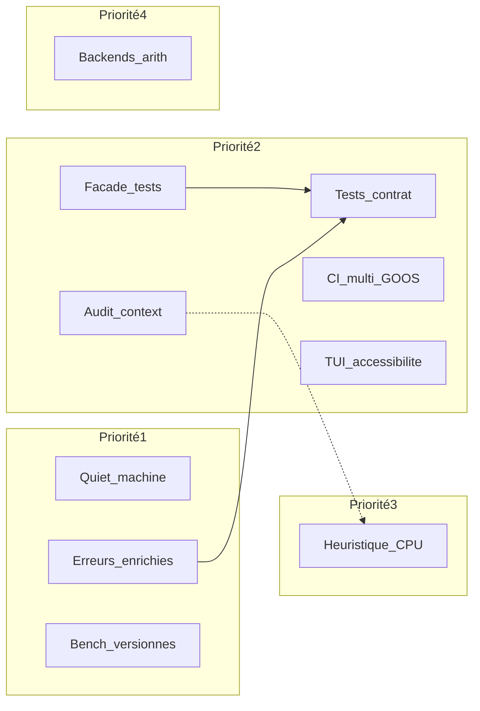

# FibCalc — Plan d’exécution des pistes d’innovation (INNOVEPLAN)

Ce document est la **déclinaison opérationnelle** de [INNOVATION.md](INNOVATION.md). Il fixe une **priorité d’exécution** (absente dans INNOVATION), des **livrables**, des **critères de fin** et un **ordre recommandé**, sans remplacer [ARCH.md](ARCH.md) ni les guides [CONTRIBUTING.md](../CONTRIBUTING.md), [PERFORMANCE.md](PERFORMANCE.md), [CALIBRATION.md](CALIBRATION.md).

**Légende — complexité (source INNOVATION) :** faible · moyenne · élevée  
**Légende — risque :** impact possible sur perfs, stabilité API, ou maintenance.

**Effort relatif :** estimation indicative en **demi-journées (j/2)** pour une personne déjà familière du dépôt ; ajuster selon l’équipe.

---

## Critères de priorisation (P1 à P4)

| Priorité | Intitulé | Critères |
|----------|----------|----------|
| **P1** | Fondations rapides | Complexité faible (ou gain immédiat net), risque maîtrisé, déblocage support / scripts / visibilité des régressions. |
| **P2** | Fiabilité et qualité structurelle | Effort moyen : `context`, tests, CI hétérogène, UX alignée produit sans recherche fondamentale. |
| **P3** | Optimisation différenciante | Dépend de calibration et seuils ([internal/config/thresholds.go](../internal/config/thresholds.go)) ; validation plus longue. |
| **P4** | Recherche / charge élevée | Backends arithmétiques hors GMP : licences, build, périmètre exploratoire. |

---

## Matrice synthèse (priorité × complexité × risque)

| # | Piste | Axe | Complexité INNOVATION | Risque (INNOVATION) | Priorité exécution | Effort relatif (j/2) |
|---|--------|-----|------------------------|----------------------|--------------------|----------------------|
| 1 | Audit systématique `context` (chemins longs) | Fiabilité | moyenne | Perfs si mal placé | **P2** | 8–16 |
| 2 | Erreurs enrichies (`CalculationError`) | Fiabilité | faible | Verbosité / i18n futur | **P1** | 2–6 |
| 3 | Réduire friction des mocks (`coreCalculator`) | Tests | moyenne | Frontières `internal` | **P2** | 6–12 |
| 4 | Tests de contrat orchestration / `Calculator` | Tests | moyenne | Coût CI | **P2** | 8–14 |
| 5 | CI multi-`GOOS` / multi-arch (`bigfft`) | Tests | faible à moyenne | Temps pipeline / flakes | **P2** | 4–10 |
| 6 | Bench comparatifs versionnés | Perf | faible | Runner stable | **P1** | 3–8 |
| 7 | Backends arithmétiques (au-delà GMP) | Perf | élevée | Build / licences | **P4** | 40+ (épique) |
| 8 | Affinage heuristique CPU | Perf | moyenne | Calibration / validation | **P3** | 12–24 |
| 9 | Mode « quiet machine » CLI | UX | faible | — | **P1** | 2–5 |
| 10 | TUI : thèmes / accessibilité couleur | UX | moyenne | Cohérence [internal/ui](../internal/ui) | **P2** (cf. variante B) | 8–16 |

**Variante B (accessibilité avant benches) :** si l’accessibilité TUI est priorité produit, exécuter la piste **10** juste après P1 (erreurs + quiet) et **reporter** la piste **6** (benches versionnés) après la stabilisation TUI pour limiter le bruit dans les comparaisons de perfs.

---

## Suivi des tâches

Tableau opérationnel : chaque ligne correspond à une entrée de la **matrice synthèse** ci-dessus (colonne **#**) et au **code** utilisé dans les sections détaillées (P1-a … P4-a). Le **statut** reflète l’état courant du dépôt ; à mettre à jour lors des PR.

| # | Code | Piste (rappel) | Priorité | Statut | Emplacement / notes |
|---|------|------------------|----------|--------|------------------------|
| 2 | P1-a | Erreurs enrichies (`CalculationError`) | P1 | Fait | `internal/errors`, `WrapCalculationError` (orchestrateur) |
| 9 | P1-b | Mode « quiet machine » CLI | P1 | Fait | `-q` / `--quiet`, `FIBCALC_QUIET` |
| 6 | P1-c | Bench comparatifs versionnés | P1 | Fait | `make bench-versioned`, [PERFORMANCE.md](PERFORMANCE.md) |
| 3 | P2-a | Réduire friction des mocks (`CoreCalculator`) | P2 | Fait | `internal/fibonacci/fibonaccitest`, [ARCH.md](ARCH.md) §11 |
| 4 | P2-b | Tests de contrat orchestration / `Calculator` | P2 | Fait | `internal/orchestration/contract_test.go` |
| 5 | P2-c | CI multi-`GOOS` (`bigfft`) | P2 | Fait | [.github/workflows/ci.yml](../.github/workflows/ci.yml) |
| 1 | P2-d | Audit `context` (chemins longs) | P2 | Fait | Calibration, doubling/FFT, `executeParallel3`, point avant transforms FFT |
| 10 | P2-e | TUI : thèmes / accessibilité | P2 | Fait | `FIBCALC_TUI_THEME=high-contrast`, symboles pied de page, [TUI_GUIDE.md](TUI_GUIDE.md) |
| 8 | P3-a | Affinage heuristique CPU | P3 | Fait | `internal/config/hardware.go`, `thresholds.go`, profil calibration v3 (`cpu_heuristic_key`) |
| 7 | P4-a | Backends arith. au-delà de GMP | P4 | Fait (doc / décision) | ADR dans [ARCH.md](ARCH.md), section « Recherche » dans [algorithms/GMP.md](algorithms/GMP.md) — pas de second backend C dans `main` |

*Ordre des lignes : même numérotation que la matrice (#), pas l’ordre d’implémentation.*

---

## Dépendances suggérées

*Lien conceptuel `ctx` → `heur` : une annulation et des deadlines cohérentes sur la calibration facilitent les campagnes de mesure nécessaires à l’affinage des seuils ; ce n’est pas un blocage strict.*

---

## P1 — Détails par piste

### P1-a — Erreurs enrichies (`CalculationError`)

| Champ | Contenu |
|-------|---------|
| **Objectif** | Améliorer debug et support sans relancer en mode verbose. |
| **Périmètre** | [internal/errors](../internal/errors), sites de construction d’erreurs sur chemins de calcul ; éviter toute fuite de secrets dans les extraits de config. |
| **Livrables** | Champs ou méthodes sur erreurs typées (seuils effectifs, estimation mémoire, extrait config sûr) ; tests unitaires sur le formatage / présence des champs. |
| **Critères de fin** | Toute erreur `CalculationError` (ou équivalent documenté) exposant au moins : cause racine lisible, et au choix pertinent : seuil appliqué et/ou estimation mémoire et/ou extrait de config non sensible ; PR documentée ; aucune clé ni secret dans les messages. |
| **Risques & mitigations** | Verbosité : flags ou niveaux de détail ; i18n futur : messages séparés des clés techniques. |
| **Ordre dans P1** | 1 (peut démarrer en parallèle de quiet et bench). |

---

### P1-b — Mode « quiet machine » (CLI)

| Champ | Contenu |
|-------|---------|
| **Objectif** | Sortie stdout prévisible pour scripts et pipelines shell. |
| **Périmètre** | [internal/cli](../internal/cli), conventions d’affichage (pas de spinner ANSI en mode quiet). |
| **Livrables** | Flag ou env unifié documenté ; tests d’intégration légers sur la sortie (golden ou snapshots ciblés). |
| **Critères de fin** | Comportement documenté dans CONTRIBUTING ou README (section CLI) ; absence d’échappements ANSI non désirés en quiet ; cohérence avec usages existants. |
| **Risques & mitigations** | Aucun signalé dans INNOVATION ; vérifier la non-régression des modes interactifs. |
| **Ordre dans P1** | 2 (indépendant). |

---

### P1-c — Bench comparatifs versionnés

| Champ | Contenu |
|-------|---------|
| **Objectif** | Historiser objectivement les gains ou régressions de performance. |
| **Périmètre** | [Makefile](../Makefile), flux PGO / benches existants ; CHANGELOG ou artefact CI (fichier JSON/Markdown versionné ou uploadé). |
| **Livrables** | Cible `make` ou job CI produisant des nombres comparables (même flags, même `GOVERSION` noté) ; modèle de ligne CHANGELOG ou chemin d’artefact. |
| **Critères de fin** | Au moins un scénario de bench documenté exécuté sur runner identifié ; résultats reliés à une révision Git (tag ou SHA) ; procédure décrite dans [PERFORMANCE.md](PERFORMANCE.md) si ce fichier est le lieu approprié. |
| **Risques & mitigations** | Bruit machine : runner dédié, répétitions, doc sur l’interprétation. |
| **Ordre dans P1** | 3 (peut paralléliser avec a/b). |

---

## P2 — Détails par piste

### P2-a — Réduire la friction des mocks (`coreCalculator`)

| Champ | Contenu |
|-------|---------|
| **Objectif** | Permettre des tests unitaires ciblés sans contournements fragiles. |
| **Périmètre** | Façade ou petit surface exportée **minimale** pour les tests ; [ARCH.md](ARCH.md) §11 (mockabilité). |
| **Livrables** | API de test documentée (package `_test` ou `testing` only si idiome Go le permet) ; migration d’un ou deux tests existants comme preuve. |
| **Critères de fin** | CONTRIBUTING ou ARCH mis à jour sur la manière recommandée de mocker ; pas d’export massif du cœur métier. |
| **Risques & mitigations** | Dilution `internal` : limiter aux signatures strictement nécessaires ; revue architecture. |
| **Ordre dans P2** | **1** (amont des tests de contrat). |

---

### P2-b — Tests de contrat (orchestration / `Calculator`)

| Champ | Contenu |
|-------|---------|
| **Objectif** | Détecter tôt les régressions d’invariants lors des évolutions d’algorithmes. |
| **Périmètre** | [internal/orchestration](../internal/orchestration), implémentations `Calculator` ; invariants INNOVATION : pas de panic, respect `context`, canal de progression fermé proprement. |
| **Livrables** | Suite de tests table-driven avec **N modestes** ; éventuellement sous-build tag si nécessaire pour CI légère. |
| **Critères de fin** | Chaque invariant a au moins un cas qui échouerait si volontairement cassé ; durée CI documentée pour le job. |
| **Risques & mitigations** | Coût CI : borner `N`, éviter matrices lourdes sur chaque PR. |
| **Ordre dans P2** | **2** (après P2-a si la façade simplifie l’injection). |

---

### P2-c — CI multi-`GOOS` / multi-arch (`internal/bigfft`)

| Champ | Contenu |
|-------|---------|
| **Objectif** | Valider `arith_amd64` vs chemins génériques et autres plateformes. |
| **Périmètre** | [internal/bigfft](../internal/bigfft), workflow CI (GitHub Actions ou équivalent). |
| **Livrables** | Matrice `GOOS`/`GOARCH` (définie pragmatiquement) exécutant `go test` (et build tags si besoin). |
| **Critères de fin** | Couverture documentée (ex. linux/amd64, windows/amd64, darwin, linux/arm64 selon disponibilité) ; document expliquant les exclusions éventuelles. |
| **Risques & mitigations** | Temps pipeline : jobs en parallèle, cache modules ; flakes : retry limité + issue étiquetée. |
| **Ordre dans P2** | **3** (indépendant de a/b mais souvent rentable après quiet pour logs plus lisibles). |

---

### P2-d — Audit systématique `context` (chemins longs)

| Champ | Contenu |
|-------|---------|
| **Objectif** | Annulation propre et deadlines alignées avec [internal/app](../internal/app). |
| **Périmètre** | [internal/calibration](../internal/calibration), boucles FFT / doubling, autres boucles longues identifiées. |
| **Livrables** | Points de rendez-vous `context` (granularité définie en revue) ; tests d’annulation ciblés. |
| **Critères de fin** | Chemins documentés comme « longs » vérifient `ctx` à intervalle raisonnable ; pas de régression fonctionnelle au-delà d’un seuil de % fixé en PR sur benchmark de référence. |
| **Risques & mitigations** | Perfs : placer les checks dans les boucles externes ou aux bornes de phases, pas dans les micro-boucles chaudes. |
| **Ordre dans P2** | **4** (peut chevaucher P2-b si les contrats testent déjà le `context`). |

---

### P2-e — TUI : thèmes contrastés et état hors couleur seule

| Champ | Contenu |
|-------|---------|
| **Objectif** | Améliorer l’accessibilité terminal. |
| **Périmètre** | [internal/tui](../internal/tui), [TUI_GUIDE.md](TUI_GUIDE.md), cohérence avec [internal/ui](../internal/ui). |
| **Livrables** | Thèmes ou styles à fort contraste ; indicateurs d’état redondants (symboles, labels) — pas uniquement couleur. |
| **Critères de fin** | Vérification manuelle ou capture selon guide ; TUI_GUIDE mis à jour pour le choix de thème et l’interprétation sans couleur. |
| **Risques & mitigations** | Cohérence visuelle : réutiliser tokens ou patterns de `internal/ui` où pertinent. |
| **Ordre dans P2** | **5** (après stabilisation P1 ; voir variante B en tête de document). |

---

## P3 — Détail piste

### P3-a — Affinage heuristique CPU (seuils)

| Champ | Contenu |
|-------|---------|
| **Objectif** | Mieux exploiter les machines hétérogènes (cache L3, AVX-512, etc.). |
| **Périmètre** | [internal/config/thresholds.go](../internal/config/thresholds.go), calibration ([internal/calibration](../internal/calibration), [CALIBRATION.md](CALIBRATION.md)). |
| **Livrables** | Détection ou classification CPU documentée ; table de seuils ou profils ; tests sur données simulées / golden si pas d’accès matériel en CI. |
| **Critères de fin** | Gain mesurable sur au moins une classe de machine documentée, ou justification neutre (pas de régression) avec benches P1-c. |
| **Risques & mitigations** | Complexité validation : plan de campagne calibration ; éviter sur-ajustement à une seule machine. |
| **Ordre dans P3** | 1 (unique piste P3 dans INNOVATION). |

---

## P4 — Détail piste

### P4-a — Backends arithmétiques au-delà de GMP

| Champ | Contenu |
|-------|---------|
| **Objectif** | Point de comparaison recherche (ex. FLINT ou autres). |
| **Périmètre** | Build `-tags gmp`, [docs/algorithms/GMP.md](algorithms/GMP.md), couche d’abstraction arithmétique existante ou à introduire. |
| **Livrables** | Prototype ou branche expérimentale ; matrice build documentée ; revue licence. |
| **Critères de fin** | Build reproductible documenté ; critères d’équivalence résultats (tests) pour un sous-ensemble de `N` ; décision go/no-go sur maintien. |
| **Risques & mitigations** | Charge build et licences : ADR ou section ARCH pour tracer le choix. |
| **Ordre dans P4** | Épique isolée ; ne pas bloquer P1–P3. |

---

## Ordre d’implémentation global recommandé

1. **P1** en parallèle raisonnable : erreurs enrichies (P1-a), quiet machine (P1-b), benches versionnés (P1-c).  
2. **P2** : façade / mocks (P2-a) → tests de contrat (P2-b) → CI multi-plateforme `bigfft` (P2-c) → audit `context` (P2-d) → TUI accessibilité (P2-e).  
3. **P3** : heuristique CPU (P3-a) après résultats fiables de calibration et idéalement après P2-d.  
4. **P4** : backlog recherche (P4-a), jalons trimestriels ou hors branche `main` jusqu’à maturité.

---

## Charge CI, coût et mitigations

| Risque (INNOVATION) | Mitigation dans l’exécution |
|---------------------|-----------------------------|
| Temps de pipeline (multi-OS, contrats) | Matrice réduite sur PR ; build complet sur `main` ou hebdomadaire. |
| Benches instables | Runner labelisé, seuils de régression en pourcentage, pas de gate dure sur une seule mesure sans réplication. |
| Tests lourds | `N` modestes ; sous-ensembles taggés si le dépôt le permet déjà. |

---

## Traçabilité

- **Source des pistes :** [INNOVATION.md](INNOVATION.md).  
- **Suivi d’avancement :** section [Suivi des tâches](#suivi-des-tâches) de ce document.  
- **Architecture et mockabilité :** [ARCH.md](ARCH.md).  
- **Ce document** est un plan d’exécution : les PR et revues restent le lieu des choix d’implémentation détaillés.
