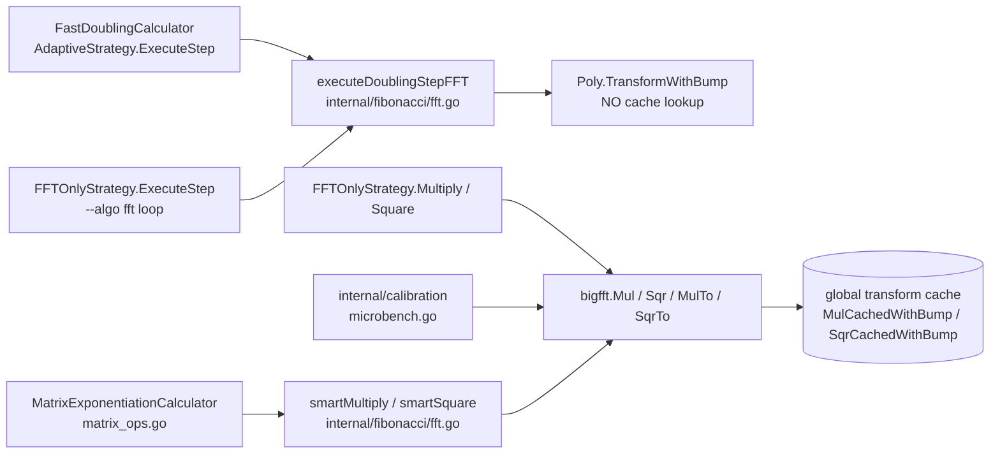

# Performance Guide

## Overview

This document describes the optimization techniques used in the Fibonacci Calculator and provides advice on achieving the best performance on your hardware.

## Reference Benchmarks

### The only measurement this repo carries

`docs/audits/bench-baseline.txt` is the sole benchmark artifact tracked in the
repository. Everything else in this section is an unbacked historical note (see
the Provenance warning below). Medians of the 5 samples per row, computed from
that file — linux/amd64, 24 threads, `-count=5 -benchtime=1x`, header stamp
`baseline-2026-07-07`:

| N | Fast Doubling | Matrix Exp. | FFT-Based |
|---|---|---|---|
| 1,000,000 | **3.15 ms** / 1.32 MB per op | 6.03 ms / 6.33 MB | 5.13 ms / 5.38 MB |
| 10,000,000 | **23.87 ms** / 17.38 MB per op | 30.84 ms / 92.25 MB | 29.08 ms / 30.88 MB |

`-benchtime=1x` means one iteration per sample, so each row includes first-call
warm-up. That warm-up shows up as a high first sample in four of the six groups —
FastDoubling/1M, FastDoubling/10M, MatrixExp/10M and FFTBased/10M, where sample 1
is the slowest of the five — but **not** in the other two: in MatrixExp/1M the
first sample (5,781,043 ns) is the second *lowest* of its five, and in FFTBased/1M
the first sample (5,134,173 ns) is exactly the median. Counted from
[`docs/audits/bench-baseline.txt`](audits/bench-baseline.txt). These
are the numbers `benchstat` compares against, and the only ones in this document
you can re-derive from a file in the tree.

### Test Configuration (historical, no archived output)

- **CPU**: AMD Ryzen 9 5900X (12 cores, 24 threads)
- **RAM**: 32 GB DDR4-3600
- **OS**: Linux 6.1
- **Go**: 1.25.0

> **Provenance — read before quoting any number below.** The two tables that follow are **historical figures with no backing artifact in this repository**: no benchmark output for them was ever archived, on this hardware or any other, and nothing in the tree can confirm them. They are kept only as a record of *relative ordering* between the three algorithms. Do not cite them as measurements. The project now targets Go 1.26.0+ (see `go.mod`) while these predate it. For a number you can defend, use the baseline table above or re-run `make benchmark` on your own runner.
>
> **Current dated references.** Two later optimization rounds make HEAD measurably faster than these historical numbers: the 2026-06-09 parallel pointwise/butterfly work (FastDoubling/10M −27.6 %; [`CHANGELOG.md`](../CHANGELOG.md)) and the 2026-06-10 audit loop (commits `4e34b82` TestMain, `fa13bfd` state+arena cache, `7999c39` bump F-012: geomean sec/op −12.0 % vs the same-day baseline, FastDoubling/10M 33.30 ms → 28.20 ms, B/op at 10M ~−70 %; [`CHANGELOG.md`](../CHANGELOG.md)).

### Results

| N | Fast Doubling | Matrix Exp. | FFT-Based | Result (digits) |
|---|---------------|-------------|-----------|-----------------|
| 1,000 | 15us | 18us | 45us | 209 |
| 10,000 | 180us | 220us | 350us | 2,090 |
| 100,000 | 3.2ms | 4.1ms | 5.8ms | 20,899 |
| 1,000,000 | 85ms | 110ms | 95ms | 208,988 |
| 10,000,000 | 2.1s | 2.8s | 2.3s | 2,089,877 |
| 100,000,000 | 45s | 62s | 48s | 20,898,764 |
| 250,000,000 | 3m12s | 4m25s | 3m28s | 52,246,910 |

> **The N=10M row is off by roughly two orders of magnitude, not by a hardware generation.** Its 2.1 s for Fast Doubling is **≈88×** the only measurement in the tree (23.87 ms median, `docs/audits/bench-baseline.txt`, linux/amd64) and **≈75×** the dated reference below. A gap that size is not explained by CPU, Go version or thermal profile; the row's provenance is simply unknown. Treat the whole column as ordering, never as magnitude.
>
> Current dated reference for the N=10M row: `BenchmarkFibonacci/FastDoubling/10M` measures 28.20 ms (calculation only, no decimal conversion; 2026-06-10, Intel Core Ultra 9 275HX — see [`CHANGELOG.md`](../CHANGELOG.md)).
>
> **The N=100M row is off by a comparable factor.** Sanity check run 2026-09-04
> on a 24-thread Windows host (`go1.27.0 windows/amd64`, thresholds from the
> host's cached profile: `Parallelism=disabled, FFT=480000 bits`):
> `NO_COLOR=1 fibcalc -n 100000000 -algo all` prints
> `FFT-Based Doubling 566ms`, `Fast Doubling 639ms`,
> `Matrix Exponentiation 1.9347084s`, for a 69,424,191-bit result — against
> 48 s / 45 s / 62 s in the table, i.e. **~85×**, **~70×** and **~32×** apart.
> A second run agreed within 10 %. This is one wall-clock run as printed by the
> comparison summary (calculation only, no decimal conversion), not a benchmark,
> and no artifact for it is archived here — reproduce it with the command above
> rather than citing these numbers.

> **Caution — algorithm ordering at very large N.** At N >= 10M the wall-clock ordering of Fast Doubling vs Matrix Exponentiation can invert on some CPUs depending on L3 cache size and memory latency; treat the table above as the canonical Ryzen reference, not a hardware-independent ranking. Fast Doubling stays the most **memory**-efficient regardless: on the one artifact in the tree (`docs/audits/bench-baseline.txt`) it allocates **~4.8x** fewer bytes per op than Matrix at F(1M) (1.32 MB vs 6.33 MB) and **~5.3x** fewer at F(10M) (17.38 MB vs 92.25 MB). Those are `-benchmem` B/op medians — total bytes allocated, not peak RSS; no peak-memory measurement exists in this repo. Reconfirm on the reference machine (Ryzen / Linux, `-count>=10` + `benchstat`) before adjusting any ordering claim.

### Comparison snapshot — Intel Core Ultra 9 275HX (24 cores)

Informative only; kept for cross-architecture comparison. Ryzen remains the canonical reference.

| N | Fast Doubling | Matrix Exp. | FFT-Based | Result (digits) |
|---|---------------|-------------|-----------|-----------------|
| 10,000       | 120us  | 180us  | 280us  | 2,090      |
| 1,000,000    | ~3ms   | 55ms   | 45ms   | 208,988    |
| 10,000,000   | ~60ms  | 750ms  | 600ms  | 2,089,877  |
| 100,000,000  | 30s    | 42s    | 33s    | 20,898,764 |
| 250,000,000  | 2m10s  | 3m05s  | 2m25s  | 52,246,910 |

Intel figures reflect a mobile workstation profile with higher single-thread performance; absolute ordering of algorithms (Fast Doubling < FFT < Matrix for medium N) is consistent across both platforms.

### Running Benchmarks

```bash
# Run all benchmarks
go test -bench=. -benchmem ./internal/fibonacci/

# Benchmark specific algorithm (sub-benchmarks of BenchmarkFibonacci)
go test -bench='BenchmarkFibonacci/FastDoubling' -benchmem -run='^$' ./internal/fibonacci/

# Benchmark with specific iteration count
go test -bench='BenchmarkFibonacci/FastDoubling' -benchtime=5x -run='^$' ./internal/fibonacci/
```

### Regression baseline (>= 5 %, local discipline)

Any commit touching `internal/fibonacci/` or `internal/bigfft/` should be
verified locally against `docs/audits/bench-baseline.txt` using
`benchstat`. The convention is: **no sub-benchmark regression > 5 %** in
`BenchmarkFibonacci/(FastDoubling|MatrixExp|FFTBased)`.

```bash
go test -bench='BenchmarkFibonacci/(FastDoubling|MatrixExp|FFTBased)' \
    -benchmem -run='^$' -count=5 -benchtime=1x ./internal/fibonacci/ > /tmp/new.txt
benchstat docs/audits/bench-baseline.txt /tmp/new.txt
```

The flags must match the baseline exactly (these are the flags `make
bench-baseline` uses to write the file); `make benchmark` (`-bench=.`,
no `-count`) is **not** benchstat-comparable to the baseline.

Refresh the baseline on a quiet machine when an intentional perf change
lands :

```bash
make bench-baseline                            # writes docs/audits/bench-baseline.txt
git add docs/audits/bench-baseline.txt && git commit -m 'perf(bench): refresh baseline'
```

For a one-shot DTM (Dynamic Threshold Manager) comparison, the raw
`bench-dtm-{on,off}.txt` snapshots were purged as stale audit artifacts;
regenerate via `BenchmarkFibonacciDTM`
(`internal/fibonacci/dtm_bench_test.go`) — the numeric results are kept
inline in [ADR-0001](adr/0001-dtm-decision.md) and the CHANGELOG.

### Versioned benchmark snapshots (regression tracking)

To compare performance across Git revisions on the **same machine**, use a fixed command and record the environment:

1. **Record a snapshot** (writes `build/bench/snapshot-*.txt` with `go version`, full Git SHA, and benchmark output):

   ```bash
   make bench-versioned
   ```

   This runs `go test` with fixed flags: `-bench='BenchmarkFibonacci/(FastDoubling|MatrixExp|FFTBased)' -benchmem -count=3 -benchtime=2s ./internal/fibonacci/`.

2. **Annotate the result**: note the Git tag or commit (`git rev-parse HEAD`) in your changelog or ticket when you archive a snapshot. Single-run numbers are noisy; compare trends only on an idle machine, same flags, same `GOMAXPROCS` if you tune it.

3. **CHANGELOG** (optional): add a one-line entry such as
   `Perf: benchmark snapshot @ <SHA> — FastDoubling ns/op ±X% vs previous main` when you publish a measured change.

In [Reference Benchmarks](#reference-benchmarks) above, only the **historical** tables (Results, and the Intel comparison snapshot) are tied to the Ryzen / Go 1.25.0 environment; the project now targets Go 1.26.0+ (`go.mod`). The baseline medians table at the top of that section comes from `docs/audits/bench-baseline.txt` (linux/amd64, 24 threads, stamped `baseline-2026-07-07`) and carries no Go-version stamp at all. Either way, both document *someone else's* runner — your snapshots document *yours*.

## Hardware heuristic defaults

When CLI thresholds are left at **0** (auto) and no valid calibration profile is loaded, FibCalc applies `internal/config.ApplyAdaptiveThresholds`, which calls `EstimateOptimalParallelThreshold`, `EstimateOptimalFFTThreshold`, and `EstimateOptimalStrassenThreshold`. These functions use:

- **`runtime.NumCPU()`** for parallelism tiers (unchanged broad behavior).
- **`HardwareHeuristic`** (`internal/config/hardware.go`): on **amd64** and **386**, **AVX2** and **AVX-512 (AVX512F)** are read from `golang.org/x/sys/cpu` to nudge defaults (e.g. slightly lower FFT crossover on SIMD-rich CPUs, adjusted Strassen threshold when at least four cores are available).

Diagnostics and the in-package unit tests (`internal/config/hardware_test.go`) exercise the unexported `estimateParallelThresholdForHeuristic`, `estimateFFTThresholdForHeuristic`, and `estimateStrassenThresholdForHeuristic` with a synthetic `HardwareHeuristic`. Cached calibration profiles store `cpu_heuristic_key` (profile format v4 since audit M-01) so a change in SIMD class invalidates stale JSON — see [CALIBRATION.md](CALIBRATION.md).

## Implemented Optimizations

### 1. Zero-Allocation Strategy

#### Problem
Fibonacci calculations for large N create millions of temporary `big.Int` objects, causing excessive garbage collector pressure.

#### Solution
Using `sync.Pool` to recycle calculation states:

```go
var statePool = sync.Pool{
    New: func() any {
        return &CalculationState{
            FK:  new(big.Int),
            FK1: new(big.Int),
            T1:  new(big.Int),
            T2:  new(big.Int),
            T3:  new(big.Int),
        }
    },
}
```

#### Impact
- Fewer allocations per calculation. The one figure the repo can show for the
  combined pooling work is `docs/audits/bench-baseline.txt`: 1.32 MB per op at
  F(1M) and 17.38 MB at F(10M) for Fast Doubling, against 6.33 MB / 92.25 MB for
  Matrix Exponentiation. No before/after measurement of pooling in isolation
  exists here; the "95 %+ / 20-30 %" figures this section used to carry had no
  backing artifact and were removed on 2026-08-07.
- Reduced GC pause times

**Calculation Arena (state-bound)**: For N > 1,000 a contiguous `CalculationArena` pre-allocates all 5 `big.Int` backing arrays from a single `[]big.Word` block, reducing GC tracking overhead and memory fragmentation. The arena is owned by `CalculationState` and travels through the same `sync.Pool`: `AcquireStateForN(n)` reuses the existing arena (`Reset()` only) when the previous tenancy was large enough, otherwise it reallocates. `ReleaseStateWithResult(s, src)` deep-copies the result out of the arena before resetting it and detaches every state slot before pool return, so a subsequent acquisition cannot alias another caller's result. The arena falls back to heap allocation when exhausted, and is dropped (not pooled) past `maxArenaPoolWords` (~50M words ≈ 400 MB) to bound resident memory.

**GC-immune state cache and per-state FFT scratch (2026-06-10)**: `sync.Pool` alone cannot retain the arena across calls — the GC-disable pattern of large calculations (`GCController`) re-enables GC right after every call, and that collection flushes the pool, so each repeated call paid a full arena reallocation (~46 % of all allocations at F(10M)). Since commit `fa13bfd`, each `FastDoublingCalculator` keeps a single-slot, **GC-immune** cache of its last released state (`cachedState`, an `atomic.Pointer[CalculationState]`), capped at `maxCachedArenaWords` (4M words ≈ 32 MB — which covers **n up to ≈ 36.9M**, since `arenaTotalWords(n) = (⌊n × 0.69424 / 64⌋ + 1) × 10` after the ADR-0009 R4 ×15 → ×10 change; the "roughly 20M" figure that used to appear here was computed against the old ×15 factor); larger arenas keep the historical pool-only behavior. Since commit `7999c39` (F-012), the FFT forward-transform `BumpAllocator` is also carried by the `CalculationState`: it is acquired once per calculation at final-operand size and only `Reset()` between doubling steps, instead of being re-acquired and re-grown at every step. Cumulative effect measured 2026-06-10: FastDoubling/10M 33.30 ms → 28.20 ms, B/op at 10M ~−70 %, geomean sec/op −12.0 % ([`CHANGELOG.md`](../CHANGELOG.md)).

### 2. 2-Tier Adaptive Multiplication

The `smartMultiply` function selects the optimal multiplication algorithm based on operand bit size:

```go
func smartMultiply(z, x, y *big.Int, fftThreshold int) (*big.Int, error) {
    bx := x.BitLen()
    by := y.BitLen()

    // Tier 1: FFT Multiplication — O(n log n)
    if fftThreshold > 0 && bx > fftThreshold && by > fftThreshold {
        return bigfft.MulTo(z, x, y)
    }

    // Tier 2: Standard math/big (uses Karatsuba internally for large operands)
    return z.Mul(x, y), nil
}
```

| Tier | Algorithm | Complexity | Activation Threshold (default) |
|------|-----------|------------|-------------------------------|
| 1 | FFT (Schonhage-Strassen) | O(n log n) | > 500,000 bits |
| 2 | Standard `math/big` | O(n^2) / O(n^1.585) | Below FFT threshold |

> **Note — sub-threshold cost is library-bound.** Below `DefaultFFTThreshold` (500,000 bits), wall time is dominated by `math/big`'s Karatsuba multiplication and `sync.Pool` P-pinning, not by project code. This is the expected behavior under the FFT threshold and is not a regression of the calculator itself.

### 3. Multi-core Parallelism

The three main multiplications in the Fast Doubling algorithm can be parallelized via the `DoublingStepExecutor.ExecuteStep` method. The caller decides: `DoublingFramework.ExecuteDoublingLoop` evaluates `shouldParallelizeMultiplicationCached` per iteration and passes the verdict as `ExecuteStep`'s `inParallel` argument.

#### Considerations

- **Activation threshold**: `ParallelThreshold` (default: 4096 bits)
- **Disabled with FFT**: Parallelism is disabled when FFT is used as FFT already saturates the CPU
- **Parallel FFT threshold**: Re-enabled above 5,000,000 bits (`ParallelFFTThreshold`)

### 4. Strassen Algorithm

For matrix exponentiation, the Strassen algorithm reduces the number of multiplications from 8 to 7:

```
Classic 2x2 multiplication: 8 multiplications
Strassen-Winograd 2x2 (implemented): 7 multiplications + 15 additions/subtractions
  (the classical Strassen formulation needs 18)
```

Enabled via `StrassenThreshold` (default: 3,072 bits via config; internal default: 256 bits) when matrix elements are large enough for the multiplication savings to compensate for additional additions. The per-calculation threshold is set via `Options.StrassenThreshold`; the internal default is reachable through `fibonacci.SetDefaultStrassenThreshold()` but is a test-only fallback — `normalizeOptions` fills a zero `StrassenThreshold` with 3,072 before any matrix multiply, so production never reads it.

### 5. Symmetric Matrix Squaring

Specific optimization for squaring symmetric matrices (where b = c), reducing multiplications from 8 to 4.

### 6. GC Controller

For large calculations (N ≥ 1M), the `GCController` suppresses *heap-growth-triggered* GC during computation (`debug.SetGCPercent(-1)`). The motivation is `GOGC=100`'s default behaviour — the live heap is allowed to double before a cycle triggers — but the repo carries no peak-RSS measurement with and without the controller.

**The guarded region is not GC-free.** The same `Begin()` installs a soft memory limit of `3 × MemStats.Sys` (`DefaultMemoryLimitMultiplier`, `internal/fibonacci/memory/gc_control.go`), and a `GOMEMLIMIT` is honoured by the runtime *even with `GOGC=off`* — that is precisely its stated purpose here: the constant's own doc comment says it "acts as an OOM safety net: if the calculation runs away, the Go runtime will trigger emergency GC instead of letting the process consume unbounded memory". So the accurate claim is: no *GOGC-driven* cycle runs inside the region, and a memory-limit-driven cycle can. The repo carries no measurement of how often the limit is actually reached.

| Mode | Activation | Behavior |
|------|-----------|----------|
| `auto` (default) | N ≥ 1,000,000 | Disable GC during calculation |
| `aggressive` | Always | Disable GC regardless of N |
| `disabled` | Never | Standard GC behavior |

The mode defaults to `auto` (selected on calculation size) and is user-overridable through the `--gc-control` flag or the `FIBCALC_GC_CONTROL` environment variable.

> **Note — concurrent comparison (`--algo all`).** When several calculators run in parallel (each with its own `GCController`), GC disable/restore is serialized by a package-level refcount (`gcGlobalMu`/`gcActiveDepth`/`gcSavedPercent`): GC stays off while *any* sibling runs and the real `GOGC` is restored exactly once when the *last* one finishes. See [`docs/adr/0005-gc-control-concurrent.md`](adr/0005-gc-control-concurrent.md).

### 7. Memory Budget Estimation

Pre-calculate estimated memory usage before starting with `--memory-limit`:

`memory.EstimateMemoryUsage(n)` (`internal/fibonacci/memory/budget.go`) is the sole
source of these numbers. It computes `bytesPerFib = (⌊n × 0.69424 / 64⌋ + 1) × 8` and
totals **180 × bytesPerFib**, plus a flat **10 MiB** floor once the FFT machinery is
engaged at all (`n > 93`). The four terms are a descriptive split of one calibrated
total — state 36× + FFT buffers 39× + transform cache 48× + overhead 57× — so moving
weight between them (as the M-08 cache bound did, 4× → 48×) must keep the sum constant.

| N | Estimated Peak Memory |
|---|---|
| 1M | ~24.9 MB |
| 10M | ~159 MB |
| 100M | ~1.5 GB |
| 1B | ~14.6 GB |
| 5B | ~72.7 GB |

Measured on the binary, 2026-09-03 and re-verified 2026-09-04 (same five totals):
`fibcalc -n <N> -memory-limit 1K -algo fast` prints the estimate in its refusal
message, e.g. at N=10M `State: 29.8 MB, FFT: 32.3 MB, Cache: 39.7 MB,
Overhead: 57.2 MB, Total: 159.0 MB exceeds limit 1K.`

> **Re-modelled by audit H-03 (2026-09).** The previous model totalled 15 × bytesPerFib
> and put F(10M) at ~12 MB against **141 MB** actually observed — it counted neither the
> ×10 arena over-sizing, nor `sync.Pool` pre-warming (the largest single term, whose
> power-of-four size classes make the true cost a step function), nor the fact that
> `--algo all` runs three calculators at once. It under-estimated by 5× to 12× at every
> measured point, which emptied `--memory-limit` of its meaning. The estimate is now a
> deliberate **safety bound**, between 1.0× and 2.5× the measured figure across the
> range and never under. Raw measurements: [`docs/audits/mem-baseline-2026-09.txt`](audits/mem-baseline-2026-09.txt).
> **A limit tuned against the old figures will now be more constraining.**

If the estimate exceeds the limit, the tool exits with an error and suggests `--last-digits K` as an alternative. Note that this is the estimator's figure, not a measured RSS: pick `--memory-limit` against this model, not against observed process memory. A malformed `--memory-limit` (or an out-of-range `--last-digits`) is now rejected at flag-parsing time, on every mode, instead of only on the paths that reached the check (audit M-02).

### 8. Partial Computation (Last Digits)

The `--last-digits K` mode computes F(N) mod 10^K using modular arithmetic in O(log N) time and O(K) memory, enabling computation for arbitrarily large N:

```bash
fibcalc -n 10000000000 --last-digits 100
```

## Tuning Guide

### Automatic Calibration

The calibration system (`internal/calibration`) tests different thresholds and determines optimal values for your hardware:

```bash
# Full threshold sweep (saves ~/.fibcalc_calibration.json)
fibcalc --calibrate

# Quick startup calibration with cached-profile fallback
fibcalc --auto-calibrate
```

> The programmatic entry point is `calibration.RunCalibration(ctx, out, calculatorRegistry, profilePath, progressDisplay, colorProvider) int`; see [CALIBRATION.md](CALIBRATION.md) for the full API and the 3-tier fallback.

### Configuration Parameters

#### Algorithm Thresholds

| Parameter | Default | Description | Adjustment |
|-----------|---------|-------------|------------|
| `ParallelThreshold` | 4,096 bits | Parallelism activation threshold | Increase on slow CPU, decrease on many-core |
| `FFTThreshold` | 500,000 bits | FFT multiplication threshold | Decrease on CPU with large L3 cache |
| `StrassenThreshold` | 3,072 bits | Strassen algorithm threshold | Increase if addition overhead is visible |

#### FFT Cache Settings

| Parameter | Default | Description |
|-----------|---------|-------------|
| `FFTCacheMinBitLen` | 100,000 bits | Minimum operand bit length to cache FFT transforms |
| `FFTCacheMaxEntries` | see below | Maximum number of cached FFT transforms |
| `FFTCacheEnabled` | `true` | Enable/disable FFT transform caching |
| (no option) `MaxBytes` | `48 × size(F(n))` | Byte ceiling on the whole cache, installed by `configureFFTCache` from `n` (audit M-08); not settable through `Options` |

> **The entry cap is not a memory bound (M-08).** An entry holds `K × (n+1)` words —
> roughly twice its operand — so a fixed entry budget lets the cache grow linearly with
> the Fibonacci index, and nothing frees it between calculations in a long-lived process
> (TUI restart, calibration sweep). Since the 2026-09 audit the cache is also capped in
> bytes at `FFTCacheMaxBytesFactor = 48` times the size of F(n) (`internal/fibonacci/constants.go`),
> sized to hold one calculation's transforms. A tighter bound was measured and **rejected**:
> 4× (2 entries at F(10M)) cost MatrixExp/10M **+22 % sec/op**, +76 % B/op and +137 %
> allocs/op — see [`docs/audits/bench-fftcache-2026-09.txt`](audits/bench-fftcache-2026-09.txt)
> and [ADR-0010 R1](adr/0010-audit-2026-09-decisions.md).

> **`FFTCacheMaxEntries` has no fixed default of 256.** `bigfft.DefaultTransformCacheConfig()` does return `MaxEntries: 256` (`internal/bigfft/fft_cache.go:DefaultTransformCacheConfig`), but `configureFFTCache` overrides it whenever the option is left at 0 and `n > 0`, computing `clamp(2 × bits.Len64(n), 64, 4096)` (`internal/fibonacci/options.go:configureFFTCache`). For n = 10M that is `2 × 24 = 48`, clamped up to **64**. The dynamic value can never reach 256: `bits.Len64` maxes out at 64, so the expression tops out at 128. The 256 constant only reaches a caller who bypasses `configureFFTCache`, or who leaves `n = 0`. The doc comment on `Options.FFTCacheMaxEntries` (`internal/fibonacci/options.go:Options.FFTCacheMaxEntries`) states this rule directly: it says the field is sized from n as `clamp(2*bits.Len64(n), 64, 4096)`, "which is 64..128 in practice since bits.Len64 caps at 64; the package default of 256 only applies when n is 0."

**Cache reach is path-specific — the default algorithm never touches it.** The
FFT transform cache (`internal/bigfft/fft_cache.go`) is consulted **only** by
`TransformCached*` / `MulCachedWithBump` / `SqrCachedWithBump`, which are reached
exclusively from `bigfft.Mul` / `Sqr` / `MulTo` / `SqrTo`
(`fft_core.go:fftmulTo`, `fftsqrTo`). Which production callers get there:



So the inter-iteration cache speedup does not apply to `--algo fast` (the
default), nor to the `--algo fft` **loop**, which runs the same
`executeDoublingStepFFT`: hits and misses are both zero on those paths. That
conclusion follows from the call graph alone and needs no benchmark. Any
cache-speedup claim would concern the matrix calculator, `FFTOnlyStrategy`'s
`Multiply`/`Square` helpers and direct `bigfft` calls — and none is measured
here.

> The invariant `putByKey` allocates a fresh backing buffer on every insert (no
> eviction-time recycling) still holds; its rationale lives in the `putByKey`
> doc comment (`internal/bigfft/fft_cache.go`), which records it as an Audit-PRD
> E1-R4 / [ADR-0002](adr/0002-recover-strategy.md) follow-up.
>
> A `BenchmarkCacheImpact` figure (22.95 ms vs 21.18 ms) used to be quoted here
> and attributed to [`CHANGELOG.md`](../CHANGELOG.md); that attribution was
> **false** — `grep -n "22.95\|BenchmarkCacheImpact" CHANGELOG.md` returns
> nothing (re-run 2026-09-04, exit 1), and no run of that benchmark is archived
> anywhere in the repo. The numbers were removed on 2026-08-07. The benchmark
> could not have measured the cache in any case: it drives a
> `FastDoublingCalculator` (`internal/fibonacci/cache_bench_test.go`), i.e. the
> uncached branch of the diagram above. Reworking the default step to use the
> cache stays a won't-fix without a supporting benchmark.

#### Dynamic Threshold Adjustment

| Parameter | Default | Description |
|-----------|---------|-------------|
| `EnableDynamicThresholds` | `false` | Enable real-time threshold adjustment based on per-iteration timing. Exposed on the command line as `--dynamic-thresholds` / `FIBCALC_DYNAMIC_THRESHOLDS` since the 2026-09 audit (M-04); before that no production path set it, so the subsystem was unreachable from the binary |
| `DynamicAdjustmentInterval` | 5 iterations | Iterations between threshold checks (when enabled) |

The default stays `false` on measurement, not on caution: a `-count=8` benchstat
run of `BenchmarkFibonacciDTM` puts the CPU difference squarely in the noise
(`~`, p > 0.25 at both 1M and 10M) and shows a significant **+17.9% allocs/op**
at 1M. The 5-6% gain quoted by ADR-0001 came from a single-sample
(`-benchtime=1x -count=5`) run that the ADR itself called noisy; it does not
reproduce. See `docs/audits/bench-dtm-2026-09.txt` and the 2026-09 status note
in [ADR-0001](adr/0001-dtm-decision.md).

#### FFT Parallelism (bigfft package)

| Variable (unexported atomic) | Accessor | Default | Description |
|----------|----------|---------|-------------|
| `parallelFFTRecursionThreshold` | `bigfft.GetParallelFFTRecursionThreshold()` | 4 | Minimum FFT size (log2) for parallel recursion |
| `maxParallelFFTDepth` | `bigfft.GetMaxParallelFFTDepth()` | 3 | Maximum depth of parallel FFT recursion |

Both are `atomic.Uint64` package variables seeded in `init()`; they are runtime-configurable via `bigfft.SetFFTParallelismConfig()`.

All threshold parameters are configured via the `fibonacci.Options` struct:

```go
opts := fibonacci.Options{
    ParallelThreshold:         4096,
    FFTThreshold:              500_000,
    StrassenThreshold:         3072,
    FFTCacheEnabled:           boolPtr(true),
    FFTCacheMaxEntries:        256,
    FFTCacheMinBitLen:         100_000,
    EnableDynamicThresholds:   false,
    DynamicAdjustmentInterval: 5,
}
```

## Performance Monitoring

### Go Profiling

```bash
# CPU profiling
go test -cpuprofile=cpu.prof -bench='BenchmarkFibonacci/FastDoubling' -run='^$' ./internal/fibonacci/
go tool pprof cpu.prof

# Memory profiling
go test -memprofile=mem.prof -bench='BenchmarkFibonacci/FastDoubling' -run='^$' ./internal/fibonacci/
go tool pprof mem.prof

# Trace
go test -trace=trace.out -bench='BenchmarkFibonacci/FastDoubling' -run='^$' ./internal/fibonacci/
go tool trace trace.out
```

## Algorithm Comparison

### Fast Doubling

**Advantages**:
- Fastest for the majority of cases
- Efficient parallelization
- Fewer multiplications than Matrix (3 per iteration)

**Disadvantages**:
- More complex code

### Matrix Exponentiation

**Advantages**:
- Elegant and mathematically clear implementation
- Efficient Strassen optimization for large numbers

**Disadvantages**:
- 4 multiplications per loop iteration when the exponent bit is clear, 11-12 when
  it is set (one symmetric squaring, plus one full matrix multiply on a set bit),
  against a flat 3 for Fast Doubling — see
  [algorithms/MATRIX.md](algorithms/MATRIX.md#comparison-with-fast-doubling)
- Slower at both sizes the baseline covers

### FFT-Based

**Advantages**:
- Forces FFT use for all multiplications
- Useful for FFT benchmarking

**Disadvantages**:
- Significant overhead for small numbers
- Primarily used for testing and benchmarking

## Advanced Optimization Tips

### 1. CPU Affinity (Linux)

```bash
# Force use of specific cores
taskset -c 0-7 <your-binary> [args]
```

### 2. Disable Frequency Scaling

```bash
# Performance mode
echo performance | sudo tee /sys/devices/system/cpu/cpu*/cpufreq/scaling_governor
```

### 3. GOMAXPROCS

```bash
# Limit number of Go threads
GOMAXPROCS=8 go test -bench=. ./internal/fibonacci/
```

### 4. Optimized Compilation

```bash
# Build with aggressive optimizations
go build -ldflags="-s -w" -gcflags="-B" ./cmd/fibcalc
```

## Known Limitations

1. **Memory**: `EstimateMemoryUsage` puts F(1 billion) at ~14.6 GB (safety bound, re-modelled by audit H-03). Use `--memory-limit` to validate before starting.
2. **Time**: Calculations for N > 500M can take hours
3. **FFT Contention**: The FFT algorithm saturates cores, limiting external parallelism
4. **Workaround**: Use `--last-digits K` for O(K) memory usage with arbitrarily large N.
