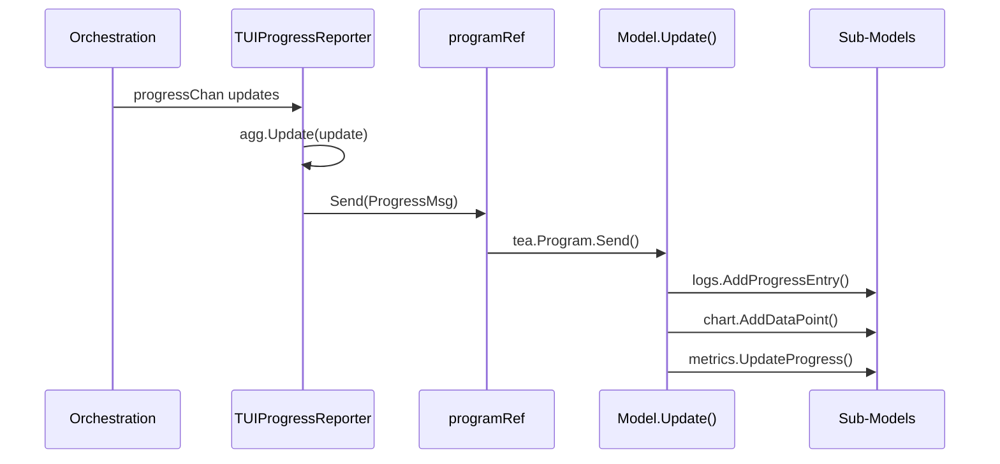

# TUI Developer Guide

> Interactive architecture map: **[agbruneau.github.io/FibGo/dashboard/](https://agbruneau.github.io/FibGo/dashboard/)** (knowledge graph, 797 nodes / 8 layers / 13-step tour)

Interactive terminal dashboard inspired by btop, built on Bubble Tea (Elm architecture).
Activated via the `--tui` flag or the `FIBCALC_TUI=true` environment variable.

For architectural context, see [Architecture](architecture/README.md).

---

## Table of Contents

1. [Quick Start](#1-quick-start)
2. [Elm Architecture (Model-Update-View)](#2-elm-architecture-model-update-view)
3. [Layout](#3-layout)
4. [Sub-Models](#4-sub-models)
5. [Message System](#5-message-system)
6. [Message Flow](#6-message-flow)
7. [Bridge Pattern (Orchestration Integration)](#7-bridge-pattern-orchestration-integration)
8. [Keyboard Navigation](#8-keyboard-navigation)
9. [Calculation Lifecycle](#9-calculation-lifecycle)
10. [Styling](#10-styling)
11. [Run() Entry Point](#11-run-entry-point)
12. [Extending the TUI](#12-extending-the-tui)

---

## 1. Quick Start

```bash
fibcalc --tui -n 10000000
fibcalc --tui -n 5000000 -algo all
```

The first command launches the TUI calculating F(10,000,000) with the default algorithm.
The second runs all registered algorithms concurrently and displays a comparison summary.

---

## 2. Elm Architecture (Model-Update-View)

**File**: `internal/tui/model.go`

The TUI follows the Elm architecture enforced by Bubble Tea. All state lives in a single
`Model` struct. On every event, `Update()` returns a new model and an optional command.
`View()` is a pure function that renders the model to a string.

### Root Model

```go
type Model struct {
    header  HeaderModel
    logs    LogsModel
    metrics MetricsModel
    chart   ChartModel
    footer  FooterModel

    keymap KeyMap

    ExecutionState // embedded: ctx, cancel, calculators, generation, done, exitCode
    LayoutManager  // embedded: width, height

    parentCtx context.Context
    config    config.AppConfig
    ref       *programRef
    paused    bool
}

// ExecutionState (model.go) groups the per-run execution fields so they can be
// reset together on the `r` key without touching layout/config.
type ExecutionState struct {
    ctx         context.Context
    cancel      context.CancelFunc
    calculators []orchestration.Calculator
    generation  uint64
    done        bool
    exitCode    int
}

// LayoutManager (layout.go) holds terminal dimensions and the layout math.
type LayoutManager struct {
    width  int
    height int
}
```

`Model` composes two embedded structs rather than holding every field flat:
`ExecutionState` owns the lifecycle fields, `LayoutManager` owns the dimensions
and exposes the percentage/clamp helpers used by `layoutPanels()`.

| Field | Purpose |
|-------|---------|
| `parentCtx` / `ExecutionState.ctx` / `ExecutionState.cancel` | Parent context survives restarts; child context is recreated on reset |
| `ExecutionState.calculators` | The `[]orchestration.Calculator` batch run for this session (TUI consumes the `orchestration` aliases, not `internal/fibonacci` directly) |
| `ExecutionState.generation` | Monotonic counter that invalidates stale messages from previous calculations |
| `ref` | Heap-allocated pointer to `tea.Program` that survives model copies |

### Init

```go
func (m Model) Init() tea.Cmd {
    return tea.Batch(
        tickCmd(),
        startCalculationCmd(m.ref, m.ctx, m.calculators, m.config, m.generation),
        watchContextCmd(m.ctx, m.generation),
    )
}
```

- `tickCmd()` -- periodic 500ms timer for metric sampling
- `startCalculationCmd()` -- orchestration entry point (runs calculators, analyzes results)
- `watchContextCmd()` -- waits for context cancellation to trigger `tea.Quit`

### View

```go
func (m Model) View() string {
    if m.width == 0 || m.height == 0 {
        return "Initializing..."
    }
    rightCol := lipgloss.JoinVertical(lipgloss.Left, m.metrics.View(), m.chart.View())
    var body string
    if m.isNarrow() { // R4.10: narrow terminals stack logs on top of the right column
        body = lipgloss.JoinVertical(lipgloss.Left, m.logs.renderToHeight(m.logsHeight()), rightCol)
    } else {
        body = lipgloss.JoinHorizontal(lipgloss.Top, m.logs.renderToHeight(lipgloss.Height(rightCol)), rightCol)
    }
    return lipgloss.JoinVertical(lipgloss.Left, m.header.View(), body, m.footer.View())
}
```

---

## 3. Layout

```
+--- Header (1 row) ---------------------------------------------------------+
| FibGo Monitor v1.0.0 | Elapsed: 0m 12s                                     |
+-------- Logs (60%) --------+----- Right Column (40%) ----------------------+
|                            |  Metrics (compact fixed height)                |
| [15:04:05] FFT Based 45%  |   Heap: 1.2 GB / 4.0 GB | GC: 12 (3.2ms)      |
| [15:04:06] Matrix..  42%  |   Speed:   4m46s/calc  Goroutines: 18         |
|                            +---- Chart (expands to fill) ------------------+
|                            |  Progress Chart                ETA: 45s       |
|                            |                                                |
|                            |  [████████░░░░░░░░░░░] 62.3%                  |
|                            |                                                |
|                            |  CPU: [▅▆▇█▇▆▅▄▃▂] 85.4%                     |
|                            |  MEM: [▃▃▃▄▄▃▃▃▃▃] 39.0%                     |
+----------------------------+------------------------------------------------+
| q: Quit  r: Restart  space: Pause/Resume                  Status: Running   |
+-----------------------------------------------------------------------------+
```

Constants: `headerHeight=1`, `footerHeight=1`, `minBodyHeight=4`, `MetricsPanelHeight=7`.

`layoutPanels()` is called on every `WindowSizeMsg`: logsWidth = 60%, rightWidth = 40%,
metricsH = MetricsPanelHeight (7), dropping to compactMetricsHeight (3) on short terminals (height < minNormalHeight, 20) via isShort(), then capped at half the right-column height; chartH = remaining body height.

---

## 4. Sub-Models

| Sub-Model | File | Responsibility |
|-----------|------|----------------|
| `HeaderModel` | `header.go` | Title, version, elapsed time with pipe separator (freezes on done via `SetDone()`, resets via `Reset()`) |
| `LogsModel` | `logs.go` | Scrollable viewport, auto-scroll, color-coded entries, max 10,000 entries |
| `MetricsModel` | `metrics.go` | Compact view: Heap usage (Heap: X / Y), GC stats (GC: N, Xms total pause), speed, goroutines, post-calc indicators (EMA smoothing, alpha=0.3) |
| `ChartModel` | `chart.go` | Progress bar, ETA, CPU/MEM sparkline indicators |
| `FooterModel` | `footer.go` | Keyboard shortcuts display, status indicator (Running/Paused/Done/Error) |

**LogsModel** uses a Bubbles `viewport.Model` for scrolling. Auto-scroll tracks whether
the viewport is at the bottom; manual scrolling disables it.

**MetricsModel** computes speed via EMA to smooth jitter:

```go
instantSpeed := dp / dt
if m.speed > 0 {
    m.speed = 0.7*m.speed + 0.3*instantSpeed
} else {
    m.speed = instantSpeed
}
```

**ChartModel** renders a progress bar using Unicode block characters, plus CPU and MEM
sparkline indicators using Unicode block elements (`▁▂▃▄▅▆▇█`). Bar width adapts to
the panel width. When done, displays total elapsed time instead of ETA.

**FooterModel** status priority: Error > Done > Paused > Running.

---

## 5. Message System

**File**: `internal/tui/messages.go`

| Message Type | Fields | Source | Handled In |
|-------------|--------|--------|------------|
| `ProgressMsg` | `CalculatorIndex`, `Value`, `AverageProgress`, `ETA` | `TUIProgressReporter` | logs, chart, metrics |
| `ProgressDoneMsg` | -- | `TUIProgressReporter` | no-op |
| `ComparisonResultsMsg` | `Results []CalculationResult` | `TUIResultPresenter` | logs |
| `FinalResultMsg` | `Result`, `N`, `Verbose`, `Details`, `ShowValue` | `TUIResultPresenter` | logs |
| `ErrorMsg` | `Err`, `Duration` | `TUIResultPresenter` | logs, footer |
| `TickMsg` | `time.Time` (`type TickMsg time.Time`) | `tickCmd()` (500ms) | `handleTick()`: when running, batches `sampleMemStatsCmd()` + `sampleSysStatsCmd()` + `tickCmd()`; when paused, re-arms only `tickCmd()` |
| `MemStatsMsg` | `Alloc`, `HeapSys`, `NumGC`, `PauseTotalNs`, `NumGoroutine` | `sampleMemStatsCmd()` | metrics |
| `SysStatsMsg` | `CPUPercent`, `MemPercent` | `sampleSysStatsCmd()` | chart (`UpdateSysStats`) |
| `IndicatorsMsg` | `Indicators *metrics.Indicators` | `computeIndicatorsCmd()` | metrics (`UpdateIndicators`) |
| `CalculationCompleteMsg` | `ExitCode`, `Generation` | `startCalculationCmd()` | header, chart, footer |
| `ContextCancelledMsg` | `Err`, `Generation` | `watchContextCmd()` | triggers `tea.Quit` |

---

## 6. Message Flow



The bridge goroutine drains the progress channel, aggregates per-calculator
progress and computes ETA via `orchestration.NewProgressAggregator()`, and
forwards updates through `programRef.Send()`.

---

## 7. Bridge Pattern (Orchestration Integration)

**File**: `internal/tui/bridge.go`

### programRef

```go
// ErrProgramNotInitialized is returned by Send before SetProgram has wired
// the underlying tea.Program (race window between bridge goroutines starting
// and the model's Init/Run injecting the program).
var ErrProgramNotInitialized = errors.New("tui: program not initialized")

type programRef struct {
    mu      sync.RWMutex
    program *tea.Program
}

func (r *programRef) SetProgram(p *tea.Program) {
    r.mu.Lock()
    r.program = p
    r.mu.Unlock()
}

func (r *programRef) Send(msg tea.Msg) error {
    r.mu.RLock()
    p := r.program
    r.mu.RUnlock()
    if p == nil {
        return ErrProgramNotInitialized
    }
    p.Send(msg)
    return nil
}
```

**Problem**: Bubble Tea copies the Model on every `Update()`, so goroutines cannot hold a
stable reference to the model.

**Solution**: `programRef` is heap-allocated with a pointer to `tea.Program`, guarded by a
`sync.RWMutex`. The model stores `*programRef`, which survives copies. `SetProgram` wires
the program once (from `Run()`), and `Send` returns `ErrProgramNotInitialized` rather than
silently dropping a message if it fires before wiring. Bridge call sites that cannot
propagate the error use the internal `sendOrLog` helper, which logs the dropped message to
the discreet `bridgeLogger` (discarded by default so the active render is not corrupted).

### TUIProgressReporter

Implements `orchestration.ProgressReporter`. Drains the progress channel, computes ETA,
and sends `ProgressMsg` for each update. Sends `ProgressDoneMsg` when the channel closes.

### TUIResultPresenter

Implements `orchestration.ResultPresenter`:

| Method | Message Sent |
|--------|-------------|
| `PresentComparisonTable()` | `ComparisonResultsMsg` |
| `PresentResult()` | `FinalResultMsg` |
| `HandleError()` | `ErrorMsg` |
| `FormatDuration()` | Delegates to `format.FormatExecutionDuration()` (`internal/format`) |

---

## 8. Keyboard Navigation

**File**: `internal/tui/keymap.go`

| Key | Action | Implementation |
|-----|--------|----------------|
| `q` / `Ctrl+C` | Quit | Cancels context, returns `tea.Quit` |
| `Space` | Pause/Resume | Toggles `m.paused`, blocks metric sampling and log updates |
| `r` | Restart calculation | `generation++`, new context, reset all sub-models, re-launch batch |
| `Up` / `k` | Scroll logs up | Delegates to `logs.Update(msg)` via viewport |
| `Down` / `j` | Scroll logs down | Delegates to `logs.Update(msg)` via viewport |
| `PgUp` / `PgDn` | Fast scroll | Delegates to `logs.Update(msg)` via viewport |

---

## 9. Calculation Lifecycle

### Start

`Init()` returns `tea.Batch(tickCmd(), startCalculationCmd(...), watchContextCmd(...))`.
`startCalculationCmd()` creates bridge reporters, calls
`orchestration.ExecuteCalculations()` then `AnalyzeComparisonResults()`, and returns
`CalculationCompleteMsg`.

### Progress

- `TickMsg` triggers `sampleMemStatsCmd()` (skipped when done or paused).
- `ProgressMsg` updates logs, chart, and metrics (skipped when paused).
- While paused, calculations continue running -- only UI updates are blocked.

### Reset (r key)

1. Cancel current context via `m.cancel()`.
2. Increment `m.generation` to invalidate stale messages.
3. Create new `context.WithCancel(parentCtx)`.
4. Reset all sub-models.
5. Re-launch command batch.

### Completion

- `CalculationCompleteMsg`: checks generation match, marks done, freezes header timer,
  sets chart done with elapsed time.
- `ContextCancelledMsg`: checks generation match, marks done, triggers `tea.Quit`.

### Generation Guard

Both completion messages carry a `Generation` field. Mismatches are discarded:

```go
case CalculationCompleteMsg:
    if msg.Generation != m.generation {
        return m, nil // stale message from previous calculation
    }
```

---

## 10. Styling

**File**: `internal/tui/styles.go`

### Theme-Driven Colors

The TUI no longer holds standalone `color*` variables. `initTUIStyles()` (called at package
load and again from `Run()` once the active theme is resolved) reads the current palette via
`ui.GetCurrentTUITheme()`, which returns a [`ui.TUITheme`](../internal/ui/themes.go) struct and
populates every `lipgloss.Style` from its fields. The concrete hex values therefore **vary by
theme** — `DarkTUITheme` (default, orange-dominant), `HighContrastTUITheme`
(black/white/yellow, via `FIBCALC_TUI_THEME=high-contrast`), and `NoColorTUITheme` (terminal
defaults, via `NO_COLOR` / `--no-color`).

| `TUITheme` field | Role | Dark default |
|------------------|------|--------------|
| `Bg` | Panel / header background | `#000000` |
| `Text` | Default panel text | `#E0E0E0` |
| `Border` | Panel borders | `#FF6600` |
| `Accent` | Titles, progress bars, metric values, status "Done", shortcut keys, CPU sparkline | `#FF8C00` |
| `Success` | Success log entries, "Running" status | `#9ece6a` |
| `Warning` | "Paused" status, MEM sparkline | `#FFB347` |
| `Error` | Error log entries, "Error" status | `#FF4444` |
| `Dim` | Timestamps, labels, version, empty progress bar | `#666666` |
| `Info` | Algorithm names in logs | `#4488FF` |

### Key Styles

| Style | Used For |
|-------|----------|
| `panelStyle` | All bordered panels (rounded orange border, dark background) |
| `headerStyle` | Header and footer bars |
| `chartBarStyle` / `chartEmptyStyle` | Filled (orange) and empty portions of progress bar |
| `cpuSparklineStyle` / `memSparklineStyle` | CPU (orange) and MEM (warm orange) sparklines |
| `statusRunningStyle` | Green "Status: Running" |
| `statusPausedStyle` | Light orange "Status: Paused" |
| `statusDoneStyle` | Orange "Status: Done" |
| `statusErrorStyle` | Red "Status: Error" |

### High contrast and non-color cues

- Set **`FIBCALC_TUI_THEME=high-contrast`** before launch (in addition to `--tui` / `FIBCALC_TUI=true`) to use [`HighContrastTUITheme`](../internal/ui/themes.go) (black/white/yellow palette via `ui.GetCurrentTUITheme`). Ignored when the CLI theme is `none` (`NO_COLOR` / `--no-color`).
- Footer status lines include **ASCII prefixes** (`[>]`, `[||]`, `[OK]`, `[!]`) so state is not conveyed by color alone.

---

## 11. Run() Entry Point

```go
func Run(ctx context.Context, calculators []orchestration.Calculator,
    cfg config.AppConfig, version string) int {
    model := NewModel(ctx, calculators, cfg, version)
    defer model.cancel()
    p := tea.NewProgram(model, tea.WithAltScreen())
    model.ref.SetProgram(p)  // Inject program reference before Run
    finalModel, err := p.Run()
    // ...
}
```

- `tea.WithAltScreen()` enters the alternate terminal buffer.
- `model.ref.SetProgram(p)` injects the reference before `p.Run()` so bridge goroutines
  spawned by `Init()` have a valid `Send()` target.
- The final model is type-asserted to extract the exit code for the process.

---

## 12. Extending the TUI

### Adding a New Panel

1. Create a new sub-model file (e.g., `newpanel.go`) with `SetSize()` and `View()`.
2. Add the sub-model field to `Model` in `model.go`.
3. Initialize in `NewModel()`.
4. Add sizing in `layoutPanels()`.
5. Render in `View()`.

### Adding a New Message Type

1. Define the message struct in `messages.go`.
2. Add a `case` in `Model.Update()`.
3. Send from a bridge method or `tea.Cmd` function.

### Adding a New Keyboard Shortcut

1. Add a binding in `keymap.go` (`DefaultKeyMap()`).
2. Add a `case` in `handleKey()` in `handlers.go` (dispatched from `Model.Update()` in `model.go`).
3. Update `FooterModel.View()` to display the new shortcut.

---

## Cross-References

- [Architecture](architecture/README.md) -- Presentation Layer; Observer-based decoupling through the `orchestration.ProgressReporter` / `ResultPresenter` interfaces
- [algorithms/PROGRESS_BAR_ALGORITHM.md](algorithms/PROGRESS_BAR_ALGORITHM.md) -- Progress calculation math
- [BUILD.md](BUILD.md) -- `--tui` flag and `FIBCALC_TUI` env var
