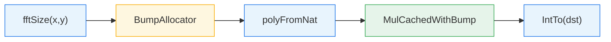
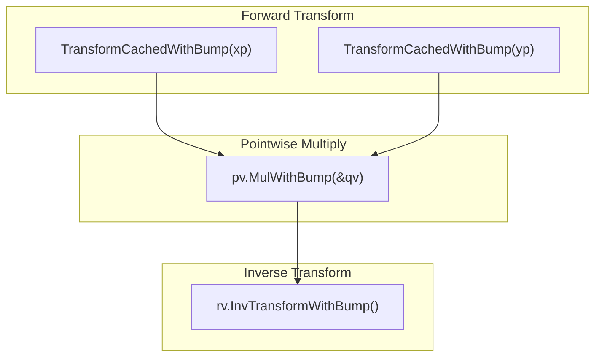
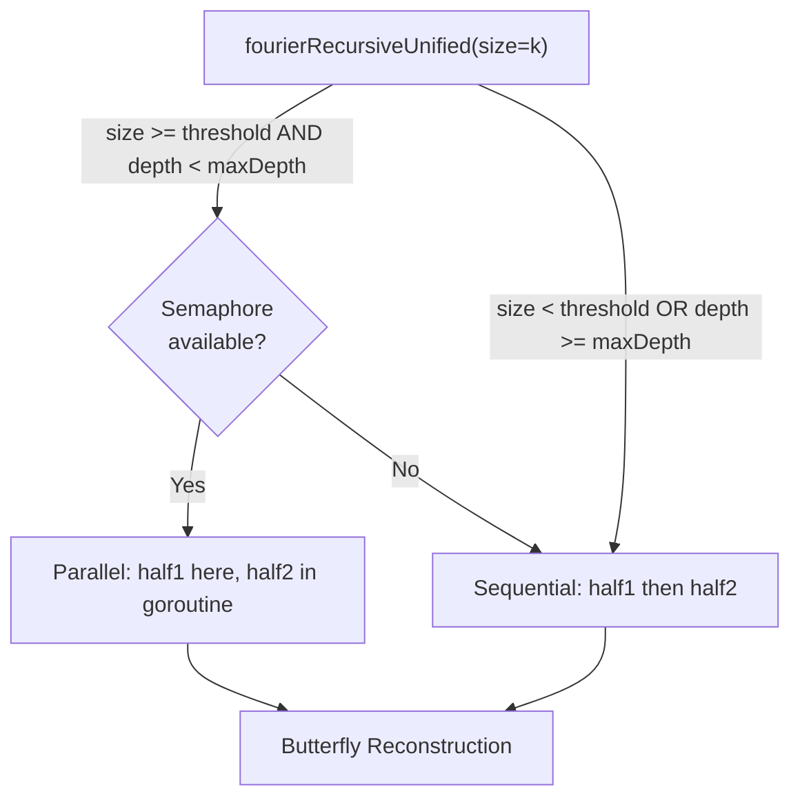
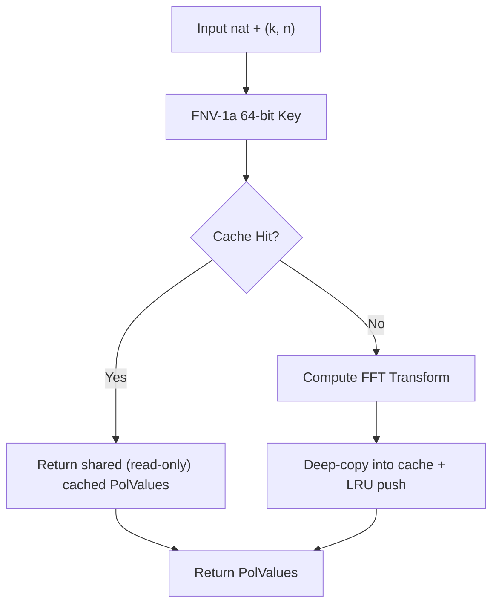
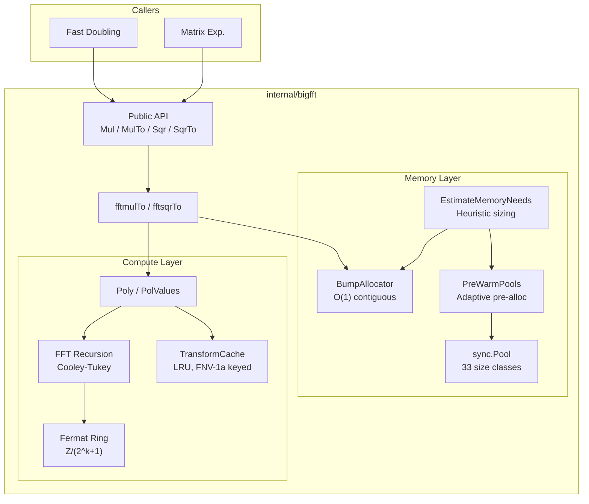

# BigFFT Subsystem: Implementation Internals

> **Scope**: Implementation architecture of `internal/bigfft`
> **Complexity**: O(n log n) integer multiplication via Schonhage-Strassen FFT
> **See also**: [FFT.md](FFT.md) for the mathematical theory, and [FFT.md § FFT Routing](FFT.md#fft-routing) — the canonical answer to *when* a calculation reaches this package

## Overview

The `internal/bigfft` package implements **Schonhage-Strassen FFT multiplication** over
Fermat rings for arbitrarily large integers. All three registered calculators reach it,
but not by the same rule and not at the same size: `"fft"` unconditionally via
`executeDoublingStepFFT`, `"fast"` via the same function but only once `FK1` passes
`FFTThreshold` (which, because the gate reads an intermediate operand, means
`n ≥ 1 440 422` at the 500 000-bit default), `"matrix"` via `smartMultiply`/`smartSquare`
once the entries of `Q^(2^i)` and of the accumulated `res` pass it (a different rule and a
different size: `n ≥ 1 768 788` at the same default). The per-path rules, the origin of the threshold value and
the reachable-`n` tables are in [FFT.md § FFT Routing](FFT.md#fft-routing), which is the
canonical description; this page does not restate them. Two Fibonacci paths do **not**
touch this package at all — the `--last-digits` modular path (`FastDoublingMod`, plain
`math/big` + `Mod`) and the optional `-tags gmp` calculator (libgmp).

The subsystem has 14 non-test source files, enumerated in
[Package Structure](#package-structure) below. (`make stats` reports package counts
and repo-wide LOC, not a per-package file count.) They are organized around four
concerns:

1. **Public API** -- panic-safe entry points for multiplication and squaring
2. **FFT core** -- polynomial decomposition, forward/inverse transforms, pointwise operations
3. **Fermat arithmetic** -- modular arithmetic in Z/(2^k+1) where multiplications reduce to shifts
4. **Memory management** -- four pool hierarchies, a bump allocator, pre-warming, and capacity estimation

---

## Public API

**File**: `internal/bigfft/fft.go`

```go
func Mul(x, y *big.Int) (res *big.Int, err error)
func MulTo(z, x, y *big.Int) (res *big.Int, err error)
func Sqr(x *big.Int) (res *big.Int, err error)
func SqrTo(z, x *big.Int) (res *big.Int, err error)
```

All four functions wrap their core logic in `defer/recover`, but the recovered value
is **not** unconditionally converted to an error. `fermatPanicToError`
(`internal/bigfft/fft.go:fermatPanicToError`) re-`panic`s the three internal
post-condition sentinels — `"len(z) > 2n+1"`, `"fermat.Mul: unexpected carry after normalization"`,
`"fermat.Sqr: unexpected carry after normalization"`, the three entries of
`fft.go:fermatPostConditionPanics` — so a genuine
bug in the modular reduction still crashes the caller by design (ADR-0002). Only
pre-condition panics (operand-size mismatches) and other unexpected panics become
returned errors.

**Threshold gating**: `Mul`/`MulTo` and `Sqr`/`SqrTo` compare the operand word count
against `fftThreshold` (default 1800 words, ~115 Kbits on 64-bit). `Mul`/`MulTo`
require **both** operands to exceed it (`xwords > t && ywords > t`); `Sqr`/`SqrTo`
test their single operand. Anything below falls through to `math/big`'s `Mul`,
avoiding FFT overhead for small numbers. The threshold lives in an
`atomic.Int64` read through `getFFTThreshold()`; the writer `SetFFTThreshold` has
no production caller (test-only in practice). Note this is the **package-internal,
word-based** threshold, distinct from `fibonacci.Options.FFTThreshold`, which is
bit-based and decides whether `smartMultiply` calls into this package at all.

**Squaring optimization**: `Sqr`/`SqrTo` transform the input once, so a squaring
runs **two transforms (1 forward + 1 inverse) instead of the three a general `Mul`
needs** (2 forward + 1 inverse). That is one transform out of three saved — an
operation count. The repo carries no measurement of the resulting wall-time
fraction, and `fft.go` says so at the `Sqr` declaration: "The saving is one
transform out of three, not a measured fraction of wall time."

---

## Internal Data Flow

The heart of the package is `fftmulTo`, which orchestrates a complete FFT multiplication.

**File**: `internal/bigfft/fft_core.go`

```go
func fftmulTo(dst, x, y nat) (nat, error) {
    k, m := fftSize(x, y)
    wordLen := len(x) + len(y)
    ba := AcquireBumpAllocator(EstimateBumpCapacity(wordLen))
    defer ReleaseBumpAllocator(ba)
    xp := polyFromNat(x, k, m)
    yp := polyFromNat(y, k, m)
    rp, err := xp.MulCachedWithBump(&yp, ba)
    if err != nil {
        return nil, err
    }
    result := rp.IntTo(dst)
    rp.Release() // return pooled buffers after the result is copied
    return result, nil
}
```

### Pipeline Stages



| Stage | Responsibility |
|-------|---------------|
| `fftSize` | Select FFT length K=2^k and chunk size m from `fftSizeThreshold` table |
| `BumpAllocator` | Pre-allocate a contiguous word buffer for all temporaries |
| `polyFromNat` | Split the input `nat` into a polynomial of `ceil(len(x)/m)` chunks of m words (at most K) |
| `MulCachedWithBump` | Forward FFT, pointwise multiply, inverse FFT (with transform caching) |
| `IntTo` | Reassemble polynomial back into a single `nat` with carry propagation |

### Detailed Multiplication Pipeline

Within `MulCachedWithBump`, the following sequence executes:



1. **Forward transform** each polynomial into `PolValues` (evaluation at roots of unity)
2. **Pointwise multiply** the two sets of values in the Fermat ring
3. **Inverse transform** the product back to coefficient form

---

## FFT Size Selection

**File**: `internal/bigfft/fft.go`

The `fftSize` function derives the FFT parameters from a lookup table:

```go
var fftSizeThreshold = [...]int64{0, 0, 0,
    4<<10, 8<<10, 16<<10,            // k=3..5
    32<<10, 64<<10, 1<<18, 1<<20, 3<<20, // k=6..10
    8<<20, 30<<20, 100<<20, 300<<20, 600<<20,  // k=11..15
}
```

The FFT length K = 2^k is chosen so that `fftSizeThreshold[k]` exceeds the total
result bit-length. The chunk size m satisfies `m << k > len(x) + len(y)`, ensuring
the polynomial representation can hold the full product.

**Stated rationale, not the computation.** The source comment sitting above the
table (`internal/bigfft/fft.go`, just before `fftSizeThreshold`) reads: "A FFT
size of K=1<<k is adequate when K is about 2*sqrt(N) where N = x.Bitlen() +
y.Bitlen()." That is the balance argument behind the table — O(K log K) FFT cost
against O(m²) coefficient multiplications — but `fftSize` computes **no square
root**. It walks `fftSizeThreshold` and takes the first index whose entry
exceeds the bit count. The table is a **tuning artifact, not a measured
crossover**: no benchmark in this repo pins any of its 16 entries against
another value.

Consequently the rule and the table diverge, systematically and by a lot at the
low end. `fftSize` is reached only through `Mul`/`MulTo`, which require **both**
operands above `defaultFFTThresholdWords = 1800` words, so the smallest bit
count it ever sees is (1801 + 1801) × 64 = 230 528:

| Total bits N | k | K = 2^k | 2·√N | K ÷ 2√N |
|---|---|---|---|---|
| 230,528 (smallest reachable) | 8 | 256 | 960 | 0.27 |
| 1,000,000 | 9 | 512 | 2,000 | 0.26 |
| 13,900,000 (≈ F(10M) squaring) | 12 | 4,096 | 7,457 | 0.55 |
| 100,000,000 | 13 | 8,192 | 20,000 | 0.41 |
| 400,000,000 | 15 | 32,768 | 40,000 | 0.82 |
| 1,000,000,000 | 16 (capped) | 65,536 | 63,246 | 1.04 |

Read the rule as an order-of-magnitude justification for the table's shape, not
as its formula: at the smallest reachable size the table picks K nearly **4×
below** what the rule would ask for, and the two only converge (ratio 0.8–1.0)
past a few hundred million bits. The same table is also read by `GetFFTParams`, which
`internal/fibonacci/fft.go:executeDoublingStepFFT` calls with no 1800-word gate
at all — so on the FFT-only calculator path even smaller sizes are reachable,
where the divergence is larger still.

---

## Polynomial Representation

**File**: `internal/bigfft/fft_poly.go`

```go
type Poly struct {
    K uint   // 1<<K is the FFT length
    M int    // words per chunk: P(b^M) recovers the original number
    A []nat  // up to 1<<K coefficients, each M words

    pooledBacking []big.Word // backing to return to the word-slice pool on Release()
    pooledA       bool       // A itself came from the []nat pool
}
```

The two unexported fields carry the `Release()` contract: `Release()` returns
`pooledBacking` to the word-slice pool and, when `pooledA` is set, `A` to the
`[]nat` pool. They are left zero when the `Poly` was built outside the pools
(e.g. `polyFromNat`), which makes `Release()` a safe no-op there.

### Key Operations

| Function | Purpose |
|----------|---------|
| `polyFromNat(x, k, m)` | Slice a `nat` into a polynomial of m-word coefficients; the count is `ceil(len(x)/m)` (at least 1), i.e. **at most** 2^k |
| `IntTo(dst)` | Reassemble polynomial back to `nat` via carry-propagating addition |
| `Transform(n)` / `TransformWithBump(n, ba)` | Forward FFT: evaluate at K-th roots of unity |
| `InvTransform()` / `InvTransformWithBump(ba)` | Inverse FFT: reconstruct from point values |
| `MulCached(q)` / `MulCachedWithBump(q, ba)` | Full cached FFT multiply pipeline |
| `SqrCached()` / `SqrCachedWithBump(ba)` | Optimized squaring (single transform) |

### PolValues Type

```go
type PolValues struct {
    K      uint     // log2 of FFT length
    N      int      // coefficient word length
    Values []fermat // 1<<K evaluated points

    pooledBacking []big.Word // backing to return to the word-slice pool on Release()
    pooledValues  bool       // Values itself came from the []fermat pool
}
```

Same `Release()` contract as `Poly`. `pooledBacking` is deliberately left nil on
transform-cache hits (`TransformCache.getByKey`), so a caller that releases a
cache-shared `PolValues` cannot poison the pool.

`PolValues` represents a polynomial evaluated at K-th roots of unity. Pointwise
multiplication (`Mul`) and squaring (`Sqr`) operate on this type; both are
read-only on their receivers, which is why the Fast Doubling FFT step can share
one transformed operand across its three concurrent products without copying.
`Clone()` produces a deep copy, but has **no production caller** — the source
marks it a test oracle (audit OVR-10), retained for tests needing an
aliasing-free copy. The same "test oracle, no production caller" marker sits on
`Poly.Mul`, `Poly.Transform`, `Poly.NTransform`, `PolValues.InvNTransform`,
`TransformCache.Get`/`Put`/`Clear` and the non-bump `*Cached` variants.

---

## Fermat Ring Arithmetic

**File**: `internal/bigfft/fermat.go`

```go
type fermat nat  // []big.Word of length n+1, representing a number mod 2^(n*W)+1
```

A `fermat` of length w+1 represents a number in the ring **Z/(2^(w*W)+1)** where
W is the machine word size (64 bits). The last word is constrained to 0 or 1.

### Why Fermat Rings?

The key property: in Z/(2^k+1), powers of 2 are roots of unity. This means
multiplications by roots of unity in the FFT become **bit shifts** rather than
full multiplications, dramatically reducing cost.

### Operations

| Method | Description |
|--------|-------------|
| `Shift(x, k)` | Compute (x << k) mod (2^n+1) via word-aligned copy and borrow |
| `ShiftHalf(x, k, tmp)` | Shift by k/2 bits using sqrt(2) = 2^(3n/4) - 2^(n/4) identity |
| `Add(x, y)` | Modular addition with normalization |
| `Sub(x, y)` | Modular subtraction with borrow handling |
| `Mul(x, y)` | Full modular multiplication (uses `basicMul` below threshold) |
| `norm()` | Normalize: ensure last word is 0 or 1 |

The `Mul` method switches between `basicMul` (schoolbook, for operands below
`smallMulThreshold = 30` words) and `big.Int.Mul` for larger operands, with subsequent
modular reduction. The `Sqr` method provides an optimized squaring path that similarly
dispatches between `basicSqr` and `big.Int.Mul` based on operand size.

The `smallMulThreshold` (30 words, ~1,920 bits on 64-bit) trades `big.Int`'s setup
overhead against `basicMul`'s O(n²) inner loop. It is a **setting, not a measured
crossover**: `fermat.go` states "30 words is a setting, with no benchmark in the
repo pinning it against a nearby value." `BenchmarkFermatSqrVsMul`
(`fermat_test.go`) exists but does not sweep this constant, and no archived run of
it is tracked.

---

## FFT Transform

**Files**: `internal/bigfft/fft_core.go`, `internal/bigfft/fft_recursion.go`

### Entry Points

| Function | Description |
|----------|-------------|
| `fourier(dst, src, backward, n, k)` | Top-level FFT; acquires its `tmp`/`tmp2` temporaries via `acquireFermat`/`releaseFermat` |
| `fourierWithBump(dst, src, backward, n, k, ba)` | FFT using bump allocator (best cache locality) |

All entry points delegate to the recursive core.

### Recursive Decomposition

**File**: `internal/bigfft/fft_recursion.go`

```go
func fourierRecursiveUnified(dst, src []fermat, backward bool, n int,
    k, size, depth uint, tmp, tmp2 fermat) error
```

> The `alloc tempAllocator` parameter was **removed** by audit L-06 (2026-09): the
> recursion only handed it down to its own recursive calls and never allocated
> through it. `tempAllocator` itself stays — `fft_poly.go` uses it (see
> [Allocator Abstraction](#allocator-abstraction)).

The FFT uses a **Cooley-Tukey radix-2 decimation-in-time** decomposition — the
input is split by index parity (`src` for one half, `src[1<<idxShift:]` for the
other, `idxShift = k - size`) and the twiddle factors are applied **after** the
two recursive calls return, in `executeReconstruction`. That ordering is what
makes it decimation-in-time rather than decimation-in-frequency:

1. **Base cases**: `size=0` (copy `src[0]` into `dst[0]`) and `size=1` (butterfly: `dst[0] = src[0]+src[1<<idxShift]`, `dst[1] = src[0]-src[1<<idxShift]`)
2. **Recursive split**: `dst[:1<<(size-1)]` recurses on `src`, `dst[1<<(size-1):]` on `src[1<<idxShift:]`
3. **Reconstruct**: for each `i`, `tmp = ShiftHalf(dst2[i], i·ω2shift)`, then `dst2[i] = dst1[i] - tmp` and `dst1[i] += tmp`

### Parallelism Control

There are **three** independent parallel dispatch points in this package, gated by
three different mechanisms. Only the first is runtime-configurable.

**(a) Recursion split** (`fourierRecursiveUnified`) — two runtime-configurable
variables, both unexported `atomic.Uint64` package variables seeded in `init()`;
the exported surface is the getter pair plus `GetFFTParallelismConfig` /
`SetFFTParallelismConfig`.

| Variable | Accessor | Default | Purpose |
|----------|----------|---------|---------|
| `parallelFFTRecursionThreshold` | `GetParallelFFTRecursionThreshold()` | 4 | Minimum recursion `size` for parallel recursion |
| `maxParallelFFTDepth` | `GetMaxParallelFFTDepth()` | 3 | Maximum parallel recursion depth |

**(b) Butterfly reconstruction** (`executeReconstruction`, `fft_recursion.go`) —
gated by the **compile-time constant** `reconstructionMinParallelWords = 1 << 16`,
compared against `len(dst1) * len(tmp)`, and short-circuited when
`runtime.NumCPU() == 1`. Not reachable through `FFTParallelismConfig`.

**(c) Pointwise multiply/square** (`runPointwise`, `fft_poly.go`) — gated by the
compile-time constant `pointwiseMinParallelWords = 1 << 16`, compared against
`count*(n+1)`, same `NumCPU() == 1` short-circuit. Also not configurable.

The two constants carry a source note attributing them to "paired end-to-end
benchmarks on a 24-thread host (2026-06)"; no output of those runs is archived in
this repo.

The (a) thresholds can be adjusted at runtime via the `FFTParallelismConfig` struct:

```go
// Read current configuration
config := bigfft.GetFFTParallelismConfig()

// Update configuration
bigfft.SetFFTParallelismConfig(bigfft.FFTParallelismConfig{
    RecursionThreshold: 5,  // Increase minimum for parallel recursion
    MaxDepth:           2,  // Reduce parallel depth
})
```

All three dispatch points share one semaphore channel, sized to
`runtime.NumCPU()` (`getSemaphore`, `fft_recursion.go`) — distinct from the
Fibonacci-level task semaphore in `internal/fibonacci/common.go`, which is sized
`runtime.GOMAXPROCS(0)`. Acquisition is always **non-blocking** (`select` with a
`default`), so a missing token never deadlocks against another token holder: the
work simply runs on the calling goroutine. Spawned goroutines draw their scratch
from the pool allocator, never from the caller's bump allocator, which is not
thread-safe. Worker panics are captured and re-panicked on the calling goroutine
so the entry points' recover policy (ADR-0002) still applies.



---

## Memory Management

### Pool System

**File**: `internal/bigfft/pool.go`

Four `sync.Pool` hierarchies with geometrically-spaced size classes minimize
allocation overhead and fragmentation:

| Pool | Size Classes (elements) | Count | Use Case |
|------|------------------------|-------|----------|
| `wordSlicePools` | 64, 256, 1K, 4K, 16K, 64K, 256K, 1M, 4M, 16M | 10 | General `big.Word` buffers |
| `fermatPools` | 32, 128, 512, 2K, 8K, 32K, 128K, 512K, 2M | 9 | Fermat number buffers |
| `natSlicePools` | 8, 32, 128, 512, 2K, 8K, 32K | 7 | `nat` slice buffers |
| `fermatSlicePools` | 8, 32, 128, 512, 2K, 8K, 32K | 7 | `fermat` slice buffers |

**Total**: 33 size classes across 4 pool types.

**Pattern**: Each pool type follows the same acquire/release protocol:

```go
slice := acquireWordSlice(size)
defer releaseWordSlice(slice)
```

**Size class selection**: `getWordSlicePoolIndex(size)` returns the index of the
smallest size class >= the requested size. If no class is large enough, allocation
bypasses the pool entirely (`make()` direct).

**Clearing**: `acquireWordSlice` zeroes only `slice[:size]` — the prefix the
caller can reach through the returned header — not the whole size class
(audit M-05). Classes are a factor of four apart, so clearing the bucket did up
to 4x the necessary `memclr`, 2.5x on average. `releaseWordSlice` still routes
on `cap`, so the bucket invariant is untouched. The companion
`acquireWordSliceUnsafe` deliberately skips the clear and is reserved for
callers that immediately overwrite every element (e.g. via `copy`).

> **What narrowing the memclr measured.**
> [`docs/audits/bench-poolclear-2026-09.txt`](../audits/bench-poolclear-2026-09.txt)
> ran the six `BenchmarkFibonacci` cases A/B in **both orders**
> (`-benchmem -benchtime=1s -count=8`, Core Ultra 9 275HX, windows/amd64,
> go1.27.0). Only `MatrixExp` moves order-stably — −5.60 % (direct) and −8.02 %
> (inverted) at 10M, −19.86 % and −8.84 % at 1M. The `FastDoubling/10M` and
> `FFTBased/10M` rows flip sign with the measurement order (+10.10 % / +8.59 %
> direct, −9.03 % / −13.64 % inverted), which makes them thermal, not causal.
> Nothing regresses order-stably, matching the a-priori expectation that the
> change is strictly less work. Read this as the protocol worth copying: a
> single-order A/B on this host would have reported a 10 % regression that does
> not exist.

**Release safety**: all four release functions (`releaseWordSlice`,
`releaseFermat`, `releaseNatSlice`, `releaseFermatSlice` in
`internal/bigfft/pool.go`) check that the slice capacity matches a
known size class before returning to the pool; mismatched or directly-allocated
slices are left for the garbage collector. Only `releaseWordSlice` *counts* those
misses — the single `wordSlicePoolMissCount.Add(1)` lives in `pool.go:releaseWordSlice`. The
counter is readable through the exported `WordSlicePoolMissCount()` and a steadily
growing value signals `[]big.Word` pool churn specifically (a caller reshaped a
pooled slice before releasing it); the other three sinks are not instrumented.

### Bump Allocator

**File**: `internal/bigfft/bump.go`

```go
type BumpAllocator struct {
    buffer []big.Word
    offset int
}
```

The bump allocator provides the fastest possible temporary allocation for FFT
operations:

| Property | Benefit |
|----------|---------|
| O(1) allocation | Just `offset += size` |
| Zero fragmentation | Contiguous memory block |
| Excellent cache locality | Sequential access pattern matches FFT data flow |
| Single release | All allocations freed by resetting offset |
| NOT thread-safe | One per goroutine, no synchronization overhead |

> **Note**: The `CalculationArena` (`internal/fibonacci/memory/arena.go`) complements this bump allocator. The bump allocator covers FFT temporaries, while the arena covers the `big.Int` backing arrays of the calculation state (`CalculationState`). The two systems coexist without interference.

**Lifecycle**: Managed via `sync.Pool`:

```go
ba := AcquireBumpAllocator(EstimateBumpCapacity(wordLen))
defer ReleaseBumpAllocator(ba)
```

**Fallback**: If an allocation exceeds remaining capacity, the allocator falls back
to `make()` transparently. This guarantees correctness even if the capacity estimate
was too small.

**Typed allocation methods**:

| Method | Description |
|--------|-------------|
| `Alloc(n)` | Allocate n zeroed words |
| `allocFermat(n)` | Allocate a fermat of n+1 words — package-internal |
| `allocFermatSlice(count, n)` | Allocate `count` contiguous fermat buffers — package-internal |
| `Reset()` | Invalidate all allocations, reuse from start |
| `Remaining()` / `Used()` | `len(buffer)-offset` and `offset` |

`Remaining()` is what makes the F-012 per-calculation reuse possible:
`executeDoublingStepFFT` (`internal/fibonacci/fft.go`) `Reset()`s the carried
allocator and re-acquires a larger one only when `ba.Remaining() < baCap`, so
the buffer is sized once for the final doubling step instead of regrowing on
almost every iteration.

### Allocator Abstraction

**File**: `internal/bigfft/allocator.go`

The `tempAllocator` interface (unexported) decouples the FFT algorithm from its allocation strategy:

```go
type tempAllocator interface {
    allocFermatTemp(n int) (fermat, func())
    allocFermatSlice(count, n int) ([]fermat, []big.Word, func())
}
```

Two implementations:

| Type | Strategy | Cleanup |
|------|----------|---------|
| `poolAllocator` | `sync.Pool` acquire/release | Returns buffers to pool |
| `*BumpAllocator` | Bump allocation from contiguous buffer (implements `tempAllocator` directly via `allocFermatTemp`/`allocFermatSlice`) | No-op (bulk release via `ReleaseBumpAllocator`) |

This abstraction allows the same FFT recursion code (`fourierRecursiveUnified`) to
work with either allocator without duplication.

### Capacity Estimation

**File**: `internal/bigfft/bump.go`

```go
func EstimateBumpCapacity(wordLen int) int
```

Heuristic formula:

```
K = 2^k (from fftSizeThreshold lookup)
n = wordLen / K + 1
transformTemp = K * (n+1)
multiplyTemp  = 8 * n
total = (2*transformTemp + multiplyTemp) * 11 / 10   // 10% headroom
```

The 10% is a tuning choice, not a measured optimum, and undershooting is not a
correctness problem: `Alloc` falls back to `make()` when the arena is exhausted.
`bump.go` states it directly — "the margin is a tuning choice, and no benchmark in
the repo pins 10% over any other value."

**Its k-selection is not `fftSize`'s.** `EstimateBumpCapacity` walks the same
table but starts at `k := 0` and, when no entry exceeds the bit count, falls
back to `k = len(fftSizeThreshold) - 1 = 15` (`bump.go`, the `if k == 0` branch).
`fftSize` starts at `k := len(fftSizeThreshold) = 16` and keeps that value in the
same case. So past 629,145,600 result bits (`600 << 20`, the table's last entry)
the estimator sizes for K = 32768 while the transform actually runs at
K = 65536, i.e. it under-estimates by about half. That is not a correctness
problem for the same reason the 10 % margin is not: the shortfall lands in
`Alloc`'s `make()` fallback. It is worth knowing before reading the estimate as
an allocation bound at very large N.

### Pool Pre-Warming

**File**: `internal/bigfft/pool_warming.go`

```go
func PreWarmPools(n uint64)
func EnsurePoolsWarmed(maxN uint64)
```

Pre-warming pre-allocates buffers in each pool hierarchy based on `EstimateMemoryNeeds(n)`.
The number of buffers scales with the target Fibonacci index:

| N Range | Buffers Pre-allocated |
|---------|----------------------|
| < 100,000 | 2 |
| 100K -- 1M | 4 |
| 1M -- 10M | 5 |
| >= 10M | 6 |

`EnsurePoolsWarmed` uses an `atomic.Bool` compare-and-swap to guarantee one-time
initialization, safe for concurrent callers. It is invoked from
`FibCalculator.CalculateWithObservers()` before the core calculation begins.

### Memory Estimation

**File**: `internal/bigfft/memory_est.go`

```go
func EstimateMemoryNeeds(n uint64) MemoryEstimate
```

Returns estimated maximum sizes for each pool type based on the bit-length of F(n),
computed from the approximation `bitLen(F(n)) ~ n * 0.69424`.

---

## FFT Transform Caching

**File**: `internal/bigfft/fft_cache.go`

```go
type TransformCache struct {
    mu        sync.RWMutex
    config    TransformCacheConfig
    entries   map[uint64]*list.Element
    lru       *list.List
    currBytes int // sum of len(entry.backing)*wordSize, guarded by mu (M-08)
    hits, misses, evictions, accesses atomic.Uint64
    // atomic.Pointer so setCacheLogger does not race with the hot-path read
    // in logPeriodicStats (A2-02).
    logger    atomic.Pointer[zerolog.Logger]
}
```

### Design

| Property | Value |
|----------|-------|
| Thread safety | `sync.RWMutex` for concurrent reads, exclusive writes |
| Key generation | FNV-1a 64-bit hash of input data + FFT parameters (k, n) |
| Eviction policy | LRU (least recently used) |
| `DefaultTransformCacheConfig().MaxEntries` | 256 |
| `DefaultTransformCacheConfig().MinBitLen` | 100,000 bits (~12 KB) |
| `DefaultTransformCacheConfig().MaxBytes` | 0 (unbounded); `configureFFTCache` sizes it from `n` |

> **256 is almost never the effective value.** `configureFFTCache`
> (`internal/fibonacci/options.go`) overwrites it whenever
> `Options.FFTCacheMaxEntries` is left at 0 and `n > 0`, computing
> `clamp(2 × bits.Len64(n), 64, 4096)`. Since `bits.Len64` caps at 64 the
> expression tops out at 128; for n = 10M it is `2 × 24 = 48`, clamped up to 64.
> The 256 default only survives for a caller that bypasses `configureFFTCache`
> or passes `n = 0`.

> **The entry cap is not a memory bound (audit M-08, 2026-09).** An entry holds
> `K × (n+1)` words — roughly twice its operand — so a fixed entry budget grows
> linearly with the Fibonacci index: at F(10M) the matrix path retained 20 entries
> of ~1.7 MB, and the same 64-128 entry budget at F(100M) would allow gigabytes,
> with nothing freeing it between calculations in a long-lived process (TUI
> restart, calibration sweep). `TransformCacheConfig.MaxBytes` now caps the total
> backing memory (`currBytes` tracks it, and `putByKey` both refuses an
> over-sized entry and evicts until the new one fits). `configureFFTCache`
> installs `48 × size(F(n))` (`fibonacci.FFTCacheMaxBytesFactor`), sized to hold
> one calculation's transforms. Tightening it to 4× was measured at MatrixExp/10M
> **+22 % sec/op** and rejected — [ADR-0010 R1](../adr/0010-audit-2026-09-decisions.md),
> [`docs/audits/bench-fftcache-2026-09.txt`](../audits/bench-fftcache-2026-09.txt).

### Why Cache?

When the same big integer is transformed more than once, the cached forward FFT
transform avoids recomputing it. **On the one production path that reaches the
cache at all, the saving has been measured — and it is zero.**
[`docs/audits/mem-baseline-2026-09.txt`](../audits/mem-baseline-2026-09.txt)
instruments F(10M) on the matrix path and records `0 hits, 27 misses` both before
and after the `MaxBytes` bound was introduced (20 entries retained, then 1). The
zero is not an instrumentation artifact: operand values change on every iteration,
so a transform is cached and never read back — which is what the P2-01 note on
`Options.FFTCacheMinBitLen` predicted before anyone measured it. (That artifact's
closing line, "the cache is therefore bounded tightly (4x the size of F(n))",
states an intent that was reversed afterwards: tightening to 4x measured **+22 %
sec/op** at MatrixExp/10M and was rejected. The shipped factor is 48 —
`FFTCacheMaxBytesFactor`, `internal/fibonacci/constants.go` — per
[ADR-0010 R1](../adr/0010-audit-2026-09-decisions.md).)

What remains unmeasured is caching against *no* caching, anywhere. Two other
artifacts touch the cache without answering that:
`docs/audits/bench-baseline.txt` measures whole calculators without
varying the cache at all, and
[`docs/audits/bench-fftcache-2026-09.txt`](../audits/bench-fftcache-2026-09.txt)
varies only its **byte bound** (`MaxBytes` 4x vs 48x), never its enabled/disabled
state, so it prices one bound against another rather than caching against no
caching. Cache-specific benchmarks do exist — `BenchmarkCacheImpact` and
`BenchmarkCacheHitRate` (`internal/fibonacci/cache_bench_test.go`), plus
`BenchmarkCacheHit`, `BenchmarkCacheHitParallel`, `BenchmarkCacheMiss`,
`BenchmarkCachePut` and `BenchmarkTransformCache`
(`internal/bigfft/fft_cache_test.go`) — but none has an archived result here, and
the two in `internal/fibonacci` cannot produce one anyway: both drive a
`FastDoublingCalculator`, whose FFT step never consults the cache (see the scope
note below), so they report a 0% hit rate whatever the configuration. Treat the
saving as "one forward transform per hit", not as a percentage.

> **Scope (A3-01)**: The cache is only consulted by the `bigfft.Mul`/`MulTo`/`Sqr`/`SqrTo`
> entry points (via `fftmulTo`/`fftsqrTo` → `MulCachedWithBump`/`SqrCachedWithBump`).
> The default Fast Doubling calculator's per-step FFT path (`executeDoublingStepFFT`
> in `internal/fibonacci/fft.go`, used by both `AdaptiveStrategy` and `FFTOnlyStrategy`)
> calls the **non-cached** `TransformWithBump` and therefore does **not** benefit from
> this cache. It applies to operations routed through `smartMultiply`/`smartSquare`
> (which call `bigfft.MulTo`/`SqrTo`) and to Strassen matrix multiplication.

### Cached Variants

| Function | Description |
|----------|-------------|
| `TransformCached(n)` | Forward FFT with cache lookup/store |
| `TransformCachedWithBump(n, ba)` | Same, using bump allocator |
| `MulCached(q)` / `MulCachedWithBump(q, ba)` | Full multiply with cached transforms |
| `SqrCached()` / `SqrCachedWithBump(ba)` | Squaring with cached transform |

### Statistics

```go
type CacheStats struct {
    Hits, Misses, Evictions uint64
    Size    int
    HitRate float64
}
```

Available via `GetTransformCache().Stats()`.

### Cache Flow



---

## Low-Level Arithmetic

Word-level vector arithmetic is delegated to `math/big`'s internal assembly via
`go:linkname`; bigfft performs no runtime CPU-feature detection of its own.

### Vector Arithmetic

**File**: `internal/bigfft/arith.go`

A single portable file (no build tags) exports three functions (`AddVV`, `SubVV`,
`AddMulVVW`) that wrap the `go:linkname` bindings declared in `arith_decl.go`.
The exported wrappers serve as test-only oracles for `arith_test.go`; production
code calls the lowercase linkname bindings directly. All platforms use the same
`math/big` internals, which Go's standard library already optimizes with
platform-appropriate assembly.

### go:linkname Declarations

**File**: `internal/bigfft/arith_decl.go`

Six `go:linkname` directives bind directly to `math/big` internal functions:

```go
//go:linkname addVV math/big.addVV
//go:linkname subVV math/big.subVV
//go:linkname addVW math/big.addVW
//go:linkname subVW math/big.subVW
//go:linkname shlVU math/big.shlVU
//go:linkname addMulVVW math/big.addMulVVW
```

---

## Package Structure

| File | Responsibility |
|------|---------------|
| `fft.go` | Public API: `Mul`, `MulTo`, `Sqr`, `SqrTo`; FFT size selection |
| `fft_core.go` | Core FFT: `fftmulTo`, `fftsqrTo`, `fourier`, `fourierWithBump` |
| `fft_recursion.go` | Recursive FFT decomposition with runtime-configurable parallelism (`FFTParallelismConfig`) |
| `fft_poly.go` | `Poly` and `PolValues` types; transform, multiply, inverse |
| `fft_cache.go` | `TransformCache`: thread-safe LRU for FFT transforms, bounded in entries **and** bytes |
| `fermat.go` | Fermat ring arithmetic: Z/(2^k+1) |
| `pool.go` | `sync.Pool` hierarchies (4 types, 33 size classes); `acquire*` zeroes only the requested prefix of a pooled slice, not the whole size class (audit M-05) |
| `pool_warming.go` | `PreWarmPools`, `EnsurePoolsWarmed` |
| `bump.go` | `BumpAllocator`: O(1) bump allocation with capacity estimation |
| `allocator.go` | `tempAllocator` interface, `poolAllocator` (`*BumpAllocator` implements it directly, see `bump.go`); consumed by `fft_poly.go`, no longer threaded through the FFT recursion (L-06) |
| `memory_est.go` | `EstimateMemoryNeeds` for pool pre-warming |
| `arith.go` | Portable vector arithmetic wrappers (test-only oracles) delegating to `math/big` internals |
| `arith_decl.go` | Architecture-independent `go:linkname` declarations to `math/big` |
| `doc.go` | Package documentation |

---

## Memory Architecture Diagram



---

## Integration Points

### Called From

Seven production files outside `internal/bigfft` reference it (re-verified
2026-09-04 with
`grep -rln "bigfft\." internal/ cmd/ --include=*.go | grep -v _test.go | grep -v "^internal/bigfft/"`,
which returns exactly these seven):

- `internal/fibonacci/fft.go` -- `smartMultiply()` dispatches to `bigfft.MulTo` (and `smartSquare()` to `bigfft.SqrTo`), or both fall back to `math/big`; `executeDoublingStepFFT` also uses `PolyFromInt`, `TransformWithBump`, `GetFFTParams`, `ValueSize`, `Acquire`/`ReleaseBumpAllocator`, `EstimateBumpCapacity`
- `internal/fibonacci/calculator.go` -- `FibCalculator.CalculateWithObservers()` calls `bigfft.EnsurePoolsWarmed()` before calculation
- `internal/fibonacci/strategy.go` -- `FFTOnlyStrategy.Multiply`/`Square` call `bigfft.MulTo`/`SqrTo` directly (`strategy.go:FFTOnlyStrategy.Multiply`, `strategy.go:FFTOnlyStrategy.Square`)
- `internal/fibonacci/options.go` -- `configureFFTCache` calls `DefaultTransformCacheConfig` + `SetTransformCacheConfig` (`options.go:configureFFTCache`)
- `internal/fibonacci/cache_strategy_bigfft.go` -- `Sample` calls `GetTransformCache` + `SetTransformCacheConfig` (`cache_strategy_bigfft.go:bigfftCacheStrategy.Sample`)
- `internal/fibonacci/fastdoubling.go` -- holds a `*bigfft.BumpAllocator` on the state; `EstimateBumpCapacity`, `ReleaseBumpAllocator`
- `internal/calibration/microbench.go` -- `bigfft.Mul` in the micro-benchmark (`microbench.go:multiplyTest`)

### Configuration

FFT behavior is influenced by these `fibonacci.Options` fields:

| Option | Default | Effect |
|--------|---------|--------|
| `FFTThreshold` | 500,000 bits | Bit-length gate; what it gates depends on the calculator — on `"matrix"` it selects `bigfft.MulTo` inside `smartMultiply`, on `"fast"` it selects a whole doubling-step implementation, on `"fft"` it is not read. See [FFT.md § FFT Routing](FFT.md#fft-routing) |

The internal `fftThreshold` (1,800 words) within `bigfft` itself controls whether
`Mul`/`Sqr` use FFT or fall through to `math/big`; this is separate from the
strategy-level threshold, and the two gates are applied **in series** — see
[FFT.md § The two gates are in series, not the same gate](FFT.md#the-two-gates-are-in-series-not-the-same-gate).

---

## Cross-References

- [FFT.md](FFT.md) -- Mathematical theory, convolution theorem, and [§ FFT Routing](FFT.md#fft-routing), the canonical description of when each calculator reaches this package
- [FAST_DOUBLING.md](FAST_DOUBLING.md) -- Primary consumer of the BigFFT subsystem
- [MATRIX.md](MATRIX.md) -- Secondary consumer via Strassen matrix multiplication
- [../PERFORMANCE.md](../PERFORMANCE.md) -- Benchmark data and threshold tuning results

## References

1. Schonhage, A., & Strassen, V. (1971). "Schnelle Multiplikation grosser Zahlen". *Computing*, 7(3-4), 281--292.
2. Crandall, R., & Pomerance, C. (2005). *Prime Numbers: A Computational Perspective*. Chapter 9: Fast Algorithms for Large-Integer Arithmetic.
3. [GMP Library -- FFT Multiplication](https://gmplib.org/manual/FFT-Multiplication)
4. Cooley, J. W., & Tukey, J. W. (1965). "An algorithm for the machine calculation of complex Fourier series". *Mathematics of Computation*, 19(90), 297--301.
