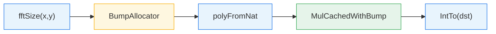
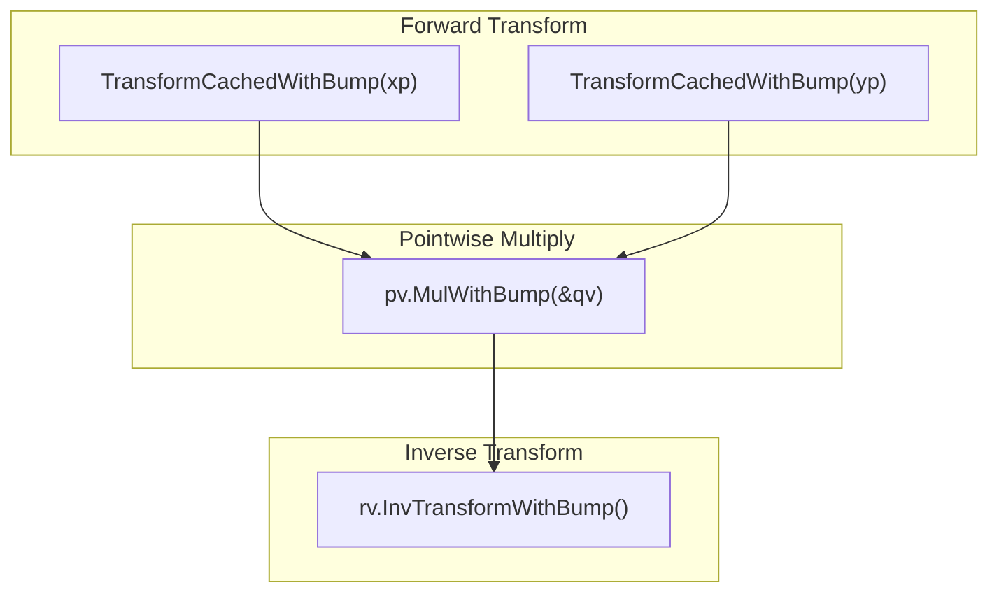
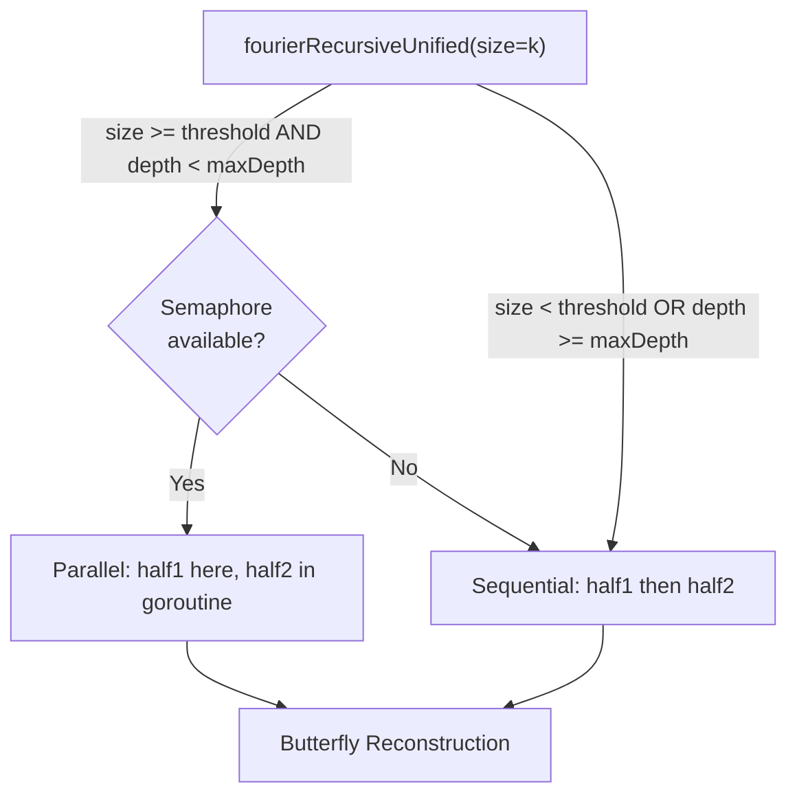
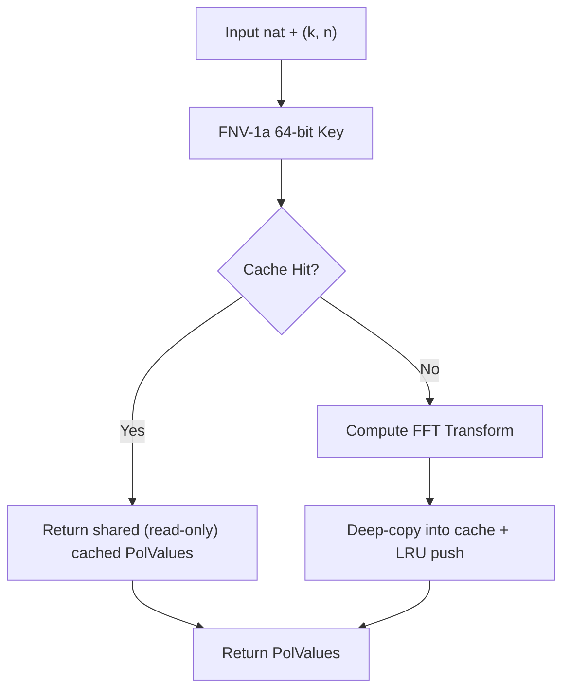
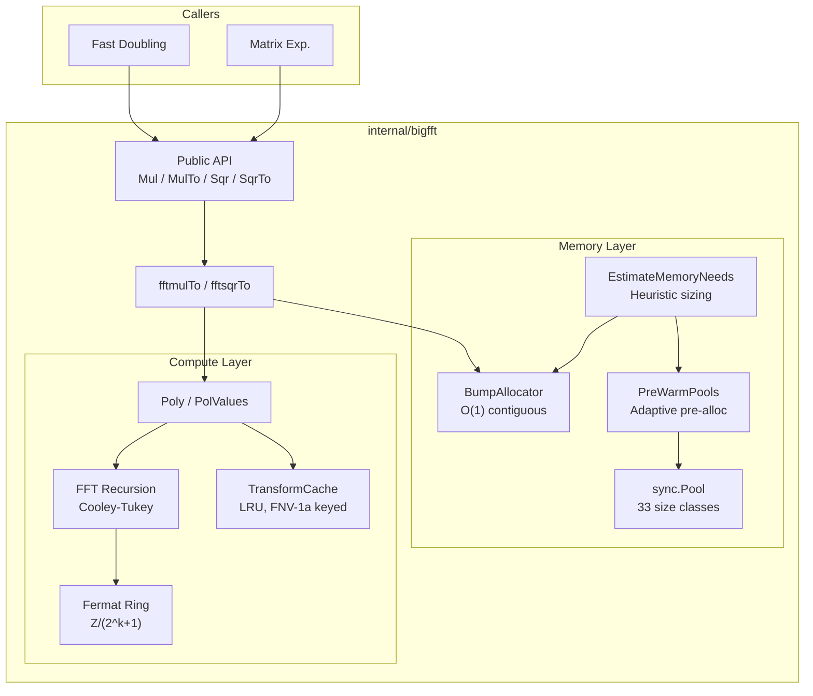

# BigFFT Subsystem: Implementation Internals

> Interactive architecture map: **[agbruneau.github.io/FibGo/dashboard/](https://agbruneau.github.io/FibGo/dashboard/)** (knowledge graph, 1128 nodes / 4782 edges / 9 layers / 12-step tour)

> **Scope**: Implementation architecture of `internal/bigfft`
> **Complexity**: O(n log n) integer multiplication via Schonhage-Strassen FFT
> **See also**: [FFT.md](FFT.md) for mathematical theory and 2-tier multiplication selection

## Overview

The `internal/bigfft` package implements **Schonhage-Strassen FFT multiplication** over
Fermat rings for arbitrarily large integers. It is the computational backbone of all
Fibonacci algorithms in this project once operand sizes exceed ~500,000 bits.

The subsystem's non-test source files (run `make stats` for the canonical, up-to-date
count) are organized around four concerns:

1. **Public API** -- panic-safe entry points for multiplication and squaring
2. **FFT core** -- polynomial decomposition, forward/inverse transforms, pointwise operations
3. **Fermat arithmetic** -- modular arithmetic in Z/(2^k+1) where multiplications reduce to shifts
4. **Memory management** -- four pool hierarchies, a bump allocator, pre-warming, and capacity estimation

---

## Public API

**File**: `internal/bigfft/fft.go`

```go
func Mul(x, y *big.Int) (res *big.Int, err error)
func MulTo(z, x, y *big.Int) (res *big.Int, err error)
func Sqr(x *big.Int) (res *big.Int, err error)
func SqrTo(z, x *big.Int) (res *big.Int, err error)
```

All four functions wrap their core logic in `defer/recover`, but the recovered value
is **not** unconditionally converted to an error. `fermatPanicToError`
(`internal/bigfft/fft.go:fermatPanicToError`) re-`panic`s the three internal
post-condition sentinels — `"len(z) > 2n+1"`, `"fermat.Mul: unexpected carry after normalization"`,
`"fermat.Sqr: unexpected carry after normalization"`, the three entries of
`fft.go:fermatPostConditionPanics` — so a genuine
bug in the modular reduction still crashes the caller by design (ADR-0002). Only
pre-condition panics (operand-size mismatches) and other unexpected panics become
returned errors.

**Threshold gating**: `Mul`/`MulTo` and `Sqr`/`SqrTo` compare the operand word count
against `fftThreshold` (default 1800 words, ~115 Kbits on 64-bit). Operands below the
threshold fall through to `math/big.Mul`, avoiding FFT overhead for small numbers.

**Squaring optimization**: `Sqr`/`SqrTo` only transform the input once, saving
approximately 33% of the FFT computation compared to `Mul`.

---

## Internal Data Flow

The heart of the package is `fftmulTo`, which orchestrates a complete FFT multiplication.

**File**: `internal/bigfft/fft_core.go`

```go
func fftmulTo(dst, x, y nat) (nat, error) {
    k, m := fftSize(x, y)
    wordLen := len(x) + len(y)
    ba := AcquireBumpAllocator(EstimateBumpCapacity(wordLen))
    defer ReleaseBumpAllocator(ba)
    xp := polyFromNat(x, k, m)
    yp := polyFromNat(y, k, m)
    rp, err := xp.MulCachedWithBump(&yp, ba)
    if err != nil {
        return nil, err
    }
    result := rp.IntTo(dst)
    rp.Release() // return pooled buffers after the result is copied
    return result, nil
}
```

### Pipeline Stages



| Stage | Responsibility |
|-------|---------------|
| `fftSize` | Select FFT length K=2^k and chunk size m from `fftSizeThreshold` table |
| `BumpAllocator` | Pre-allocate a contiguous word buffer for all temporaries |
| `polyFromNat` | Split the input `nat` into a polynomial of `ceil(len(x)/m)` chunks of m words (at most K) |
| `MulCachedWithBump` | Forward FFT, pointwise multiply, inverse FFT (with transform caching) |
| `IntTo` | Reassemble polynomial back into a single `nat` with carry propagation |

### Detailed Multiplication Pipeline

Within `MulCachedWithBump`, the following sequence executes:



1. **Forward transform** each polynomial into `PolValues` (evaluation at roots of unity)
2. **Pointwise multiply** the two sets of values in the Fermat ring
3. **Inverse transform** the product back to coefficient form

---

## FFT Size Selection

**File**: `internal/bigfft/fft.go`

The `fftSize` function determines optimal FFT parameters from a lookup table:

```go
var fftSizeThreshold = [...]int64{0, 0, 0,
    4<<10, 8<<10, 16<<10,            // k=3..5
    32<<10, 64<<10, 1<<18, 1<<20, 3<<20, // k=6..10
    8<<20, 30<<20, 100<<20, 300<<20, 600<<20,  // k=11..15
}
```

The FFT length K = 2^k is chosen so that `fftSizeThreshold[k]` exceeds the total
result bit-length. The chunk size m satisfies `m << k > len(x) + len(y)`, ensuring
the polynomial representation can hold the full product.

**Design principle**: K is approximately 2*sqrt(N) where N is the total bit-length
of the product. This balances the cost of the O(K log K) FFT against the O(m^2)
coefficient multiplications.

---

## Polynomial Representation

**File**: `internal/bigfft/fft_poly.go`

```go
type Poly struct {
    K uint   // 1<<K is the FFT length
    M int    // words per chunk: P(b^M) recovers the original number
    A []nat  // up to 1<<K coefficients, each M words

    pooledBacking []big.Word // backing to return to the word-slice pool on Release()
    pooledA       bool       // A itself came from the []nat pool
}
```

The two unexported fields carry the `Release()` contract: `Release()` returns
`pooledBacking` to the word-slice pool and, when `pooledA` is set, `A` to the
`[]nat` pool. They are left zero when the `Poly` was built outside the pools
(e.g. `polyFromNat`), which makes `Release()` a safe no-op there.

### Key Operations

| Function | Purpose |
|----------|---------|
| `polyFromNat(x, k, m)` | Slice a `nat` into a polynomial of m-word coefficients; the count is `ceil(len(x)/m)` (at least 1), i.e. **at most** 2^k |
| `IntTo(dst)` | Reassemble polynomial back to `nat` via carry-propagating addition |
| `Transform(n)` / `TransformWithBump(n, ba)` | Forward FFT: evaluate at K-th roots of unity |
| `InvTransform()` / `InvTransformWithBump(ba)` | Inverse FFT: reconstruct from point values |
| `MulCached(q)` / `MulCachedWithBump(q, ba)` | Full cached FFT multiply pipeline |
| `SqrCached()` / `SqrCachedWithBump(ba)` | Optimized squaring (single transform) |

### PolValues Type

```go
type PolValues struct {
    K      uint     // log2 of FFT length
    N      int      // coefficient word length
    Values []fermat // 1<<K evaluated points

    pooledBacking []big.Word // backing to return to the word-slice pool on Release()
    pooledValues  bool       // Values itself came from the []fermat pool
}
```

Same `Release()` contract as `Poly`. `pooledBacking` is deliberately left nil on
transform-cache hits (`TransformCache.getByKey`), so a caller that releases a
cache-shared `PolValues` cannot poison the pool.

`PolValues` represents a polynomial evaluated at K-th roots of unity. Pointwise
multiplication (`Mul`) and squaring (`Sqr`) operate on this type. The `Clone()`
method produces a deep copy for safe concurrent use.

---

## Fermat Ring Arithmetic

**File**: `internal/bigfft/fermat.go`

```go
type fermat nat  // []big.Word of length n+1, representing a number mod 2^(n*W)+1
```

A `fermat` of length w+1 represents a number in the ring **Z/(2^(w*W)+1)** where
W is the machine word size (64 bits). The last word is constrained to 0 or 1.

### Why Fermat Rings?

The key property: in Z/(2^k+1), powers of 2 are roots of unity. This means
multiplications by roots of unity in the FFT become **bit shifts** rather than
full multiplications, dramatically reducing cost.

### Operations

| Method | Description |
|--------|-------------|
| `Shift(x, k)` | Compute (x << k) mod (2^n+1) via word-aligned copy and borrow |
| `ShiftHalf(x, k, tmp)` | Shift by k/2 bits using sqrt(2) = 2^(3n/4) - 2^(n/4) identity |
| `Add(x, y)` | Modular addition with normalization |
| `Sub(x, y)` | Modular subtraction with borrow handling |
| `Mul(x, y)` | Full modular multiplication (uses `basicMul` below threshold) |
| `norm()` | Normalize: ensure last word is 0 or 1 |

The `Mul` method switches between `basicMul` (schoolbook, for operands below
`smallMulThreshold = 30` words) and `big.Int.Mul` for larger operands, with subsequent
modular reduction. The `Sqr` method provides an optimized squaring path that similarly
dispatches between `basicSqr` and `big.Int.Mul` based on operand size.

The `smallMulThreshold` (30 words, ~1,920 bits on 64-bit) was determined empirically.
Below this threshold, the schoolbook `basicMul`/`basicSqr` functions avoid `big.Int`
allocation overhead and are faster for the small operands common in early FFT recursion levels.

---

## FFT Transform

**Files**: `internal/bigfft/fft_core.go`, `internal/bigfft/fft_recursion.go`

### Entry Points

| Function | Description |
|----------|-------------|
| `fourier(dst, src, backward, n, k)` | Top-level FFT; acquires its `tmp`/`tmp2` temporaries via `acquireFermat`/`releaseFermat` |
| `fourierWithBump(dst, src, backward, n, k, ba)` | FFT using bump allocator (best cache locality) |

All entry points delegate to the recursive core.

### Recursive Decomposition

**File**: `internal/bigfft/fft_recursion.go`

```go
func fourierRecursiveUnified(dst, src []fermat, backward bool, n int,
    k, size, depth uint, tmp, tmp2 fermat, alloc tempAllocator) error
```

The FFT uses a **Cooley-Tukey radix-2 decimation-in-frequency** decomposition:

1. **Base cases**: size=0 (copy) and size=1 (butterfly: add/sub)
2. **Recursive split**: divide into two halves, recurse on each
3. **Reconstruct**: apply twiddle factors via `ShiftHalf` and butterfly operations

### Parallelism Control

FFT parallelism is controlled by two **runtime-configurable** variables (default values shown):

Both are unexported `atomic.Uint64` package variables seeded in `init()`; the
exported surface is the getter pair plus `GetFFTParallelismConfig` /
`SetFFTParallelismConfig`.

| Variable | Accessor | Default | Purpose |
|----------|----------|---------|---------|
| `parallelFFTRecursionThreshold` | `GetParallelFFTRecursionThreshold()` | 4 | Minimum k for parallel recursion |
| `maxParallelFFTDepth` | `GetMaxParallelFFTDepth()` | 3 | Maximum parallel recursion depth |

These can be adjusted at runtime via the `FFTParallelismConfig` struct:

```go
// Read current configuration
config := bigfft.GetFFTParallelismConfig()

// Update configuration
bigfft.SetFFTParallelismConfig(bigfft.FFTParallelismConfig{
    RecursionThreshold: 5,  // Increase minimum for parallel recursion
    MaxDepth:           2,  // Reduce parallel depth
})
```

Parallelism uses a semaphore channel sized to `runtime.NumCPU()`. When a goroutine
slot is available, the second half of the recursion runs in a new goroutine with
pool-allocated temporary buffers (avoiding races on the non-thread-safe bump allocator).
If no slot is available, execution falls through to sequential.



---

## Memory Management

### Pool System

**File**: `internal/bigfft/pool.go`

Four `sync.Pool` hierarchies with geometrically-spaced size classes minimize
allocation overhead and fragmentation:

| Pool | Size Classes (elements) | Count | Use Case |
|------|------------------------|-------|----------|
| `wordSlicePools` | 64, 256, 1K, 4K, 16K, 64K, 256K, 1M, 4M, 16M | 10 | General `big.Word` buffers |
| `fermatPools` | 32, 128, 512, 2K, 8K, 32K, 128K, 512K, 2M | 9 | Fermat number buffers |
| `natSlicePools` | 8, 32, 128, 512, 2K, 8K, 32K | 7 | `nat` slice buffers |
| `fermatSlicePools` | 8, 32, 128, 512, 2K, 8K, 32K | 7 | `fermat` slice buffers |

**Total**: 33 size classes across 4 pool types.

**Pattern**: Each pool type follows the same acquire/release protocol:

```go
slice := acquireWordSlice(size)
defer releaseWordSlice(slice)
```

**Size class selection**: `getWordSlicePoolIndex(size)` returns the index of the
smallest size class >= the requested size. If no class is large enough, allocation
bypasses the pool entirely (`make()` direct).

**Clearing**: `acquireWordSlice` zeroes the slice with Go's `clear()` builtin before
returning it. The companion `acquireWordSliceUnsafe` deliberately skips the clear and
is reserved for callers that immediately overwrite every element (e.g. via `copy`).

**Release safety**: all four release functions (`releaseWordSlice`,
`releaseFermat`, `releaseNatSlice`, `releaseFermatSlice` in
`internal/bigfft/pool.go`) check that the slice capacity matches a
known size class before returning to the pool; mismatched or directly-allocated
slices are left for the garbage collector. Only `releaseWordSlice` *counts* those
misses — the single `wordSlicePoolMissCount.Add(1)` lives in `pool.go:releaseWordSlice`. The
counter is readable through the exported `WordSlicePoolMissCount()` and a steadily
growing value signals `[]big.Word` pool churn specifically (a caller reshaped a
pooled slice before releasing it); the other three sinks are not instrumented.

### Bump Allocator

**File**: `internal/bigfft/bump.go`

```go
type BumpAllocator struct {
    buffer []big.Word
    offset int
}
```

The bump allocator provides the fastest possible temporary allocation for FFT
operations:

| Property | Benefit |
|----------|---------|
| O(1) allocation | Just `offset += size` |
| Zero fragmentation | Contiguous memory block |
| Excellent cache locality | Sequential access pattern matches FFT data flow |
| Single release | All allocations freed by resetting offset |
| NOT thread-safe | One per goroutine, no synchronization overhead |

> **Note**: The `CalculationArena` (`internal/fibonacci/memory/arena.go`) complements this bump allocator. The bump allocator covers FFT temporaries, while the arena covers the `big.Int` backing arrays of the calculation state (`CalculationState`). The two systems coexist without interference.

**Lifecycle**: Managed via `sync.Pool`:

```go
ba := AcquireBumpAllocator(EstimateBumpCapacity(wordLen))
defer ReleaseBumpAllocator(ba)
```

**Fallback**: If an allocation exceeds remaining capacity, the allocator falls back
to `make()` transparently. This guarantees correctness even if the capacity estimate
was too small.

**Typed allocation methods**:

| Method | Description |
|--------|-------------|
| `Alloc(n)` | Allocate n zeroed words |
| `allocUnsafe(n)` | Allocate n words without zeroing (caller overwrites) — package-internal |
| `allocFermat(n)` | Allocate a fermat of n+1 words — package-internal |
| `allocFermatSlice(count, n)` | Allocate `count` contiguous fermat buffers — package-internal |
| `Reset()` | Invalidate all allocations, reuse from start |

### Allocator Abstraction

**File**: `internal/bigfft/allocator.go`

The `tempAllocator` interface (unexported) decouples the FFT algorithm from its allocation strategy:

```go
type tempAllocator interface {
    allocFermatTemp(n int) (fermat, func())
    allocFermatSlice(count, n int) ([]fermat, []big.Word, func())
}
```

Two implementations:

| Type | Strategy | Cleanup |
|------|----------|---------|
| `poolAllocator` | `sync.Pool` acquire/release | Returns buffers to pool |
| `*BumpAllocator` | Bump allocation from contiguous buffer (implements `tempAllocator` directly via `allocFermatTemp`/`allocFermatSlice`) | No-op (bulk release via `ReleaseBumpAllocator`) |

This abstraction allows the same FFT recursion code (`fourierRecursiveUnified`) to
work with either allocator without duplication.

### Capacity Estimation

**File**: `internal/bigfft/bump.go`

```go
func EstimateBumpCapacity(wordLen int) int
```

Heuristic formula:

```
K = 2^k (from fftSizeThreshold lookup)
n = wordLen / K + 1
transformTemp = K * (n+1)
multiplyTemp  = 8 * n
total = (2*transformTemp + multiplyTemp) * 11 / 10   // 10% safety margin (reduced from 20% per profiling)
```

### Pool Pre-Warming

**File**: `internal/bigfft/pool_warming.go`

```go
func PreWarmPools(n uint64)
func EnsurePoolsWarmed(maxN uint64)
```

Pre-warming pre-allocates buffers in each pool hierarchy based on `EstimateMemoryNeeds(n)`.
The number of buffers scales with the target Fibonacci index:

| N Range | Buffers Pre-allocated |
|---------|----------------------|
| < 100,000 | 2 |
| 100K -- 1M | 4 |
| 1M -- 10M | 5 |
| >= 10M | 6 |

`EnsurePoolsWarmed` uses an `atomic.Bool` compare-and-swap to guarantee one-time
initialization, safe for concurrent callers. It is invoked from
`FibCalculator.CalculateWithObservers()` before the core calculation begins.

### Memory Estimation

**File**: `internal/bigfft/memory_est.go`

```go
func EstimateMemoryNeeds(n uint64) MemoryEstimate
```

Returns estimated maximum sizes for each pool type based on the bit-length of F(n),
computed from the approximation `bitLen(F(n)) ~ n * 0.69424`.

---

## FFT Transform Caching

**File**: `internal/bigfft/fft_cache.go`

```go
type TransformCache struct {
    mu        sync.RWMutex
    config    TransformCacheConfig
    entries   map[uint64]*list.Element
    lru       *list.List
    hits, misses, evictions, accesses atomic.Uint64
    // atomic.Pointer so setCacheLogger does not race with the hot-path read
    // in logPeriodicStats (A2-02).
    logger    atomic.Pointer[zerolog.Logger]
}
```

### Design

| Property | Value |
|----------|-------|
| Thread safety | `sync.RWMutex` for concurrent reads, exclusive writes |
| Key generation | FNV-1a 64-bit hash of input data + FFT parameters (k, n) |
| Eviction policy | LRU (least recently used) |
| Default max entries | 256 |
| Minimum operand size | 100,000 bits (~12 KB) |

### Why Cache?

When the same big integer is transformed more than once, the cached forward FFT
transform avoids recomputing it. The repo carries **no measurement of a speedup**
from this on any path — the only benchmark artifact tracked is
`docs/audits/bench-baseline.txt`, which measures whole calculators, and the one
cache-specific benchmark that exists (`BenchmarkCacheImpact`) has no recorded
result in the repo. Treat the saving as "one forward transform per hit", not as a
percentage.

> **Scope (A3-01)**: The cache is only consulted by the `bigfft.Mul`/`MulTo`/`Sqr`/`SqrTo`
> entry points (via `fftmulTo`/`fftsqrTo` → `MulCachedWithBump`/`SqrCachedWithBump`).
> The default Fast Doubling calculator's per-step FFT path (`executeDoublingStepFFT`
> in `internal/fibonacci/fft.go`, used by both `AdaptiveStrategy` and `FFTOnlyStrategy`)
> calls the **non-cached** `TransformWithBump` and therefore does **not** benefit from
> this cache. It applies to operations routed through `smartMultiply`/`smartSquare`
> (which call `bigfft.MulTo`/`SqrTo`) and to Strassen matrix multiplication.

### Cached Variants

| Function | Description |
|----------|-------------|
| `TransformCached(n)` | Forward FFT with cache lookup/store |
| `TransformCachedWithBump(n, ba)` | Same, using bump allocator |
| `MulCached(q)` / `MulCachedWithBump(q, ba)` | Full multiply with cached transforms |
| `SqrCached()` / `SqrCachedWithBump(ba)` | Squaring with cached transform |

### Statistics

```go
type CacheStats struct {
    Hits, Misses, Evictions uint64
    Size    int
    HitRate float64
}
```

Available via `GetTransformCache().Stats()`.

### Cache Flow



---

## Low-Level Arithmetic

Word-level vector arithmetic is delegated to `math/big`'s internal assembly via
`go:linkname`; bigfft performs no runtime CPU-feature detection of its own.

### Vector Arithmetic

**File**: `internal/bigfft/arith.go`

A single portable file (no build tags) exports three functions (`AddVV`, `SubVV`,
`AddMulVVW`) that wrap the `go:linkname` bindings declared in `arith_decl.go`.
The exported wrappers serve as test-only oracles for `arith_test.go`; production
code calls the lowercase linkname bindings directly. All platforms use the same
`math/big` internals, which Go's standard library already optimizes with
platform-appropriate assembly.

### go:linkname Declarations

**File**: `internal/bigfft/arith_decl.go`

Six `go:linkname` directives bind directly to `math/big` internal functions:

```go
//go:linkname addVV math/big.addVV
//go:linkname subVV math/big.subVV
//go:linkname addVW math/big.addVW
//go:linkname subVW math/big.subVW
//go:linkname shlVU math/big.shlVU
//go:linkname addMulVVW math/big.addMulVVW
```

---

## Package Structure

| File | Responsibility |
|------|---------------|
| `fft.go` | Public API: `Mul`, `MulTo`, `Sqr`, `SqrTo`; FFT size selection |
| `fft_core.go` | Core FFT: `fftmulTo`, `fftsqrTo`, `fourier`, `fourierWithBump` |
| `fft_recursion.go` | Recursive FFT decomposition with runtime-configurable parallelism (`FFTParallelismConfig`) |
| `fft_poly.go` | `Poly` and `PolValues` types; transform, multiply, inverse |
| `fft_cache.go` | `TransformCache`: thread-safe LRU for FFT transforms |
| `fermat.go` | Fermat ring arithmetic: Z/(2^k+1) |
| `pool.go` | `sync.Pool` hierarchies (4 types, 33 size classes) |
| `pool_warming.go` | `PreWarmPools`, `EnsurePoolsWarmed` |
| `bump.go` | `BumpAllocator`: O(1) bump allocation with capacity estimation |
| `allocator.go` | `tempAllocator` interface, `poolAllocator` (`*BumpAllocator` implements it directly, see `bump.go`) |
| `memory_est.go` | `EstimateMemoryNeeds` for pool pre-warming |
| `arith.go` | Portable vector arithmetic wrappers (test-only oracles) delegating to `math/big` internals |
| `arith_decl.go` | Architecture-independent `go:linkname` declarations to `math/big` |
| `doc.go` | Package documentation |

---

## Memory Architecture Diagram



---

## Integration Points

### Called From

Seven production files outside `internal/bigfft` import it (verified 2026-08-07 with
`grep -rn "bigfft\." internal/ cmd/ --include=*.go | grep -v _test.go`):

- `internal/fibonacci/fft.go` -- `smartMultiply()` dispatches to `bigfft.MulTo` (and `smartSquare()` to `bigfft.SqrTo`), or both fall back to `math/big`; `executeDoublingStepFFT` also uses `PolyFromInt`, `TransformWithBump`, `GetFFTParams`, `ValueSize`, `Acquire`/`ReleaseBumpAllocator`, `EstimateBumpCapacity`
- `internal/fibonacci/calculator.go` -- `FibCalculator.CalculateWithObservers()` calls `bigfft.EnsurePoolsWarmed()` before calculation
- `internal/fibonacci/strategy.go` -- `FFTOnlyStrategy.Multiply`/`Square` call `bigfft.MulTo`/`SqrTo` directly (`strategy.go:FFTOnlyStrategy.Multiply`, `strategy.go:FFTOnlyStrategy.Square`)
- `internal/fibonacci/options.go` -- `configureFFTCache` calls `DefaultTransformCacheConfig` + `SetTransformCacheConfig` (`options.go:configureFFTCache`)
- `internal/fibonacci/cache_strategy_bigfft.go` -- `Sample` calls `GetTransformCache` + `SetTransformCacheConfig` (`cache_strategy_bigfft.go:bigfftCacheStrategy.Sample`)
- `internal/fibonacci/fastdoubling.go` -- holds a `*bigfft.BumpAllocator` on the state; `EstimateBumpCapacity`, `ReleaseBumpAllocator`
- `internal/calibration/microbench.go` -- `bigfft.Mul` in the micro-benchmark (`microbench.go:multiplyTest`)

### Configuration

FFT behavior is influenced by these `fibonacci.Options` fields:

| Option | Default | Effect |
|--------|---------|--------|
| `FFTThreshold` | 500,000 bits | Bit-length above which `smartMultiply` routes to `bigfft.MulTo` |

The internal `fftThreshold` (1,800 words) within `bigfft` itself controls whether
`Mul`/`Sqr` use FFT or fall through to `math/big`; this is separate from the
strategy-level threshold.

---

## Cross-References

- [FFT.md](FFT.md) -- Mathematical theory, convolution theorem, 2-tier multiplication selection
- [FAST_DOUBLING.md](FAST_DOUBLING.md) -- Primary consumer of the BigFFT subsystem
- [MATRIX.md](MATRIX.md) -- Secondary consumer via Strassen matrix multiplication
- [../PERFORMANCE.md](../PERFORMANCE.md) -- Benchmark data and threshold tuning results

## References

1. Schonhage, A., & Strassen, V. (1971). "Schnelle Multiplikation grosser Zahlen". *Computing*, 7(3-4), 281--292.
2. Crandall, R., & Pomerance, C. (2005). *Prime Numbers: A Computational Perspective*. Chapter 9: Fast Algorithms for Large-Integer Arithmetic.
3. [GMP Library -- FFT Multiplication](https://gmplib.org/manual/FFT-Multiplication)
4. Cooley, J. W., & Tukey, J. W. (1965). "An algorithm for the machine calculation of complex Fourier series". *Mathematics of Computation*, 19(90), 297--301.
