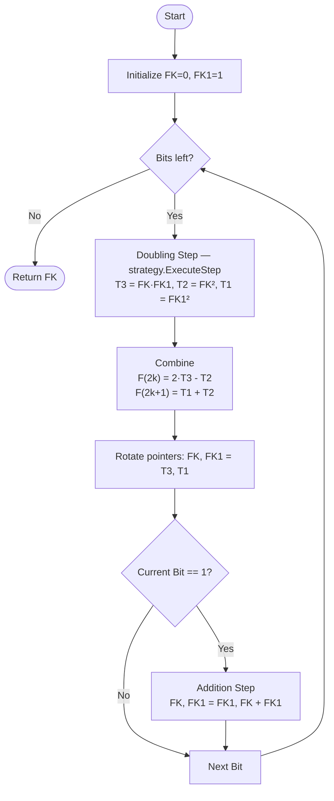

# Fast Doubling Algorithm

> Interactive architecture map: **[agbruneau.github.io/Fibonacci/dashboard/](https://agbruneau.github.io/Fibonacci/dashboard/)** (knowledge graph, 1128 nodes / 4782 edges / 9 layers / 12-step tour, regenerated 2026-07-06 at commit 6e3ec29)

> **Complexity**: O(log n) arithmetic operations
> **Actual Complexity**: O(log n * M(n)) where M(n) is the multiplication cost

## Introduction

The **Fast Doubling** algorithm is one of the most efficient methods for calculating Fibonacci numbers. It exploits the mathematical properties of the sequence to reduce the number of operations to O(log n).

## Mathematical Foundation

### Matrix Form of Fibonacci

The Fibonacci sequence can be expressed in matrix form:

```
[ F(n+1)  F(n)   ]   [ 1  1 ]^n
[                ] = [      ]
[ F(n)    F(n-1) ]   [ 1  0 ]
```

This relation is known as the **Fibonacci Q matrix**.

### Derivation of Doubling Formulae

By squaring the matrix for F(k), we obtain the matrix for F(2k):

```
[ F(k+1)  F(k)  ]^2   [ F(k+1)^2 + F(k)^2        F(k+1)F(k) + F(k)F(k-1) ]
[               ]    = [                                                     ]
[ F(k)    F(k-1)]     [ F(k)F(k+1) + F(k-1)F(k)   F(k)^2 + F(k-1)^2       ]
```

Which corresponds to:

```
[ F(2k+1)  F(2k)   ]
[                  ]
[ F(2k)    F(2k-1) ]
```

From this equality, we extract the **Fast Doubling identities**:

```
F(2k)   = F(k) * [2*F(k+1) - F(k)]
F(2k+1) = F(k+1)^2 + F(k)^2
```

> **Implementation note**: The codebase uses the equivalent reformulation `F(2k) = 2·F(k)·F(k+1) - F(k)²` which eliminates a temporary variable. Both are algebraically identical (expand `F(k)·(2F(k+1) - F(k))` to verify).

### Formal Proof by Induction

We prove the Fast Doubling identities using mathematical induction on the matrix power Q^n.

**Definitions**:
$$Q = \begin{pmatrix} 1 & 1 \\ 1 & 0 \end{pmatrix}, \quad Q^n = \begin{pmatrix} F_{n+1} & F_n \\ F_n & F_{n-1} \end{pmatrix}$$

**Goal**: Derive F(2n) and F(2n+1) in terms of F(n) and F(n+1).

**Step 1: Matrix Squaring**
From the property Q^(2n) = (Q^n)^2:
$$ \begin{pmatrix} F_{2n+1} & F_{2n} \\ F_{2n} & F_{2n-1} \end{pmatrix} = \begin{pmatrix} F_{n+1} & F_n \\ F_n & F_{n-1} \end{pmatrix}^2 $$

**Step 2: Expansion**
Performing the matrix multiplication on the RHS:
$$ \begin{pmatrix} F_{n+1} & F_n \\ F_n & F_{n-1} \end{pmatrix} \times \begin{pmatrix} F_{n+1} & F_n \\ F_n & F_{n-1} \end{pmatrix} = \begin{pmatrix} F_{n+1}^2 + F_n^2 & F_{n+1}F_n + F_nF_{n-1} \\ F_nF_{n+1} + F_{n-1}F_n & F_n^2 + F_{n-1}^2 \end{pmatrix} $$

**Step 3: Equating Terms**
By comparing the elements of the matrices:

1.  **Top-left element (F(2n+1))**:
    $$ F_{2n+1} = F_{n+1}^2 + F_n^2 $$
    *(This is the second Fast Doubling identity)*

2.  **Top-right element (F(2n))**:
    $$ F_{2n} = F_n(F_{n+1} + F_{n-1}) $$
    Substituting F(n-1) = F(n+1) - F(n):
    $$ F_{2n} = F_n(F_{n+1} + F_{n+1} - F_n) $$
    $$ F_{2n} = F_n(2F_{n+1} - F_n) $$
    *(This is the first Fast Doubling identity)*

**Conclusion**:
The identities hold for all n >= 1 by the properties of matrix exponentiation.

## Visualization

The algorithm iterates through the bits of N from MSB to LSB. The diagram below
follows `DoublingFramework.ExecuteDoublingLoop`
(`internal/fibonacci/doubling_framework.go`) step for step, including the
expanded form of the F(2k) identity that the loop actually evaluates.



## Algorithm

### Pseudocode

```
FastDoubling(n):
    if n == 0:
        return (0, 1)  // (F(0), F(1))

    (a, b) = FastDoubling(n // 2)  // (F(k), F(k+1)) where k = n/2

    c = a * (2*b - a)      // F(2k)
    d = a^2 + b^2          // F(2k+1)

    if n is even:
        return (c, d)   // (F(n), F(n+1))
    else:
        return (d, c+d) // (F(n), F(n+1))
```

### Go Implementation (Simplified)

```go
func FastDoublingSimple(n uint64) (*big.Int, *big.Int) {
    if n == 0 {
        return big.NewInt(0), big.NewInt(1)
    }

    a, b := FastDoublingSimple(n / 2)

    // c = a * (2b - a) = F(2k)
    c := new(big.Int).Lsh(b, 1)     // 2b
    c.Sub(c, a)                      // 2b - a
    c.Mul(c, a)                      // a * (2b - a)

    // d = a^2 + b^2 = F(2k+1)
    a2 := new(big.Int).Mul(a, a)
    b2 := new(big.Int).Mul(b, b)
    d := new(big.Int).Add(a2, b2)

    if n%2 == 0 {
        return c, d
    }
    return d, new(big.Int).Add(c, d)
}
```

## Implemented Optimizations

### 1. DoublingFramework with Strategy Pattern

The recursive version is converted to an iterative `DoublingFramework` that accepts a pluggable `DoublingStepExecutor`:

```go
type DoublingFramework struct {
    strategy         DoublingStepExecutor
    dynamicThreshold *threshold.DynamicThresholdManager
    CacheStrategy    CacheStrategy // optional hook tuning the transform cache from inside the loop
}

// Create framework with a strategy
framework := NewDoublingFramework(strategy)

// Execute the main loop
result, err := framework.ExecuteDoublingLoop(ctx, reporter, n, opts, state, inParallel)
```

The `FastDoublingCalculator` uses an `AdaptiveStrategy` that selects between standard `math/big` and FFT multiplication based on operand size. The `FFTBasedCalculator` uses an `FFTOnlyStrategy` that forces FFT for all operations.

### 2. Zero-Allocation with sync.Pool

Calculation states are recycled via a `sync.Pool`. The `CalculationState` type is public; besides five `*big.Int` temporaries it owns its calculation arena and its FFT scratch allocator (nine fields total):

```go
type CalculationState struct {
    FK, FK1, T1, T2, T3 *big.Int

    arena         *memory.CalculationArena // state-bound arena (see "Calculation Arena" below)
    arenaCapWords int                      // cached arena capacity in words

    bump            *bigfft.BumpAllocator // FFT forward-transform scratch, acquired once per calculation (F-012)
    fftBumpCapWords int                   // bump capacity targeted at the final doubling step
}

// Acquire a state from the pool sized for n (resets FK=0, FK1=1)
s := AcquireStateForN(n)
raw, err := framework.ExecuteDoublingLoop(ctx, reporter, n, opts, s, false)
if err != nil {
    ReleaseState(s)          // error path only
    return nil, err
}
return ReleaseStateWithResult(s, raw), nil  // success path: deep-copies out
```

`defer ReleaseState(state)` is **not** the production pattern and no caller uses
it. The two releases are not interchangeable: `ReleaseState` is the error path,
`ReleaseStateWithResult` is the success path and deep-copies the result out of the
arena before the state goes back to the pool — deferring the former would return
the arena while the result still aliases it. See
`internal/fibonacci/fft_based.go:FFTBasedCalculator.CalculateCore` for the only
production shape — `AcquireStateForN`, then either `ReleaseState` on the error
path or `ReleaseStateWithResult` on success.

Objects exceeding `MaxPooledBitLen` (50M bits) are left for GC rather than returned to the pool.

### 3. Calculation Arena (state-bound)

For N > 1,000, a `CalculationArena` pre-allocates a single contiguous block for all `big.Int` backing arrays. This reduces GC pressure and improves cache locality. The arena is owned by the pooled `CalculationState`, so the same `[]big.Word` block is reused across calls when the previous tenancy was wide enough — only `Reset()` runs in the hot path:

```go
s := AcquireStateForN(n)         // reuses or grows the bound arena
// ... Fast Doubling loop fills s.FK / s.FK1 / s.T1..3 from the arena
result := ReleaseStateWithResult(s, s.FK)  // deep-copies result OUT of arena, resets, returns to pool
```

If the arena is exhausted, allocation falls back to the standard heap. Past `maxArenaPoolWords` (~50M words / ~400 MB), the arena is dropped rather than pooled. A "steal `s.FK`" zero-copy trick is incompatible with arena reuse: stealing the slice would leave the released result aliasing pooled memory that the next tenant's `Reset()` overwrites. Instead, `ReleaseStateWithResult` performs a single deep-copy of the result out of the arena: one linear pass, `~850 KB` for F(10M). Its share of total runtime is not measured by any artifact in this repo and is therefore not claimed here.

Since the 2026-06 audit loop, the default `FastDoublingCalculator` layers two refinements on top of the pool (the public `AcquireStateForN`/`ReleaseStateWithResult` pair above remains the mechanism used by `FFTBasedCalculator`):

- **GC-immune cache slot** (commit `fa13bfd`) — each calculator instance keeps the last released state in a single slot (`cachedState`, an `atomic.Pointer[CalculationState]`). The GC-disable pattern of large calculations (`memory.GCController`) triggers a collection after every call, and that collection flushes `sync.Pool`: the pool alone never retained the arena across calls (arena recreation was ~46 % of all allocations at F(10M)). The slot survives those collections. It is bounded by `maxCachedArenaWords` (4M words, ~32 MB; larger arenas stay pool-only), and every release still goes through the single teardown path `finalizeStateReleaseTo` (order: `checkLimit` → `clearStateAliases` → sink).
- **Per-calculation FFT bump allocator** (commit `7999c39`, F-012) — the forward-transform `BumpAllocator` is acquired once per calculation, sized for the final doubling step (`fftBumpCapWords`), carried by the state, and only `Reset()` between steps. Its retention follows the arena's anti-bloat drop policy.

Measured 2026-06-10 for the two changes combined (see [`CHANGELOG.md`](../../CHANGELOG.md)): FastDoubling/10M 33.30 ms → 28.20 ms, geomean sec/op −12.0 %, B/op at 10M roughly −70 %.

### 4. Parallel Multiplication via Strategy

The `DoublingStepExecutor.ExecuteStep` method performs the three multiplications required for a doubling step. The strategy does **not** decide whether to parallelize: `DoublingFramework.ExecuteDoublingLoop` (`doubling_framework.go`) calls `shouldParallelizeMultiplicationCached(opts, fkBitLen, fk1BitLen)` and passes the verdict in as `inParallel`. That decision reads three thresholds, not just `ParallelThreshold` — when the operand exceeds `FFTThreshold`, parallelism is suppressed unless it also exceeds `ParallelFFTThreshold` (`fastdoubling.go`):

```go
// Narrow interface for basic operations
type Multiplier interface {
    Multiply(z, x, y *big.Int, opts Options) (*big.Int, error)
    Square(z, x *big.Int, opts Options) (*big.Int, error)
    Name() string
}

// Wide interface with optimized doubling step
type DoublingStepExecutor interface {
    Multiplier
    ExecuteStep(ctx context.Context, s *CalculationState, opts Options, inParallel bool) error
}
```

Parallelism considerations:
- **Activation threshold**: `ParallelThreshold` (default: 4096 bits)
- **Disabled with FFT**: FFT already saturates CPU cores
- **Re-enabled for very large numbers**: Above `ParallelFFTThreshold` (5,000,000 bits)

### 5. 2-Tier Adaptive Multiplication

The `smartMultiply` function (`internal/fibonacci/fft.go`) selects the
multiplication algorithm from the operand sizes. Verbatim, minus the comments:

```go
func smartMultiply(z, x, y *big.Int, fftThreshold int) (*big.Int, error) {
    if z == nil {
        z = new(big.Int)
    }

    bx := x.BitLen()
    by := y.BitLen()

    // Tier 1: FFT Multiplication for very large operands.
    if fftThreshold > 0 && bx > fftThreshold && by > fftThreshold {
        return bigfft.MulTo(z, x, y)
    }

    // Tier 2: math/big Multiplication (uses optimized algorithms internally)
    return z.Mul(x, y), nil
}
```

The `&&` (BOTH operands above the threshold) is deliberate: the source comment
records it as a correctness-axis choice, `math/big.Mul` staying exact for
asymmetric operands, with a `max(bx, by)` criterion filed as a separate
performance question (A1-07). `smartSquare` is the one-operand twin and gates on
`bx > fftThreshold` alone.

## Complexity Analysis

### Number of Operations

At each iteration of the main loop:
- 1 left shift (O(n) bits)
- 1 subtraction (O(n) bits)
- 3 large integer multiplications
- 1 addition (O(n) bits)
- Potentially 1 additional addition (if bit = 1)

Number of iterations: `bits.Len64(n)` = ⌊log2 n⌋ + 1 (`doubling_framework.go`,
`numBits := bits.Len64(n)`; the loop runs `i` from `numBits-1` down to `0`).

### Multiplication Cost

The cost of each multiplication depends on the operand size:
- F(n) has approximately n * log2(phi) ~ 0.694 * n bits
- Standard: O(n^2)
- Karatsuba: O(n^1.585)
- FFT: O(n log n)

### Total Complexity

- **With standard math/big**: O(log n * n^2)
- **With Karatsuba**: O(log n * n^1.585)
- **With FFT**: O(log n * n log n)

## Comparison with Other Methods

| Method | Complexity | Multiplications/iteration | Advantage |
|--------|------------|---------------------------|-----------|
| Fast Doubling | O(log n * M(n)) | 3 | Fewest multiplications |
| Matrix Exp. | O(log n * M(n)) | 4 to 12 | More intuitive |
| Naive recursion | O(phi^n) | 0 | Simple but impractical |
| Iteration | O(n) | 0 | Simple, slow for large n |

Matrix Exp. per-iteration count, read off `MatrixFramework.ExecuteMatrixLoop`
(`matrix_framework.go`): every iteration but the last does one symmetric squaring
(4 multiplications, `squareSymmetricMatrix`), and an iteration whose exponent bit
is set adds one matrix multiplication — 7 with Strassen-Winograd, 8 classic. So
4 when the bit is clear, 11 or 12 when it is set. The two calculators are only
measured against each other at N=1M and N=10M
(`docs/audits/bench-baseline.txt`); see [COMPARISON.md](COMPARISON.md).

## Usage

### Go API

```go
factory := fibonacci.NewDefaultFactory()
calc, _ := factory.Get("fast")
result, _ := calc.Calculate(ctx, progressChan, 0, n, fibonacci.Options{
    ParallelThreshold: 4096,
    FFTThreshold:      500_000,
})
```

### Benchmarks

```bash
# Run Fast Doubling benchmarks (sub-benchmarks of BenchmarkFibonacci)
go test -bench='BenchmarkFibonacci/FastDoubling' -benchmem -run='^$' ./internal/fibonacci/

# Compare with other algorithms
go test -bench='BenchmarkFibonacci/(FastDoubling|MatrixExp|FFTBased)' -benchmem -run='^$' ./internal/fibonacci/

# benchstat-comparable run against docs/audits/bench-baseline.txt: reuse the
# baseline's own flags and write elsewhere, then compare
go test -bench='BenchmarkFibonacci/(FastDoubling|MatrixExp|FFTBased)' \
    -benchmem -run='^$' -count=5 -benchtime=1x ./internal/fibonacci/ > new.txt
benchstat docs/audits/bench-baseline.txt new.txt
```

`make bench-baseline` is **not** the comparison command: it *overwrites*
`docs/audits/bench-baseline.txt` with a fresh run, destroying the reference. Run
it only when deliberately refreshing the baseline — see
[`../TESTING.md`](../TESTING.md#benchmark-testing).

## References

1. Knuth, D. E. (1997). *The Art of Computer Programming, Volume 2: Seminumerical Algorithms*. Section 4.6.3.
2. [Fast Fibonacci algorithms](https://www.nayuki.io/page/fast-fibonacci-algorithms) - Nayuki
3. [Project Nayuki - Fast Doubling](https://www.nayuki.io/res/fast-fibonacci-algorithms/FastFibonacci.java)
