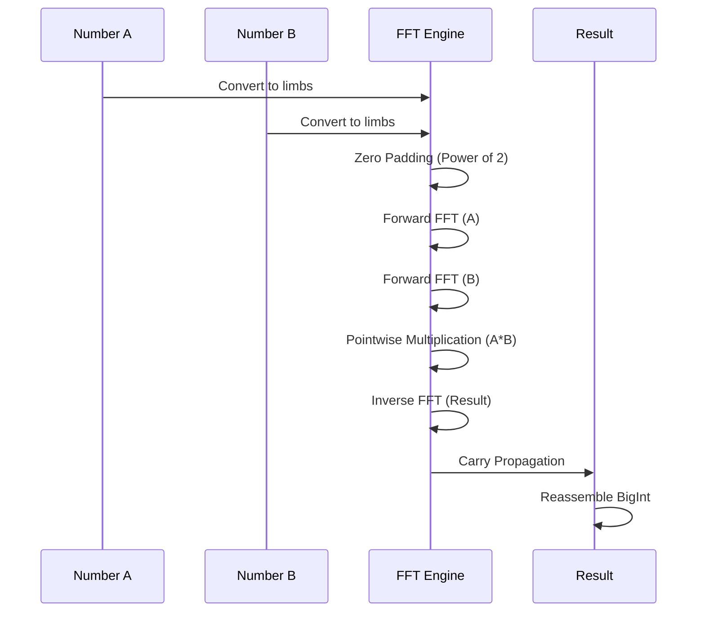
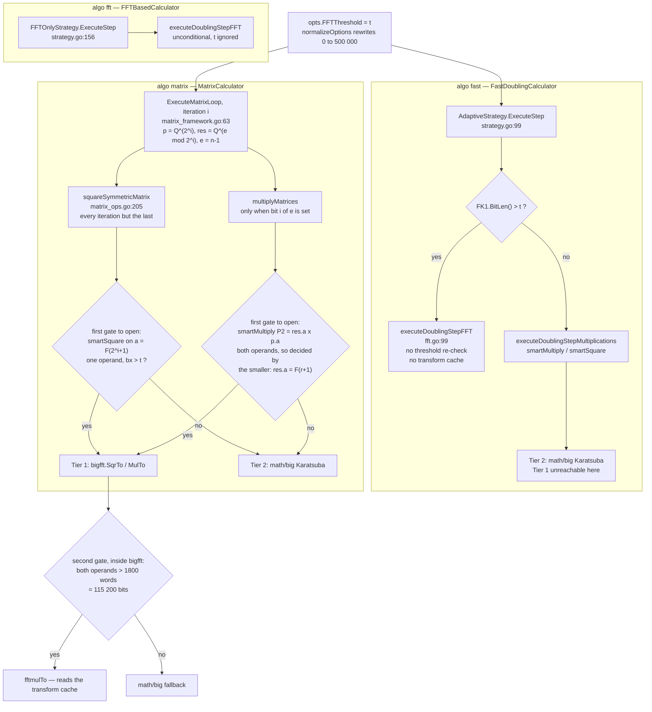

# FFT Multiplication for Large Integers

> **Complexity**: the method is Schönhage–Strassen's Fermat-ring FFT, whose bound is O(n log n log log n) when the pointwise products recurse [[1]](../REFERENCES.md#ref-1). `internal/bigfft` does not recurse: it runs **one** transform level, hands the pointwise products to `math/big` (Karatsuba) and caps the transform length at 2^16, so its own asymptotic class is Θ(n^log2 3), with a smaller constant than `math/big` alone — see [Complexity Analysis](#complexity-analysis). Numbers in brackets refer to [`docs/REFERENCES.md`](../REFERENCES.md).
> **Used by**: `"fft"` at every size; `"fast"` only from `n = 1 440 422` up and `"matrix"` only from `n = 1 768 788` up, with the default threshold — see [FFT Routing](#fft-routing), which is the canonical description of the switch.

## Introduction

FFT multiplication turns an integer product into a convolution of its pieces, computed by a **Fast Fourier Transform** [[4]](../REFERENCES.md#ref-4): quadratic schoolbook multiplication costs O(n^2), Karatsuba [[3]](../REFERENCES.md#ref-3) O(n^log2 3) ≈ O(n^1.585), and the fully recursive FFT of Schönhage and Strassen [[1]](../REFERENCES.md#ref-1) O(n log n log log n). The single-level variant this repository runs does not reach the last bound: asymptotically it keeps Karatsuba's exponent and lowers the constant. Why, and by how much, is in [Complexity Analysis](#complexity-analysis). In this project the nominal switch sits at `DefaultFFTThreshold = 500_000` bits — but that is a **configured default, not a measured crossover**: `internal/fibonacci/constants.go` states "This default is conservative, not an estimate of the crossover", the real crossover being host-dependent and measured only by `(*MicroBenchmark).findFFTCrossover` in `internal/calibration`.

And 500 000 bits is not the number to hold in your head when asking "will *my* run use the FFT?". The threshold is compared against an intermediate operand, not against `F(n)`, and each calculator compares it somewhere else — the whole mechanism is laid out in [FFT Routing](#fft-routing) below.

## Mathematical Principle

### Convolution and Multiplication

Multiplication of two integers can be viewed as a **convolution** of their digits:

```
x = Sum_i a_i * beta^i        y = Sum_j b_j * beta^j        (beta = 2^(64*m), pieces of m words)

x * y = Sum_k c_k * beta^k    where  c_k = Sum_i a_i * b_(k-i)
```

The term c_k is the **discrete convolution** of sequences {a_i} and {b_j}. The c_k are
larger than beta, so recombining them into x*y needs carries.

### Convolution Theorem

The convolution theorem states that:

```
DFT(a * b) = DFT(a) * DFT(b)  (pointwise multiplication)
```

Where `*` is convolution and DFT is the Discrete Fourier Transform.

Therefore:
```
a * b = IDFT(DFT(a) * DFT(b))
```

### Visualization



### FFT Multiplication Algorithm

The generic scheme — pad, transform both operands, multiply pointwise, transform back,
propagate carries — takes this concrete form in `internal/bigfft` (`fftSize`,
`valueSize` in `fft.go`; `Poly.Transform`, `PolValues.Mul`/`Sqr`, `InvTransform` in
`fft_poly.go`):

1. **Split.** For a product of `W` words, `fftSize` picks `k` from the table
   `fftSizeThreshold` and cuts each operand into pieces of `m = W>>k + 1` words, so that
   `K = 2^k` pieces hold the whole product: the convolution is **cyclic with zero padding**,
   nothing wraps around.
2. **Coefficient ring.** Each piece becomes an element of Z/(2^n'+1), with n' the smallest
   multiple of max(2^(k-2), 64) bits above `2·m·64 + k` (`valueSize(k, m, 2)`) — large enough
   that no c_k is truncated.
3. **Forward transforms.** Evaluate at θ^i, i = 0..K−1, where θ = 2^(l/2) is a K-th root of unity mod
   2^n'+1 (2^n' = 2^(K·l/4)). An integer power of 2 is a shift; the half power uses
   √2 ≡ 2^(3n'/4) − 2^(n'/4) (`fermat.ShiftHalf`), so every butterfly is shifts, an add and
   a subtract — no multiplication — radix-2 as in [[4]](../REFERENCES.md#ref-4).
4. **Pointwise products.** K products mod 2^n'+1, each a full n'×n' product by
   `math/big` (or `basicMul` under 30 words) followed by a linear-time fold
   (`fermat.Mul`/`Sqr`, `fermat.go`). **This is where Schönhage–Strassen recurses and this
   code does not.**
5. **Inverse transform and recombination**, with carries, back into a `big.Int`.

Squaring transforms one operand instead of two (2 transforms instead of 3). The FFT step
of the `"fast"` and `"fft"` calculators goes further: it transforms F(k) and F(k+1) once and
derives all three products of a doubling step from them — 2 forward and 3 inverse
transforms instead of 7 (`executeDoublingStepFFT`, `internal/fibonacci/fft.go`).

GMP's FFT [[11]](../REFERENCES.md#ref-11) differs at step 1: it computes products *mod
2^N+1* through a negacyclic convolution, which is what lets a pointwise product mod
2^N'+1 recurse into the same routine. `internal/bigfft` has a negacyclic transform
(`NTransform`), but its only callers are tests.

## Implementation in FibCalc

The FFT multiplication is implemented in the `internal/bigfft` package using a **Fermat FFT** operating in the ring Z/(2^n' + 1), where the roots of unity are powers of √2 and multiplying by them becomes shifts and adds (steps 2–3 above). The package is derived from `remyoudompheng/bigfft` [[12]](../REFERENCES.md#ref-12).

For the implementation itself (public API, Fermat arithmetic, memory management, transform cache), see [BIGFFT.md](BIGFFT.md).

## FFT Routing

**This section is the canonical description of FFT routing for this repository.** It answers, in one place: where the switch is taken, on which operand, with which threshold value, where that value comes from, and for which `n` the FFT actually runs. The other pages — [FAST_DOUBLING.md](FAST_DOUBLING.md), [MATRIX.md](MATRIX.md), [BIGFFT.md](BIGFFT.md), [COMPARISON.md](COMPARISON.md), [GMP.md](GMP.md), and outside `docs/algorithms/` the `README.md`, [`../ARCH.md`](../ARCH.md), [`../PERFORMANCE.md`](../PERFORMANCE.md) and [`../CALIBRATION.md`](../CALIBRATION.md) — link here rather than restate the rule, so it drifts in one file or in none.

The short version: there is **no single FFT switch**. `FFTThreshold` is compared against different operands at different points of the call graph, is ignored outright on two of the five paths below, and on the default `"fast"` calculator does not choose a multiplication routine at all — it chooses a whole doubling-step implementation.

### Where `FFTThreshold` is read

| Path | Decision site | Predicate | What runs above it | Reads the transform cache? |
|---|---|---|---|---|
| `"fast"` (`FastDoublingCalculator`, the default algorithm) | `AdaptiveStrategy.ExecuteStep`, `internal/fibonacci/strategy.go:101` | `opts.FFTThreshold > 0 && state.FK1.BitLen() > opts.FFTThreshold` — a **single** operand, the larger of the two | `executeDoublingStepFFT` (`internal/fibonacci/fft.go:99`): `PolyFromInt` + `TransformWithBump`, three pointwise products, **no further threshold test** | **no** |
| `"fast"`, below that gate | `executeDoublingStepMultiplications` → `smartMultiply` / `smartSquare` (`fft.go:49`, `fft.go:72`) | `bx > t && by > t` (both operands); `smartSquare` gates on `bx > t` alone | nothing — unreachable here, see below | n/a |
| `"fft"` (`FFTBasedCalculator`) | `FFTOnlyStrategy.ExecuteStep`, `strategy.go:156` | none | `executeDoublingStepFFT` on every step at every size; `FFTThreshold` is **not read** on this path | **no** |
| `"matrix"` (`MatrixCalculator`) | `multiplicationTask.execute` / `squaringTask.execute`, `internal/fibonacci/common.go:150` and `:167` | `smartMultiply`: `bx > t && by > t`; `smartSquare`: `bx > t` | `bigfft.MulTo` / `bigfft.SqrTo` | **yes** — the only calculator that does (`internal/calibration/microbench.go` also reaches it, outside the calculators) |
| `-tags gmp` (`GMPCalculator`) | — | — | libgmp picks its own algorithm; the `Options` thresholds are ignored ([GMP.md](GMP.md)) | n/a |

Two consequences follow immediately, and both contradict the "2-tier multiplication" story the name `smartMultiply` suggests:

1. **Tier 1 of `smartMultiply` is dead code on `"fast"`.** Reaching `smartMultiply` means the gate at `strategy.go:101` was false, so `FK1.BitLen() <= t`; the sequence is non-decreasing, so `FK.BitLen() <= FK1.BitLen() <= t`. `bx > t && by > t` cannot hold. The full argument, with the branch diagram, is in [FAST_DOUBLING.md § Where this actually fires — and where it cannot](FAST_DOUBLING.md#where-this-actually-fires--and-where-it-cannot).
2. **The FFT step on `"fast"` never consults the transform cache.** `executeDoublingStepFFT` transforms through `TransformWithBump`, while the cache is read only by `bigfft.Mul`/`MulTo`/`Sqr`/`SqrTo` (`internal/fibonacci/options.go:97-108`, `configureFFTCache`). Tuning `FFTCacheMaxEntries` on a `"fast"` run changes nothing. See [BIGFFT.md § FFT Transform Caching](BIGFFT.md#fft-transform-caching).

### Routing diagram



The `-tags gmp` calculator has no box in this diagram because it has no branch: libgmp selects its own multiplication algorithm and the `Options` thresholds are never read ([GMP.md](GMP.md)).

### The two gates are in series, not the same gate

`fibonacci.Options.FFTThreshold` counts **bits**; `bigfft`'s own `fftThreshold` counts **words** and defaults to `defaultFFTThresholdWords = 1800` (`internal/bigfft/fft.go:48`), i.e. 115 200 bits on a 64-bit host. Passing the first gate does not exempt an operand from the second: `bigfft.MulTo` re-tests `xwords > t && ywords > t` (`internal/bigfft/fft.go:101`) and silently falls back to `math/big` below it.

In practice the second gate never bites on the `"matrix"` path for any value the heuristic can produce, since the smallest of those is 250 000 bits — more than twice 115 200; an explicit `--fft-threshold` below 115 200 would be a different story, the bit gate opening while the word gate stays shut. It also matters for `"fft"`: `FFTOnlyStrategy.Multiply`/`Square` route through `bigfft.MulTo`/`SqrTo` and therefore honour the word gate, while `FFTOnlyStrategy.ExecuteStep` calls `executeDoublingStepFFT`, which bypasses it entirely. That asymmetry is why "`"fft"` forces FFT at every size" is true of the doubling step and false of the `Multiplier` methods.

### Which values of n reach the FFT

Three production paths, three different answers, and none of them is a threshold on
`bitlen(F(n))`. Two are trivial: `FFTOnlyStrategy.ExecuteStep` never reads
`FFTThreshold`, so `"fft"` takes `executeDoublingStepFFT` at every step for every
`n ≥ 1`; and `-tags gmp` has no threshold at all ([GMP.md](GMP.md)). The two paths
that answer with a number — `"fast"` and `"matrix"` — are below, and **they do not
answer the same number**: 1 440 422 and 1 768 788 respectively, at the default
threshold.

#### The `"fast"` path

On the `"fast"` calculator the gate reads `FK1`, the running `F(k+1)` — **not** `F(n)`. At the entry of the last doubling step, `k = ⌊n/2⌋`, so the largest value the gate ever sees is `bitlen(F(⌊n/2⌋ + 1)) ≈ 0.694 · n/2`. The FFT therefore fires only from

```
n  >  2 · t / log2(phi)  ≈  2.881 · t
```

upward — that is, only once `F(n)` is roughly **twice** the threshold. Solved exactly, per threshold value the heuristic can produce:

| `FFTThreshold` (and where it comes from) | Smallest `n` with at least one FFT step | `bitlen(F(n))` there |
|---|---|---|
| 250 000 — non-64-bit word size | 720 212 | 500 001 |
| 460 000 — 64-bit + AVX-512 | 1 325 188 | 920 000 |
| 480 000 — 64-bit + AVX2 | 1 382 806 | 960 001 |
| 500 000 — 64-bit, no AVX2/AVX-512, and the static default | 1 440 422 | 1 000 001 |

And, at the default 500 000, how many of the loop's steps take the FFT branch:

| `n` | doubling steps (`bits.Len64(n)`) | of which routed to `executeDoublingStepFFT` |
|---|---|---|
| 400 000 | 19 | 0 |
| 1 000 000 | 20 | 0 |
| 1 500 000 | 21 | 1 |
| 10 000 000 | 24 | 3 |
| 100 000 000 | 27 | 7 |

So: **`-n 400000` does not use the FFT on the `"fast"` calculator, at any SIMD level.** Neither does `-n 1000000` on a 64-bit host. Even at `-n 10000000` only the last 3 of 24 steps take the FFT branch — though operands roughly double at every step, so those 3 carry by far the largest multiplications. How the runtime actually splits between the two branches is not measured by any artifact in this repo; the step counts above are structural, not timings.

These figures are arithmetic on Fibonacci bit lengths plus the gate read at `strategy.go:101`; they are not benchmark results and no measurement artifact is claimed for them. To re-derive them, iterate `k = n >> (i+1)` for `i` from `bits.Len64(n)-1` down to `0` — that is exactly the state the loop holds at the entry of step `i` (`internal/fibonacci/doubling_framework.go:162`) — and count how often `bitlen(F(k+1)) > t`:

```go
// F returns F(k), F(k+1); any correct implementation will do.
for i := bits.Len64(n) - 1; i >= 0; i-- {
    _, fk1 := F(n >> uint(i+1))
    if fk1.BitLen() > t { /* this step routes to executeDoublingStepFFT */ }
}
```

#### The `"matrix"` path

The `"fast"` number above does **not** transfer here, and the gap is about 330 000.

Write `e = n - 1` and `nb = bits.Len64(e)`, the iteration count of
`ExecuteMatrixLoop` (the loop at `internal/fibonacci/matrix_framework.go:63`, with
the `multiplyMatrices` call at `:73` and the squaring at `:81`).
`matrixState.Reset` (`matrix_types.go:88`) starts `res` at the identity and `p` at Q,
and the loop squares `p` on every iteration but the last and multiplies `res` by `p`
on every set bit of `e`. So at the **entry** of iteration `i` the loop holds

```
p   = Q^(2^i)            res = Q^(r),  r = e mod 2^i
```

and both are symmetric Fibonacci matrices, `Q^m = [[F(m+1), F(m)], [F(m), F(m-1)]]`.
Every operand any guard ever inspects is therefore a Fibonacci number, or a small
signed combination of two of them.

**The squaring branch: four products, four guards, one decisive.**
`squareSymmetricMatrix` (`internal/fibonacci/matrix_ops.go:205`) dispatches three
`smartSquare` and one `smartMultiply` per iteration, all on `p = Q^(2^i)`:

| Product | Operand(s) | Guard | Opens when |
|---|---|---|---|
| `smartSquare(a)` | `a = F(2^i + 1)` | one operand, `bx > t` | `bitlen(F(2^i + 1)) > t` |
| `smartSquare(b)` | `b = F(2^i)` | one operand, `bx > t` | `bitlen(F(2^i)) > t` |
| `smartSquare(d)` | `d = F(2^i - 1)` | one operand, `bx > t` | `bitlen(F(2^i - 1)) > t` |
| `smartMultiply(b, a+d)` | `b = F(2^i)`, `a+d = L(2^i)` | **both** operands | `bitlen(F(2^i)) > t` |

The multiplication's `&&` is decided by its *smaller* operand, and that operand is
always `b`: `a + d = F(2^i+1) + F(2^i-1)` is the Lucas number `L(2^i)`, and
`L(2^i) > F(2^i+1) > F(2^i) = b`. So it opens at
exactly the same `i` as `smartSquare(b)`, and the decisive guard — the first of the
four to open as `i` grows — is `smartSquare(a)`, since `a > b > d`. The guards being
per-operand, one iteration can send 0, 1, 2, 3 or 4 of its four products to `bigfft`;
only once `bitlen(F(2^i - 1)) > t` does an entire squaring go FFT.

**But the multiplication branch fires first.** At the last iteration (`i = nb-1`,
whose bit is always set) `res = Q^r` with `r = e` minus its top bit — an exponent that
can reach `2^(nb-1) - 1`, nearly **twice** the largest exponent any squaring reaches
(`2^(nb-2)`). Both dispatches of `multiplyMatrices` contain the product `res.a × p.a`
— `ae` in `multiplyMatrix2x2`, `P2` in `multiplyMatrixStrassen` — and its smaller
operand, `res.a = F(r+1)`, is the largest "smaller operand" among the seven (or
eight) products, so `P2` is the first of them to open. It is normally tied:
`P5 = S1 × S5` has `S1 = res.c + res.d = F(r+1)` for its smaller operand too (the
classic dispatch ties `ae` with `af = res.a × p.b` the same way), which is why the
boundary values in the table below fire **two** products rather than one. Either
way the first-fire `n` is independent of `StrassenThreshold`: whichever dispatch is
chosen, the same operand pair decides.

One product on this path can never fire at any `n`: Strassen's
`S2 = A21 + A22 - A11` is **identically zero** here, because `res` is a symmetric
Fibonacci matrix and `F(r) + F(r-1) = F(r+1)`. `P1 = S2 × S6` is a multiplication by
zero at every iteration.

**The threshold.** Let `M(t)` be the smallest `m` with `bitlen(F(m)) > t`, and
`J(t) = ⌈log2 M(t)⌉`. A `"matrix"` run sends at least one product to `bigfft`
exactly when

```
n  ≥  2^J(t) + M(t)
```

and the predicate is monotone in `n`, so this really is a single threshold: for
`nb = J+1` the run is `n = 2^J + r + 1` and the multiplication guard needs
`r + 1 ≥ M`; from `n = 2^(J+1) + 1` on, `nb ≥ J+2`, the squaring at `i = J` exists and
fires for every `n`. Nothing depends on the binary *shape* of `n - 1` — that only
changes how many products fire, not whether any does.

| `FFTThreshold` | `M(t)` | `J(t)` | Smallest `n` with ≥ 1 FFT product | First product to fire | Smallest `n` at which the squaring branch alone fires |
|---|---|---|---|---|---|
| 250 000 | 360 107 | 19 | **884 395** | `P2`, iteration 19 | 1 048 577 |
| 460 000 | 662 595 | 20 | **1 711 171** | `P2`, iteration 20 | 2 097 153 |
| 480 000 | 691 404 | 20 | **1 739 980** | `P2`, iteration 20 | 2 097 153 |
| 500 000 | 720 212 | 20 | **1 768 788** | `P2`, iteration 20 | 2 097 153 |

And, at the default 500 000, how much of the work takes the FFT tier:

| `n` | loop iterations (`bits.Len64(n-1)`) | iterations with ≥ 1 FFT product | FFT products / all entry products |
|---|---|---|---|
| 400 000 | 19 | 0 | 0 / 166 |
| 1 000 000 | 20 | 0 | 0 / 167 |
| 1 500 000 | 21 | 0 | 0 / 186 |
| 10 000 000 | 24 | 4 | 18 / 200 |
| 100 000 000 | 27 | 7 | 54 / 245 |

The denominator is specific to the `n` on its row, not a function of `n` alone in the
way the `"fast"` step count is: each set bit of `n - 1` adds a 7- or 8-product matrix
multiply on top of that iteration's 4-product squaring, so it tracks
`popcount(n - 1)` as much as size. As on `"fast"`, the FFT products are the last and
by far the largest ones; no artifact in this repo measures how the runtime splits
between the tiers.

These figures are arithmetic on Fibonacci bit lengths plus the guards at
`fft.go:49` / `fft.go:72` as reached from `matrix_ops.go`; they are not benchmark
results and no measurement artifact is claimed for them. They were cross-checked
against an exact `math/big` replay of `ExecuteMatrixLoop` / `multiplyMatrices` /
`squareSymmetricMatrix` — a replay that reproduces F(10) and F(100) correctly — at
seventeen values of `n`, spanning both sides of every boundary in the first table and
every row of the second below 10 000 000. The 10 000 000 and 100 000 000 rows come
from the bit-length model alone, which agreed with the replay at every `n` where the
replay was cheap enough to run. To re-derive them, walk the loop and count what each
guard sees:

```go
// bl(k) = bitlen(F(k)) = floor(k*log2(phi) - log2(sqrt 5)) + 1 for k >= 2.
e := n - 1
nb := bits.Len64(e)
for i := 0; i < nb; i++ {
    m := uint64(1) << uint(i) // p = Q^m
    r := e & (m - 1)          // res = Q^r
    if (e>>uint(i))&1 == 1 {
        // res x p: P2 (Strassen) / ae (classic) = res.a * p.a is the first to open
        if bl(r+1) > t && bl(m+1) > t { /* this product routes to bigfft.MulTo */ }
    }
    if i < nb-1 {
        // square p: smartSquare on a = F(2^i+1) is the first to open
        if bl(m+1) > t { /* this product routes to bigfft.SqrTo */ }
    }
}
```

#### Reading these numbers under `-algo all`

The CLI default is `-algo all` (`DefaultAlgo = "all"`,
`internal/config/config.go:29`), and `GetCalculatorsToRun` then runs **every**
registered calculator (`internal/orchestration/calculator_selection.go:17-27`). A
single default invocation therefore exercises all three answers at once, and no one
number covers it:

| `n`, default threshold | `"fast"` | `"matrix"` | `"fft"` |
|---|---|---|---|
| 400 000 | no FFT | no FFT | FFT at every step |
| 1 440 422 | first FFT step | no FFT | FFT at every step |
| 1 768 788 | FFT | first FFT product | FFT at every step |

So a default `-n 400000` run does execute FFT code — inside the `"fft"` calculator,
never inside `"fast"` or `"matrix"`. Pass `-algo fast` or `-algo matrix` to isolate
the path a table above describes.

### Configuration

The FFT threshold is configured via the `fibonacci.Options` struct:

```go
opts := fibonacci.Options{
    FFTThreshold: 500_000,  // Default: 500,000 bits
}
```

Setting `FFTThreshold` to 0 does **not** disable FFT: `normalizeOptions()` rewrites a
zero threshold to `DefaultFFTThreshold` (500,000) on every calculation path. To keep
FFT off, set the threshold above the largest operand you expect — and note that this
works on `"fast"` and `"matrix"` only: the `"fft"` calculator never reads the field, so
no value of it will keep that calculator off the FFT path.

### Where the threshold value comes from

Two mechanisms produce a value for `FFTThreshold`, and only one of them measures anything.

**1. Static hardware heuristic** — `EstimateOptimalFFTThreshold`
(`internal/config/thresholds.go`) is applied by `ApplyAdaptiveThresholds` to a
CLI threshold still left at 0. It reads exactly two inputs: word size and the
detected SIMD level. Nothing else — not L3 size, not clock, not core count:

| Condition | Threshold returned |
|-----------|--------------------|
| word size != 64 (32-bit) | 250,000 bits |
| 64-bit, AVX-512 | 460,000 bits |
| 64-bit, AVX2 | 480,000 bits |
| 64-bit, otherwise | 500,000 bits |

These four constants are hard-coded and unbacked by any benchmark in the repo.

**2. Timed calibration** — `internal/calibration` runs micro-benchmarks and
`(*MicroBenchmark).findFFTCrossover(bySize)` returns `(bitSize, decisiveness)`.
This is the only path that produces a threshold from measurement rather than
assertion, and since audit M-01 it accepts a size only under three conditions
(`internal/calibration/microbench.go:findFFTCrossover`):

| Condition | Where | Why |
|---|---|---|
| Sizes at or below `bigfft.FFTThresholdWords` (1,800 words) get no FFT arm at all | `runTests` | below it both arms run the same `math/big` code, so the comparison was a workload against itself |
| FFT must win by **10 %** (`fftCrossoverMargin = 0.9`) | `microbench.go:423` | same margin `findParallelCrossover` has always required |
| The win must be **monotone**: every larger measured size must win too | `microbench.go:481-493` | a transition that reverses above itself is boundary noise, not a crossover |

When no size qualifies, `findFFTCrossover` returns `0` and `analyzeResults`
keeps `FFTThreshold = 500000` with `Confidence = 0.0`
(`microbench.go:analyzeResults`) — a default is not a measurement and does not
carry the confidence of one.

> **What this still does not settle.** [`docs/audits/microbench-stability-2026-09.txt`](../audits/microbench-stability-2026-09.txt)
> records `QuickCalibrate()` run ten times back to back on an idle host. Before
> M-01 the runs flapped between 115,200 and 460,800 bits — a factor of four —
> and reported **both** with the same 0.70 confidence, which cleared the
> escalation bar (`EscalationConfidenceThreshold = 0.5`,
> `internal/calibration/strategy.go:35`) every time, so the coin flip got
> persisted. After M-01, eight of the ten runs fall below the bar and hand over
> to `CompleteStrategy`; the two that clear it (0.71 and 0.64) agree on
> 460,800. The artifact says plainly that this is
> better, not solved: the 2,000-word test size sits just past `bigfft`'s own
> activation threshold, so whether FFT wins there is genuinely marginal on that
> CPU. What changed is that the ambiguity is now visible in the confidence
> score instead of being flattened into a constant. `CurrentProfileVersion` went
> 3 → 4 so version-3 profiles are invalidated rather than replayed.

**Resolution order.** A cached calibration profile
(`~/.fibcalc_calibration.json`) does **not** outrank an explicit flag. The chain
documented at the head of `internal/config/thresholds.go` is, highest first:
CLI flags (`--fft-threshold`) → environment (`FIBCALC_FFT_THRESHOLD`) → cached
profile → adaptive hardware estimation (the table above) → the static defaults
in `fibonacci/constants.go`. Flags and environment variables both mark a
threshold *explicit*, and `calibration.LoadCachedCalibration` fills only the
ones left implicit. Until audit M-03 (2026-09) the profile overwrote all three
unconditionally — that inversion was documented here and in the source as a
"KNOWN SURPRISE"; it is decided now, in favour of the flag.

## Interaction with Parallelism

### Contention Problem

The FFT algorithm tends to **saturate CPU resources** as it performs many parallel memory operations internally. Running multiple FFT multiplications in parallel causes contention.

### Implemented Solution

`shouldParallelizeMultiplicationCached` (in `internal/fibonacci/fastdoubling.go`) disables external parallelism when FFT is active, except for very large numbers. The decision uses `maxBitLen` (the larger of the two operands' bit lengths), because the squaring operations trigger FFT as soon as a single operand exceeds the threshold:

```go
// shouldParallelizeMultiplicationCached, internal/fibonacci/fastdoubling.go
// maxBitLen = max(fkBitLen, fk1BitLen)
if opts.FFTThreshold > 0 && maxBitLen > opts.FFTThreshold {
    // FFT will be used: parallelism is re-enabled only for
    // extremely large numbers (> ParallelFFTThreshold = 5M bits).
    return maxBitLen > ParallelFFTThreshold
}
```

## FFT-Based Calculator

The `"fft"` calculator uses the `DoublingFramework` with an `FFTOnlyStrategy`:

```go
type FFTBasedCalculator struct{}

func (c *FFTBasedCalculator) Name() string {
    return "FFT-Based Doubling"
}

func (c *FFTBasedCalculator) CalculateCore(ctx context.Context, reporter progress.ProgressCallback,
    n uint64, opts Options) (*big.Int, error) {
    // State-bound arena, pre-sized for F(n)
    s := AcquireStateForN(n)

    strategy := &FFTOnlyStrategy{}
    framework := NewDoublingFramework(strategy)

    raw, err := framework.ExecuteDoublingLoop(ctx, reporter, n, opts, s, false)
    if err != nil {
        ReleaseState(s)
        return nil, err
    }
    // Deep-copies the result out of the arena so it never aliases pooled memory
    return ReleaseStateWithResult(s, raw), nil
}
```

This calculator is primarily used for:
- FFT performance benchmarking
- Regression testing
- Multiplication algorithm comparison

## Complexity Analysis
### Three bounds, one implementation

| Algorithm | Bound for an n-bit product | Present in this project? |
|---|---|---|
| Schoolbook | Θ(n^2) | yes — `basicMul`/`basicSqr` in `bigfft/fermat.go` under 30 words; `math/big` under 40 words [[13]](../REFERENCES.md#ref-13) |
| Karatsuba [[3]](../REFERENCES.md#ref-3) | Θ(n^log2 3) ≈ n^1.585 | yes — `math/big.Int.Mul`, Tier 2 of `smartMultiply`, and every pointwise product of `internal/bigfft` |
| Toom-Cook 3 | Θ(n^log3 5) ≈ n^1.465 | **no** — `math/big` stops at Karatsuba [[13]](../REFERENCES.md#ref-13) |
| Schönhage–Strassen, recursive [[1]](../REFERENCES.md#ref-1) | O(n log n log log n) | **no** — see below |
| Harvey–van der Hoeven [[2]](../REFERENCES.md#ref-2) | O(n log n) | **no** — nor in GMP 6.3.0 [[11]](../REFERENCES.md#ref-11) |
| `internal/bigfft` (one level, K ≤ 2^16) | Θ(n^log2 3), smaller constant than Karatsuba alone | yes — this package, derived from [[12]](../REFERENCES.md#ref-12) |

The Schönhage–Strassen bound needs step 4 of [the algorithm above](#fft-multiplication-algorithm)
to recurse: each pointwise product mod 2^n'+1 is itself done by the same FFT, with a
transform length that grows with n' at every level, and the log log n factor counts those
levels. GMP does exactly that when it pays [[11]](../REFERENCES.md#ref-11). `internal/bigfft`
does not: `fermat.Mul` hands every pointwise product to `math/big`, so the transform is a
single level on top of Karatsuba. Its cost for a product of N bits, read off the code, is

```
C(N) =  t · Θ(K log K) shift/add butterflies on n'-bit residues      t = 3 (product), 2 (square)
      + K · M_big(n')                                                  K = 2^k, n' ≈ 2N/K
```

with M_big the `math/big` product. The transforms are Θ(N log K). What decides the class is
how `k` grows:

- **Up to 600·2^20 bits of product** (`fftSizeThreshold[15]`), `k` follows the table, which
  keeps K of the order of √N, so the residues stay short — 66 to 288 words in the rows below the cap, with 2√N/K between 2.0 and 4.0.
- **Above it**, `k` is pinned at 16 (`GetFFTParams` and `fftSize` return
  `len(fftSizeThreshold)`; `valueSize` rejects anything larger). K = 65 536 is then a constant,
  n' grows linearly with N, and the pointwise term is 2^16 · M_big(2N/2^16) = Θ(N^log2 3). In the
  pure power model M_big(x) = c·x^log2 3 that term is 3 · 2^(16(1 − log2 3)) ≈ 1/219 of one
  Karatsuba product of the full size — a model figure, not a measurement.

On the `"fast"` and `"fft"` FFT step (product ≈ 2·len(F(k+1)) + 2 words, last doubling step
shown), the shapes are:

| n | product (words) | k | K | residue n' (words) |
|---|---|---|---|---|
| 1.5·10^6 | 16 274 | 9 | 512 | 66 |
| 10^7 | 108 478 | 11 | 2 048 | 112 |
| 10^8 | 1 084 756 | 13 | 8 192 | 288 |
| 10^9 | 10 847 532 | **16** | 65 536 | 512 |
| 10^10 | 108 475 302 | 16 | 65 536 | 3 328 |
| 10^11 | 1 084 752 994 | 16 | 65 536 | 33 280 |

The cap is reached from n ≈ 9.06·10^8 on this path. Past it, each decade of n multiplies the
residue length by ten, and the pointwise Karatsuba products take over the cost.
The rows come from a verbatim copy of `GetFFTParams` and `valueSize` (`internal/bigfft/fft.go`)
fed with bitlen(F(⌊n/2⌋+1)) ≈ (n/2)·log2 φ; no timing backs them.

Two consequences:

- **"FFT wins eventually" is a constant-factor statement here**, not a change of exponent.
  The exponent only drops if the pointwise products recurse — through a mod 2^N+1 product, which
  the package has in test-only form (`NTransform`) — and no benchmark in this repo measures
  either the current constant or what recursion would buy.
- Any O(·) for a calculator built on this package (`"fast"`, `"fft"`, `"matrix"`) inherits
  Θ(n^log2 3), not the Schönhage–Strassen bound. Only `-tags gmp` gets GMP's recursive FFT.

### Crossover Point

```
                    |
    Calculation     |     /
     time           |    /  <- math/big Karatsuba, c1 * n^1.585
                    |   /
                    |  /
                    | /          <- internal/bigfft: one FFT level over Karatsuba,
                    |/     _______   same exponent past the k = 16 cap, smaller constant
                    +------------------
                          500k bits     Size (bits)
```

The 500k mark on that sketch is where the code **switches**, not where the two
curves have been observed to cross: it is `DefaultFFTThreshold = 500_000`
(`internal/fibonacci/constants.go`), whose own comment calls it a conservative,
unmeasured placement. The sketch is qualitative; no measurement in this repo
plots either curve.

It is also the mark for an *operand*, not for `F(n)`. On the `"fast"` calculator
the branch is taken against `FK1`, so the sketch's 500k corresponds to a result
around 1 000 000 bits — `n = 1 440 422`. On `"matrix"` it is taken against the
entries of `p = Q^(2^i)` and of the accumulated `res`, and the first pair to cross
it is `res.a × p.a`, at `n = 1 768 788`. See [The `"fast"` path](#the-fast-path)
and [The `"matrix"` path](#the-matrix-path).

### FFT Overhead

FFT overhead comes from:
1. Conversion big.Int -> FFT representation
2. Padding to next power of 2
3. Forward and inverse FFT
4. Carry propagation

## Usage

### Go API

```go
factory := fibonacci.NewDefaultFactory()
calc, _ := factory.Get("fft")
result, _ := calc.Calculate(ctx, progressChan, 0, 100_000_000, fibonacci.Options{})
```

### Benchmarks

```bash
# Benchmark FFT-based calculator (sub-benchmark of BenchmarkFibonacci)
go test -bench='BenchmarkFibonacci/FFTBased' -benchmem -run='^$' ./internal/fibonacci/

# Benchmark bigfft package directly
go test -bench=. -benchmem ./internal/bigfft/
```

## Cross-References

- [BIGFFT.md](BIGFFT.md) -- Implementation internals: public API, Fermat arithmetic, memory management, transform caching
- [FAST_DOUBLING.md](FAST_DOUBLING.md) -- The `"fast"` path: why Tier 1 of `smartMultiply` is unreachable there, with the branch diagram
- [MATRIX.md](MATRIX.md) -- The one production path where the 2-tier `smartMultiply` really is 2-tier
- [COMPARISON.md](COMPARISON.md) -- Algorithm comparison and benchmarks
- [GMP.md](GMP.md) -- The path that ignores `FFTThreshold` entirely

## References

Full entries, with verified DOIs, in [`docs/REFERENCES.md`](../REFERENCES.md):
[[1]](../REFERENCES.md#ref-1) Schönhage & Strassen 1971 — the method and its recursive bound;
[[2]](../REFERENCES.md#ref-2) Harvey & van der Hoeven 2021 — the O(n log n) bound, not implemented;
[[3]](../REFERENCES.md#ref-3) Karatsuba & Ofman 1962;
[[4]](../REFERENCES.md#ref-4) Cooley & Tukey 1965;
[[10]](../REFERENCES.md#ref-10) Brent & Zimmermann 2010, ch. 2;
[[11]](../REFERENCES.md#ref-11) GMP 6.3.0 manual, § FFT Multiplication — the recursive counterpart;
[[12]](../REFERENCES.md#ref-12) `remyoudompheng/bigfft`, the upstream;
[[13]](../REFERENCES.md#ref-13) `math/big` `natmul.go`, where the pointwise products end.
