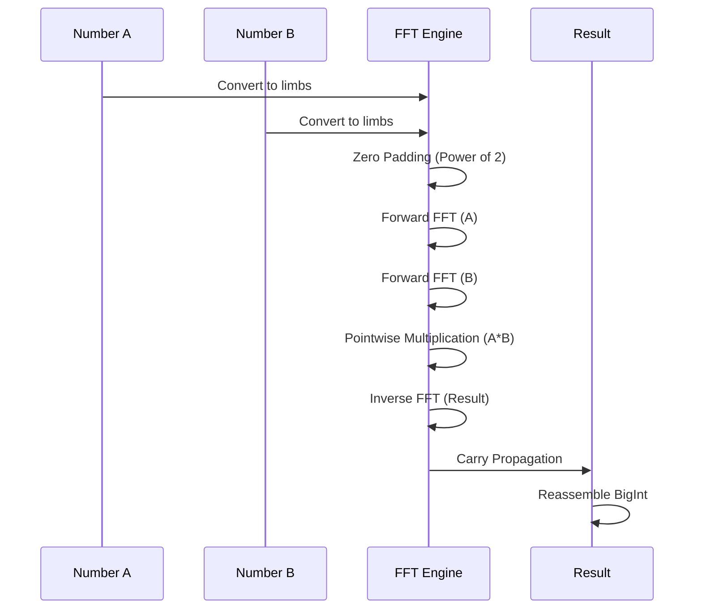

# FFT Multiplication for Large Integers

> **Complexity**: O(n log n) for multiplying two numbers of n bits
> **Used by**: `"fast"` and `"matrix"` above `FFTThreshold`; `"fft"` at every size

## Introduction

The **Fast Fourier Transform (FFT)** allows multiplying two large integers in O(n log n) instead of O(n^2) for naive multiplication or O(n^1.585) for Karatsuba. In this project the switch happens at `DefaultFFTThreshold = 500_000` bits — but that is a **configured default, not a measured crossover**: `internal/fibonacci/constants.go` states it is "a deliberately conservative placement of that crossover, not a measured one", the real crossover being host-dependent and measured only by `(*MicroBenchmark).findFFTCrossover` in `internal/calibration`.

## Mathematical Principle

### Convolution and Multiplication

Multiplication of two integers can be viewed as a **convolution** of their digits:

```
A = Sum_i a_i * B^i
B = Sum_j b_j * B^j

A * B = Sum_k c_k * B^k  where  c_k = Sum_i a_i * b(k-i)
```

The term c_k is the **discrete convolution** of sequences {a_i} and {b_j}.

### Convolution Theorem

The convolution theorem states that:

```
DFT(a * b) = DFT(a) * DFT(b)  (pointwise multiplication)
```

Where `*` is convolution and DFT is the Discrete Fourier Transform.

Therefore:
```
a * b = IDFT(DFT(a) * DFT(b))
```

### Visualization



### FFT Multiplication Algorithm

1. **Padding**: Extend numbers to a power of 2 length
2. **DFT**: Compute FFT of both digit sequences
3. **Multiplication**: Multiply pointwise in the frequency domain
4. **IDFT**: Compute inverse FFT
5. **Carry Propagation**: Handle carries

## Implementation in FibCalc

The FFT multiplication is implemented in the `internal/bigfft` package using a **Fermat FFT** operating in the ring Z/(2^k + 1), where roots of unity are powers of 2 and multiplications become bit shifts.

For the implementation itself (public API, Fermat arithmetic, memory management, transform cache), see [BIGFFT.md](BIGFFT.md).

### 2-Tier Multiplication Selection

The `smartMultiply` function in `internal/fibonacci/fft.go` selects the algorithm by comparing operand bit-lengths against the configured threshold:

- **Tier 1: FFT** — both operands exceed `FFTThreshold` → routes to `bigfft.MulTo`
- **Tier 2: Standard math/big** — uses Karatsuba internally for large operands

## Activation Threshold

### Configuration

The FFT threshold is configured via the `fibonacci.Options` struct:

```go
opts := fibonacci.Options{
    FFTThreshold: 500_000,  // Default: 500,000 bits
}
```

Setting `FFTThreshold` to 0 does **not** disable FFT: `normalizeOptions()` rewrites a
zero threshold to `DefaultFFTThreshold` (500,000) on every calculation path. To keep
FFT off, set the threshold above the largest operand you expect.

### Threshold Selection

Two mechanisms exist, and only one of them measures anything.

**1. Static hardware heuristic** — `EstimateOptimalFFTThreshold`
(`internal/config/thresholds.go`) is applied by `ApplyAdaptiveThresholds` to a
CLI threshold still left at 0. It reads exactly two inputs: word size and the
detected SIMD level. Nothing else — not L3 size, not clock, not core count:

| Condition | Threshold returned |
|-----------|--------------------|
| word size != 64 (32-bit) | 250,000 bits |
| 64-bit, AVX-512 | 460,000 bits |
| 64-bit, AVX2 | 480,000 bits |
| 64-bit, otherwise | 500,000 bits |

These four constants are hard-coded and unbacked by any benchmark in the repo.

**2. Timed calibration** — `internal/calibration` runs micro-benchmarks and
`(*MicroBenchmark).findFFTCrossover(bySize)` returns `(bitSize, decisiveness)`.
This is the only path that produces a threshold from measurement rather than
assertion, and since audit M-01 it accepts a size only under three conditions
(`internal/calibration/microbench.go:findFFTCrossover`):

| Condition | Where | Why |
|---|---|---|
| Sizes at or below `bigfft.FFTThresholdWords` (1,800 words) get no FFT arm at all | `runTests` | below it both arms run the same `math/big` code, so the comparison was a workload against itself |
| FFT must win by **10 %** (`fftCrossoverMargin = 0.9`) | `microbench.go:423` | same margin `findParallelCrossover` has always required |
| The win must be **monotone**: every larger measured size must win too | `microbench.go:481-493` | a transition that reverses above itself is boundary noise, not a crossover |

When no size qualifies, `findFFTCrossover` returns `0` and `analyzeResults`
keeps `FFTThreshold = 500000` with `Confidence = 0.0`
(`microbench.go:analyzeResults`) — a default is not a measurement and does not
carry the confidence of one.

> **What this still does not settle.** [`docs/audits/microbench-stability-2026-09.txt`](../audits/microbench-stability-2026-09.txt)
> records `QuickCalibrate()` run ten times back to back on an idle host. Before
> M-01 the runs flapped between 115,200 and 460,800 bits — a factor of four —
> and reported **both** with the same 0.70 confidence, which cleared the
> escalation bar (`EscalationConfidenceThreshold = 0.5`,
> `internal/calibration/strategy.go:35`) every time, so the coin flip got
> persisted. After M-01, eight of the ten runs fall below the bar and hand over
> to `CompleteStrategy`; the two that clear it (0.71 and 0.64) agree on
> 460,800. The artifact says plainly that this is
> better, not solved: the 2,000-word test size sits just past `bigfft`'s own
> activation threshold, so whether FFT wins there is genuinely marginal on that
> CPU. What changed is that the ambiguity is now visible in the confidence
> score instead of being flattened into a constant. `CurrentProfileVersion` went
> 3 → 4 so version-3 profiles are invalidated rather than replayed.

**Resolution order.** A cached calibration profile
(`~/.fibcalc_calibration.json`) does **not** outrank an explicit flag. The chain
documented at the head of `internal/config/thresholds.go` is, highest first:
CLI flags (`--fft-threshold`) → environment (`FIBCALC_FFT_THRESHOLD`) → cached
profile → adaptive hardware estimation (the table above) → the static defaults
in `fibonacci/constants.go`. Flags and environment variables both mark a
threshold *explicit*, and `calibration.LoadCachedCalibration` fills only the
ones left implicit. Until audit M-03 (2026-09) the profile overwrote all three
unconditionally — that inversion was documented here and in the source as a
"KNOWN SURPRISE"; it is decided now, in favour of the flag.

## Interaction with Parallelism

### Contention Problem

The FFT algorithm tends to **saturate CPU resources** as it performs many parallel memory operations internally. Running multiple FFT multiplications in parallel causes contention.

### Implemented Solution

`shouldParallelizeMultiplicationCached` (in `internal/fibonacci/fastdoubling.go`) disables external parallelism when FFT is active, except for very large numbers. The decision uses `maxBitLen` (the larger of the two operands' bit lengths), because the squaring operations trigger FFT as soon as a single operand exceeds the threshold:

```go
// shouldParallelizeMultiplicationCached, internal/fibonacci/fastdoubling.go
// maxBitLen = max(fkBitLen, fk1BitLen)
if opts.FFTThreshold > 0 && maxBitLen > opts.FFTThreshold {
    // FFT will be used: parallelism is re-enabled only for
    // extremely large numbers (> ParallelFFTThreshold = 5M bits).
    return maxBitLen > ParallelFFTThreshold
}
```

## FFT-Based Calculator

The `"fft"` calculator uses the `DoublingFramework` with an `FFTOnlyStrategy`:

```go
type FFTBasedCalculator struct{}

func (c *FFTBasedCalculator) Name() string {
    return "FFT-Based Doubling"
}

func (c *FFTBasedCalculator) CalculateCore(ctx context.Context, reporter progress.ProgressCallback,
    n uint64, opts Options) (*big.Int, error) {
    // State-bound arena, pre-sized for F(n)
    s := AcquireStateForN(n)

    strategy := &FFTOnlyStrategy{}
    framework := NewDoublingFramework(strategy)

    raw, err := framework.ExecuteDoublingLoop(ctx, reporter, n, opts, s, false)
    if err != nil {
        ReleaseState(s)
        return nil, err
    }
    // Deep-copies the result out of the arena so it never aliases pooled memory
    return ReleaseStateWithResult(s, raw), nil
}
```

This calculator is primarily used for:
- FFT performance benchmarking
- Regression testing
- Multiplication algorithm comparison

## Complexity Analysis

### Multiplication of two numbers of n bits

| Algorithm | Complexity | Hidden constant | Present in this project? |
|-----------|------------|-----------------|--------------------------|
| Naive | O(n^2) | Low | yes — `basicMul`/`basicSqr` in `bigfft/fermat.go`, below `smallMulThreshold` |
| Karatsuba | O(n^1.585) | Medium | yes — inside `math/big.Int.Mul`, Tier 2 of `smartMultiply` |
| Toom-Cook 3 | O(n^1.465) | High | **no** — listed for reference only; nothing in this repo implements it |
| FFT | O(n log n) | Very high | yes — `internal/bigfft` |

### Crossover Point

```
                    |
    Calculation     |     /
     time           |    /  <- Karatsuba O(n^1.585)
                    |   /
                    |  /
                    | /          <- FFT O(n log n)
                    |/     _______
                    +------------------
                          500k bits     Size (bits)
```

The 500k mark on that sketch is where the code **switches**, not where the two
curves have been observed to cross: it is `DefaultFFTThreshold = 500_000`
(`internal/fibonacci/constants.go`), whose own comment calls it a conservative,
unmeasured placement. The sketch is qualitative; no measurement in this repo
plots either curve.

### FFT Overhead

FFT overhead comes from:
1. Conversion big.Int -> FFT representation
2. Padding to next power of 2
3. Forward and inverse FFT
4. Carry propagation

## Usage

### Go API

```go
factory := fibonacci.NewDefaultFactory()
calc, _ := factory.Get("fft")
result, _ := calc.Calculate(ctx, progressChan, 0, 100_000_000, fibonacci.Options{})
```

### Benchmarks

```bash
# Benchmark FFT-based calculator (sub-benchmark of BenchmarkFibonacci)
go test -bench='BenchmarkFibonacci/FFTBased' -benchmem -run='^$' ./internal/fibonacci/

# Benchmark bigfft package directly
go test -bench=. -benchmem ./internal/bigfft/
```

## Cross-References

- [BIGFFT.md](BIGFFT.md) -- Implementation internals: public API, Fermat arithmetic, memory management, transform caching
- [FAST_DOUBLING.md](FAST_DOUBLING.md) -- Primary consumer of the FFT subsystem
- [MATRIX.md](MATRIX.md) -- Secondary consumer via Strassen matrix multiplication
- [COMPARISON.md](COMPARISON.md) -- Algorithm comparison and benchmarks

## References

1. Cooley, J. W., & Tukey, J. W. (1965). "An algorithm for the machine calculation of complex Fourier series". *Mathematics of Computation*.
2. Schonhage, A., & Strassen, V. (1971). "Schnelle Multiplikation grosser Zahlen". *Computing*.
3. [GMP Library - FFT Multiplication](https://gmplib.org/manual/FFT-Multiplication)
