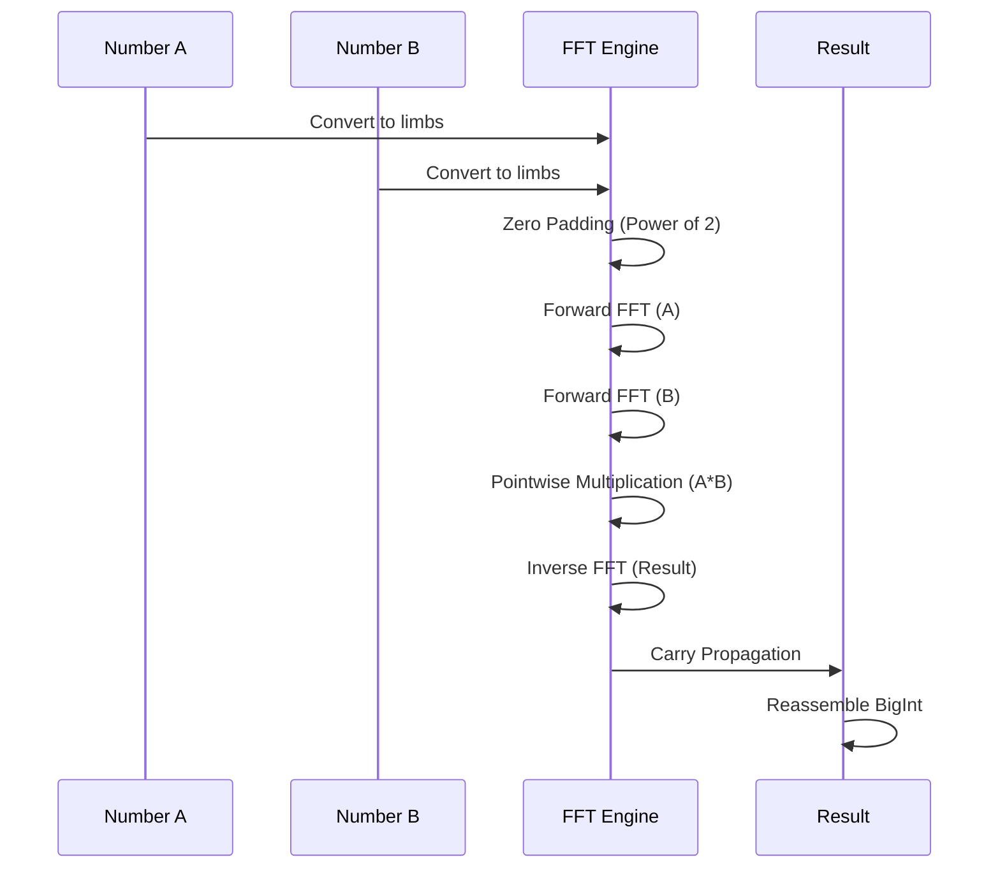

# FFT Multiplication for Large Integers

> Interactive architecture map: **[agbruneau.github.io/FibGo/dashboard/](https://agbruneau.github.io/FibGo/dashboard/)** (knowledge graph, 797 nodes / 8 layers / 13-step tour)

> **Complexity**: O(n log n) for multiplying two numbers of n bits
> **Used by**: Fast Doubling and Matrix Exp. for very large numbers

## Introduction

The **Fast Fourier Transform (FFT)** allows multiplying two large integers in O(n log n) instead of O(n^2) for naive multiplication or O(n^1.585) for Karatsuba. This optimization becomes crucial for numbers exceeding approximately 500,000 bits.

## Mathematical Principle

### Convolution and Multiplication

Multiplication of two integers can be viewed as a **convolution** of their digits:

```
A = Sum_i a_i * B^i
B = Sum_j b_j * B^j

A * B = Sum_k c_k * B^k  where  c_k = Sum_i a_i * b(k-i)
```

The term c_k is the **discrete convolution** of sequences {a_i} and {b_j}.

### Convolution Theorem

The convolution theorem states that:

```
DFT(a * b) = DFT(a) * DFT(b)  (pointwise multiplication)
```

Where `*` is convolution and DFT is the Discrete Fourier Transform.

Therefore:
```
a * b = IDFT(DFT(a) * DFT(b))
```

### Visualization



### FFT Multiplication Algorithm

1. **Padding**: Extend numbers to a power of 2 length
2. **DFT**: Compute FFT of both digit sequences
3. **Multiplication**: Multiply pointwise in the frequency domain
4. **IDFT**: Compute inverse FFT
5. **Carry Propagation**: Handle carries

## Implementation in FibCalc

The FFT multiplication is implemented in the `internal/bigfft` package using a **Fermat FFT** operating in the ring Z/(2^k + 1), where roots of unity are powers of 2 and multiplications become bit shifts.

Pour l'implémentation détaillée (API publique, arithmétique de Fermat, gestion mémoire, cache de transformées), voir [BIGFFT.md](BIGFFT.md).

### 2-Tier Multiplication Selection

The `smartMultiply` function in `internal/fibonacci/fft.go` selects the optimal algorithm based on operand bit-length:

- **Tier 1: FFT** — both operands exceed `FFTThreshold` → routes to `bigfft.MulTo`
- **Tier 2: Standard math/big** — uses Karatsuba internally for large operands

## Activation Threshold

### Configuration

The FFT threshold is configured via the `fibonacci.Options` struct:

```go
opts := fibonacci.Options{
    FFTThreshold: 500_000,  // Default: 500,000 bits
}
```

Setting `FFTThreshold` to 0 disables FFT multiplication entirely.

### Threshold Selection

The optimal threshold depends on several factors:

| Factor | Impact |
|--------|--------|
| L3 cache size | Larger cache -> lower threshold |
| CPU frequency | Faster -> slightly higher threshold |
| Number of cores | More cores -> FFT less advantageous (saturating) |

The calibration system (`internal/calibration`) can determine optimal thresholds for your hardware programmatically.

## Interaction with Parallelism

### Contention Problem

The FFT algorithm tends to **saturate CPU resources** as it performs many parallel memory operations internally. Running multiple FFT multiplications in parallel causes contention.

### Implemented Solution

`ShouldParallelizeMultiplication` (in `internal/fibonacci/fastdoubling.go`) disables external parallelism when FFT is active, except for very large numbers. The decision uses `maxBitLen` (the larger of the two operands' bit lengths), because the squaring operations trigger FFT as soon as a single operand exceeds the threshold:

```go
// shouldParallelizeMultiplicationCached, internal/fibonacci/fastdoubling.go
// maxBitLen = max(fkBitLen, fk1BitLen)
if opts.FFTThreshold > 0 && maxBitLen > opts.FFTThreshold {
    // FFT will be used: parallelism is re-enabled only for
    // extremely large numbers (> ParallelFFTThreshold = 5M bits).
    return maxBitLen > ParallelFFTThreshold
}
```

## FFT-Based Calculator

The `"fft"` calculator uses the `DoublingFramework` with an `FFTOnlyStrategy`:

```go
type FFTBasedCalculator struct{}

func (c *FFTBasedCalculator) Name() string {
    return "FFT-Based Doubling"
}

func (c *FFTBasedCalculator) CalculateCore(ctx context.Context, reporter progress.ProgressCallback,
    n uint64, opts Options) (*big.Int, error) {
    // State-bound arena, pre-sized for F(n)
    s := AcquireStateForN(n)

    strategy := &FFTOnlyStrategy{}
    framework := NewDoublingFramework(strategy)

    raw, err := framework.ExecuteDoublingLoop(ctx, reporter, n, opts, s, false)
    if err != nil {
        ReleaseState(s)
        return nil, err
    }
    // Deep-copies the result out of the arena so it never aliases pooled memory
    return ReleaseStateWithResult(s, raw), nil
}
```

This calculator is primarily used for:
- FFT performance benchmarking
- Regression testing
- Multiplication algorithm comparison

## Complexity Analysis

### Multiplication of two numbers of n bits

| Algorithm | Complexity | Hidden constant |
|-----------|------------|-----------------|
| Naive | O(n^2) | Low |
| Karatsuba | O(n^1.585) | Medium |
| Toom-Cook 3 | O(n^1.465) | High |
| FFT | O(n log n) | Very high |

### Crossover Point

```
                    |
    Calculation     |     /
     time           |    /  <- Karatsuba O(n^1.585)
                    |   /
                    |  /
                    | /          <- FFT O(n log n)
                    |/     _______
                    +------------------
                          ~500k bits    Size (bits)
```

The default crossover is `DefaultFFTThreshold = 500_000` bits (`internal/fibonacci/constants.go`).

### FFT Overhead

FFT overhead comes from:
1. Conversion big.Int -> FFT representation
2. Padding to next power of 2
3. Forward and inverse FFT
4. Carry propagation

## Usage

### Go API

```go
factory := fibonacci.GlobalFactory()
calc, _ := factory.Get("fft")
result, _ := calc.Calculate(ctx, progressChan, 0, 100_000_000, fibonacci.Options{})
```

### Benchmarks

```bash
# Benchmark FFT-based calculator (sub-benchmark of BenchmarkFibonacci)
go test -bench='BenchmarkFibonacci/FFTBased' -benchmem -run='^$' ./internal/fibonacci/

# Benchmark bigfft package directly
go test -bench=. -benchmem ./internal/bigfft/
```

## Cross-References

- [BIGFFT.md](BIGFFT.md) -- Implementation internals: public API, Fermat arithmetic, memory management, transform caching
- [FAST_DOUBLING.md](FAST_DOUBLING.md) -- Primary consumer of the FFT subsystem
- [MATRIX.md](MATRIX.md) -- Secondary consumer via Strassen matrix multiplication
- [COMPARISON.md](COMPARISON.md) -- Algorithm comparison and benchmarks

## References

1. Cooley, J. W., & Tukey, J. W. (1965). "An algorithm for the machine calculation of complex Fourier series". *Mathematics of Computation*.
2. Schonhage, A., & Strassen, V. (1971). "Schnelle Multiplikation grosser Zahlen". *Computing*.
3. [GMP Library - FFT Multiplication](https://gmplib.org/manual/FFT-Multiplication)
