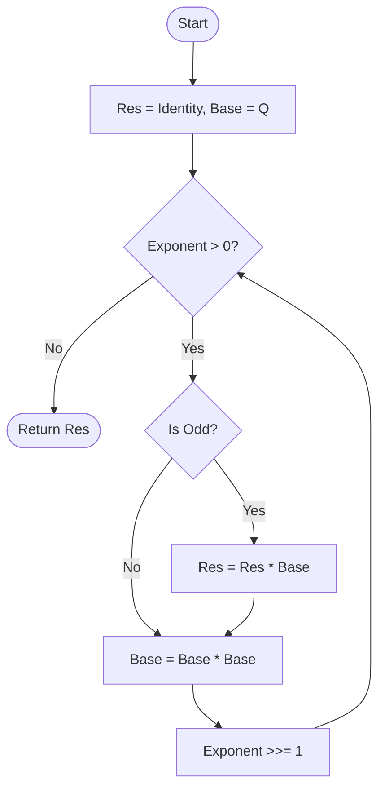
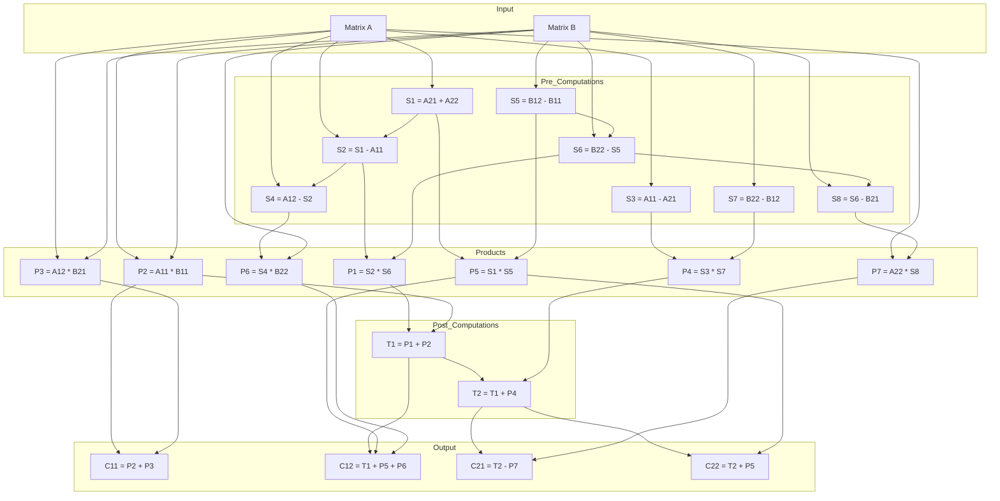

# Matrix Exponentiation

> **Complexity**: O(log n) matrix operations
> **Actual Complexity**: O(log n * M(n)) where M(n) is the multiplication cost

## Introduction

**Matrix exponentiation** is an elegant method for calculating Fibonacci numbers based on the matrix representation of the sequence. This approach exploits fast exponentiation (squaring) to reduce the number of operations to O(log n).

## Mathematical Foundation

### Fibonacci Q Matrix

The Fibonacci sequence satisfies the matrix relation:

```
[ F(n+1) ]   [ 1  1 ]   [ F(n)   ]
[        ] = [      ] * [        ]
[ F(n)   ]   [ 1  0 ]   [ F(n-1) ]
```

Applying this relation n times from initial conditions F(1) = 1, F(0) = 0:

```
[ F(n+1)  F(n)   ]   [ 1  1 ]^n
[                ] = [      ]
[ F(n)    F(n-1) ]   [ 1  0 ]
```

The matrix `Q = [[1,1], [1,0]]` is called the **Fibonacci Q matrix**.

### Formal Proof of Q-matrix Power Property

We prove by induction that Q^n has F(n+1), F(n), F(n), F(n-1) as its elements.

**Base Case (n=1)**:
$$ Q^1 = \begin{pmatrix} 1 & 1 \\ 1 & 0 \end{pmatrix} = \begin{pmatrix} F_2 & F_1 \\ F_1 & F_0 \end{pmatrix} $$
Since F(2)=1, F(1)=1, F(0)=0, the base case holds.

**Inductive Step**:
Assume the property holds for k: Q^k has elements F(k+1), F(k), F(k), F(k-1).
We want to show it holds for k+1.

$$ Q^{k+1} = Q^k \times Q = \begin{pmatrix} F_{k+1} & F_k \\ F_k & F_{k-1} \end{pmatrix} \times \begin{pmatrix} 1 & 1 \\ 1 & 0 \end{pmatrix} $$

Performing the multiplication:
$$ Q^{k+1} = \begin{pmatrix} F_{k+1} + F_k & F_{k+1} \\ F_k + F_{k-1} & F_k \end{pmatrix} $$

Using the Fibonacci recurrence F(m) = F(m-1) + F(m-2):
- Top-left: F(k+1) + F(k) = F(k+2)
- Top-right: F(k+1)
- Bottom-left: F(k) + F(k-1) = F(k+1)
- Bottom-right: F(k)

This matches the formula for n=k+1. The property holds for all n >= 1.

### Properties of Q

1. **Determinant**: det(Q^n) = (-1)^n
2. **Symmetry**: Q^n is always a symmetric matrix (Q^n[0][1] = Q^n[1][0])
3. **Cassini's Identity**: F(n+1)*F(n-1) - F(n)^2 = (-1)^n

## Algorithm

### Fast Exponentiation (Binary Exponentiation)

The key idea is to use binary decomposition of the exponent:

```
n = Sum b_i * 2^i  (where b_i in {0, 1})
```

Then:
```
Q^n = Q^(Sum b_i * 2^i) = Product Q^(b_i * 2^i)
```

### Visualization



### Pseudocode

```
MatrixFibonacci(n):
    if n == 0:
        return 0

    result = identity matrix I
    base = Q = [[1,1], [1,0]]

    exponent = n - 1

    while exponent > 0:
        if exponent is odd:
            result = result * base
        base = base * base  // Squaring
        exponent = exponent / 2

    return result[0][0]  // This is F(n)
```

> **How the implementation differs from this pseudocode** (`MatrixFramework.ExecuteMatrixLoop`,
> `internal/fibonacci/matrix_framework.go`): it does not shift a running
> `exponent` down to 0. It computes `exponent := n - 1` and
> `numBits := bits.Len64(exponent)` once, then walks
> `i` from `0` to `numBits-1`, testing `(exponent>>i)&1`. The squaring is guarded
> by `if i < numBits-1`, so the final iteration skips it — the pseudocode above
> squares one extra time and discards the result. Both diagrams and the
> pseudocode are otherwise faithful: `res` starts as the identity, `p` as Q
> (`matrixState.Reset`), the exponent is `n-1`, and the returned value is
> `res.a` = `Q^(n-1)[0][0]` = F(n). `n == 0` returns 0 before the loop.

### Go Implementation

The implementation uses the `MatrixFramework` to encapsulate the exponentiation loop:

```go
type MatrixExponentiationCalculator struct{}

func (c *MatrixExponentiationCalculator) Name() string {
    return "Matrix Exponentiation (O(log n), Parallel, Zero-Alloc)"
}

func (c *MatrixExponentiationCalculator) CalculateCore(ctx context.Context, reporter progress.ProgressCallback,
    n uint64, opts Options) (*big.Int, error) {
    state := acquireMatrixState()
    defer releaseMatrixState(state)

    framework := NewMatrixFramework()
    return framework.ExecuteMatrixLoop(ctx, reporter, n, opts, state)
}
```

The `matrix` type (defined in `matrix_types.go`) represents a 2x2 matrix:

```go
type matrix struct{ a, b, c, d *big.Int }
// Layout: [ a b ]
//         [ c d ]
```

## Implemented Optimizations

### 1. Strassen Algorithm (Winograd Variant)

For 2x2 matrices with large elements, Strassen-style multiplication reduces the number of multiplications from 8 to 7. The implementation (`multiplyMatrixStrassen` in `matrix_ops.go`) uses the **Strassen-Winograd variant**, which needs only 15 additions/subtractions instead of the 18 required by the classical Strassen formulation:

```
Classic 2x2 multiplication:
  C[0][0] = A[0][0]*B[0][0] + A[0][1]*B[1][0]  (2 mult)
  C[0][1] = A[0][0]*B[0][1] + A[0][1]*B[1][1]  (2 mult)
  C[1][0] = A[1][0]*B[0][0] + A[1][1]*B[1][0]  (2 mult)
  C[1][1] = A[1][0]*B[0][1] + A[1][1]*B[1][1]  (2 mult)
  Total: 8 multiplications

Strassen-Winograd 2x2 (1-based indices: A11 = A[0][0], ..., B22 = B[1][1]):

  Pre-computations (8 additions/subtractions, computeStrassenIntermediates):
    S1 = A21 + A22
    S2 = S1 - A11
    S3 = A11 - A21
    S4 = A12 - S2
    S5 = B12 - B11
    S6 = B22 - S5
    S7 = B22 - B12
    S8 = S6 - B21

  Products (7 multiplications):
    P1 = S2 * S6
    P2 = A11 * B11
    P3 = A12 * B21
    P4 = S3 * S7
    P5 = S1 * S5
    P6 = S4 * B22
    P7 = A22 * S8

  Post-computations and assembly (7 additions/subtractions, assembleStrassenResult):
    T1 = P1 + P2
    T2 = T1 + P4

    C11 = P2 + P3
    C12 = T1 + P5 + P6
    C21 = T2 - P7
    C22 = T2 + P5

  Total: 7 multiplications + 15 additions/subtractions
```

**Strassen-Winograd Decomposition Diagram** (dataflow as implemented in `matrix_ops.go`):



#### Threshold Mechanism

The `multiplyMatrices()` function dynamically dispatches between the classic and Strassen algorithms based on operand bit size. Two threshold levels exist:

| Threshold | Value | Scope |
|-----------|-------|-------|
| Internal default (`defaultStrassenThresholdBits`) | 256 bits | Set at package init, controls `multiplyMatrices()` when no explicit threshold is provided |
| Config default (`DefaultStrassenThreshold`) | 3,072 bits | Used by `normalizeOptions()` when `Options.StrassenThreshold == 0` |

When `Options.StrassenThreshold` is set explicitly, it takes precedence over both defaults. When `Options.StrassenThreshold == 0`, `normalizeOptions()` fills it with `DefaultStrassenThreshold` (3,072).

#### Runtime Configuration

The internal default can be adjusted at runtime via atomic operations:

```go
// Set custom internal default
fibonacci.SetDefaultStrassenThreshold(512)

// Read current internal default
current := fibonacci.GetDefaultStrassenThreshold()
```

This is a **test-only safety net**, not a production tuning path: `normalizeOptions`
(`internal/fibonacci/options.go`) rewrites a zero `Options.StrassenThreshold` to
`DefaultStrassenThreshold` (3072) before any matrix multiply, so `multiplyMatrices`
never falls back to this atomic in production. `internal/calibration` does not call
it; the only callers outside `matrix_ops.go` are in
`internal/fibonacci/fibonacci_strassen_test.go`.

#### Implementation Details

The `multiplyMatrixStrassen()` function uses a three-phase approach:

1. **`computeStrassenIntermediates()`** -- Pre-computes the eight sums/differences S1-S8 using temporary storage from the pooled `matrixState`.
2. **Product phase** -- `multiplyMatrixStrassen()` dispatches the seven multiplications P1-P7 through the generic task executor.
3. **`assembleStrassenResult()`** -- Computes T1/T2 and combines the products into the four result matrix elements.

Independent Strassen products can be parallelized; see [Parallelism](#4-parallelism) for the exact gate.

### 2. Symmetric Matrix Squaring

Since the Fibonacci Q-matrix powers are always symmetric (b = c), squaring can be done with only 4 multiplications instead of 8:

```
[ a  b ]^2   [ a^2+b^2    b(a+d) ]
[      ]   = [                    ]
[ b  d ]     [ b(a+d)     b^2+d^2 ]
```

The `squareSymmetricMatrix` function in `matrix_ops.go` implements this optimization.

### 3. Zero-Allocation with sync.Pool

Matrix states are recycled via a `sync.Pool`:

```go
type matrixState struct {
    res, p, tempMatrix *matrix
    // Temporaries for Strassen (p1-p7, s1-s8)
    // Temporaries for symmetric square (t1-t5)
}
```

### 4. Parallelism

The independent multiplications — P1-P7 for Strassen, the 8 products of
`multiplyMatrix2x2`, and the 3 squarings + 1 multiplication of
`squareSymmetricMatrix` — are dispatched through the generic task executor
(`executeTasks` / `executeMixedTasks`, `common.go`), which runs them on an
`errgroup` bounded by a package-level semaphore of `runtime.GOMAXPROCS(0)`
tokens.

The gate is computed once per loop iteration in `ExecuteMatrixLoop`, not inside
the multiplication routines:

```go
useParallel := runtime.GOMAXPROCS(0) > 1 && normalizedOpts.ParallelThreshold > 0
// ... per iteration, for both the multiply and the square branch:
inParallel := useParallel && maxBitLenMatrix(state.p) > normalizedOpts.ParallelThreshold
```

Two consequences worth knowing: the predicate reads **only `state.p`** (the
running power of Q), including on the `res × p` multiply branch where `res` is
not consulted; and unlike Fast Doubling there is no FFT-related suppression —
`ParallelFFTThreshold` is read solely by
`shouldParallelizeMultiplicationCached` in `fastdoubling.go` and never on the
matrix path.

## Complexity Analysis

### Operations per Iteration

| Operation | Classic | Strassen* | Symmetric Square |
|-----------|---------|-----------|------------------|
| Multiplications | 8 | 7 | 4 |
| Additions | 4 | 15 | 3 |

\* Strassen-Winograd variant as implemented in `matrix_ops.go` (15 additions/subtractions; the classical Strassen formulation requires 18).

### Number of Iterations

- log2(n) iterations
- At each iteration: 1 squaring + potentially 1 multiplication

### Total Complexity

- **With Karatsuba**: O(log n * n^1.585)
- **With FFT**: O(log n * n log n)

## Comparison with Fast Doubling

| Criterion | Matrix Exp. | Fast Doubling |
|-----------|-------------|---------------|
| Multiplications per matrix operation | 4 (symmetric square), 7 (Strassen), 8 (classic) | n/a |
| Multiplications per loop iteration | 4 (bit clear) or 11-12 (bit set) | 3 |
| Mathematical complexity | More intuitive | More compact |
| Measured performance (1M / 10M) | 6.03 ms / 30.84 ms | 3.15 ms / 23.87 ms |

The per-iteration row follows `ExecuteMatrixLoop`: every iteration but the last
squares (4 multiplications), and an iteration whose exponent bit is set adds one
full matrix multiplication (7 or 8) on top. The performance row is the median of
the five samples per case in [`docs/audits/bench-baseline.txt`](../audits/bench-baseline.txt),
which covers N = 1M and N = 10M and nothing else.
[`../PERFORMANCE.md`](../PERFORMANCE.md) warns the time ordering can invert at
N ≥ 10M on some CPUs. On the same artifact Fast Doubling allocates ~4.8x fewer
bytes per op than Matrix at F(1M) and ~5.3x fewer at F(10M) (17.38 MB vs
92.25 MB).

**Allocated bytes are not resident bytes, and the two disagree here.** The
`-benchmem` B/op figure counts every byte the allocator ever handed out during
an op; it says nothing about how much is live at once. The repo does carry a
resident measurement — [`docs/audits/mem-baseline-2026-09.txt`](../audits/mem-baseline-2026-09.txt),
`runtime.MemStats.Sys` delta across one calculation, **one process per data
point** (Sys never shrinks, so several points in one process would report a
shared high-water mark):

| n | `fast` | `fft` | `matrix` |
|---|---|---|---|
| 1,000,000 | 9 MB | 18 MB | **13 MB** |
| 10,000,000 | 62 MB | 67 MB | **141 MB** |

At F(10M) the resident gap is **2.3x**, not the 5.3x the B/op ratio suggests —
most of Matrix's extra allocation is churn through pooled and arena-backed
buffers, not retained footprint. At F(1M) the two metrics disagree on the
*order*: Matrix allocates more than FFT-Based (6.33 MB vs 5.38 MB B/op) yet
holds less (13 MB vs 18 MB Sys). Quote whichever number answers the question
being asked, and do not read one as a proxy for the other.

This also qualifies [`../PERFORMANCE.md`](../PERFORMANCE.md)'s claim that Fast
Doubling's memory advantage is the hardware-independent part of the ranking.
It holds at F(10M) on both metrics, but at F(1M) the Matrix / FFT-Based order
depends on which metric you pick — and the two artifacts are from different
hosts and operating systems (linux/amd64 for `bench-baseline.txt`,
windows/amd64 for `mem-baseline-2026-09.txt`), so the disagreement is not
demonstrably a metric effect alone.

## Usage

### Go API

```go
factory := fibonacci.NewDefaultFactory()
calc, _ := factory.Get("matrix")
result, _ := calc.Calculate(ctx, progressChan, 0, n, fibonacci.Options{
    StrassenThreshold: 3072,
})
```

### Benchmarks

```bash
# Run Matrix Exponentiation benchmarks
go test -bench='BenchmarkFibonacci/MatrixExp' -benchmem -run='^$' ./internal/fibonacci/

# Compare with Fast Doubling
go test -bench='BenchmarkFibonacci/(FastDoubling|MatrixExp)' -benchmem -run='^$' ./internal/fibonacci/
```

## References

1. Erickson, J. (2019). *Algorithms*. Chapter on Recursion and Backtracking.
2. Cormen, T. H. et al. (2009). *Introduction to Algorithms*. Section 31.2: Matrix Exponentiation.
3. Strassen, V. (1969). "Gaussian Elimination is not Optimal". *Numerische Mathematik*.
