# Component Diagram — Engine Classes and Interfaces

`classDiagram` view of the compute core: interfaces, implementations, and the collaborations that are **not** package imports (see the dependency graph for those).

```mermaid
classDiagram
    direction LR

    class Calculator {
        <<interface>>
        +Calculate(ctx, progressChan, calcIndex, n, opts) *big.Int, error
        +Name() string
    }

    class CoreCalculator {
        <<interface>>
        +CalculateCore(ctx, reporter, n, opts) *big.Int, error
        +Name() string
    }

    class FibCalculator {
        -core CoreCalculator
        +Calculate(ctx, progressChan, calcIndex, n, opts) *big.Int, error
        +CalculateWithObservers(ctx, subject, calcIndex, n, opts) *big.Int, error
        +Name() string
    }

    class CalculatorSource {
        <<interface>>
        orchestration/interfaces.go
        +List() []string
        +Get(name) Calculator, error
    }

    class DefaultFactory {
        -creators map
        -calculators map
        -mu sync.RWMutex
        +Register(name, creator) error
        +Create(name) Calculator, error
        +Get(name) Calculator, error
        +List() []string
        +GetAll() map
    }

    class Multiplier {
        <<interface>>
        +Multiply(z, x, y, opts) *big.Int, error
        +Square(z, x, opts) *big.Int, error
        +Name() string
    }

    class DoublingStepExecutor {
        <<interface>>
        +Multiply(z, x, y, opts) *big.Int, error
        +Square(z, x, opts) *big.Int, error
        +ExecuteStep(ctx, state, opts, inParallel) error
        +Name() string
    }

    class AdaptiveStrategy {
        +Multiply(z, x, y, opts) *big.Int, error
        +Square(z, x, opts) *big.Int, error
        +ExecuteStep(ctx, state, opts, inParallel) error
    }

    class FFTOnlyStrategy {
        +Multiply(z, x, y, opts) *big.Int, error
        +Square(z, x, opts) *big.Int, error
        +ExecuteStep(ctx, state, opts, inParallel) error
    }

    class DoublingFramework {
        -strategy DoublingStepExecutor
        +ExecuteDoublingLoop(ctx, reporter, n, opts, state, useParallel) *big.Int, error
    }

    class MatrixFramework {
        +SquareFunc SquareSymmetricMatrixFunc
        +ExecuteMatrixLoop(ctx, reporter, n, opts, state) *big.Int, error
    }

    class ProgressObserver {
        <<interface>>
        +Update(calcIndex, progress)
    }

    class ProgressSubject {
        -observers []ProgressObserver
        -mu sync.RWMutex
        +Register(observer)
        +Notify(calcIndex, progress)
        +Freeze(calcIndex) ProgressCallback
    }

    class ProgressCallback {
        <<function type>>
        +invoke(progress float64)
    }

    class ChannelObserver {
        -channel chan ProgressUpdate
    }

    class LoggingObserver {
        -logger *slog.Logger
        -threshold float64
        -lastLog map
    }

    class NoOpObserver {
    }

    class ProgressReporter {
        <<interface>>
        +DisplayProgress(wg, progressChan, numCalculators, out)
    }

    class ResultPresenter {
        <<interface>>
        +PresentComparisonTable(results, out)
        +PresentResult(result, n, verbose, details, showValue, out)
    }

    class ErrorHandler {
        <<interface>>
        +HandleError(err, duration, out) int
    }

    class tempAllocator {
        <<interface>>
        -allocFermatTemp(n) fermat, func()
        -allocFermatSlice(count, n) []fermat, []big.Word, func()
    }

    class BumpAllocator {
        -buffer []big.Word
        -offset int
        +Alloc(n) []big.Word
        +Remaining() int
        +Used() int
        +Reset()
        -allocFermat(n) fermat
        -allocFermatTemp(n) fermat, func()
        -allocFermatSlice(count, n) []fermat, []big.Word, func()
    }

    class poolAllocator {
        -allocFermatTemp(n) fermat, func()
        -allocFermatSlice(count, n) []fermat, []big.Word, func()
    }

    class TransformCache {
        -mu sync.RWMutex
        -config TransformCacheConfig
        -entries map key to list element
        -lru container/list.List
        -currBytes int
        +Get(data, k, n) PolValues, bool
        +Put(data, pv)
        +Config() TransformCacheConfig
        +Bytes() int
        +Stats() CacheStats
        +Clear()
    }

    class Options {
        +ParallelThreshold int
        +FFTThreshold int
        +StrassenThreshold int
        +FFTCacheMinBitLen int
        +FFTCacheMaxEntries int
        +FFTCacheEnabled *bool
        +GCMode string
        +MemoryLimitBytes uint64
    }

    Calculator <|.. FibCalculator
    FibCalculator o-- CoreCalculator : wraps (Decorator)
    CalculatorSource <|.. DefaultFactory
    Multiplier <|.. AdaptiveStrategy
    Multiplier <|.. FFTOnlyStrategy
    DoublingStepExecutor <|.. AdaptiveStrategy
    DoublingStepExecutor <|.. FFTOnlyStrategy
    DoublingStepExecutor --|> Multiplier : extends
    ProgressObserver <|.. ChannelObserver
    ProgressObserver <|.. LoggingObserver
    ProgressObserver <|.. NoOpObserver
    tempAllocator <|.. BumpAllocator
    tempAllocator <|.. poolAllocator

    DoublingFramework --> DoublingStepExecutor : uses
    DoublingFramework --> Options : configured by
    DoublingFramework --> ProgressCallback : reports via
    MatrixFramework --> Options : configured by
    MatrixFramework --> ProgressCallback : reports via
    FibCalculator --> ProgressSubject : creates
    FibCalculator --> ProgressCallback : Freeze snapshot
    ProgressSubject --> ProgressCallback : Freeze produces
    ProgressSubject --> ProgressObserver : notifies
    DefaultFactory --> FibCalculator : creates
    MatrixFramework --> TransformCache : indirect via bigfft

    note for FibCalculator "*FibCalculator exposes Name, Calculate and CalculateWithObservers only. It has no CalculateCore, so it does NOT implement CoreCalculator - it composes one through the private core field."
    note for ProgressCallback "Neither framework ever receives a *ProgressSubject: ExecuteDoublingLoop and ExecuteMatrixLoop both take a progress.ProgressCallback, the lock-free closure returned by ProgressSubject.Freeze."
    note for TransformCache "Cached TRANSFORMS are consulted only from Mul/Sqr/MulTo/SqrTo (fftmulTo/fftsqrTo call MulCachedWithBump/SqrCachedWithBump), which the matrix path enters through smartMultiply/smartSquare. No doubling loop reads a cached transform: AdaptiveStrategy routes every operand above FFTThreshold to executeDoublingStepFFT, which calls TransformWithBump, and the operands left below it never clear smartMultiply's own FFT gate. The cache is still CONFIGURED from one other place: options.go:configureFFTCache, once per calculation with n > 93."
```

---
[← Back to the architecture hub](./README.md)
Narrative legend of this figure: [§4 Core Packages](../ARCH.md#4-core-packages-responsibilities-key-types-interfaces).
