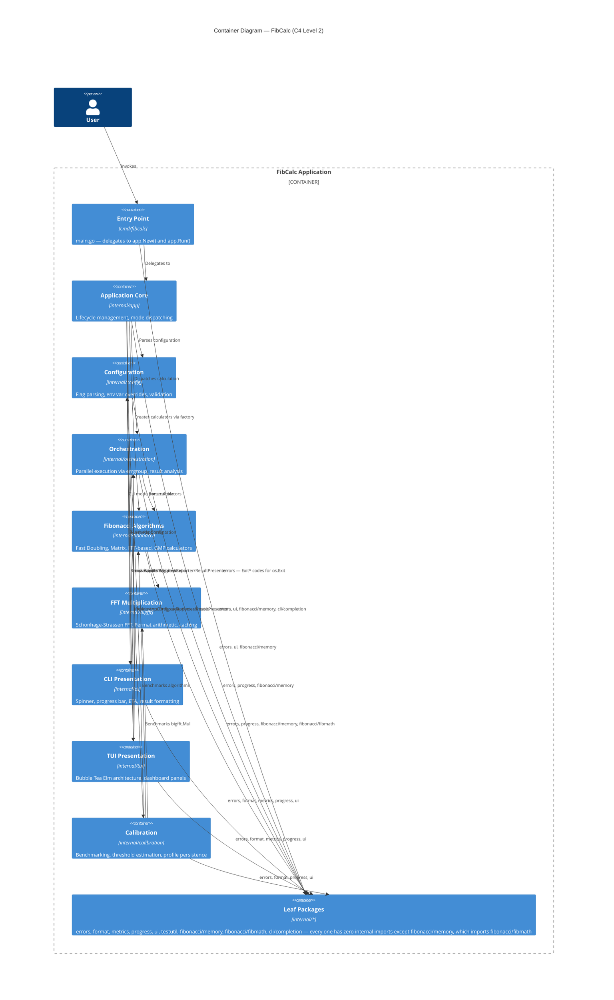

# Container Diagram — C4 Level 2

Breakdown of the application into logical containers. Every `Rel` between two `Container`s is a direct Go import; `Rel(user, entry, …)` is the only exception (a `Person` → `Container` relation).

---
[← Back to the architecture hub](./README.md)
Narrative legend of this figure: [§2 High-Level Architecture](../ARCH.md#2-high-level-architecture-clean-architecture).
