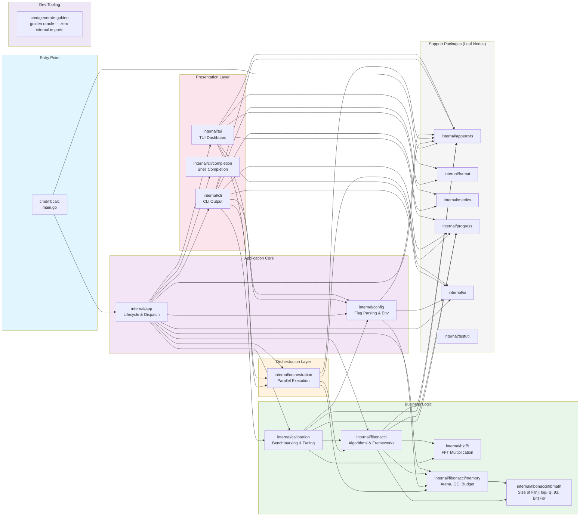

# Internal Dependency Graph

The module's 45 direct internal imports, one per edge — no more, no fewer. The `go list`
pipeline that establishes this set equality is in the
[validation record](./validation/validation-report.md#layer-tightness--dependency-direction)
(run on 2026-09-23, empty `diff`).

---
[← Back to the architecture hub](./README.md)
Narrative legend of this figure: [§2 High-Level Architecture](../ARCH.md#2-high-level-architecture-clean-architecture) and [§3 Directory Structure](../ARCH.md#3-directory-structure).
