# Configuration Resolution Flow

Precedence order of the configuration sources and construction of `fibonacci.Options`.

```mermaid
flowchart LR
    subgraph Sources["Configuration Sources — UNIFORM precedence, the 3 thresholds included since audit M-03 (2026-09)"]
        S1[1. CLI Flags<br/>--threshold, --fft-threshold,<br/>--strassen-threshold<br/>+ every other flag: highest priority]
        S2[2. Environment Variables<br/>FIBCALC_* prefix — read only when the<br/>matching flag is absent from argv.<br/>Marks the threshold explicit, same as a flag]
        S3[3. Cached Calibration Profile<br/>~/.fibcalc_calibration.json — fills ONLY the<br/>thresholds whose *Explicit marker is false<br/>calibration.go:applyProfileThresholds]
        S4[4. Adaptive Hardware Estimation<br/>CPU cores, architecture — fills zeros only]
        S5[5. Static Defaults<br/>constants.go]
    end

    subgraph Parse["Flag & Env Parsing"]
        S1 --> P1[config.ParseConfig]
        S2 --> P1
        P1 --> P2[flag.Parse]
        P2 --> P3[applyEnvOverrides]
        P3 --> P3a["markExplicitThresholds (env.go)<br/>flag set OR FIBCALC_* provided<br/>→ Threshold/FFT/Strassen ThresholdExplicit"]
        P3a --> P3b["strings.ToLower on Algo"]
        P3b --> P4[AppConfig.Validate]
        P4 --> P5[AppConfig struct]
    end

    subgraph Calibration["Calibration Resolution (app.New, then Application.Run)"]
        P5 --> C5["LoadCachedCalibration<br/>(app.New — UNCONDITIONAL,<br/>runs before any mode dispatch)"]
        C5 --> C6{Loaded AND Validate ok?}
        C6 -->|"Yes: version, NumCPU, GOARCH, word size, CPUHeuristicKey all match"| C7["applyProfileThresholds<br/>fills ONLY the thresholds left non-explicit;<br/>a --threshold / --fft-threshold /<br/>--strassen-threshold or FIBCALC_* value survives"]
        C6 -->|No or stale| C8[ApplyAdaptiveThresholds]
        C7 --> C1{--calibrate flag?}
        C8 --> C1
        C1 -->|Yes| C2["Full Calibration Mode<br/>calibration.go: RunCalibration -> RunCalibrationWithOptions<br/>-> runPassSequence — terminal, returns"]
        C1 -->|No| C3{--auto-calibrate?}
        C3 -->|Yes| C4["AutoCalibrate (calibration.go): fresh cached profile wins,<br/>else FastStrategy -> MicroBenchmark.RunQuick (microbench.go),<br/>escalating to CompleteStrategy (strategy_complete.go -> runner.go)<br/>when confidence is low — overwrites cfg, then falls through"]
    end

    subgraph Adaptive["Adaptive Threshold Estimation (each reads HardwareHeuristic.SIMD)"]
        C8 --> D1[EstimateOptimalParallelThreshold<br/>CPU core count, then SIMD class]
        C8 --> D2[EstimateOptimalFFTThreshold<br/>word size, then SIMD class]
        C8 --> D3[EstimateOptimalStrassenThreshold<br/>CPU core count, then SIMD class]
    end

    subgraph Options["Options Construction"]
        C7 --> E1[fibonacci.Options]
        D1 --> E1
        D2 --> E1
        D3 --> E1
        E1 --> E2[normalizeOptions]
        E2 --> E3{Any zero values?}
        E3 -->|Yes| E4[Fill from constants.go<br/>ParallelThreshold=4096<br/>FFTThreshold=500K<br/>StrassenThreshold=3072]
        E3 -->|No| E5[Options ready]
        E4 --> E5
    end

    E5 --> F0a[NewDoublingFramework<br/>static thresholds for the whole run]

    subgraph Profile["Calibration Profile"]
        C2 --> G1[JSON profile]
        C4 --> G1
        G1 --> G2[Save to<br/>~/.fibcalc_calibration.json]
        G2 -.->|read back on a LATER run<br/>by LoadOrCreateProfile| G3["profile.IsValid(): version, NumCPU,<br/>GOARCH, word size, CPUHeuristicKey"]
        G3 -.-> C5
    end

    style Sources fill:#e1f5fe
    style Parse fill:#f3e5f5
    style Calibration fill:#fff3e0
    style Adaptive fill:#e8f5e9
    style Options fill:#fce4ec
    style Dynamic fill:#e0f2f1
    style Profile fill:#f5f5f5
```

---
[← Back to the architecture hub](../README.md)
Narrative legend of this figure: [§8 Configuration Cascade](../../ARCH.md#configuration-cascade) and [§9 Configuration and Environment](../../ARCH.md#9-configuration-and-environment).
