# Pipeline Fast Doubling

Du décorateur `FibCalculator` jusqu'à l'extraction du résultat, en passant par `DoublingFramework` et le pas FFT.

```mermaid
flowchart LR
    subgraph Input["Input Processing (FibCalculator decorator)"]
        A1[FibCalculator.Calculate] --> A4[Create ProgressSubject]
        A4 --> A5["Register ChannelObserver<br/>(if progressChan != nil)"]
        A5 --> A5b[CalculateWithObservers]
        A5b --> A5c[Memory budget guard, GCController,<br/>reporter = subject.Freeze or no-op]
        A5c --> A2{n <= 93?}
        A2 -->|Yes| A3["calculateSmall:<br/>iterative big.Int addition"]
        A2 -->|No| A5d["configureFFTCache, EnsurePoolsWarmed,<br/>gcCtrl.WithGC wrapping core.CalculateCore()"]
    end

    subgraph Strategy["CoreCalculator (chosen by the factory before Calculate)"]
        A5d --> B1{Which CoreCalculator?}
        B1 -->|fast| B2["FastDoublingCalculator:<br/>acquireStateForN, normalizeOptions,<br/>AdaptiveStrategy"]
        B1 -->|fft| B3["FFTBasedCalculator:<br/>AcquireStateForN, FFTOnlyStrategy,<br/>useParallel hard-coded false"]
        B1 -->|"gmp — -tags gmp AND an explicit<br/>RegisterGMPCalculator on your factory;<br/>NewDefaultFactory registers fast/matrix/fft only"| B4["GMPCalculator: standalone loop,<br/>no DoublingFramework"]
    end

    subgraph Framework["DoublingFramework.ExecuteDoublingLoop"]
        B2 --> C1[numBits = bits.Len64 of n]
        B3 --> C1
        C1 --> C2[Iterate bits MSB to LSB]
        C2 --> C3["Doubling step (unconditional)<br/>F(2k) = 2*FK*FK1 - FK^2<br/>F(2k+1) = FK1^2 + FK^2"]
    end

    subgraph Multiply["Multiplication Decision (strategy.ExecuteStep)"]
        C3 -->|AdaptiveStrategy| D1{"FFTThreshold > 0 AND<br/>FK1.BitLen() > FFTThreshold?<br/>(FK1 only — strictly greater)"}
        D1 -->|No| D2[executeDoublingStepMultiplications<br/>smartMultiply/smartSquare, math/big]
        D1 -->|Yes| D3[executeDoublingStepFFT]
        C3 -->|"FFTOnlyStrategy — no threshold test"| D3
        C3 -.->|"computed in the loop BEFORE ExecuteStep,<br/>passed as inParallel to BOTH branches"| D4{shouldParallelizeMultiplicationCached}
        D4 -->|"maxBitLen > FFTThreshold:<br/>true only if > ParallelFFTThreshold (5M)"| D4a[inParallel]
        D4 -->|"otherwise: maxBitLen > ParallelThreshold"| D4a
    end

    subgraph FFTPipeline["FFT Doubling Step (mono-goroutine forward phase)"]
        D3 --> E1[GetFFTParams -> k, m<br/>ValueSize -> n]
        E1 --> E2[Acquire/Reset state-bound BumpAllocator<br/>sized by fftBumpCapWords]
        E2 --> E3[PolyFromInt on FK and FK1]
        E3 --> E6["TransformWithBump x2<br/>(NOT TransformCached —<br/>the doubling loop never consults the LRU)"]
        E6 --> E7[executeFFTTransforms:<br/>T3 = FK*FK1, T1 = FK1², T2 = FK²]
    end

    subgraph Parallel["Per-operation Execution (executeFFTTransforms)"]
        D4a -.-> F0
        E7 --> F0{inParallel?}
        F0 -->|No| F0a[op1, op2, op3 sequentially<br/>with ctx.Err checks between]
        F0 -->|Yes| F2[executeParallel3]
        F2 --> F3["Launch 3 goroutines FIRST,<br/>each acquires a task-semaphore token<br/>INSIDE itself (runParallel3Op)"]
        F3 --> F1["Task semaphore cap = runtime.GOMAXPROCS(0)"]
        F1 --> E7b[per op: PolValues.Mul/Sqr]
        F0a --> E7b
        E7b --> F4{"runPointwise:<br/>K*(n+1) >= 65536 and NumCPU > 1?"}
        F4 -->|Yes| F4a["chunks on extra goroutines,<br/>non-blocking acquire on the bigfft<br/>FFT semaphore (cap = runtime.NumCPU)"]
        F4 -->|No| F4b[single loop over the K coefficients]
        F4a --> E8[InvTransform: fourier backward,<br/>then Shift by -k = divide by K]
        F4b --> E8
        E8 --> E9[IntToBigInt: poly to big.Int<br/>with carry propagation]
    end

    subgraph Result["Result Extraction (back in ExecuteDoublingLoop)"]
        D2 --> G1["Post-multiply: T3 = 2·T3 − T2, T1 = T1 + T2<br/>then rotate FK, FK1, T1, T2, T3"]
        E9 --> G1
        G1 --> G1b{Current bit of n set?}
        G1b -->|1| G1c["Advance one index<br/>FK, FK1 = FK1, FK+FK1"]
        G1b -->|0| G2{More bits?}
        G1c --> G2
        G2 -->|Yes| C2
        G2 -->|No| G3["Deep-copy result out of arena<br/>releaseStateWithResult (no steal: P1-04)"]
        G3 --> G4["Return the state: cachedState slot then<br/>statePool (FastDoubling), statePool only (FFTBased)"]
        G4 --> G5[Return big.Int result]
    end

    style Input fill:#e1f5fe
    style Strategy fill:#f3e5f5
    style Framework fill:#fff3e0
    style Multiply fill:#e8f5e9
    style FFTPipeline fill:#fce4ec
    style Parallel fill:#e0f2f1
    style Result fill:#f5f5f5
```

---
[← Retour au hub architecture](../README.md)
Légende narrative de cette figure : [§7A Fast Doubling](../../ARCH.md#a-fast-doubling-fastdoublingcalculator).
