# Pipeline de multiplication FFT (bigfft)

Chemin complet de `bigfft.Mul`/`Sqr` : seuil d'activation, allocation, conversion polynomiale, transformée, produit point à point, transformée inverse.

```mermaid
flowchart LR
    subgraph Input["FFT Multiplication Input (bigfft.Mul/MulTo/Sqr/SqrTo)"]
        A0{"len(x.Bits()) > getFFTThreshold()<br/>(default 1800 words; both operands for Mul/MulTo)"}
        A0 -->|No| A0a[math/big fallback — no FFT at all]
        A0 -->|Yes| A1[fftmulTo / fftsqrTo]
        A1 --> A2[fftSize / fftSizeSqr -> k, m]
    end

    subgraph Alloc["Memory Allocation"]
        A2 --> B2["AcquireBumpAllocator(EstimateBumpCapacity(...))<br/>— unconditional on this path,<br/>O&#40;1&#41; pointer bump, zero fragmentation"]
        B2 -.->|"poolAllocator is the other tempAllocator impl;<br/>it serves the non-bump Transform/Mul oracles<br/>and the parallel pointwise workers"| B3[poolAllocator: sync.Pool get]
    end

    subgraph Convert["Polynomial Conversion"]
        B2 --> C1[polyFromNat<br/>big.Int magnitude to polynomial]
        C1 --> C2[Split into m-word coefficients]
        C2 --> C3[Each coefficient becomes<br/>Fermat-ring element]
    end

    subgraph ForwardFFT["Forward FFT Transform (TransformCachedWithBump)"]
        C3 --> D1{"cacheGate(): enabled<br/>AND polyBitLen >= MinBitLen?"}
        D1 -->|No| D3["TransformWithBump -> fourierWithBump<br/>Cooley-Tukey butterfly;<br/>cache never touched"]
        D1 -->|Yes| D1a{computePolyKey in LRU?}
        D1a -->|Hit| D2[cached PolValues returned]
        D1a -->|Miss| D4[TransformWithBump, then putByKey]
        D3 --> D5[Transformed coefficients]
        D2 --> D5
        D4 --> D5
    end

    subgraph Pointwise["Pointwise Multiplication (PolValues.mul / sqr via runPointwise)"]
        D5 --> E1{"K*(n+1) >= 65536<br/>AND runtime.NumCPU() > 1?"}
        E1 -->|No| E1a[single loop over the K coefficients]
        E1 -->|Yes| E1b["chunks on extra goroutines,<br/>non-blocking acquire on the FFT semaphore<br/>(cap = runtime.NumCPU); no token -> run inline"]
        E1a --> E2[fermat.Mul / fermat.Sqr<br/>in the ring mod 2^&#40;n*W&#41; + 1]
        E1b --> E2
        E2 --> E4["addVV/subVV/addVW/subVW/shlVU/addMulVVW<br/>reached through go:linkname into math/big —<br/>declared unconditionally in arith_decl.go:<br/>no build-tag split, no CPU-feature test,<br/>no pure-Go fallback in this repo.<br/>The SIMD assembly is math/big's own."]
        E4 --> E6[Product coefficients]
    end

    subgraph InverseFFT["Inverse FFT Transform (invTransform)"]
        E6 --> F1[fourierWithBump backward=true<br/>inverse butterfly]
        F1 --> F2["fermat.Shift by -k:<br/>divide by K = 1&lt;&lt;k"]
    end

    subgraph Output["Result Conversion"]
        F2 --> G1[IntTo<br/>polynomial to big.Int magnitude]
        G1 --> G2["Reassemble coefficients with<br/>carry propagation (addVV / addVW), then trim"]
        G2 --> G3[Return big.Int product]
    end

    subgraph Cache["Transform Cache Details"]
        H1[LRU eviction policy]
        H2[Thread-safe RWMutex]
        H3[Configurable max entries]
        H4[Benefits cache-consulting paths only<br/>direct Mul/Sqr/MulTo/SqrTo —<br/>no effect on any doubling loop]
    end

    style Input fill:#e1f5fe
    style Alloc fill:#f3e5f5
    style Convert fill:#fff3e0
    style ForwardFFT fill:#e8f5e9
    style Pointwise fill:#fce4ec
    style InverseFFT fill:#e0f2f1
    style Output fill:#f5f5f5
    style Cache fill:#fffde7
```

---
[← Retour au hub architecture](../README.md)
Légende narrative de cette figure : [§7C FFT-Based Doubling](../../ARCH.md#c-fft-based-doubling-fftbasedcalculator).
