# Pipeline Matrix Exponentiation

Exponentiation binaire de la matrice Q, décision Strassen, et retour du résultat par vol de pointeur.

```mermaid
flowchart LR
    subgraph Input["Input Processing"]
        A1[FibCalculator.Calculate] --> A2{n <= 93?}
        A2 -->|Yes| A3["calculateSmall:<br/>iterative big.Int addition"]
        A2 -->|No| A4["acquireMatrixState() -> Reset()<br/>res = identity, p = base Q"]
        A4 --> A5["NewMatrixFramework()<br/>SquareFunc = squareSymmetricMatrix"]
    end

    subgraph Framework["MatrixFramework.ExecuteMatrixLoop — exponent = n-1"]
        A5 --> B1["numBits = bits.Len64(n-1)<br/>for i = 0 .. numBits-1 (LSB to MSB)"]
        B1 --> B2{"bit i of (n-1) set?"}
        B2 -->|Yes| B3["multiplyMatrices: tempMatrix = res x p,<br/>then swap res/tempMatrix"]
        B2 -->|No| B4[Skip the multiply]
        B3 --> B5{"i < numBits-1?"}
        B4 --> B5
        B5 -->|Yes| C2
        B5 -->|"No — on the LAST bit the squaring is skipped"| B6[ReportStepProgress]
        C2 -.-> B6
        B6 --> B7{More bits?}
        B7 -->|Yes| B1
        B7 -->|No| F3
    end

    subgraph Squaring["Matrix Squaring — SquareFunc is the only squaring path (no symmetry test, no standard-squaring alternative), guarded by i < numBits-1 so the LAST bit skips it (matrix_framework.go:MatrixFramework.ExecuteMatrixLoop)"]
        C2["squareSymmetricMatrix:<br/>3 squarings (a², b², d²) + 1 multiply b·(a+d)<br/>via executeMixedTasks; then swap p/tempMatrix"]
    end

    subgraph Multiply["Strassen Decision — reached ONLY from multiplyMatrices (res x p). The squaring path never consults StrassenThreshold."]
        B3 --> D1{"maxBitLenTwoMatrices(res, p)<br/>vs StrassenThreshold"}
        D1 -->|<= StrassenThreshold| D2[multiplyMatrix2x2<br/>8 multiplications]
        D1 -->|> StrassenThreshold| D3["multiplyMatrixStrassen (Winograd)<br/>7 multiplications, 8 pre + 7 post add/sub"]
    end

    subgraph BigMul["Big Integer Multiply (smartMultiply / smartSquare, per task)"]
        D2 --> E1{"smartMultiply: BOTH operands' BitLen > FFTThreshold?<br/>smartSquare: the single operand's BitLen > FFTThreshold?"}
        D3 --> E1
        C2 --> E1
        E1 -->|No| E2[z.Mul — math/big, Karatsuba internally]
        E1 -->|Yes| E3["bigfft.MulTo / SqrTo —<br/>re-gated inside bigfft on its own word<br/>threshold, and cache-consulting"]
    end

    subgraph Result["Result"]
        F3["Steal res.a and replace the slot with a fresh big.Int<br/>(safe here: matrixState owns independent big.Ints,<br/>no arena aliasing — unlike the doubling state)"]
        F3 --> F4[Return big.Int result]
    end

    style Input fill:#e1f5fe
    style Framework fill:#f3e5f5
    style Squaring fill:#fff3e0
    style Multiply fill:#e8f5e9
    style BigMul fill:#fce4ec
    style Result fill:#f5f5f5
```

---
[← Retour au hub architecture](../README.md)
Légende narrative de cette figure : [§7B Matrix Exponentiation](../../ARCH.md#b-matrix-exponentiation-matrixexponentiationcalculator).
