# Hiérarchie des interfaces

Les interfaces clés du projet et leurs implémentations, groupées par domaine (calcul, observation, allocation).

```mermaid
classDiagram
    direction TB

    %% Source file noted per class (basename only — line numbers omitted
    %% deliberately, they drift on every edit; grep the basename to locate).

    %% ── Computation Interfaces ──

    class Calculator {
        <<interface>>
        calculator.go
        +Calculate(ctx, progressChan, calcIndex, n, opts) *big.Int, error
        +Name() string
    }

    class CoreCalculator {
        <<interface>>
        calculator.go
        +CalculateCore(ctx, reporter, n, opts) *big.Int, error
        +Name() string
    }

    class CalculatorFactory {
        <<interface>>
        registry.go
        +Create(name) Calculator, error
        +Get(name) Calculator, error
        +List() []string
        +Register(name, creator) error
        +GetAll() map
    }

    class Multiplier {
        <<interface>>
        strategy.go
        +Multiply(z, x, y, opts) *big.Int, error
        +Square(z, x, opts) *big.Int, error
        +Name() string
    }

    class DoublingStepExecutor {
        <<interface>>
        strategy.go
        embeds Multiplier
        +ExecuteStep(ctx, state, opts, inParallel) error
    }

    %% ── Observation Interfaces ──

    class ProgressObserver {
        <<interface>>
        observer.go
        +Update(calcIndex, progress)
    }

    class ProgressReporter {
        <<interface>>
        interfaces.go
        +DisplayProgress(wg, progressChan, numCalculators, out)
    }

    class ResultPresenter {
        <<interface>>
        interfaces.go
        +PresentComparisonTable(results, out)
        +PresentResult(result, n, verbose, details, showValue, out)
    }

    class ErrorHandler {
        <<interface>>
        interfaces.go
        +HandleError(err, duration, out) int
    }

    %% ── Allocation Interfaces ──

    class tempAllocator {
        <<interface>>
        allocator.go
        -allocFermatTemp(n) fermat, func()
        -allocFermatSlice(count, n) []fermat, []big.Word, func()
    }

    %% ── Interface Segregation ──

    DoublingStepExecutor --|> Multiplier : extends (ISP)

    %% ── Implementations ──

    class FibCalculator {
        calculator.go
    }
    class DefaultFactory {
        registry.go
    }
    class AdaptiveStrategy {
        strategy.go
    }
    class FFTOnlyStrategy {
        strategy.go
    }
    class ChannelObserver {
        observers.go
    }
    class LoggingObserver {
        observers.go
    }
    class NoOpObserver {
        observers.go
    }
    class ProgressReporterFunc {
        interfaces.go
    }
    class TUIProgressReporter {
        bridge.go
    }
    class NullProgressReporter {
        interfaces.go
    }
    class CLIResultPresenter {
        presenter.go
    }
    class TUIResultPresenter {
        bridge.go
    }
    class BumpAllocator {
        bump.go
    }
    class poolAllocator {
        allocator.go
    }

    Calculator <|.. FibCalculator
    FibCalculator o-- CoreCalculator : wraps (Decorator)
    CalculatorFactory <|.. DefaultFactory
    DoublingStepExecutor <|.. AdaptiveStrategy
    DoublingStepExecutor <|.. FFTOnlyStrategy
    ProgressObserver <|.. ChannelObserver
    ProgressObserver <|.. LoggingObserver
    ProgressObserver <|.. NoOpObserver
    ProgressReporter <|.. ProgressReporterFunc : adapts cli.DisplayProgress
    ProgressReporter <|.. TUIProgressReporter
    ProgressReporter <|.. NullProgressReporter
    ResultPresenter <|.. CLIResultPresenter
    ResultPresenter <|.. TUIResultPresenter
    ErrorHandler <|.. CLIResultPresenter
    ErrorHandler <|.. TUIResultPresenter
    tempAllocator <|.. BumpAllocator
    tempAllocator <|.. poolAllocator

    note for FibCalculator "*FibCalculator implements Calculator (Calculate, Name) plus CalculateWithObservers. It has no CalculateCore, so it does NOT implement CoreCalculator - it composes one through the private core field (Decorator)."

    note for ErrorHandler "Third collaboration interface of internal/orchestration, alongside ProgressReporter and ResultPresenter (see orchestration/doc.go). AnalyzeComparisonResults takes it as a parameter next to ResultPresenter. Both presenters satisfy it: the conformance assertions sit on consecutive lines in cli/presenter.go and tui/bridge.go."
```

---
[← Retour au hub architecture](../README.md)
Légende narrative de cette figure : [§5 Design Patterns](../../ARCH.md#5-design-patterns) et [§8 Presentation Layer Integration](../../ARCH.md#presentation-layer-integration).
