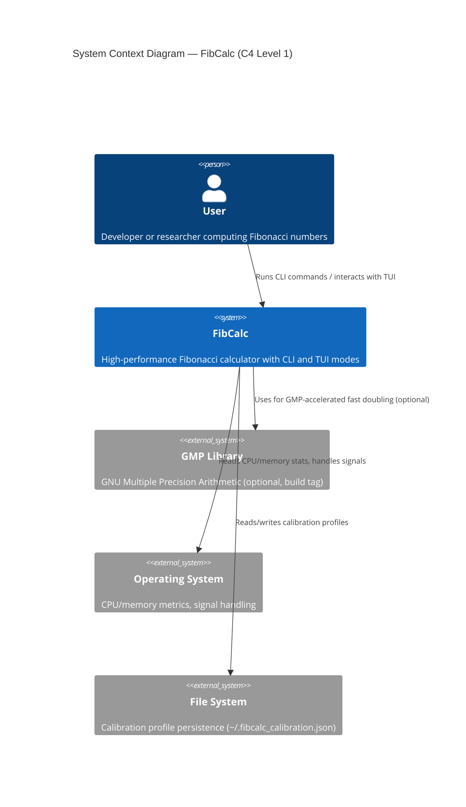

# System Context — C4 Level 1

FibCalc seen from the outside: the user, and the three external systems the binary touches (optional GMP, OS, file system).

---
[← Back to the architecture hub](./README.md)
Narrative legend of this figure: [§1 Project Overview](../ARCH.md#1-project-overview).
